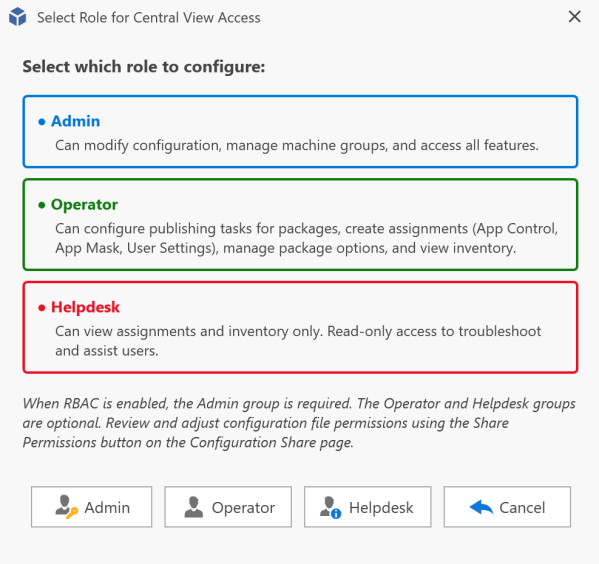

# Limit Access to the Central View Console

You can configure an Active Directory group or Azure AD group that will have access to the Central View console. When a user starts the console, the group membership is checked. When the user is not a member of the configured group, access to the console is not allowed. Additionally, you can configure other RBAC roles.

The following roles can be assigned to users or groups:

Below is a typical integrated authentication configuration for accessing the configuration and content shares.

---

## Firewall and Communication Ports

By default, AppVentiX does not use any other ports other than file share (SMB) access (port 445), or port 443 for QUIC-enabled shares. See the [QUIC Share](quic-share.md) section for more information about setting up a QUIC share.

There are a few exceptions:

- For AD domain connections (to retrieve user groups): port 389 (LDAP) or 636 (LDAPS)
- For Entra ID connections and Azure Virtual Desktop (AVD) connections: the default Graph API ports (443) are used to reach online Microsoft services
- When importing packages from the Microsoft Store, the Store URL needs to be accessible

In Active Directory domain environments, the AD connection is most of the time already possible because a lot of authentication traffic is directed to domain controllers. AppVentiX will make use of this default AD integration already known in the operating system.
