# AppVentiX Agent GUI

The AppVentiX Agent GUI can be used for:

- Checking the service state
- Viewing details about deployed packages, App Masking rules, and App Control policies
- Troubleshooting
- Invoking a refresh

Example screenshots of the Agent GUI:

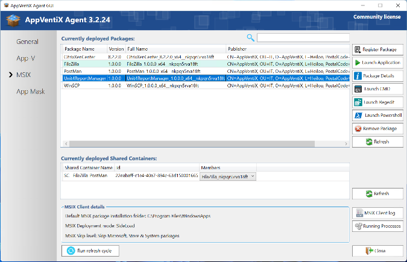

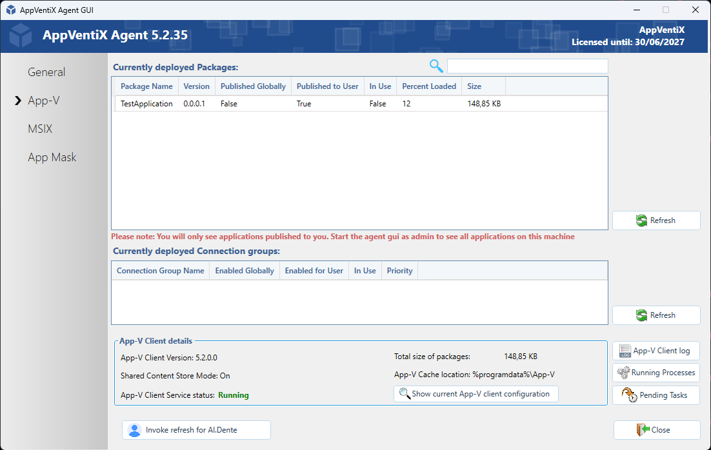

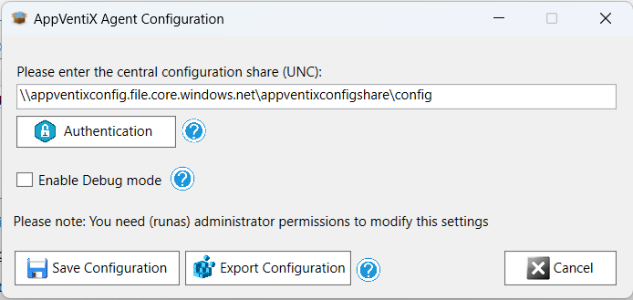

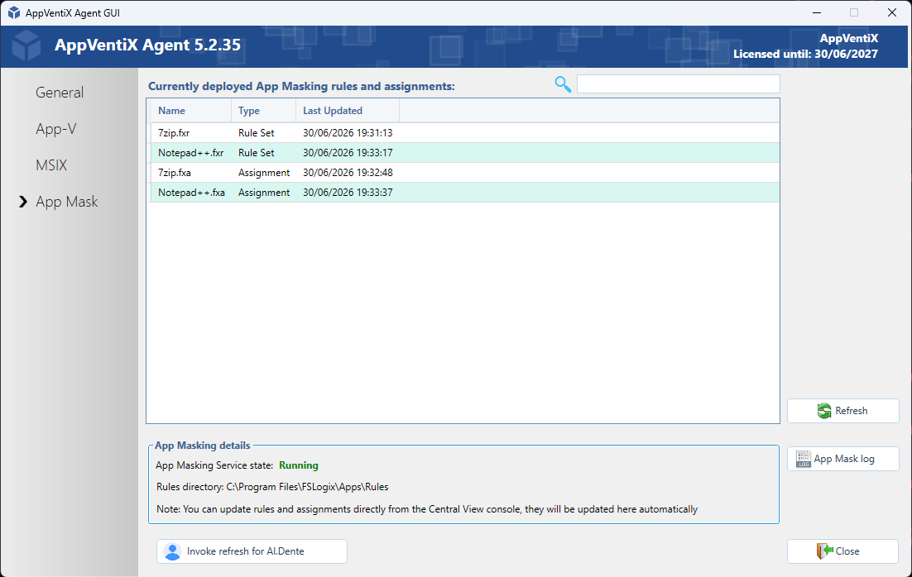

---

## Configure Service

The AppVentiX agent is configured centrally in the Central View console. There are a couple of settings you can configure when you click on the **Configure Service** button:

In the agent configuration you can change/update the configuration store. You can also provide a user account which the service will use to access the configuration store and content store(s). By default the service will use integrated authentication.

**Debug mode** will log more information to the event log for troubleshooting purposes. Make sure to disable this option after troubleshooting.

You can export these settings to a registry file to import on other machines. These settings can also be provided for silent installation of the agent. Click on the **Silent Install** button in the Central View console (agent ribbon) to see the prepopulated silent installation parameter.

> **Note:** All other Agent Settings are configured and stored centrally.

---

## AppVentiX Agent GUI shortcut

By default no shortcut is created for the agent GUI. There is an option available to add this so you can assign this to certain users.
Typically not all users need this.

To add, you can retrieve the package from the AppVentix Store.
This can be done via the **Applications** tab or the **Packages** tab.

Click The **AppVentiX Store** button in the toolbar.

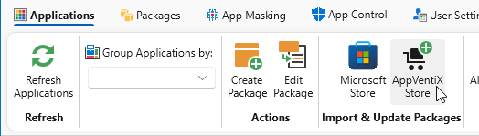

Select the **AppVentiXAgentGUI..._x64.msix** package and click the **Import selected packages** button.

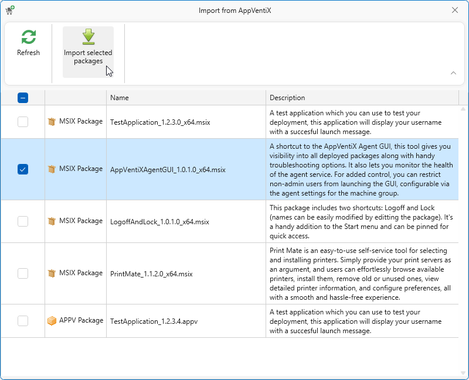

Click **Close**.

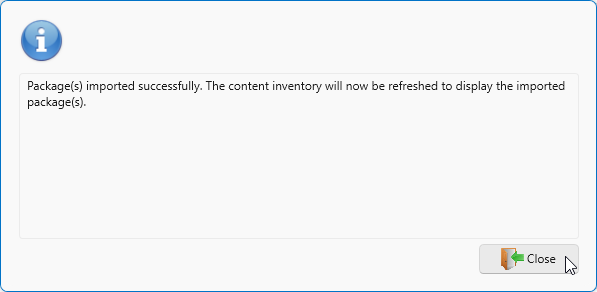

On the **Packages** tab, find the **AppVentiXAgentGUI** package and click the **Publish** button to publish the application.

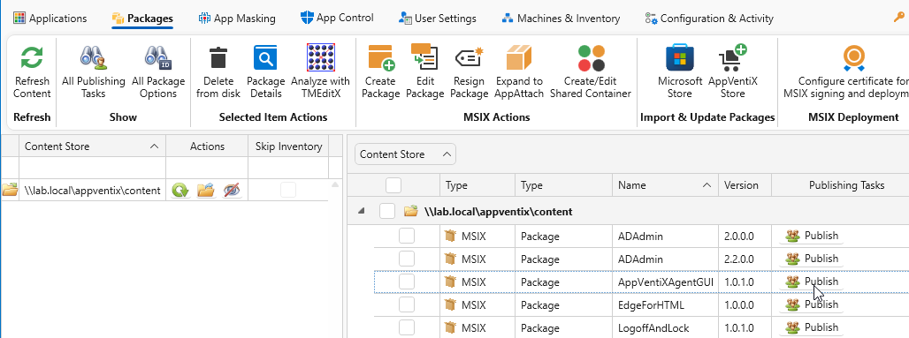

Choose a group to publish the Package to and when finished click **Save publishing task**.

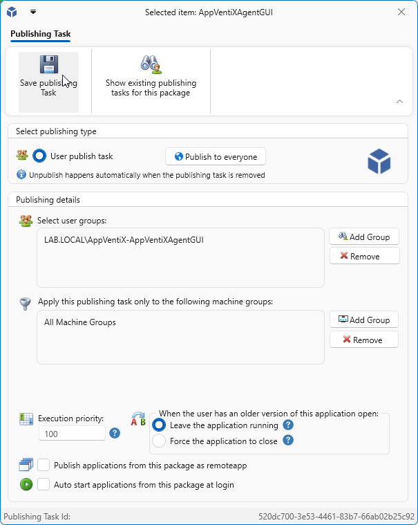

Click **Close**.

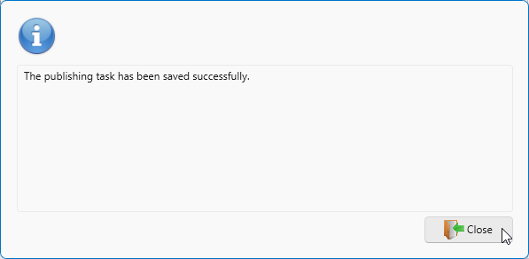

When an entitled user logs in, the Agent GUI shortcut will be available.

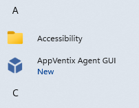

