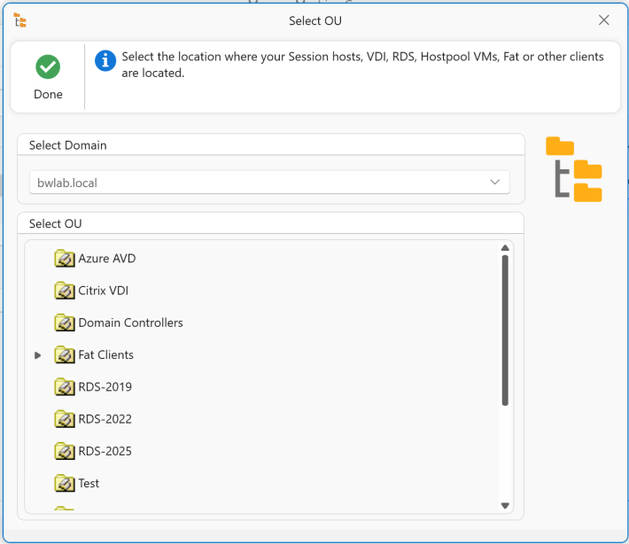
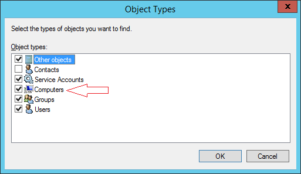

# AppVentiX Agent GUI

The AppVentiX Agent GUI can be used for:

- Checking the service state
- Viewing details about deployed packages, App Masking rules, and App Control policies
- Troubleshooting
- Invoking a refresh

Example screenshots of the Agent GUI:

---

## Configure Service

The AppVentiX agent is configured centrally in the Central View console. There are a couple of settings you can configure when you click on the **Configure Service** button:

In the agent configuration you can change/update the configuration share. You can also provide a user account which the service will use to access the configuration share and content share(s). By default the service will use integrated authentication.

**Debug mode** will log more information to the event log for troubleshooting purposes. Make sure to disable this option after troubleshooting.

You can export these settings to a registry file to import on other machines. These settings can also be provided for silent installation of the agent. Click on the **Silent Install** button in the Central View console (agent ribbon) to see the prepopulated silent installation parameter.

> **Note:** All other Agent Settings are configured and stored centrally.

---

## Refresh Shortcut

The following shortcut is placed in the Start menu. The user can click on this refresh shortcut to execute a refresh:

A refresh progress notification will be displayed:

This refresh updates applications, App Masking rules, App Control policies, and user settings.
