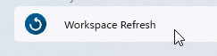
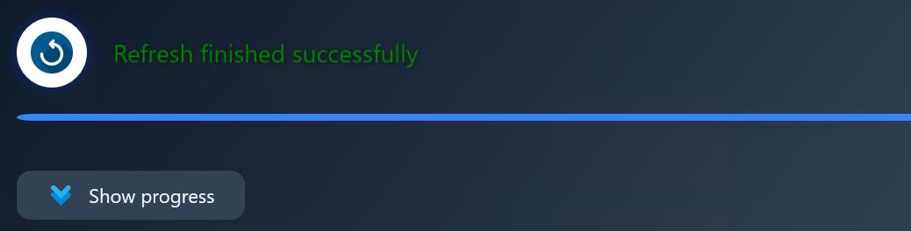
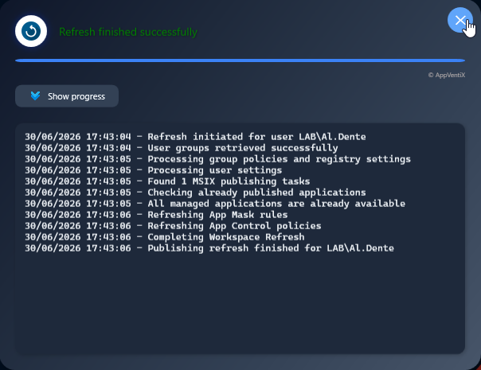

# AppVentiX Agent Refresh shortcut

The following shortcut is placed in the Start menu. Open the application to trigger a refresh.

A popup screen will show the progress.
A refresh progress notification will be displayed:

Click the **Show progress** button to see more refresh details. You can close the window when finished.

This refresh updates applications, App Masking rules, App Control policies, and user settings.