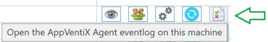
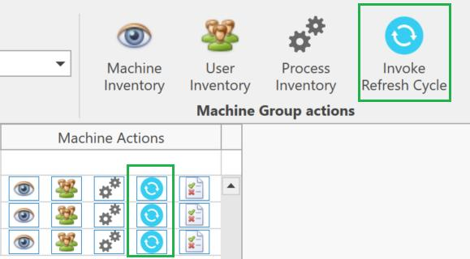
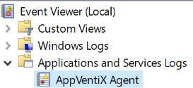
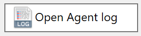
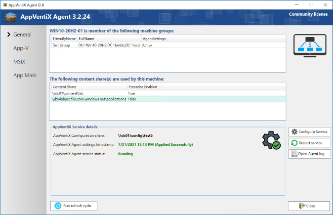
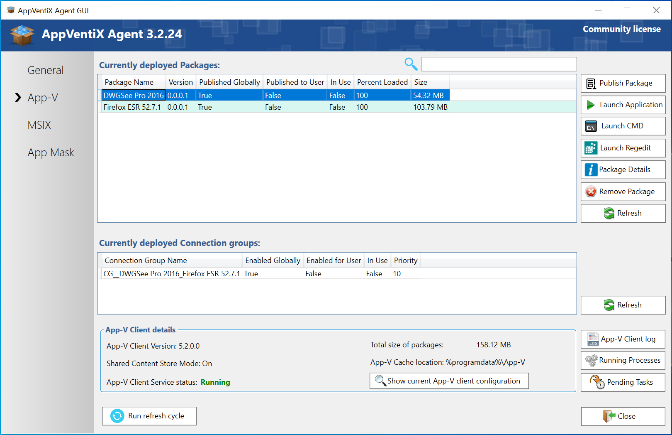

# AppVentiX Agent Service

The service is responsible for deploying and managing packages, for publishing packages for users that are logging on, and for users that are already logged on. The agent makes smart decisions: it will only publish new packages to users and will unpublish packages for users automatically when they are no longer managed (when you remove the publishing task or remove a user from a group, for example). The agent service can be configured with [Agent Settings](agent-settings.md) to fine-tune your deployment.

---

## Event Log

Every action of the service is logged in a dedicated event log, making troubleshooting easy and giving you good insight into your AppVentiX deployment.

The AppVentiX Agent event log can be found directly under **Applications and Services Logs**:

You can open the event log very easily from the Agent GUI with the **Open Agent log** button.

You can also inventory the log remotely from the Central View console by clicking on the log icon next to a machine.

The agent service is event-driven and the actions can be configured with Agent Settings. For example, you can configure the agent to clear the cache at machine start, publish packages at user login, etc.

---

## The Refresh Cycle

The refresh cycle handles the deployment of new packages by comparing which ones are already present in the cache with the ones on the content share(s). New packages will be cached when the pre-cache option is enabled for the content share. The refresh cycle runs at machine startup and while the machine is running it can be triggered in multiple ways:

- Through a configurable timer (in the Agent Settings)
- Manually on the machine through the AppVentiX Agent GUI (Run Refresh cycle button)
- With the PowerShell command: `(Get-Service 'AppVentiXService').ExecuteCommand(252)`
- Remotely by the AppVentiX Central View console
- The user can click on the Refresh Workspace shortcut in the Start menu

You can recognize the Refresh Cycle by the blue circle:

In Central View you can invoke the refresh cycle for a single machine (blue circle next to the machine) or for the whole machine group (machine group actions).

### What the Refresh Cycle Does

1. Pre-cache packages from content shares (only when pre-cache is enabled for the content share) (App-V and MSIX)
2. Remove packages from the cache that are no longer on one of the configured content shares (when this setting is enabled in the agent settings). This setting is enabled by default. (App-V and MSIX)
3. Execute global publishing tasks (App-V only)
4. Execute user publishing tasks for currently logged-in users (App-V and MSIX), deploy App Masking rules, App Control policies, and refresh user settings

### PowerShell Commands for the Refresh Cycle

The following PowerShell commands can be used to initiate the refresh cycle, for example as a scheduled task or in an automation solution:

| Action | PowerShell Command |
|--------|-------------------|
| Refresh both cache and user publishing tasks (default) | `(Get-Service 'AppVentiXService').ExecuteCommand(252)` |
| Refresh only cache: balance cache to remove old packages, pre-cache packages when enabled for a content share, process package drain tasks | `(Get-Service 'AppVentiXService').ExecuteCommand(242)` |
| Refresh only user publishing tasks for currently logged-in users and refresh global publishing tasks (App-V) | `(Get-Service 'AppVentiXService').ExecuteCommand(241)` |

