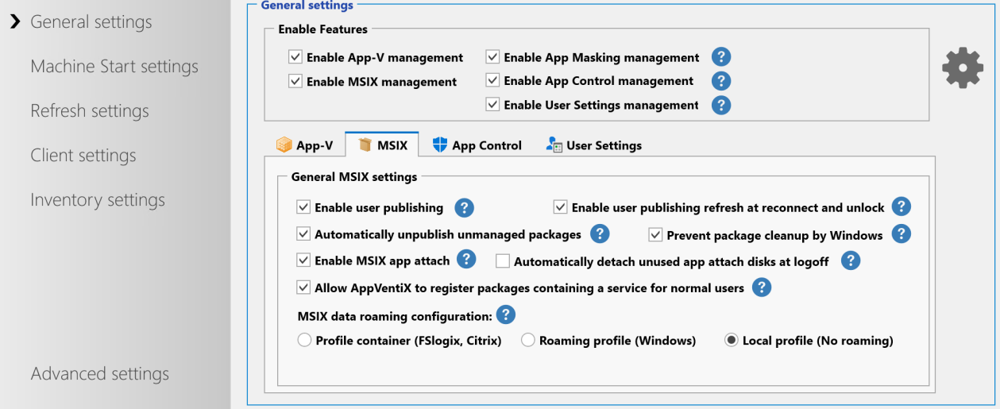
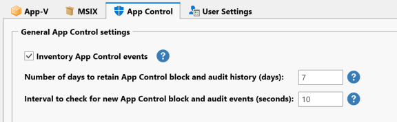
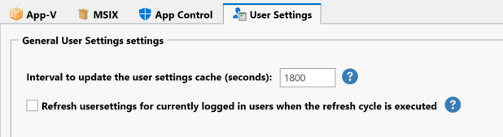
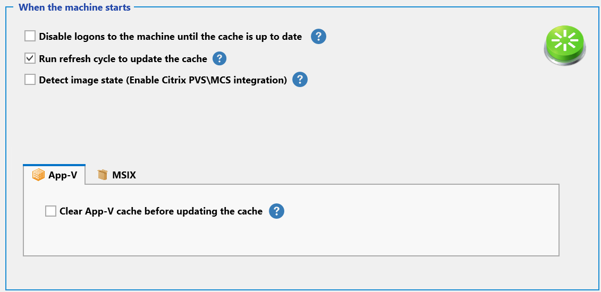
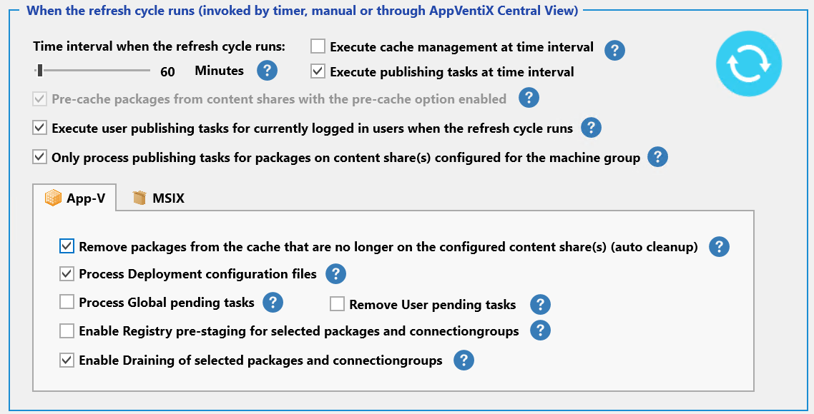
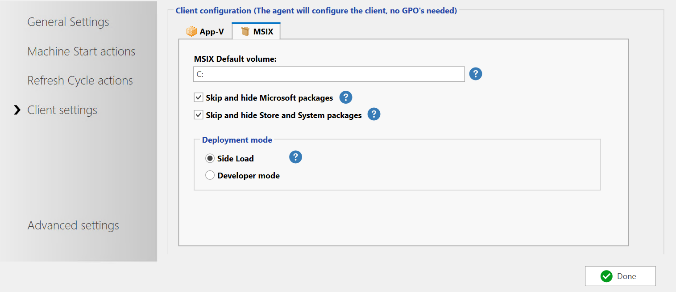
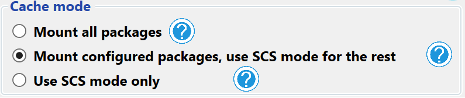
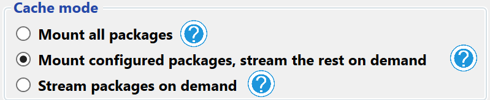
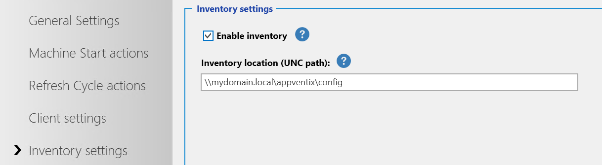
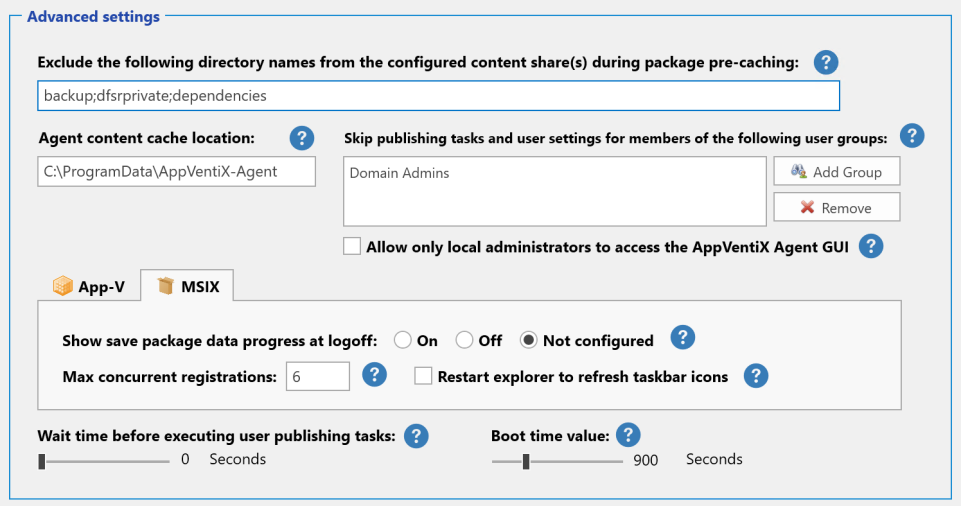

# Machine Group Agent Settings

Configure Agent Options to fine-tune your deployment. Agent options are retrieved and applied by the agent running on the client machine. Agent settings are applied when the agent service (re)starts.

Most Agent Settings speak for themselves. The tooltip will provide additional information by holding your cursor on the question mark icon. All settings not in their own tab apply to all features; where they are different you will find them in their own tab/groupbox.

---

## General Settings

Here you can enable App-V and/or MSIX. You can also enable them both to use them side by side. The settings are split between the features to easily navigate through the settings.

| Setting | Description |
|---------|-------------|
| Enable user publishing | Enables the service to process user publishing tasks when a user logs in (App-V and MSIX) |
| Enable user publishing at session reconnect | Enables the service to process user publishing tasks when a user reconnects or unlocks their session (App-V and MSIX) |
| Publish packages globally when there is no user publishing task configured | Instructs the agent to deploy packages globally when there is no user task configured for the package (App-V only) |
| Unpublish packages and connection groups at logoff | Designed for environments where users frequently log in to different machines. Ensures packages are unpublished at logoff, preventing orphaned shortcuts or registrations if user assignments change or packages are removed while the user is logged off, maintaining a clean publish state. |
| Automatically unpublish unmanaged packages | Makes the deployment fully managed. When you remove a publishing task the package will be unpublished/removed for the user automatically (App-V and MSIX) |
| Enable MSIX app attach | Enables the App Attach integration in the agent (MSIX only) |
| Automatically detach unused app attach disks at logoff | Disabled by default. By default, app attach disks are automatically detached when the machine is rebooted. Optionally enable this setting to detach unused app attach disks at logoff. When enabled, the service will check 30 seconds after a user logoff if the app attach disk is still in use; if not, it will be detached. Especially useful for shared OS (like RDS/multi-user OS) and when you have many app attach disks to manage and machines are rebooted less frequently. |
| Allow AppVentiX to register packages containing a service | MSIX packages containing a service can only be added with elevated permissions. AppVentiX can add the package to allow the service to install and will then register it for a normal user account. |
| Prevent package cleanup by Windows | When you use FSLogix or another profile container solution and a user logs off, the profile is removed from the machine. Windows can detect that a package is no longer needed and removes it. With this setting the package will stay on the machine when the user logs off. AppVentiX will then remove packages using the balance cache feature when they are no longer on a content share. |
| MSIX data roaming | Configures the profile solution you are using. By default the profile container option is enabled, making package deployment compatible with container-based profile solutions. The "retain user settings stored in the systemappdata folder" option makes sure these settings persist as well. |
| Inventory App Control events | Enables inventory and logging for App Control block and audit events. Events are stored centrally in the Inventory folder of the configuration share. In Central View, click the App Control Log button to view the logs and create App Control policies directly. |
| Number of days to retain App Control block and audit history | Specifies the number of days that block and audit events are collected and stored before being overwritten by newer events. |
| Interval to check for new App Control block and audit events | Specifies the interval for checking new audit and block events. Only events newer than the previous inventory are processed, ensuring efficient, low-impact checks. During learning mode, configure a shorter interval to collect events more quickly. |
| Interval to update the user settings cache | The time interval when the user settings cache is updated. When an assigned user setting is not found in the cache it will be retrieved online automatically. Optionally you can redirect the cache location to another drive in the advanced settings. |
| Refresh user settings for currently logged-in users when the refresh cycle is executed | By default user settings are only executed during user login or when the user clicks on the Refresh Workspace shortcut. When this setting is enabled, user settings are also refreshed for logged-in users when the refresh cycle runs on the machine. |

---

## Machine Start Actions

With machine start actions you can configure the machine start configuration.

| Setting | Description |
|---------|-------------|
| Disable logons to the machine until the cache is up to date | The agent will disable logins while the cache is updated at machine start. It will enable logins again when the cache is up to date. |
| Run refresh cycle to update the cache | Invoke the refresh cycle at machine start to pre-cache packages from the content share(s) (when enabled for the content share). |
| Detect image state (Citrix PVS/MCS integration) | When the machine starts, the agent can detect the image state (read-only or read/write) and make smart decisions about how to deploy packages. Other agent settings are updated automatically when you enable this feature. There are 2 supported scenarios: **Scenario 1:** Private mode: Stop Refresh cycle. Read-only mode: Deploy packages. Often used for non-persistent RDS environments; you can redirect the cache to a persistent drive. **Scenario 2:** Private mode: Deploy packages in the cache. Read-only mode: Deploy new packages using optimized delivery (App-V SCS mode or MSIX App Attach). Often used for non-persistent VDI environments. When the image is opened for updates, the agent pre-caches all packages from the content shares. When running in read-only mode, the agent uses SCS mode (App-V) or App Attach (MSIX) to prevent write cache pollution. |
| Clear cache | Instructs the agent to clear the cache at machine start before packages from the content share(s) are pre-cached. This is an advanced feature: it first removes packages and then removes any leftovers in the cache to make sure it is empty. Often used for non-persistent environments where the cache is redirected to another drive. |

---

## Refresh Cycle Actions

Here you can configure the refresh cycle actions.

| Setting | Description |
|---------|-------------|
| Timer when the refresh cycle runs | Configure the refresh cycle to run every x minutes. The refresh cycle already runs at machine start-up to perform cache management. You can enable a timer for how often the refresh cycle should run during machine uptime and which part of the refresh cycle to invoke at the configured interval. |
| Pre-cache packages from the content shares with the pre-cache option enabled | A mandatory setting. You can control whether to pre-cache packages using the checkbox next to the content share in the machine group configuration window. |
| Execute user publishing tasks for currently logged-in users | Publish new or updated packages to users while they are logged in. They do not have to log off and back on again. |
| Only process publishing tasks for packages on content share(s) configured for the machine group | Publishing tasks are executed for users on machines regardless of where the package is stored by default. With this setting, only publishing tasks are executed for packages that are on one of the content share(s) configured for the machine group. |
| Remove packages from the cache that are no longer on the configured content share(s) | Removes packages from the cache when they are no longer found on one of the configured content share(s). Especially useful for persistent environments to keep the cache clean and up to date. Often not needed when clear cache at machine start is enabled. |
| Process Deployment configuration files | When enabled (default), the AppVentiX agent will process the deployment configuration file in the same folder as the package. The configuration file needs the .appd extension. Multiple .appd files in the same directory are supported. When you want to assign a specific .appd file to a package, give the .appd file the exact name of the package (for example: for package `Archi_530.100.appv`, name the config file `Archi_530.100.appd` or `Archi_530.100_DeploymentConfig.appd`). Applies to App-V only. |
| Process global pending tasks | When a globally published package is in use when a newer version is deployed, the App-V client generates a pending task to publish the package when the machine reboots. With this setting enabled, the AppVentiX agent detects global pending tasks and processes them automatically when the package is no longer in use. The user only needs to close the application. Applies to App-V only. |
| Remove user pending tasks | Removes user pending tasks before executing user publishing tasks to make sure the publish operation is retried when a package was in use the previous time. Applies to App-V only. |
| Enable registry prestaging | The pre-stage virtual registry option makes sure the virtual registry of the package is already loaded on the machine directly after the package is added. This is especially useful for bigger packages in combination with non-persistent environments. You need to configure a service account to use this feature. |
| Enable draining | Enables the draining feature. When selecting packages in Central View you can select "Drain this package" in the package options. The agent will remove packages on the drain list and prevent them from deploying again. |

---

## Client Settings

With client settings you can configure the App-V and/or MSIX client. No GPOs are needed; the agent configures the settings for you. A single point of configuration.

| Setting | Description |
|---------|-------------|
| Enable App-V Client | The AppVentiX agent will enable the App-V client for you. No need to enable the App-V client on the machines manually. |
| Cache location | The location where the package cache is stored. |
| Enable SCS mode | Configure if SCS mode should be enabled or disabled (enabled by default). The service configures SCS mode automatically when the service starts. Applies to App-V only. |
| Enable dynamic virtualization | Enabled by default. This feature integrates packages automatically with Internet Explorer and Windows Explorer (for plugins and context menus in Explorer). Turn this off if you want more isolation and control. Applies to App-V only. |
| Enable package scripts | Disabled by default. If enabled, the App-V client will allow the use of package scripts. Applies to App-V only. |
| Enable 8.3 name creation | The App-V client requires 8.3 name creation to be enabled on the disk containing the packages. This option ensures it is enabled. |
| Enable Office 365 integration | Enables virtual applications to be integrated with the installed Office 365 installation. Applies to App-V only. |
| Cache mode | Configure the desired cache mode. When SCS mode is enabled: **Mount all packages** will always mount (pre-cache) all packages. **Mount configured packages** (recommended): configure which packages should be mounted in the console; for other packages SCS mode is used. **Use SCS mode only**: no packages will be mounted in the cache; every package uses SCS mode and reads content directly from the network share. When SCS mode is disabled: **Stream packages on demand**: packages are loaded in the cache when they are started. Applies to App-V only. |
| Deployment mode | Side Load is needed to deploy MSIX packages. This is now the default in Windows. Applies to MSIX only. |

---

## FSLogix App Masking Feature

| Setting | Description |
|---------|-------------|
| Enable App Masking management | Enable centrally managed FSLogix App Masking rules and assignments with a single checkbox. |

---

## Inventory Settings

In the Inventory tab you can enable or disable the remote inventory feature and configure another share to store the inventory data. By default the inventory data is stored on the configuration share. Please note that the machines need write permissions to the inventory location to be able to save the inventory data. The configuration share only needs read permissions.

---

## Advanced Settings

Only change advanced settings when you have a special use case for them.

| Setting | Description |
|---------|-------------|
| Exclude the following directory names on the configured content share(s) | A list of folder names skipped by the agent when performing pre-cache or balance cache procedures. By default, folders containing "backup" and "dfsrprivate" are excluded. The list is separated with a semicolon (;). |
| Wait time before executing user publishing tasks | Normally not needed, but here you can configure a specific timeout after a user login before the user publishing tasks are executed. |
| Boot time value | The time the service detects that the machine has just rebooted and machine start-up actions are executed. Default is 900 seconds. Increase this value if your machines have a very long start-up time. |
| Enable staged package load procedure (App-V) | In some cases when many packages are loaded in the cache at the same time, the App-V client does not load some packages correctly. When this feature is enabled, packages are loaded using an interval to prevent this issue. |
| Enable App-V Cache validation after loading packages | Validates the App-V cache and reloads packages that are not loaded correctly. This feature ensures the App-V cache is always healthy. |
| Show save package data progress at logoff | When a user logs off, the package data is saved. This provides a status window to the user. It only takes milliseconds, so this option is usually not needed. |
| Agent content cache location | For the pre-cache and balance cache methods, the content share is scanned for changes. The content cache keeps a cache of the content on the share(s) so the number of reads is reduced. In non-persistent scenarios this location can be configured to a persistent drive like `D:\AppVentiXCache`. |
| Max concurrent registrations | The number of parallel MSIX registrations at the same time (throttling). Can be increased when using fast network/storage resources and reduced when having lower resources. |
| Restart explorer to refresh taskbar icons | In profile container scenarios with dynamic delivery (no pre-caching), pinned taskbar icons may appear transparent. This setting restarts Explorer once after login to refresh the icons on the taskbar. |
| Skip publishing tasks and user settings for members of the following user groups | Multiple groups can be configured (Domain Admins is added by default but can be removed). Users who are members of one of these groups will be skipped from user settings and publishing tasks. |
