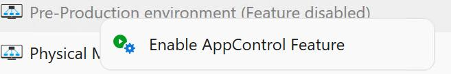
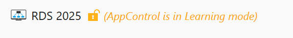
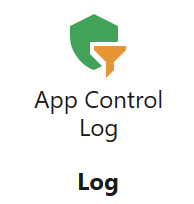
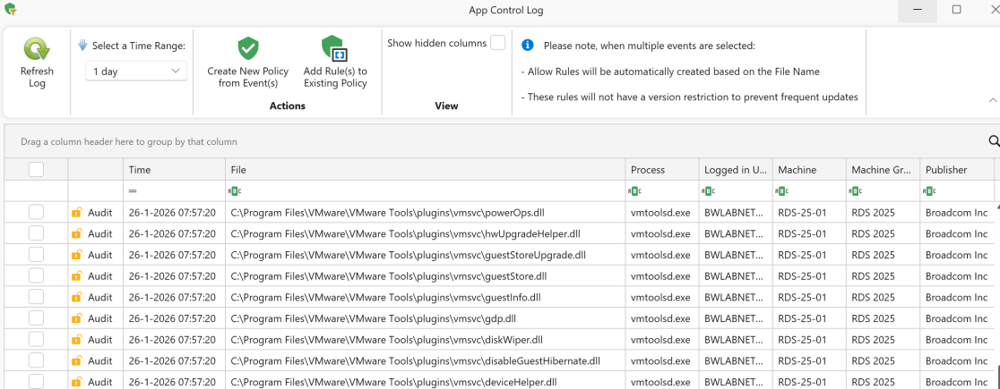
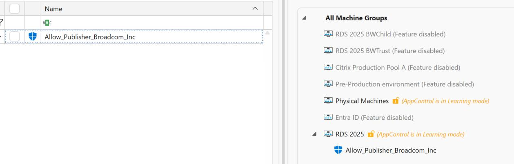
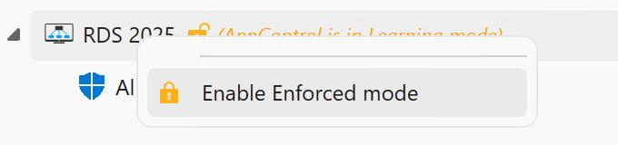
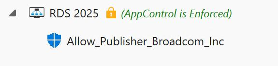
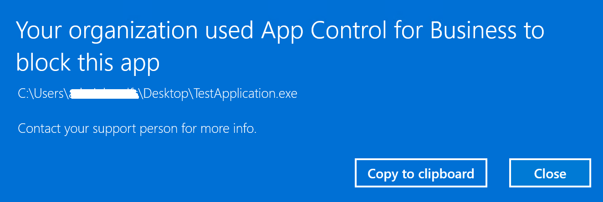
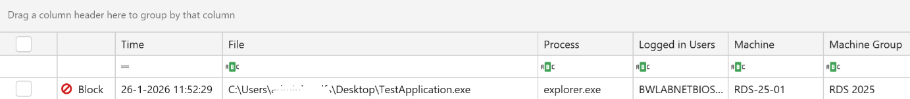

# App Control Setup and Best Practices

AppVentiX makes it easy to set up and manage Microsoft App Control for Business (WDAC). This feature allows you to block applications and processes that are not allowed by your organization. This results in a very secure workspace because users cannot run processes that are not covered in an allow policy.

---

## Getting Started with App Control

### Step 1: Enable the Feature

Enable the feature in the [Agent Settings](agent-settings.md) for the machine group, or by right-clicking on the machine group in the App Control page:

### Step 2: Learning Mode

The machine group will be in learning mode by default:

After enabling the feature, restart the agent service or the machine to activate the feature.

Learning mode allows you to monitor events so you can create policies to allow the applications and processes you want to allow. At this stage nothing will be blocked.

### Step 3: Open the App Control Log

Open the App Control log (note that it may take some time before the first events appear). You can speed this up by clicking the Refresh Workspace shortcut on the machine, which also initiates event collection.

Select the event and click the **Create New Policy** button.

The recommended policy type is to allow the process or application by publisher (most applications are signed with a certificate). In this way you can create one policy to allow all the processes associated with this application. When application executables are not signed, a file hash or file path rule can be used instead.

Save the policy and assign the policy to the machine group by dragging it to the treeview:

### Step 4: Enable Enforced Mode

After the policies are created, right-click the machine group and select **Enable Enforced Mode**:

---

## Blocked Applications

Applications and processes not covered by a policy will be blocked. The following message is displayed to the user when an application is blocked:

Blocked events are visible in the App Control log window:

After reviewing the event, the process can be allowed in the same way as an audit event. When a new allow policy is created, the user can click the Refresh Workspace shortcut and immediately start the application, without needing to log off and back on.

---

## Notes and Best Practices

- Applications or processes that are allowed are no longer logged in the App Control log
- Creating policies that allow files or paths on UNC locations is supported only on Windows 11 and Windows Server 2025
- Publisher policies may not apply to service executables (processes launched by background services). In these cases, use folder path-based allow policies instead
- Policies that allow files in user-writable locations (for example, the user profile) require the **Path is writable** checkbox. This option is automatically enabled for profile paths. For other locations, verify that users have write permissions and enable this setting if necessary
- Wildcard usage: Folder path rules (`C:\Program Files\MyApp\*`) apply to all files in the directory
- With the **Folder Scan** rule type (creating a new policy from the App Control feature page), you can connect to a remote UNC share to scan a whole folder at once. It will provide publisher information and fall back to filepath or hash when files are not signed
- Creating policies from events is the easiest and most effective way to manage your App Control implementation

---

## App Control Rule Types

App Control policies support multiple rule types with different specificity levels:

1. **Publisher Rules:** Allow applications based on code-signing certificate. Most flexible and recommended for signed applications. Supports publisher + product name + filename + version combinations.

2. **File Attribute Rules:** Based on file metadata (filename, product name, file description, internal name, version). Useful for applications without valid signatures. Less secure than publisher rules.

3. **File/Folder Path Rules:** Allow/deny based on file or folder location. Only works in User Mode (not for kernel drivers). Can specify individual files or entire directories with wildcards.

4. **File Hash Rules:** Based on cryptographic file hash (SHA1/SHA256). Most specific but requires updates for each file version. Fallback option when other methods are not suitable.

5. **Folder Scan Rules:** Scans entire folders and creates rules for all executables found. Automatically creates rules using preferred rule levels (Publisher, FileName, FilePath, Hash). Supports excluding specific subdirectories.
