# App Control Setup and Best Practices

AppVentiX makes it easy to set up and manage Microsoft App Control for Business (formerly Windows Defender Application Control / WDAC). App Control controls which applications are allowed to run on your devices. Only explicitly trusted applications can execute, which results in a very secure workspace because users cannot run processes that are not covered by an allow policy.

From a single interface you can create and manage policies, collect triggered application events from your clients, and build new policies based on those events.

---

## Before You Start

Make sure both Central View and the Agent are updated to version 5.0.26 or later. You can download the latest version from [https://download.appventix.com/latest](https://download.appventix.com/latest).

Start with a test environment rather than your entire production environment. Each AppVentiX Agent reports back triggered events, and a large environment can quickly generate an overwhelming amount of data. Start small, create your initial policies, and test thoroughly before rolling out to production.

> **IMPORTANT**: The machine on which AppVentiX Central View is installed must be Server 2022 or higher if you want to enable and configure App Control. It will not work on a lower version due to the lack of support by Microsoft.

---

## Enabling App Control

You have two options to enable App Control: directly from the App Control pane, or through the Machine Group settings. Make sure you have permission to edit and change Machine Groups.

### Option 1: From the App Control Pane

Click the **App Control** tab in Central View. On the left you will see your policies (once created), and on the right the Machine Groups configured in AppVentiX.

Right-click a Machine Group and select **Enable AppControl Feature**.

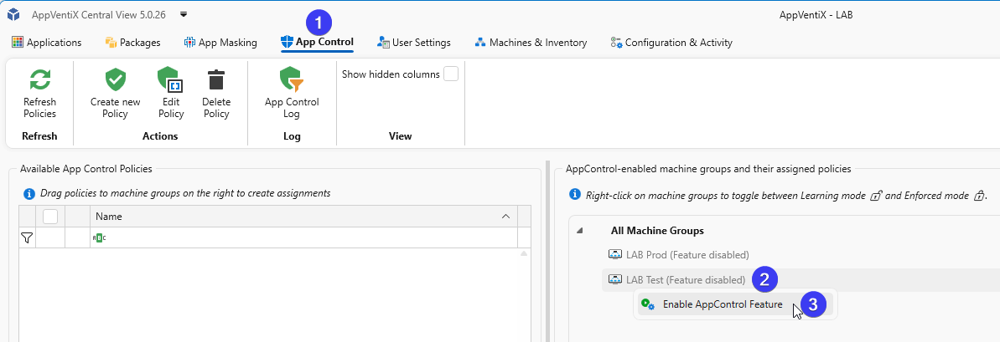

### Option 2: From Machine Group Settings

Go to the **Machines & Inventory** tab and click the **Machine Group** button in the toolbar. Select your environment (preferably a test environment) and click **Configure Agent for selected Machine Group**. Under **General settings**, check **Enable App Control management**.

Repeat this step for each Machine Group you want to enable.

In the Machine Group General settings you can also fine-tune the history and event collection settings:

- By default, 7 days of history are retained. Older data is purged.
- The interval to check for new App Control events is 30 minutes (1800 seconds) by default. Only new events triggered since the last retrieval are added to the log.

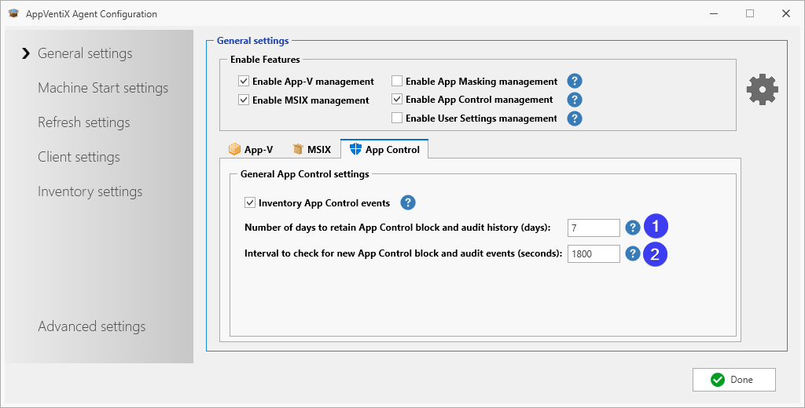

After enabling the feature, restart the agent service or the machine to activate it.

### Learning Mode and Enforced Mode

When a Machine Group is initially enabled for App Control, it starts in **Learning Mode**. Nothing is blocked, everything is allowed to run, and events are written to the event log so you can build your policies.

When you have configured all your policies, switch a Machine Group to **Enforced Mode**. In this mode all applications that are not allowed to run are blocked.

You can switch between Learning Mode and Enforced Mode at any time by right-clicking the Machine Group.

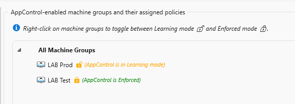

---

## Understanding the Default Behavior

With the App Control feature enabled, nothing is blocked by default. The agent starts collecting events from the Windows event log and reports them back to Central View for review.

### Generating Events

Log into a machine as a user and start several applications, open files, and perform normal work. Alternatively, enable the feature and let it run in the background during daily use.

### Speeding Up the Sync

Events are synced automatically in the background. To investigate a specific event in Central View right away, you can trigger a manual sync. On the client, open the Start Menu and select **Refresh Workspace**.

A popup shows the sync progress. Click **Show progress** for more detail.

> **NOTE:** This sync happens automatically. The manual method only speeds it up.

### Reviewing Events in Central View

After some time has passed, open the **App Control Log** in Central View to see the events triggered by your users. Click **Refresh Log** to load the latest data, or use **Select a Time Range** to filter by a specific period.

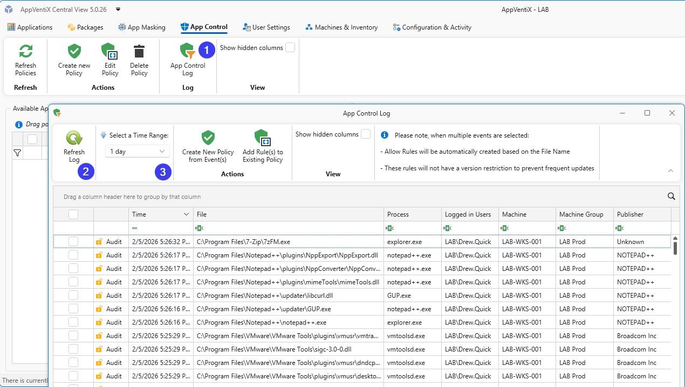

---

## User Mode vs Kernel Mode

Windows runs software on two separate levels:

- **User Mode** is where everyday applications run: browsers, Office, business applications, and essentially everything you deploy through an installer or package. These programs have limited privileges and cannot directly access hardware or critical system components.
- **Kernel Mode** is the domain of drivers and system components that have direct access to hardware and the Windows core, such as printer drivers, network drivers, antivirus kernel components, or storage controllers. Software at this level runs with the highest privileges, which makes strict control through policies especially valuable.

When you create a policy, checkboxes determine where the rule applies. Standard applications (`.exe`, `.msi`, `.msix`) fall under User Mode; drivers (`.sys`) and kernel components fall under Kernel Mode. In most cases you can leave both checked and Windows applies the rule at the appropriate level. To deliberately limit the scope, for example to whitelist applications only while managing drivers through a separate policy or other tooling, uncheck one of the two.

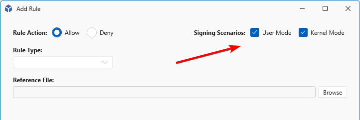

---

## Rule Types

When creating a policy you decide how to identify the application you want to allow or block. Each rule type has its own trade-off between security and flexibility.

- **Publisher** rules trust applications based on their digital signature. This is the most flexible option: as long as the software is signed by the same publisher, updates are automatically allowed without policy changes. Ideal for commercial software that is regularly updated. Can be combined with product name, filename, and version for a more restrictive rule.
- **File or Path** rules allow anything running from a specific file or directory, such as `C:\Program Files\YourApp\`. Wildcards are supported. This is convenient but less secure: a malicious file dropped into that folder would also be trusted. Use sparingly and only for well-protected directories.
- **File Attributes** rules match on metadata such as the original filename, product name, or internal name embedded in the executable. Useful when publisher signing is not available but the file has consistent attributes across versions. Only works in User Mode (not for kernel drivers).
- **File Hash** rules trust a specific file based on its cryptographic hash (SHA1/SHA256). This is the most restrictive option: if the file changes even slightly, for example after an update, the hash no longer matches and the application is blocked. Best for files that rarely change or when you need absolute certainty about what is running.

> **IMPORTANT**: Wildcards in paths are only supported on clients with Server 2022 or up and Windows 11 and up.

Two additional options are available when creating a policy manually:

- **Certificate** lets you select a certificate file (`.cer`, `.crt`, `.p7b`) and create a Publisher rule based on that certificate.
- **Folder Scan** creates policies automatically. It tries to create a Publisher rule first and falls back to File Attributes, then Path, and finally File Hash. Use this to scan network shares for applications and files you want to allow.

In practice you will often combine rule types: Publisher rules for mainstream software, and File Attributes or Hash for unsigned or in-house applications.

---

## Creating Policies

Policies can be created in two ways: manually, or from the App Control (learned) logs.

### Creating Policies Manually

Open the **App Control** tab and click **Create new policy**.

Choose a **Rule Type** (Publisher, File or Path, File Attributes, File Hash, Certificate, or Folder Scan).

For a packaged app (for example an MSIX application) it is easiest to add it with the Publisher method. Select **Publisher** from the **Rule Type** list, then select a reference file (`.exe`, `.dll`, or `.sys`). For a packaged app, select **Select a Publisher from the Package Content**. This list shows all unique publishers extracted from signed packages on the content stores.

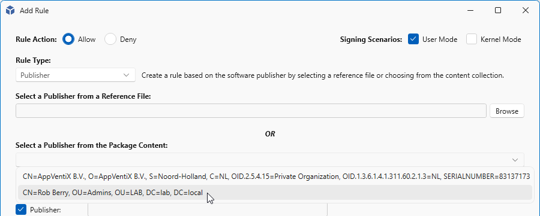

When you select a publisher from the list, the rule is filled in with the data from the signed package. When finished, click **Create Rule**.

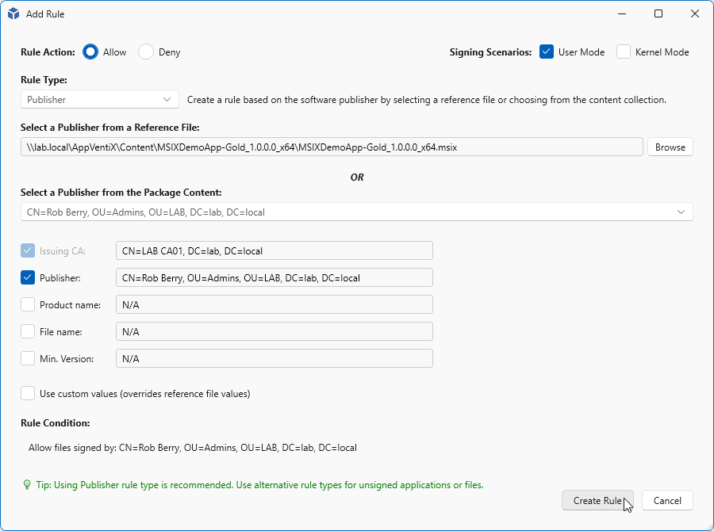

A name is generated based on the rule you created. You can change it if needed.

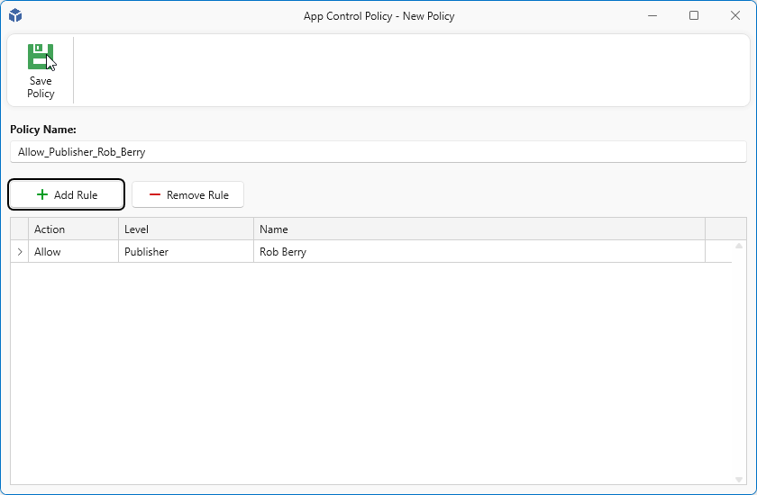

> **NOTE:** Some rules take a while to create. Wait until they are finished.

### Creating a Policy from the Logs (Learning Mode)

You can also create rules from the logs (learned rules). On the **App Control** tab, click the **App Control Log** button in the toolbar.

Select an entry you want to add. In this example "Notepad++" has a publisher named "NOTEPAD++", so a publisher rule can be created from this single entry. Click **Create New Policy from event(s)** in the toolbar, or right-click the selected entry and choose **Create New Policy from event(s)**.

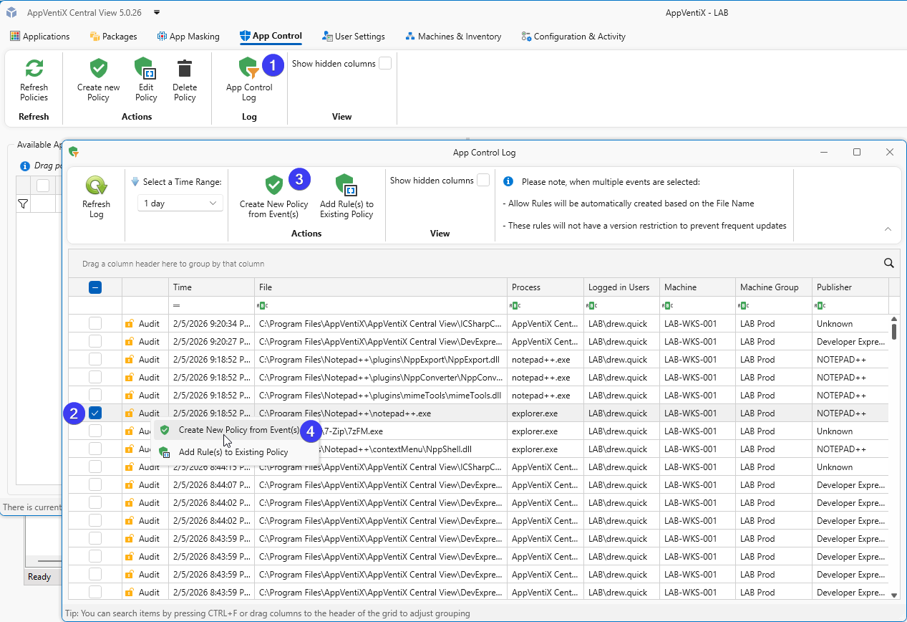

In the next step you can further configure the rule. By default only the Issuing CA and Publisher are checked, which is sufficient for this rule. To make the rule more restrictive, for example to allow only one of two applications signed with the same certificate, also check **Product name**, **File name**, or **Min. Version**. In most cases Publisher (and sometimes Product name) is enough. When finished, click **Create Rule**.

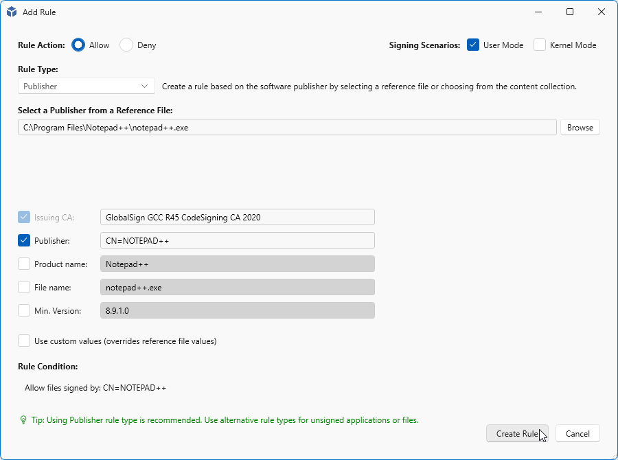

A default name is generated based on the rule type and publisher name. Change it if needed, then click **Save Policy**.

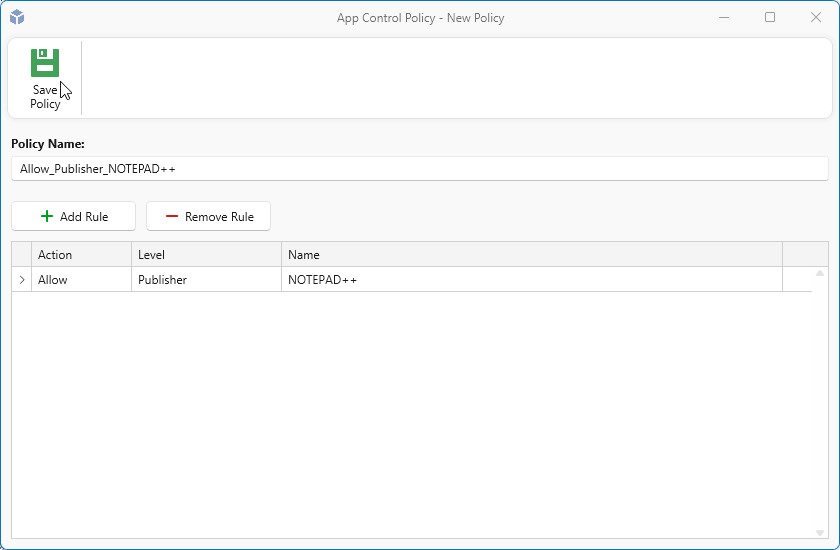

### Creating a File Path Policy from the Logs

Sometimes a Publisher rule is not possible because a file is not signed and there is no publisher information to base a rule on. One example is 7-Zip, which ships unsigned executables.

As before, select an item in the log and click **Create New Policy from event(s)**.

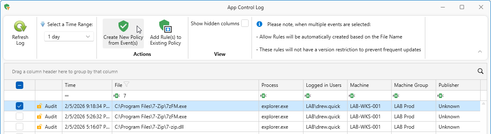

On the next page, verify that everything is correct and click **Create Rule**.

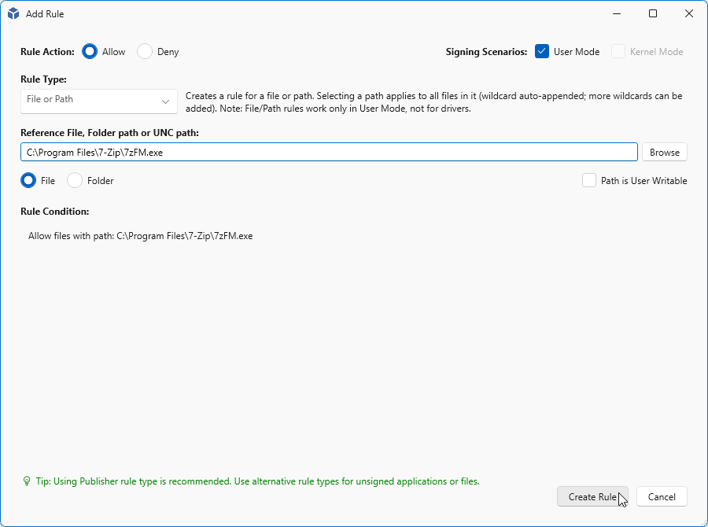

A default name is generated. With file rules there may be additional files for the same application. You can create a separate rule per file, or combine them into one policy. If you plan to combine rules, give the policy a helpful name. In this example the rule set is renamed to **Allow_FilePath_7zip** so other 7-Zip rules can be added to the same policy.

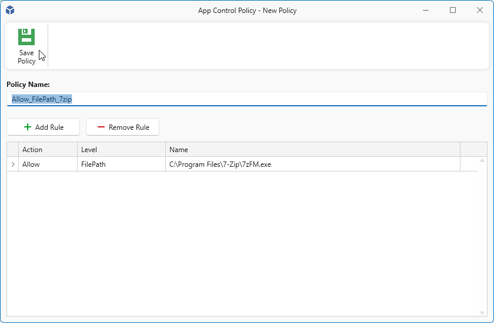

To add rules to an existing policy, select the items you want to add and click **Add Rule(s) to Existing Policy**.

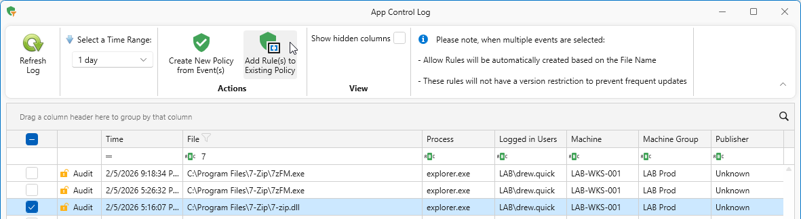

Select the policy you want to add the rules to and click **OK** to continue.

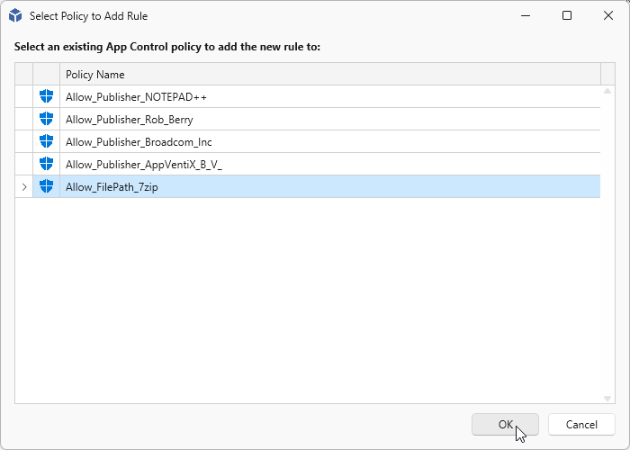

Verify the rule to add and click **Create Rule**.

When you are finished adding rules, click **Save Policy**.

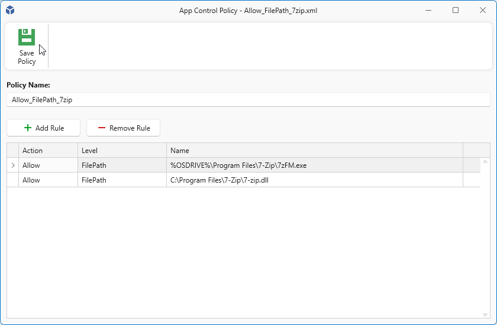

---

## Assign and Activate Policies

Assigning a policy determines where it is applied, for example to **All Machine Groups** or to one or more specific Machine Groups. Select the policies you want to assign and drag them onto a group to make them active there, or drag them onto **All Machine Groups** to activate them everywhere.

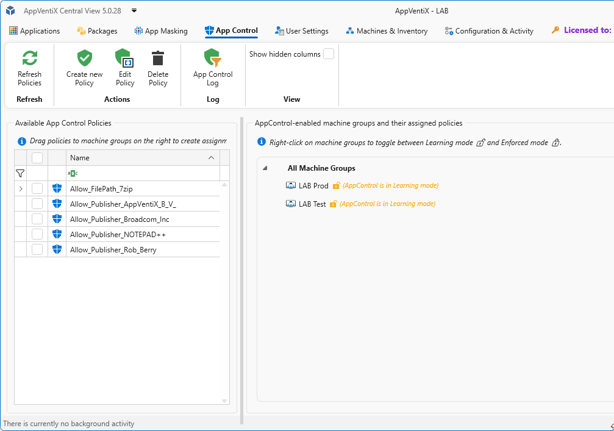

The policies become available immediately and are applied when the agent next checks for updates.

> **NOTE:** Applications or processes that are allowed are no longer logged in the App Control log.

---

## Enabling Enforced Mode

When you have reviewed the logs and created the necessary policies, disable Learning Mode and enable Enforced Mode. Allowed applications start without a blocked message. You can switch back to Learning Mode at any time to troubleshoot.

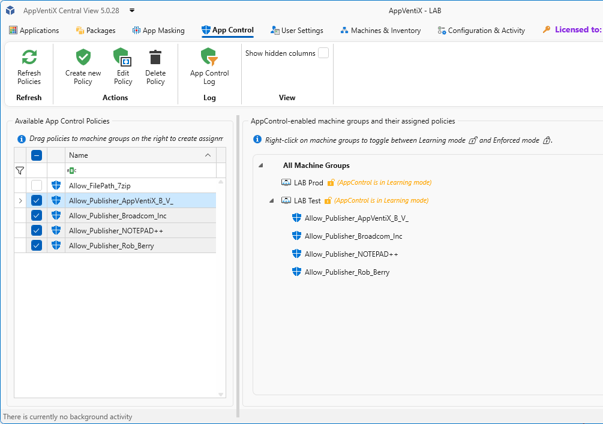

In the example below Notepad++ starts because it was allowed and its policy was activated, while 7-Zip is blocked because its policy was not yet activated.

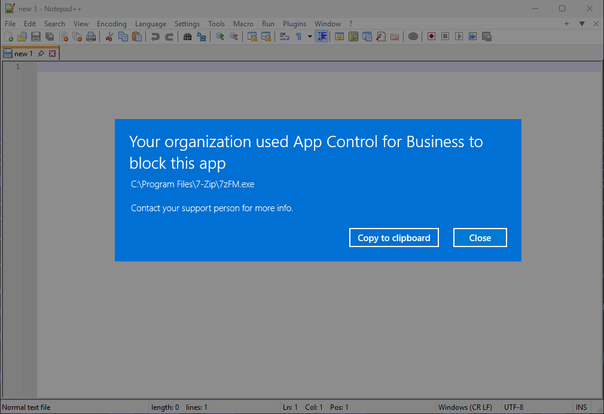

When an application is blocked, the user can review the event in the App Control log and create an allow policy in the same way as a learned event. After the new policy is created, the user can click **Refresh Workspace** and start the application immediately, without needing to log off and back on.

---

## Policy Management and Best Practices

- Applications or processes that are allowed are no longer logged in the App Control log.
- Creating policies that allow files or paths on UNC locations is supported only on Windows 11 and Windows Server 2025.
- Publisher policies may not apply to service executables (processes launched by background services). In these cases, use folder path-based allow policies instead.
- Policies that allow files in user-writable locations (for example, the user profile) require the **Path is writable** checkbox. This option is automatically enabled for profile paths. For other locations, verify that users have write permissions and enable this setting if necessary.
- Folder path rules (`C:\Program Files\MyApp\*`) apply to all files in the directory.
- With the **Folder Scan** rule type, you can connect to a remote UNC share to scan a whole folder at once. It extracts publisher information and falls back to file path or hash when files are not signed.
- Creating policies from events is the easiest and most effective way to manage your App Control implementation.
