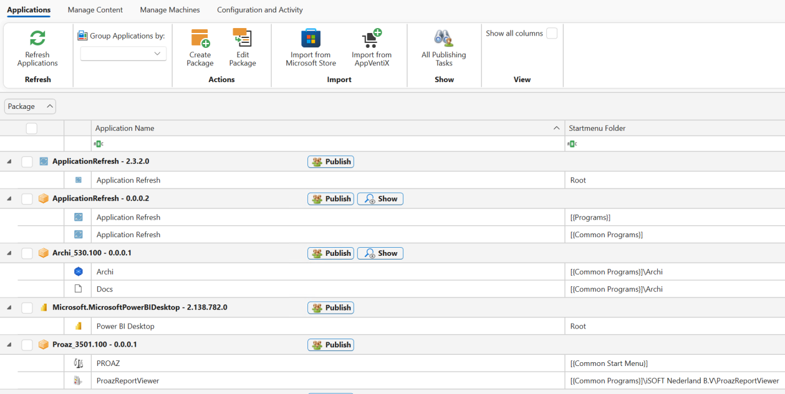
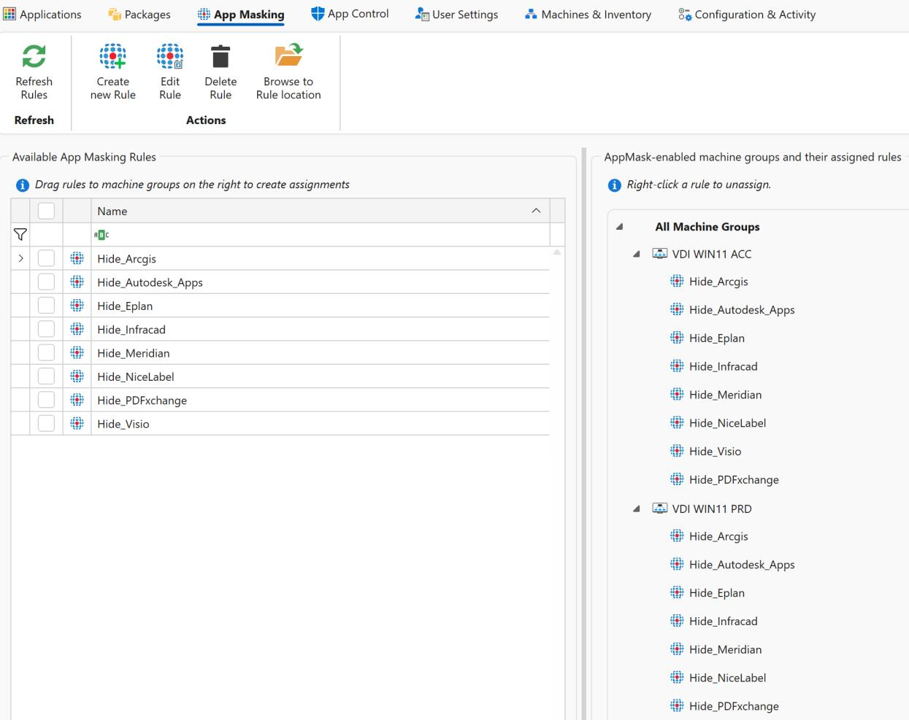
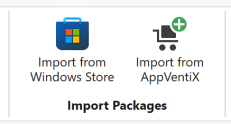

# Application Overview

The default page in Central View is the Applications page. This section provides an overview of all applications within your packages.

You can easily create new packages or edit existing ones from here. When creating new packages, you can manage shortcuts, include custom files, add scripts, and more, giving you complete control over your package configurations.

---

## Import Packages

Using the Import Packages buttons, you can directly import MSIX packages from the Microsoft Store, such as Power BI, WhatsApp, Whiteboard, and the MSIX Packaging Tool.

The **Import from AppVentiX** option allows you to import packages created by AppVentiX, including:

- A test package for validating deployments
- Handy shortcuts like Log Off and Lock
- Tools such as PrintMate, which lets users easily manage their printers

