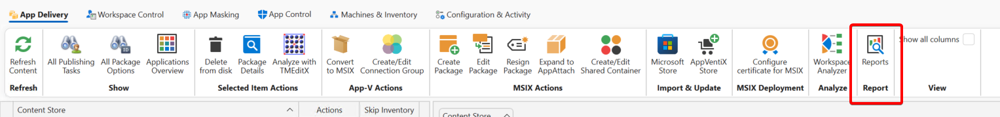
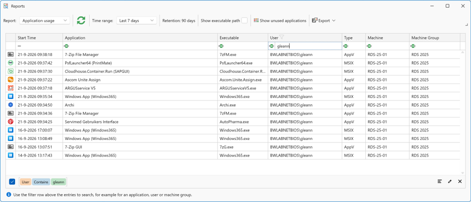
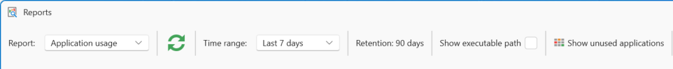
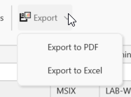

# Reports

**Reports** give you visibility into application usage. With application tracking enabled, you can gather usage data across App-V, MSIX, and locally installed applications.
Usernames can optionally be anonymized, and reports can be exported to Excel or PDF. Reporting can be enabled on a per-machine-group basis.

You can enable the report in the [**Machine Group Agent Settings**](../agent-settings/index.md#inventory-and-report-settings).

!!! note
    You can also find the **Reports** button on the **Machines & Inventory** tab.

You will see an overview of the applications launched by your users.

Use the top menu bar to filter and fine-tune your report.

Click **Export** to save the report as PDF or Excel.

