# Create Azure blob storage via Terraform (IaC)

The storage account required for the Azure storage blob configuration described [here](../azure-blob-storage/index.md#manual-setup) can also be crated via Terraform.

!!! Important
    This description requires you to have basic knowledge of Terraform ans assumes you already have a working environment.

## Terraform files

Create the files with the following content. Adjust the variables accordingly to your environment.

`variables.tf`

The variable used in the Terraform deployment.

```Terraform
# --- Azure context ---------------------------------------------------------

variable "subscription_id" {
  description = "Azure subscription ID to deploy the storage account into."
  type        = string
}

variable "tenant_id" {
  description = "Entra ID (Azure AD) tenant ID that owns the subscription and the app registration."
  type        = string
}

# --- Resource group ----------------------------------------------------------

variable "create_resource_group" {
  description = "true creates a new resource group. false reuses an existing one (must already exist)."
  type        = bool
  default     = true
}

variable "resource_group_name" {
  description = "Name of the resource group to create (create_resource_group = true) or reuse (create_resource_group = false)."
  type        = string
}

variable "location" {
  description = "Azure region for the resource group / storage account, e.g. westeurope."
  type        = string
}

# --- Storage account ----------------------------------------------------------

variable "storage_account_name" {
  description = "Globally unique storage account name (lowercase letters/numbers only, 3-24 chars)."
  type        = string

  validation {
    condition     = can(regex("^[a-z0-9]{3,24}$", var.storage_account_name))
    error_message = "storage_account_name must be 3-24 characters, lowercase letters and digits only."
  }
}

variable "storage_account_tier" {
  description = "Storage account performance tier. AppVentiX support may instruct changing this to Premium."
  type        = string
  default     = "Standard"
}

variable "storage_account_replication_type" {
  description = "Storage account redundancy/replication type."
  type        = string
  default     = "LRS"
}

variable "blob_soft_delete_retention_days" {
  description = "Days to retain deleted blobs (soft delete)."
  type        = number
  default     = 7
}

variable "container_soft_delete_retention_days" {
  description = "Days to retain deleted containers (soft delete)."
  type        = number
  default     = 7
}

# --- App registration / client certificate ------------------------------------

variable "app_registration_display_name" {
  description = "Display name for the Agent app registration used for certificate-based access to the storage account."
  type        = string
  default     = "AppVentiX Central View Agent"
}

variable "cert_validity_years" {
  description = "Validity period (years) for the generated self-signed client certificate."
  type        = number
  default     = 3
}

variable "agent_inventory_role" {
  description = "Role granted to the agent app registration on the inventory container: \"contributor\" (preferred) or \"reader\" (minimal)."
  type        = string
  default     = "contributor"

  validation {
    condition     = contains(["contributor", "reader"], var.agent_inventory_role)
    error_message = "agent_inventory_role must be either \"contributor\" or \"reader\"."
  }
}

# --- Admin principal (Storage Blob Data Contributor on all containers) --------

variable "admin_principal_type" {
  description = "Whether admin_principal_name refers to a \"User\" (UPN) or a \"Group\" (display name)."
  type        = string

  validation {
    condition     = contains(["User", "Group"], var.admin_principal_type)
    error_message = "admin_principal_type must be either \"User\" or \"Group\"."
  }
}

variable "admin_principal_name" {
  description = "UPN of the admin user (admin_principal_type = \"User\") or display name of the admin group (admin_principal_type = \"Group\") to grant Storage Blob Data Contributor on all containers."
  type        = string
}

```

`terraform.tfvars` (optional)

Optional file for specifying the variables. You can also specify them via the `-var` parameter or as `TF_VAR_...` variables. That is up to you.

```Terraform
# Copy this file to terraform.tfvars and fill in your real values.
# terraform.tfvars is git-ignored; never commit real subscription/tenant IDs
# or principal names in this example file.

subscription_id = "00000000-0000-0000-0000-000000000000"
tenant_id       = "00000000-0000-0000-0000-000000000000"

# set true to create a new resource group or false to reuse an existing resource group
create_resource_group = true
resource_group_name   = "rg-appventix-centralview"
location               = "westeurope"

storage_account_name             = "saappventix"
storage_account_tier             = "Standard"
storage_account_replication_type = "LRS"

app_registration_display_name = "AppVentiX Central View Agent"
cert_validity_years            = 3
agent_inventory_role           = "contributor"

# admin_principal_type = "User" and admin_principal_name = a UPN, or
# admin_principal_type = "Group" and admin_principal_name = a group display name.
admin_principal_type = "User"
admin_principal_name = "admin@contoso.com"

```

`providers.tf`

The providers and (minimum) versions used.

```Terraform
terraform {
  required_version = ">= 1.6"

  required_providers {
    azurerm = {
      source  = "hashicorp/azurerm"
      version = "~> 4.0"
    }
    azuread = {
      source  = "hashicorp/azuread"
      version = "~> 3.0"
    }
    tls = {
      source  = "hashicorp/tls"
      version = "~> 4.0"
    }
    random = {
      source  = "hashicorp/random"
      version = "~> 3.6"
    }
    pkcs12 = {
      source  = "chilicat/pkcs12"
      version = "~> 0.4"
    }
    local = {
      source  = "hashicorp/local"
      version = "~> 2.5"
    }
  }
}
```

`resource_group.tf`

Resource group. Either a new or reuse an existing.

```Terraform
# "Connect to Existing > Manual" flow: either create a new resource group for
# the storage account, or reuse one that already exists.

resource "azurerm_resource_group" "this" {
  count = var.create_resource_group ? 1 : 0

  name     = var.resource_group_name
  location = var.location
}

data "azurerm_resource_group" "existing" {
  count = var.create_resource_group ? 0 : 1

  name = var.resource_group_name
}

locals {
  resource_group_name = var.create_resource_group ? azurerm_resource_group.this[0].name : data.azurerm_resource_group.existing[0].name
  location             = var.create_resource_group ? azurerm_resource_group.this[0].location : data.azurerm_resource_group.existing[0].location
}

```

`output.tf`

The values that will be in the output.

```Terraform
output "storage_account_name" {
  description = "Name of the storage account to enter in the AppVentiX Central View Manual wizard."
  value       = azurerm_storage_account.this.name
}

output "resource_group_name" {
  description = "Resource group containing the storage account."
  value       = local.resource_group_name
}

output "tenant_id" {
  description = "Tenant ID to enter in the AppVentiX Central View Manual wizard."
  value       = var.tenant_id
}

output "app_registration_client_id" {
  description = "Application (client) ID to enter in the AppVentiX Central View Manual wizard."
  value       = azuread_application.agent.client_id
}

output "app_registration_object_id" {
  description = "Object ID of the Agent app registration."
  value       = azuread_application.agent.object_id
}

output "pfx_file_path" {
  description = "Local path to the generated .pfx client certificate to import in the wizard."
  value       = local_file.agent_pfx.filename
}

output "public_cert_file_path" {
  description = "Local path to the generated public certificate (.pem), kept for records only."
  value       = local_file.agent_cert_pem.filename
}

output "pfx_password" {
  description = "Password protecting the generated .pfx. Retrieve with: terraform output -raw pfx_password"
  value       = random_password.pfx.result
  sensitive   = true
}

output "pfx_password_file_path" {
  description = "Local path to the .pfx password, written out in plain text alongside the .pfx."
  value       = local_file.agent_pfx_password.filename
}

```

`app_registration.tf`

The App Registration creation and configuration.

```Terraform
# Agent app registration: single tenant, certificate authentication, the
# fixed "Mobile and desktop applications" redirect URI from the manual doc,
# and admin consent for the default Microsoft Graph User.Read delegated
# permission (what the "Grant admin consent" button in the doc approves).

data "azuread_client_config" "current" {}

data "azuread_service_principal" "msgraph" {
  client_id = "00000003-0000-0000-c000-000000000000"
}

resource "azuread_application" "agent" {
  display_name     = var.app_registration_display_name
  sign_in_audience = "AzureADMyOrg"
  owners           = [data.azuread_client_config.current.object_id]

  required_resource_access {
    resource_app_id = "00000003-0000-0000-c000-000000000000" # Microsoft Graph

    resource_access {
      id   = "e1fe6dd8-ba31-4d61-89e7-88639da4683d" # User.Read (delegated)
      type = "Scope"
    }
  }

  public_client {
    redirect_uris = [
      "ms-appx-web://microsoft.aad.brokerplugin/e05585a2-c70c-46fc-bcf9-74ad966e2837",
    ]
  }
}

resource "azuread_service_principal" "agent" {
  client_id = azuread_application.agent.client_id
  owners    = [data.azuread_client_config.current.object_id]
}

resource "azuread_service_principal_delegated_permission_grant" "agent" {
  service_principal_object_id          = azuread_service_principal.agent.object_id
  resource_service_principal_object_id = data.azuread_service_principal.msgraph.object_id
  claim_values                         = ["User.Read"]
}

resource "azuread_application_certificate" "agent" {
  application_id = azuread_application.agent.id
  type           = "AsymmetricX509Cert"
  encoding       = "pem"
  value          = tls_self_signed_cert.agent.cert_pem
}
```

`certificate.tf`

Certificate creation, used in the AppRegistration for Agent authentication.

```Terraform
# Self-signed client certificate used by the Agent app registration to
# authenticate to the storage account, delivered as a .pfx (private key +
# cert) plus a .pem public cert for reference, matching the wizard's
# "Generate a new certificate" option.

resource "tls_private_key" "agent" {
  algorithm = "RSA"
  rsa_bits  = 2048
}

resource "tls_self_signed_cert" "agent" {
  private_key_pem = tls_private_key.agent.private_key_pem

  subject {
    common_name = "AppVentiX Central View Agent (${var.storage_account_name})"
  }

  validity_period_hours = var.cert_validity_years * 365 * 24

  allowed_uses = [
    "key_encipherment",
    "digital_signature",
    "client_auth",
  ]
}

resource "random_password" "pfx" {
  length           = 32
  special          = true
  override_special = "!@#$%&*-=+"
}

resource "pkcs12_from_pem" "agent" {
  password         = random_password.pfx.result
  cert_pem         = tls_self_signed_cert.agent.cert_pem
  private_key_pem  = tls_private_key.agent.private_key_pem
}

resource "local_file" "agent_pfx" {
  filename       = "${path.module}/output/${var.storage_account_name}-agent.pfx"
  content_base64 = pkcs12_from_pem.agent.result
}

resource "local_file" "agent_cert_pem" {
  filename = "${path.module}/output/${var.storage_account_name}-agent.pem"
  content  = tls_self_signed_cert.agent.cert_pem
}

resource "local_file" "agent_pfx_password" {
  filename = "${path.module}/output/${var.storage_account_name}-agent-pfx-password.txt"
  content  = random_password.pfx.result
}

```

`storage.tf`

The storage account creation and configuration

```Terraform
# Storage account settings mirror the "Manual" walkthrough:
# - Standard performance / LRS redundancy (both overridable)
# - Public network access enabled from all networks
# - Secure transfer (HTTPS) required
# - Soft delete for blobs and containers, 7 day retention
# - Encryption left at defaults (Microsoft-managed keys)

resource "azurerm_storage_account" "this" {
  name                = var.storage_account_name
  resource_group_name = local.resource_group_name
  location             = local.location

  account_kind              = "StorageV2"
  account_tier              = var.storage_account_tier
  account_replication_type  = var.storage_account_replication_type

  https_traffic_only_enabled    = true
  min_tls_version                = "TLS1_2"
  public_network_access_enabled = true

  network_rules {
    default_action = "Allow"
  }

  blob_properties {
    delete_retention_policy {
      days = var.blob_soft_delete_retention_days
    }

    container_delete_retention_policy {
      days = var.container_soft_delete_retention_days
    }
  }
}

# The 5 containers required by AppVentiX. Names must be exactly as documented:
# lowercase, no spaces.
resource "azurerm_storage_container" "this" {
  for_each = toset(["machinegroups", "publishing", "content", "inventory", "centralview"])

  name                  = each.value
  storage_account_id    = azurerm_storage_account.this.id
  container_access_type = "private"
}

```

`rbac.tf`

The role assignments.

```Terraform
# Base RBAC flow from the manual doc:
# - Admin (user or group): Storage Blob Data Contributor on all 5 containers
# - Agent (app registration): Storage Blob Data Reader on machinegroups/
#   publishing/content, and Contributor (preferred) or Reader (minimal) on
#   inventory. The agent is not granted access to centralview.

data "azuread_user" "admin" {
  count = var.admin_principal_type == "User" ? 1 : 0

  user_principal_name = var.admin_principal_name
}

data "azuread_group" "admin" {
  count = var.admin_principal_type == "Group" ? 1 : 0

  display_name = var.admin_principal_name
}

locals {
  admin_object_id = var.admin_principal_type == "User" ? data.azuread_user.admin[0].object_id : data.azuread_group.admin[0].object_id

  agent_inventory_role_name = var.agent_inventory_role == "contributor" ? "Storage Blob Data Contributor" : "Storage Blob Data Reader"
}

resource "azurerm_role_assignment" "admin_containers" {
  for_each = azurerm_storage_container.this

  scope                = each.value.id
  role_definition_name = "Storage Blob Data Contributor"
  principal_id         = local.admin_object_id
}

resource "azurerm_role_assignment" "agent_reader" {
  for_each = toset(["machinegroups", "publishing", "content"])

  scope                = azurerm_storage_container.this[each.key].id
  role_definition_name = "Storage Blob Data Reader"
  principal_id         = azuread_service_principal.agent.object_id
}

resource "azurerm_role_assignment" "agent_inventory" {
  scope                = azurerm_storage_container.this["inventory"].id
  role_definition_name = local.agent_inventory_role_name
  principal_id         = azuread_service_principal.agent.object_id
}

```

Next depending on your setup you can execute the following commands.

1. `terraform init` this will retrieve the providers necessary and get the environment ready.
2. `terraform plan -out="tfplan"` Check if everything is in order and create the plan
3. `terraform apply "tfplan"` Execute the plan.

When Terraform is finished, you will have the nesecary details to configure AppVentiX Central view to connect to the newly created Storage account.

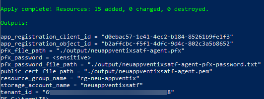

The pfx, pem and certificate password can be found in the output folder

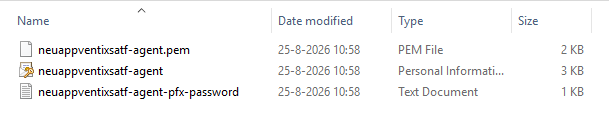

!!! warning
    The txt file contains the clear text password. Remove the txt file after you store it in a safe location!

## AppVentiX configuration

If needed create a [new site first](../sites/index.md)

In the Central View Settings wizard enter a **Site name**. Select **Azure Blob storage** and click **Create New**

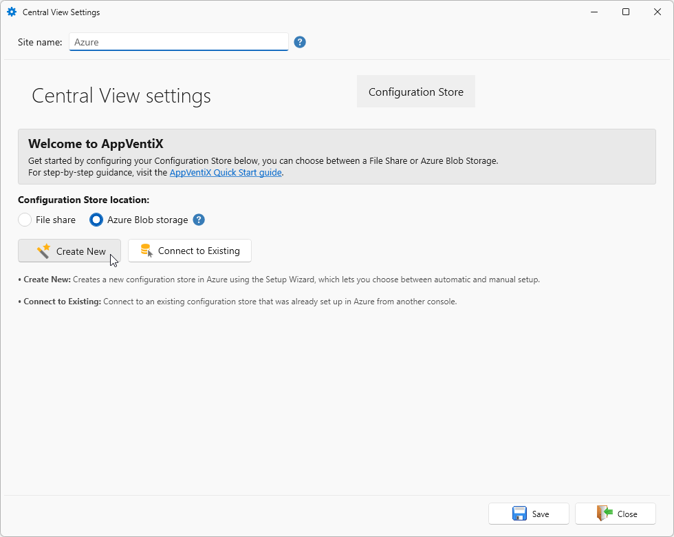

Select **Manual - I'll provide the values** and click **Next** to continue.

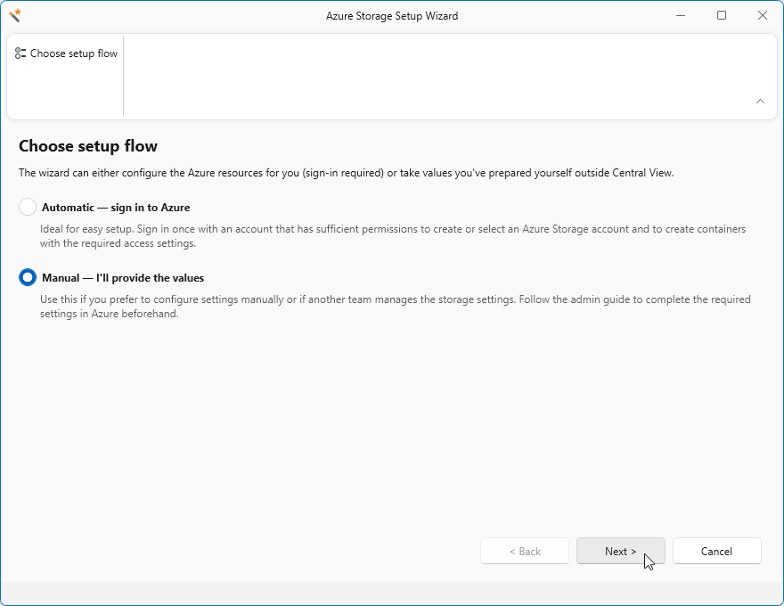

Enter the **Storage account name** you got returned from the Terraform output.

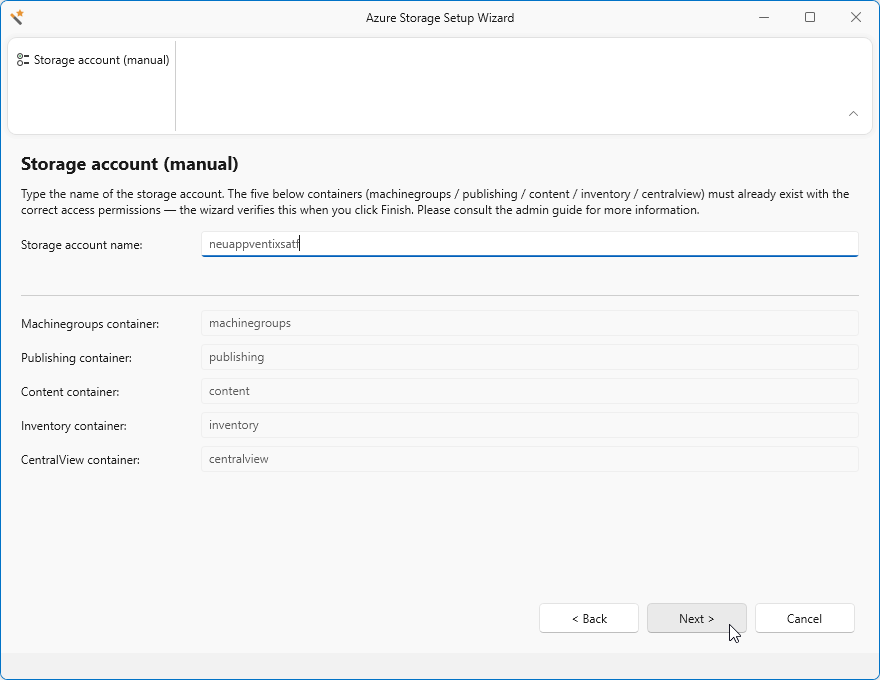

Enter the **Tenant ID** and **Client ID** values from the Terraform output.
Click **Next**.

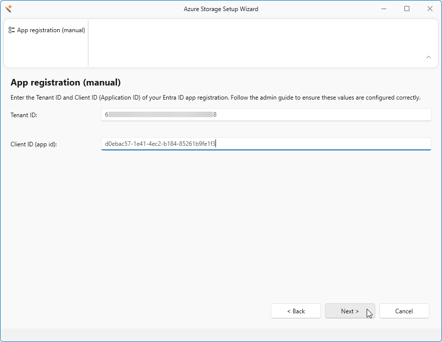

Browse to select the created pfx file or add the path in the **PFX file** field.

In the **PFX password** field enter the password from the txt file.

You can change the path for the **Export public key (cer) to:** field, but we don't need this since this is already configured by Terraform.

Click **Next**.

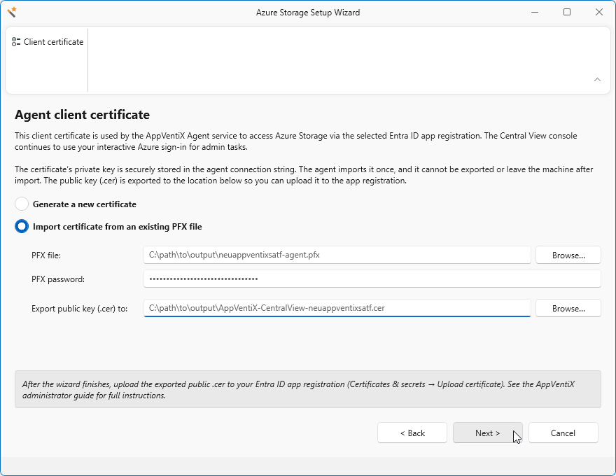

Click **Finish**

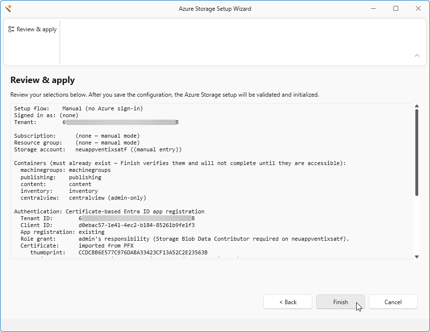

After you have clicked on finish you might have to login to Azure.

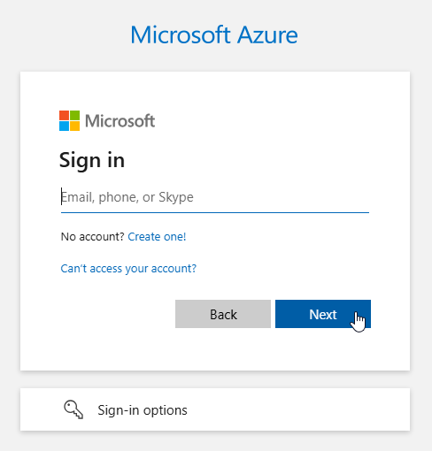

After the login was successful you can close the browser and click on **Close**

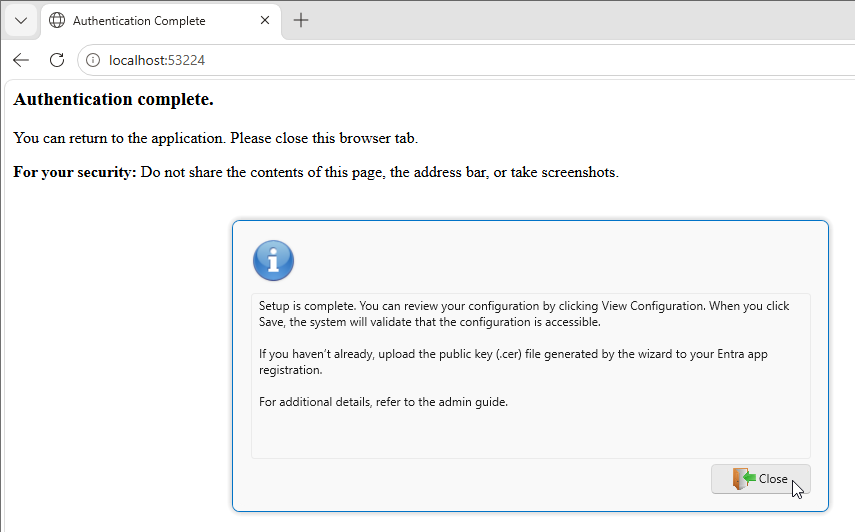

And finally click **Save** to store everything and start using the new configuration.

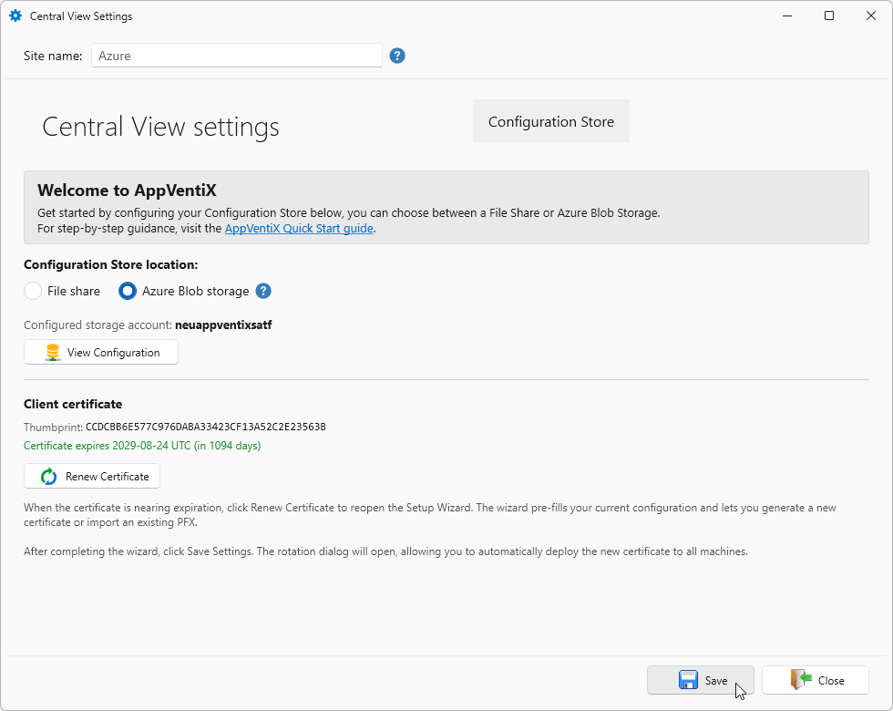