# Azure Blob storage configuration

With a Azure Blob storage it's possible to store configuration settings securely and make it available for your clients outside of your network.
With Azure Blob storage you don't have any dependency with Active directory or challenges you might experience with SMB shares.

To start the (initial) configuration, click the **Setup Wizard**

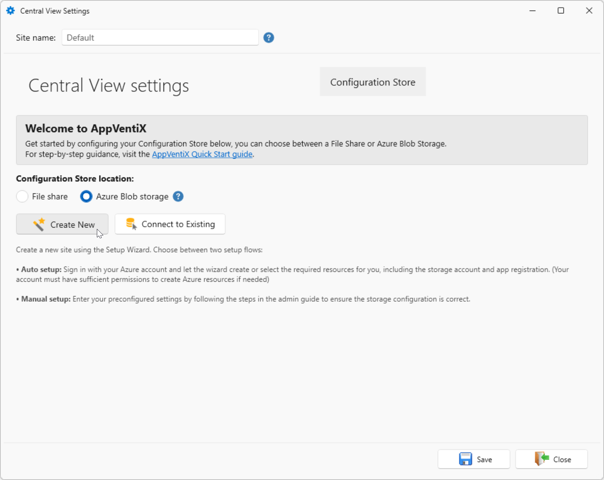

You have two options for configuring:

* [Create New](#create-new)
* [Connect to Existing](#connect-to-existing)

## Create New

With the create new you have two options, by default **Automatic - ...** is selected. The manual option is also available.

* [Automatic setup](#automatic)
* [Manual setup](#manual)

### Automatic

With the automatic option, AppVentiX will do all the configuration for you.

To continue, you account needs at least one of the following (subscription) roles

* Owner
* Contributor + User Access Administrator

Select **Automatic - sign in to Azure**

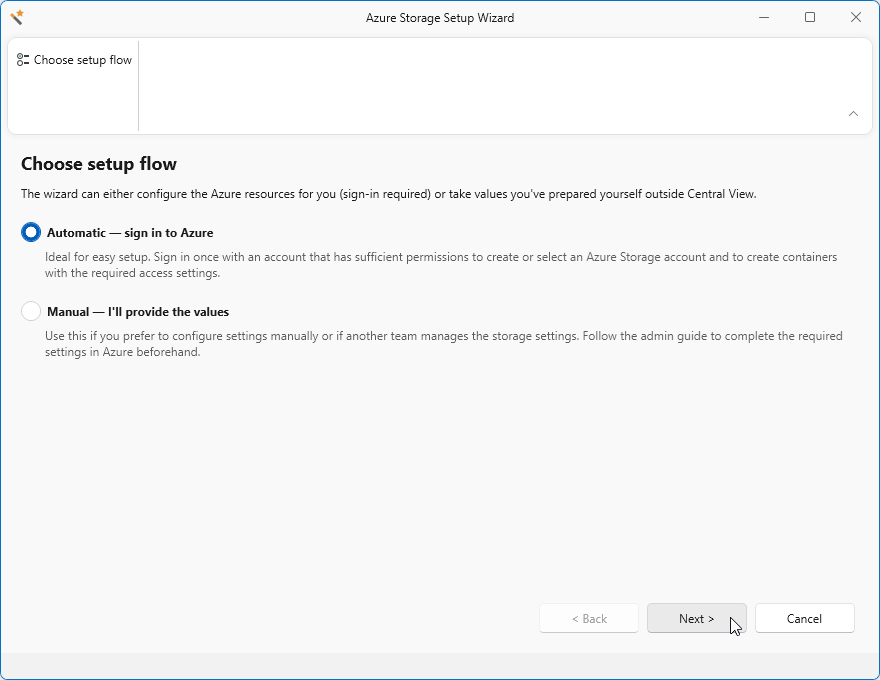

Click **Sign in to Azure...**

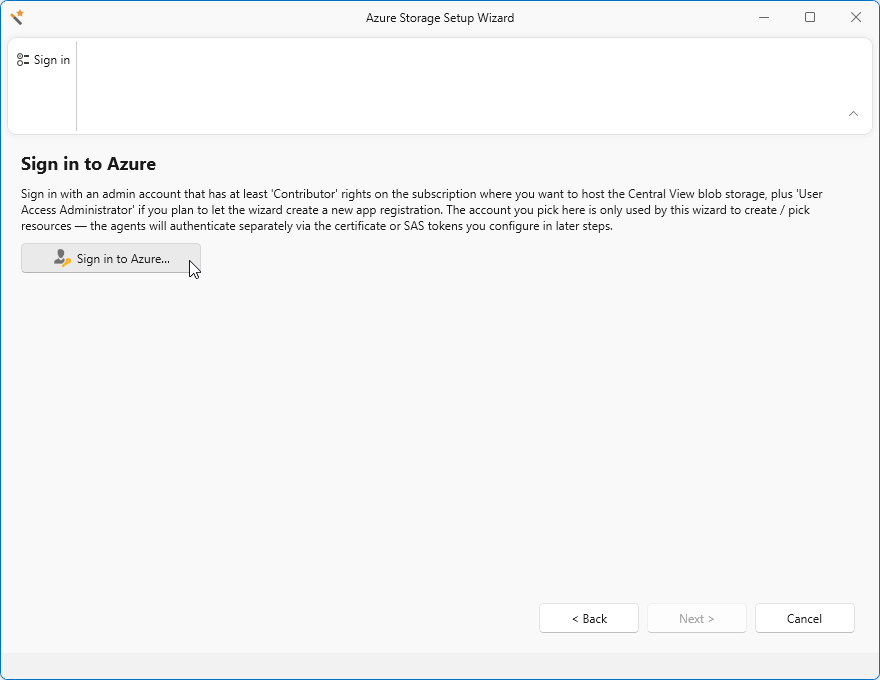

A browser popup will appear for you to sign in with your company credentials, log in.

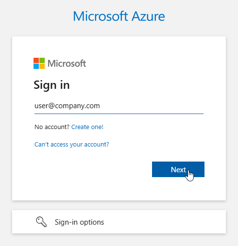

A **Permissions requested** dialog may appear, requesting for Microsoft Graph Command Line Tools permissions.
Click **Accept** to continue.

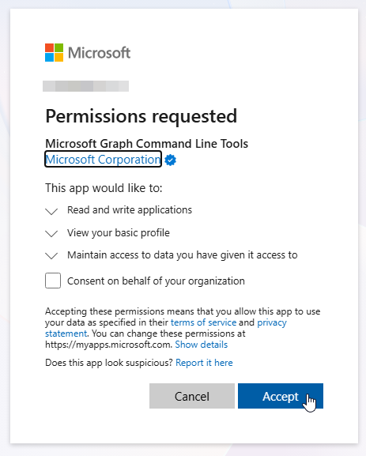

When login is successful, you can close the browser and continue in AppVentiX Central View.

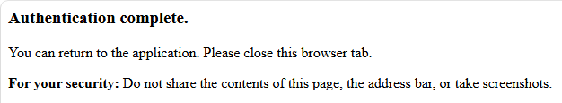

Click **Next** to start the storage account creation.

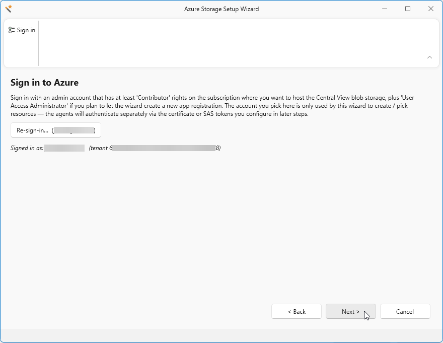

Select the subscription you want to use for the Storage Account.
Next, select an existing Resource Group or click **New** to create a new Resource Group for the storage account.

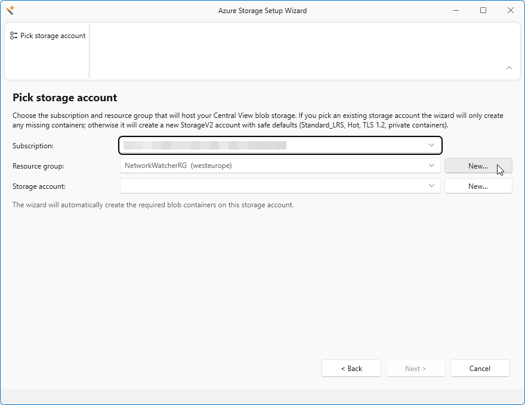

Enter a Resource Group Name and select a Region.
Click **Create** when you are ready.

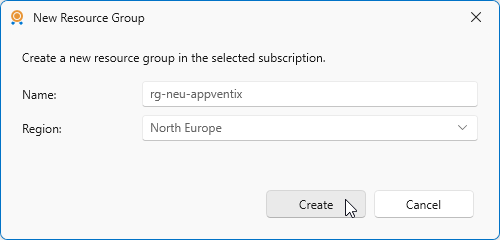

Click **New** to create a new Storage Account.

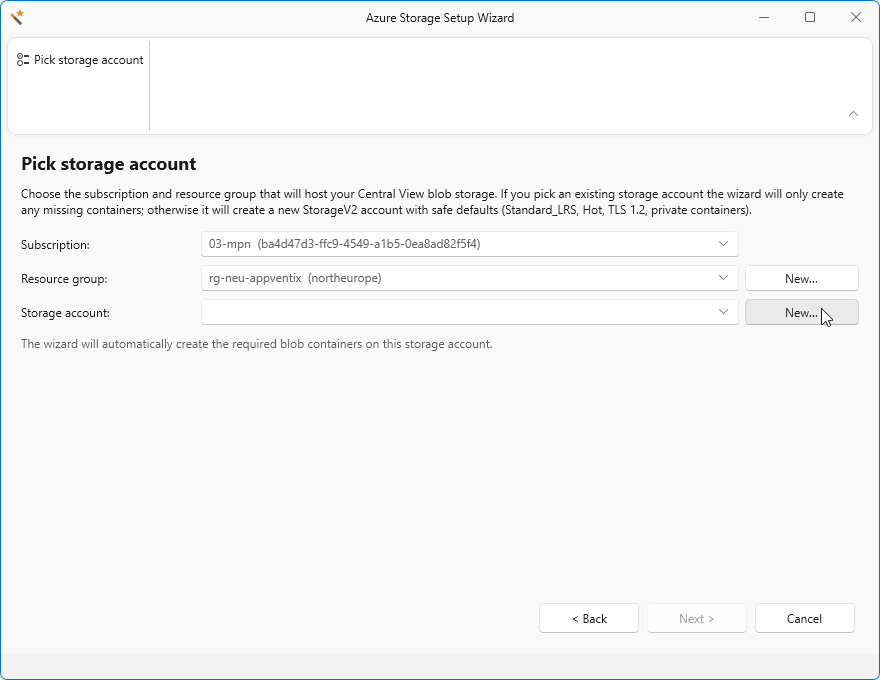

Enter a __unique__ storage account name.
If you enter a name that already exists, you may be presented with a warning message.

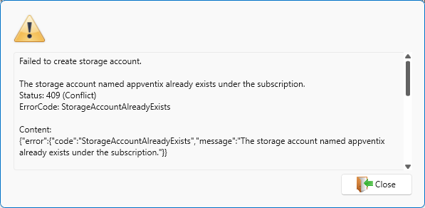

Click **Create** to start the creation of the Storage Account, this can take a short time.
During this period, the Storage Account is created, permissions are set and blob containers are created.

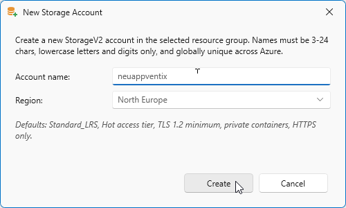

Click **Next**

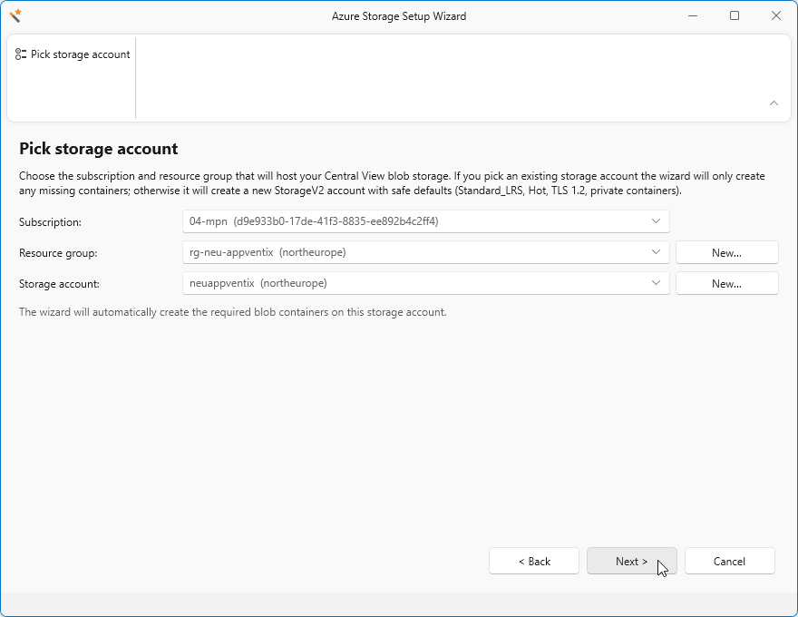

A new App Registration will be created by default with the correct required permissions.
You can change the Display name according to your companies policy.

To **Use an existing app registration** you can create your own App Registration.
You can follow [this](../custom-app-registration/index.md) guide  to configure your own App Registration.

!!! note
    After Automatic App Registration creation, Storage Blob Data Contributor role will be assigned to it.

Click **Next** to start this process.

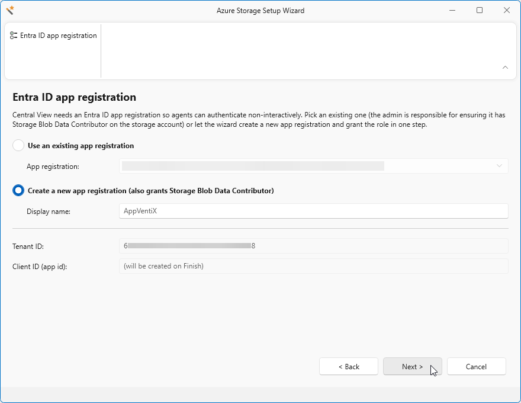

On the next screen, an Agent client certificate will be created. AppVentiX (Central View and Agents) will use this certificate to authenticate to the Storage Account.
You can however [select your own pxf certificate](../client-certificate/index.md)

The default validity is 3 years, you can change this accordingly.

!!! note
    The Public key will be automatically configured, no manual action is required. The public key saved is for your records only.

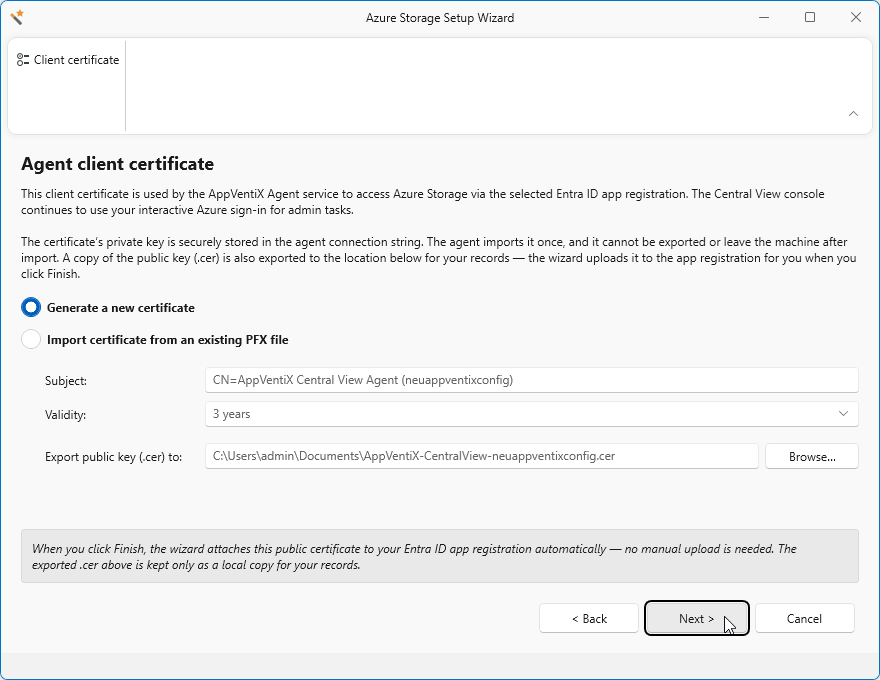

Click **Finish** to finalize the wizard.
Some last configuration settings will be set and containers will be created.

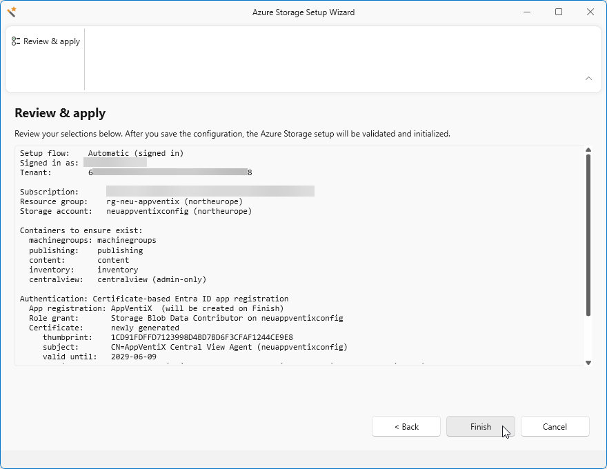

Click **Close**.

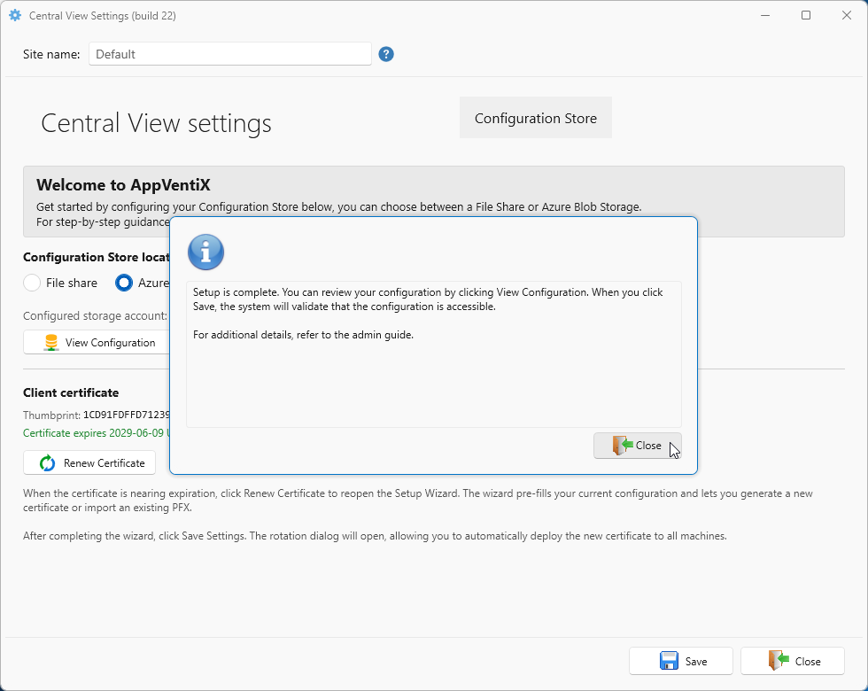

Click **Save** to start using this new configuration settings.

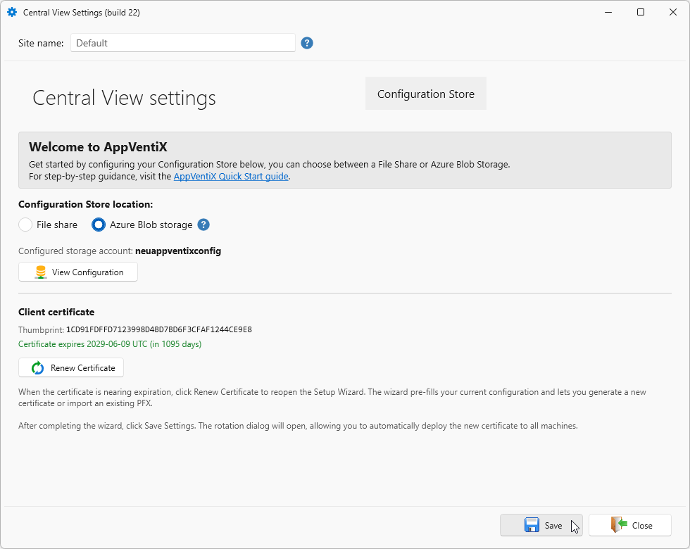

A popup may appear for you to login again.
Enter your password and approve MFA if required.

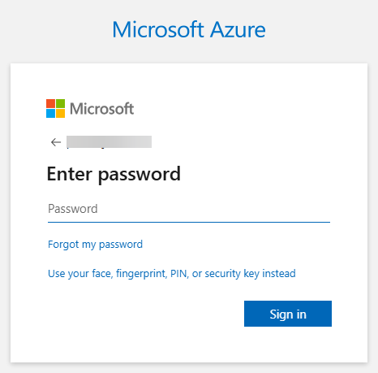

When the login is successful, a popup may appear, click **Close**

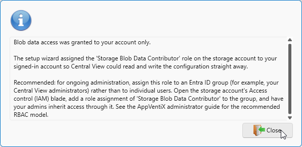

You are now ready for the next step.

### Manual

... More info will follow soon ...

## Connect to Existing

... More info will follow soon ...