# Azure File Share Configuration

AppVentiX supports Azure file shares that are AD integrated and/or stand-alone shares.

---

## Stand-Alone Azure File Shares

Stand-alone Azure file shares are used for example for Azure AD-joined machines.

### Step 1: Create a Storage Account

In the Azure portal, go to **Storage Accounts** and click on **Create Storage Account**:

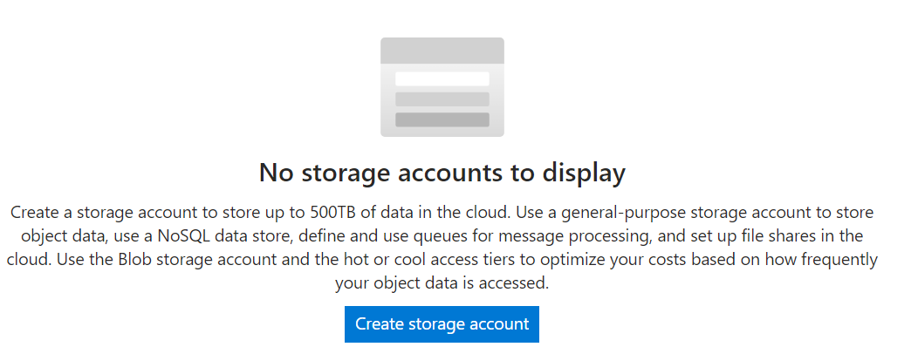

Give the storage account a name and select your region:

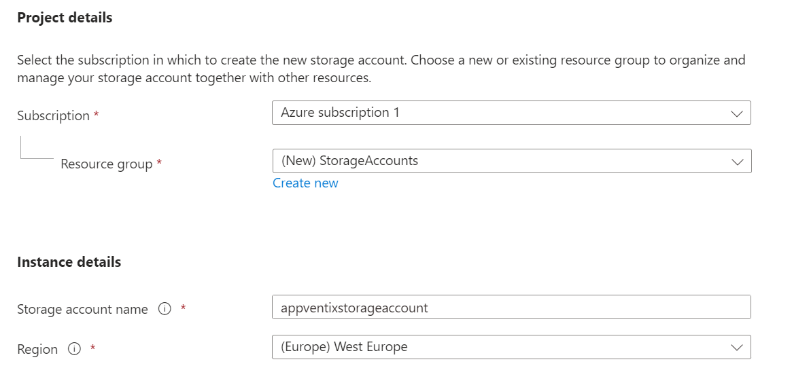

You can leave all settings at default and click **Create**. Optionally you can fine-tune the storage account to meet your needs, but the default settings are sufficient.

### Step 2: Create the File Share

After the storage account is created, go to the storage account and click on **File Shares**:

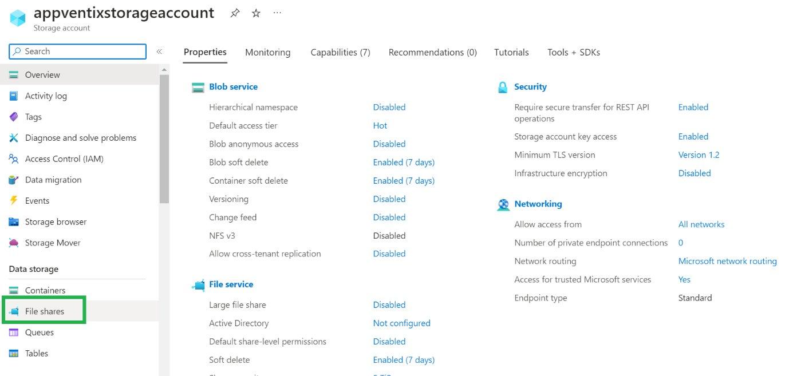

Select **New File Share**:

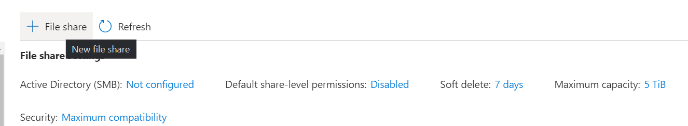

Select the default tier and settings. They have been tested to work and perform well with AppVentiX. Optionally you can decide to pick a higher or lower tier; you can always change the tier later.

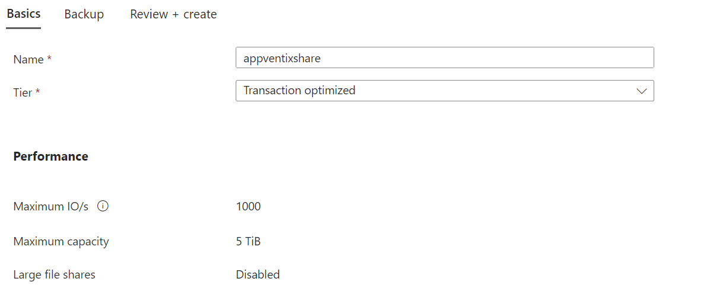

Click **Create** to create the file share.

### Step 3: Create Folders

After the file share is created, click on **Browse** and then **Add Directory**. Create 2 folders: `config` and `content`:

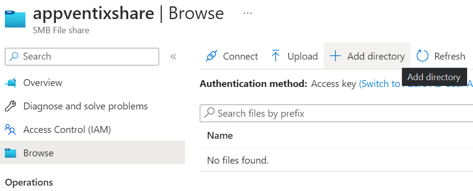

### Step 4: Get the Access Key

Go to the storage account main menu and click on **Access Keys**:

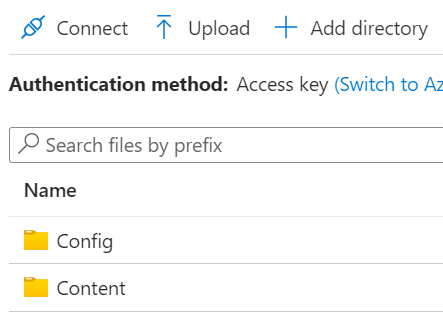

From here, copy the storage account name and the access key.

### Step 5: Configure in Central View

Go to the Central View settings page. Enter the file share you just created in the following format (note the config folder at the end):

```
\\appventixstorageaccount.file.core.windows.net\appventixshare\config
```

Replace the storage account name and share name with the ones you just created.

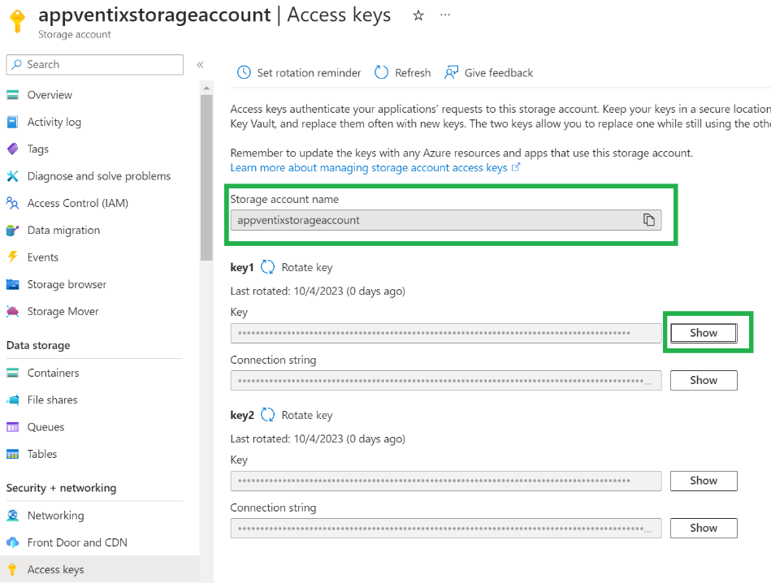

Clear the integrated authentication checkbox and copy the storage account name in the username textbox. Make sure to use the format `localhost\storageaccountname`. In the password field, paste the access key.

Example:

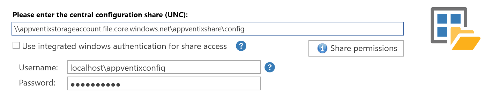

Save the settings. If the settings are saved successfully, it means the share is accessible and configured correctly.

The content folder you created in the previous step can be used in the machine group configuration:

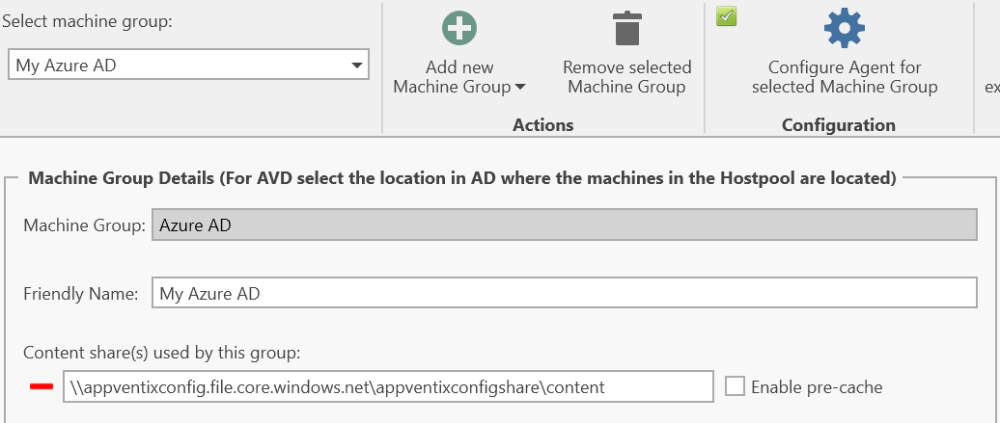

This is the location where you can store App-V, MSIX (App Attach), and/or FSLogix App Masking rules. In the Manage Content page you can browse to the share and upload content.

---

## AD Integrated Azure File Shares

Use an existing file share or create an Azure file share just like in the previous steps, then join the share to Active Directory:

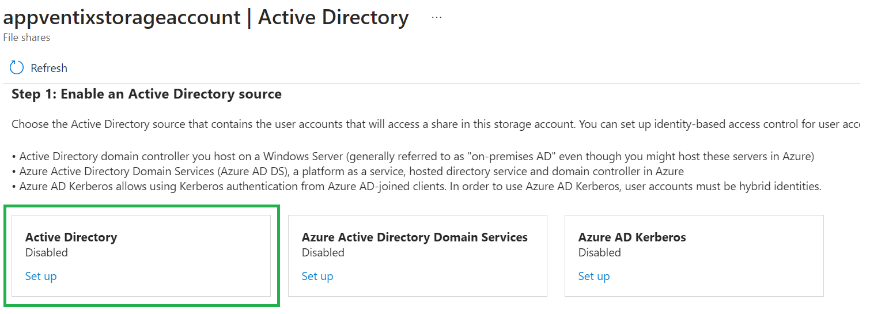

> **Note:** You can also use Azure AD Kerberos integrated, but the steps to configure the share in AppVentiX will be the same as the stand-alone share configuration.

After completing the steps to integrate the share with your Active Directory, you have 2 options to authenticate to the share:

**Option 1: Group-based authentication**

Create a group and add the machine accounts to the group, give this group read permissions:

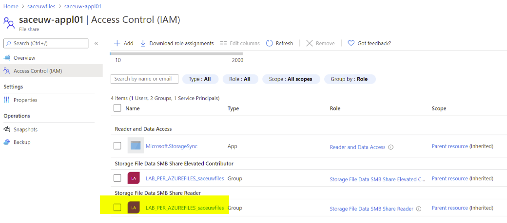

Make sure this group has read/write permissions in the inventory folder on the configuration store, or else the remote inventory will not work. You can leave the integrated authentication checkbox enabled.

**Option 2: Service account authentication**

Create a service account and give this user account read/write permissions on the share:

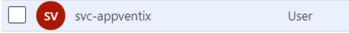

Then enter this account in the Central View settings window:

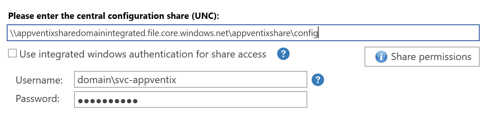
