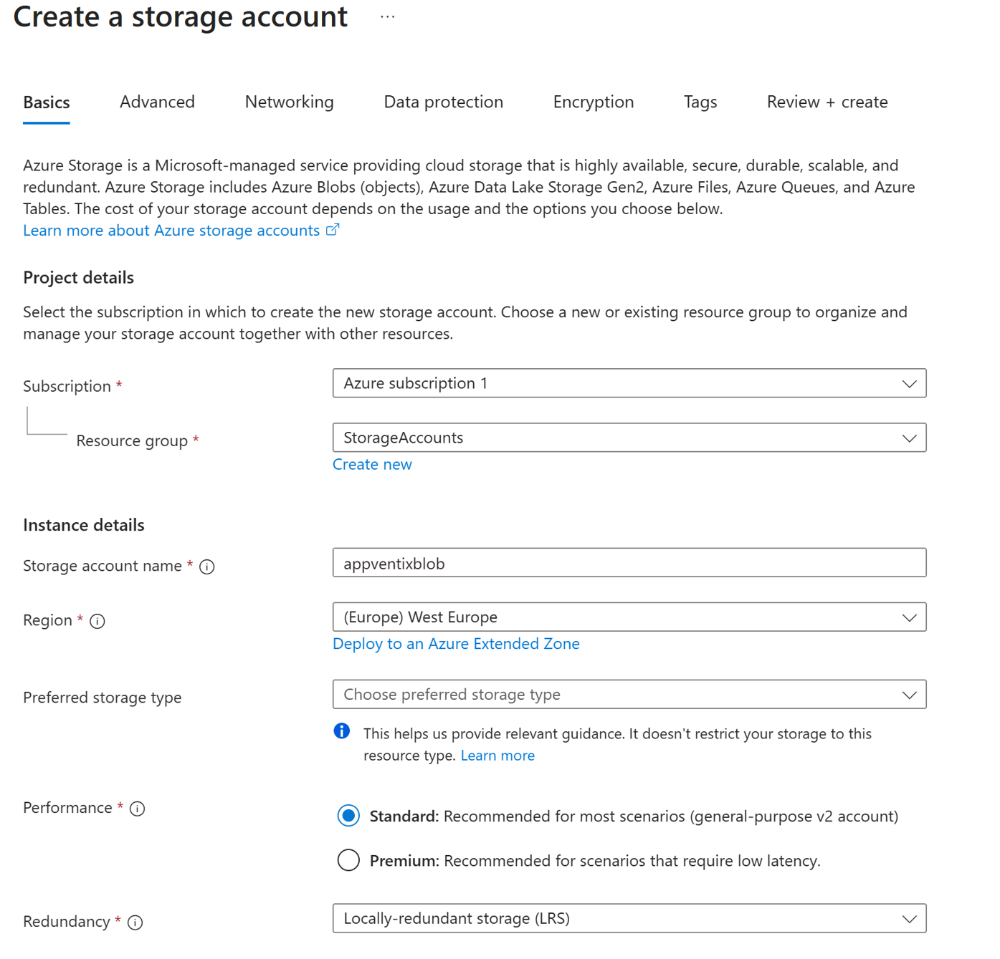
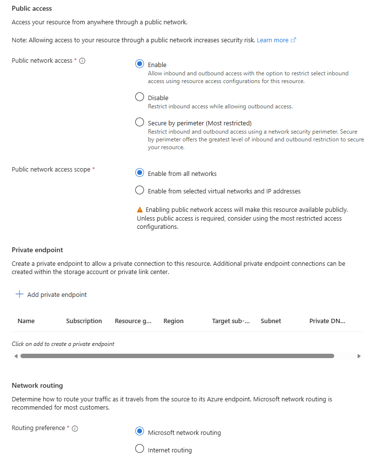
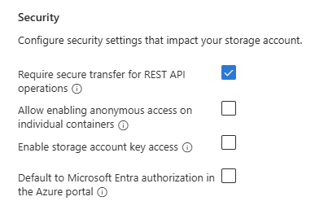
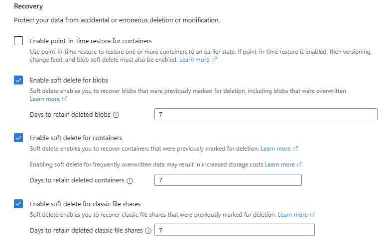
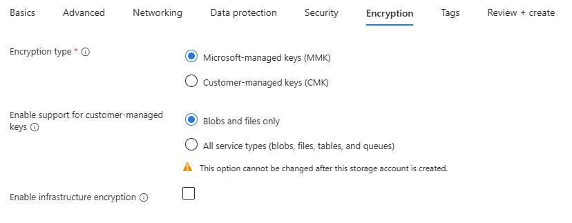

# Manual StorageAccount creation

Azure blob storage can be setup using the automatic wizard, but often this is not possible because this is handed over to another team. This article describes the manual steps to configure the Azure blob storage for AppVentiX. And also lists the permissions needed to follow the automatic setup wizard.

## Manual setup

Start by creating a new storage account.

Create a new Resource Group or select an existing one.
Next enter a unique name and select a region of your choosing, according to your companies policy and guidelines.

For the Performance type, in most cases "Standard" will be sufficient. AppVentiX caches the data locally.
Always validate and test if it's sufficient before going into production

On the **Networking** tab enable Public network access so your machines can connect to the storage account from the internet.

On the **Security** tab, make sure **Require secure transfer for REST API operations** is enabled.

On the **Data protection** tab you can configure the recovery options accordingly.

On the **Encryption** tab, you can leave the settings on the default values.

Wait until the new Storage Account is created. Next you can configure the roles required.

| User | Role |
|-|-|
| Admin | Storage Blob Data Contributor |