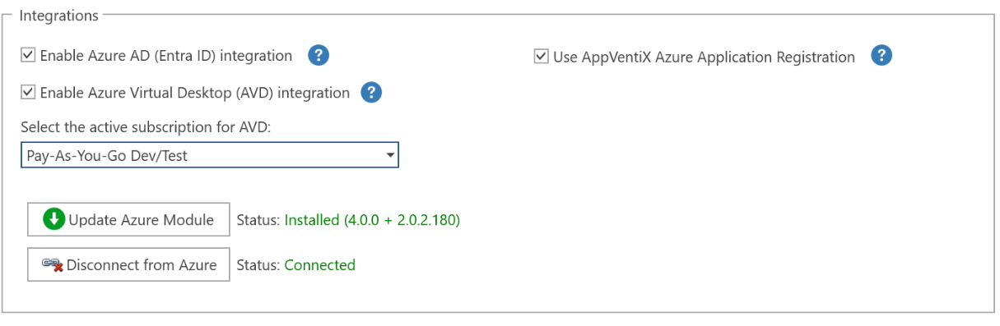
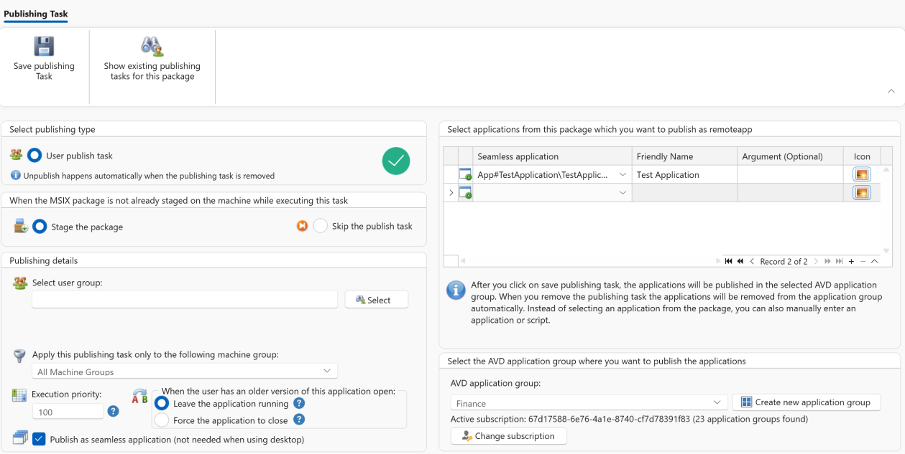
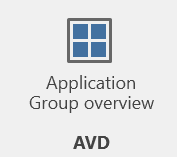

# Azure Virtual Desktop (AVD) Integration

AppVentiX supports both Desktop and RemoteApp scenarios. For AVD there is a direct integration available. You can enable this in the Central View settings.

Configuration is simple: Click on **Install AVD Module** and wait for the process to finish (this can take a few minutes). After installation, click on **Connect to AVD** and provide your credentials in the login box.

When the integration is enabled, you can select applications from an App-V, MSIX, and/or MSIX App Attach package and select an Application Group in AVD to publish the application to.

You can also create a new AVD application group directly from AppVentiX. You can also switch the active subscription and tenant if you have multiple AVD environments to manage.

When you save the publishing task, the applications are published in AVD and are accessible by the user. The AppVentiX wrapper will take care that the application is available for the user before it is started. It is also possible to launch PowerShell or cmd scripts.

It is also possible to edit a publishing task (like the group or application description); the applications will be updated in AVD automatically. When you remove a publishing task, the applications are automatically removed from AVD, making it a fully managed integration which is easy to use and provides complete control and insight from one single point of management.

The Manage Content page in the Central View console also includes a **Remote App Overview** button:

This gives you a total overview of all published applications in AVD. You can sort on application group, user group assignment, and application name. This provides complete insight in one overview.

!!! note
    To manage application groups in AVD, you need at least Contributor permissions in AVD.
