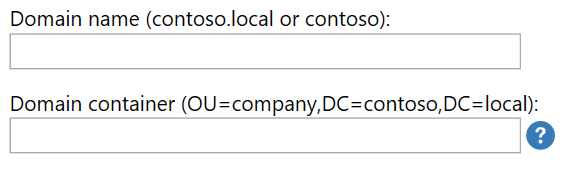

# Central View Inventory and Advanced Settings

## Central View Inventory

By default, the machine, user, process, and event inventory data is stored on the configuration store in the inventory folder. When an inventory is triggered, the agent will receive a command (also through the configuration store) to perform the inventory. The inventory data is displayed (together with the inventory time) in the console.

Optionally it is possible to enable direct inventory to the agent using WinRM (in the advanced agent settings, turn the inventory slider to disabled). The performance and scalability of the inventory through the configuration store is much better than the direct connection, so it is recommended to leave the inventory through configuration store option enabled.

