# Central View Settings

In the Central View settings you can configure global settings which will apply to the whole site deployment (both console and agents).

You can find the Settings by opening the **Configuration & Activity** tab and clicking the **Settings** button in **Configuration**.

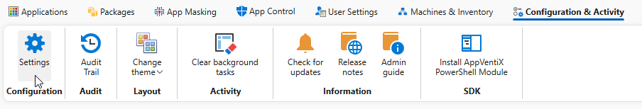

Within the **Settings** page you will find four sections:

* [Configuration Store](#configuration-store)
* [Settings](#settings)
* [Advanced](#advanced-settings)
* [License](#license)

## Configuration Store

Depending on your site configuration, you can find the base location for your setup here as well as some settings you can change for the configuration store.

File share (UNC) uses a Windows / SMB / Azure File share accessible by UNC path. Azure Blob storage stores configuration and content directly in blob containers, authenticated via client certificate.

* [File share](#file-share)
* [Azure Blob storage](#azure-blob-storage)

### File Share

Here you will find more settings if you have configured an SMB share for your AppVentiX configuration store.

Click the **Configuration Store** tab.

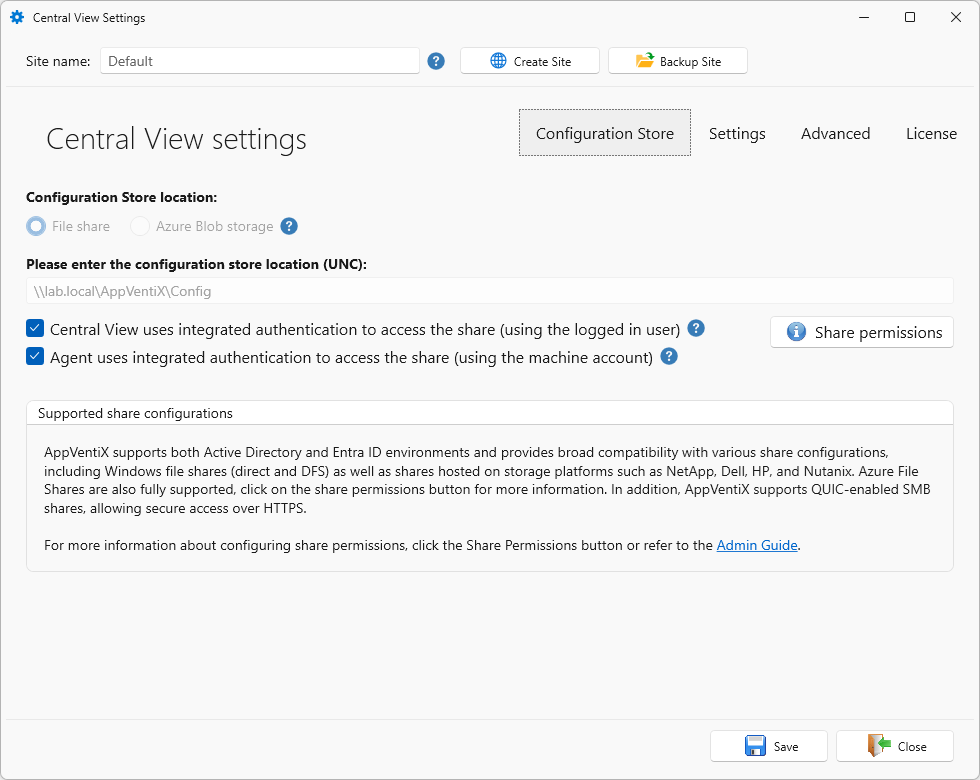

* **Please enter the configuration store location (UNC)**

This field will contain the location of the configuration share that is configured for this site. You can find more information on **[this page](../smb-share/index.md)**.

* **Central View uses integrated authentication to access the share (using the logged in user)**

When this option is enabled, Central View accesses the configuration and content shares as the currently logged-in user. Disable it to provide an explicit service account for Central View. A new area will appear where you can fill in the account details.

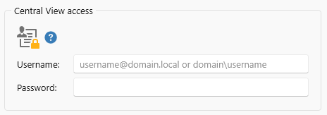

This option is disabled by default.

* **Agent uses integrated authentication to access the share (using the machine account)**

When this option is enabled, agents access the configuration and content shares using their own machine account (the typical pattern in domain-joined scenarios). Disable it to configure a service account that the Agent uses instead. A new area will appear where you can fill in the account details.

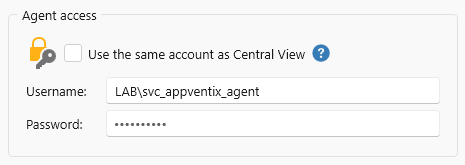

This option is disabled by default.

### Azure Blob Storage

Here you will find more settings if you have configured an Azure storage blob for your AppVentiX configuration store.

Click the **Configuration Store** tab.

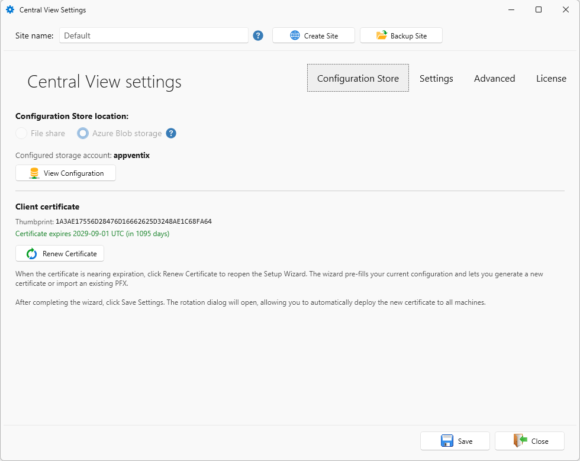

* **Configuration Store location**

When you click the **View Configuration** button, a new window will be shown with the Azure details configured for this site.

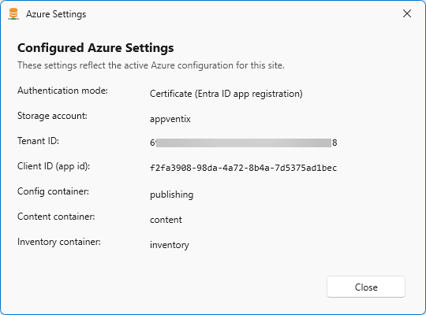

* **Client certificate**

When you click the **Renew configuration** button, you will start the certificate rotation. More information about this process and the steps needed can be found **[here](../client-certificate/index.md)**.

When finished changing your settings, don't forget to click the **Save** button.

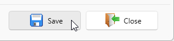

## Settings

Click the **Settings** tab.

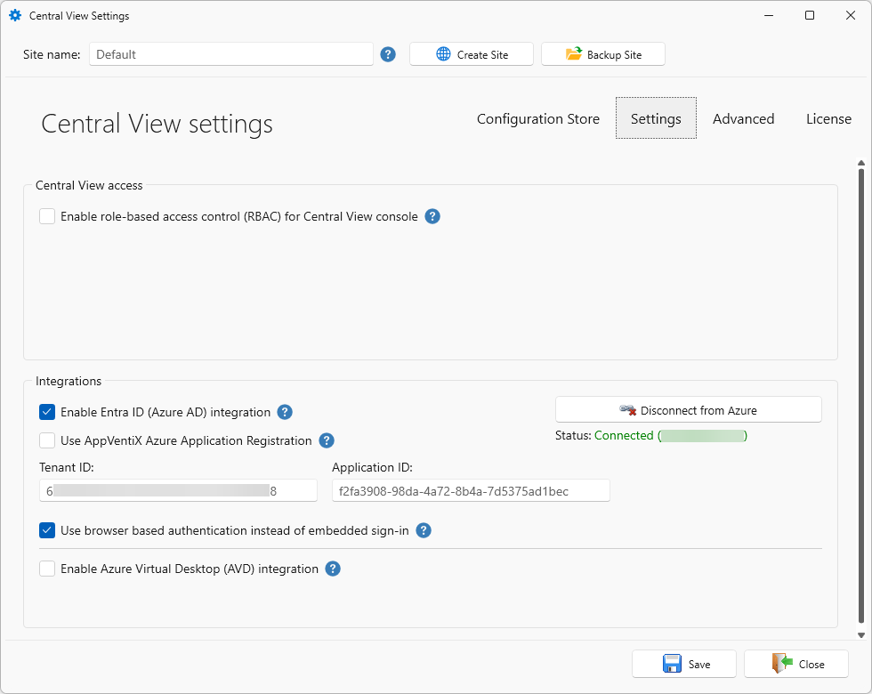

### Central View Access

* **Enable role-based access control (RBAC) for Central View console**

Configure access groups with different permission levels. The Admin group (full access) is **mandatory**. Operator (limited access) and Helpdesk (read-only) are optional. Only one group per role is supported.

For more information and how to configure this, visit **[this page](../rbac/index.md)**.

This option is disabled by default.

### Integrations

* **Enable Entra ID (Azure AD) integration**

When this option is enabled, you can select Entra ID groups in the publishing tasks. This applies only to Entra ID joined machines.

Depending on your initial configuration this will be enabled or disabled by default.
If your initial configuration was for example a storage blob, this option will be enabled by default. If you configured a share, this option will be disabled by default.

If this option is disabled, the other fields are hidden.

* **Use AppVentiX Azure Application Registration**

You can use the AppVentiX application registration or create your own application registration in your tenant.

To know more and how to configure your own App Registration, please visit **[this page](../custom-app-registration/index.md)**.

The fields **Tenant ID** and **Application ID** will be pre-filled if you followed the wizard. Fill these fields with values when you follow the manual steps.

This option is disabled by default.

* **Use browser based authentication instead of embedded sign-in**

When this option is enabled, Azure sign-in opens in your default browser instead of the built-in dialog. This can help on systems where the embedded sign-in window does not work correctly.

This option is enabled by default.

* **Enable Azure Virtual Desktop (AVD) integration**

When this option is enabled, you can publish applications directly in AVD. A new drop-down box will appear where you can **Select the active subscription for AVD**.

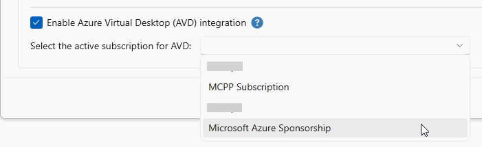

This option is disabled by default.

When finished changing your settings, don't forget to click the **Save** button.

## Advanced Settings

Click the **Advanced** tab.

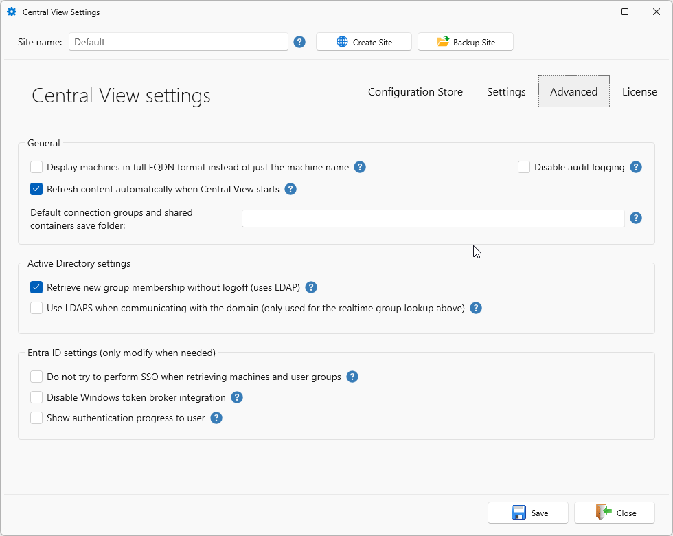

### General

* **Display machines in full FQDN format instead of just the machine name**

When this option is enabled, Central View will show the machines with their full FQDN in the machine inventory instead of only the machine name.

This option is disabled by default.

* **Refresh content automatically when Central View starts**

When this option is enabled, Central View will refresh the content automatically at startup so the cache is always up to date. When this option is disabled you can refresh manually.

This option is enabled by default.

* **Default connection groups and shared containers save folder**

By default, Connection Groups and Shared Containers are created in the root of the content share where the selected packages are stored. You can specify a folder to place them in instead. Enter only a folder name, not a full path, because the Connection Group or Shared Container is always created on the same content share as the selected packages.

### Active Directory Settings

* **Retrieve new group membership without logoff (uses LDAP)**

When this option is enabled, the agent queries Active Directory over LDAP for the user's tokenGroups on top of the groups in the logon token. Group memberships that were added after the user logged on are picked up right away, without a logoff.

When this option is disabled, only the logon token is used. That means no LDAP traffic and the fastest lookup, but a new group membership only takes effect after the user logs off and back on.

This option is enabled by default.

!!! Note
    The agent uses the cached group membership from the user's logon token, and that token only contains the groups the user was a member of at the moment they logged on. This setting is what keeps that list up to date. On 5.2 and newer the agent no longer uses LDAP as its primary source for group membership, and the separate domain context configuration has been removed.

* **Use LDAPS when communicating with the domain (only used for the realtime group lookup above)**

This setting applies to the LDAP queries made by the **Retrieve new group membership without logoff** setting above. When it is enabled, the agent and the Central View console use LDAPS (TCP:636) instead of LDAP (TCP:389) for those queries. Make sure your domain controllers have a certificate installed that supports LDAPS.

When that setting is disabled, the agent does not use LDAP at all, so this setting has no effect on it.

This option is disabled by default.

### Entra ID Settings

!!! Note
    You only need to change these settings when you are using Entra ID. In Active Directory environments you can ignore these settings and leave them disabled.

* **Do not try to perform SSO when retrieving machines and user groups**

When this option is enabled, you can select a different account for machine and user group retrieval in Central View. SSO with your currently logged-in account will not be used.

* **Disable Windows token broker integration**

When this option is enabled, the authentication library will not use the operating system account. Only enable this when the machine is not Entra ID joined.

* **Show authentication progress to user**

When this option is enabled, the authentication progress is always shown. By default the process runs hidden and the progress only appears when the user needs to take action.

When finished changing your settings, don't forget to click the **Save** button.

## License

Click the **License** tab.

Here you will find details about the currently installed license and validity period.

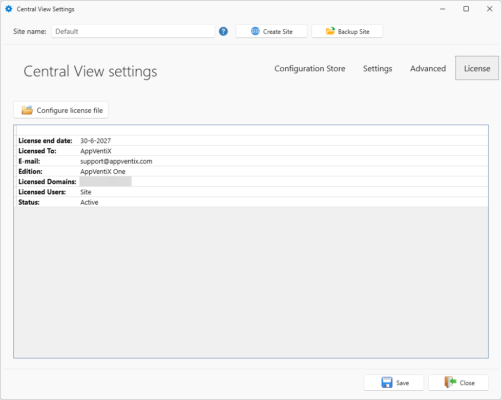

* **Configure license file**

To update or renew your license, click the **Configure license file** button.

Select the new license file and click **Open**.

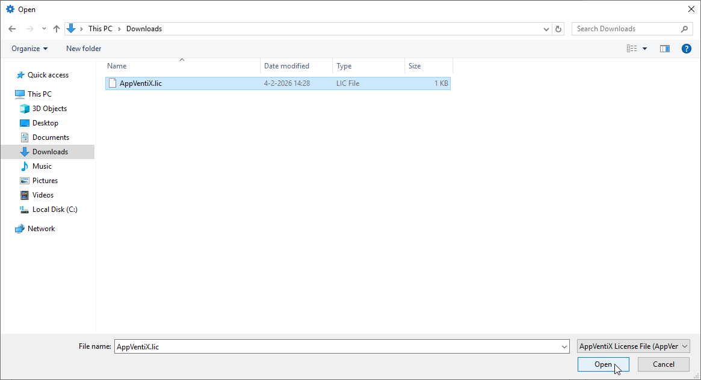

The license will be automatically updated on your configuration store.

When finished changing your settings, don't forget to click the **Save** button.

> For help with this configuration, contact [support@appventix.com](mailto:support@appventix.com).
