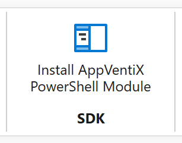

# AppVentiX Central View Console

Central View is the centrepiece of your deployment. It is a lightweight, easy-to-use real-time management console. Central View does not need a dedicated back-end server.

---

## Machine Groups

Central View reads Active Directory group(s), Active Directory OUs, or Entra ID to retrieve the machines in a specific machine group. The agent will automatically detect which machine group it belongs to. Please read the [Quick Start](../quickstart/index.md) steps for an impression of how to create a machine group.

In Active Directory environments, the easiest approach is to create machine groups based on OUs. Machines are automatically pulled from the selected OU, so there is no need to manually add or remove devices. The group updates automatically.


When creating a machine group based on an AD group instead of OU, make sure you enable the following option in Active Directory when adding machines to the AD group, or else you cannot find machine accounts to add to the AD group.

> **Note:** You can create multiple machine groups and machines can be members of multiple machine groups. You can also configure multiple content shares for a machine group. The agent will retrieve packages from all configured content shares. The agent will only apply Agent Settings from the first Machine Group it is a member of.

For Entra ID-based machine groups, please consult the [Entra ID (Azure AD) setup](entra-id.md) section in this admin guide.

You can always edit a machine group and change Agent Settings. Please note that the Agent Service on the machine needs to be restarted before the new settings will be activated.

When creating a machine group you can configure content share(s) for the group. Next to the content share you have the option to select a checkbox: **Enable Pre-cache**.

When pre-cache is enabled for a content share, the agent will deploy packages from the content share in the cache when the refresh cycle runs. Use pre-cache when you want packages to be available on the agent before a user logs in (for fast publishing). For App-V this means packages are loaded on the machine; for MSIX this means packages are staged on the machine (when used in combination with App Attach, the disk is attached and the package staged).

Do not enable pre-cache for a content share if you want packages to be deployed on the fly at user login using publishing tasks. This is supported for all package formats: App-V, MSIX, and App Attach.

---

## PowerShell Module

[A PowerShell module is available](../powershell-module/index.md) to automate the creation of publishing tasks. You can install the module on the same machine as Central View using the button in the console, or install it from the PowerShell Gallery:

```powershell
Install-Module -Name AppVentiX
```



For full PowerShell module documentation, see the [PowerShell Module](../powershell-module/index.md) section.
