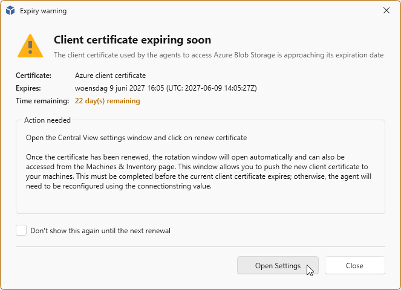
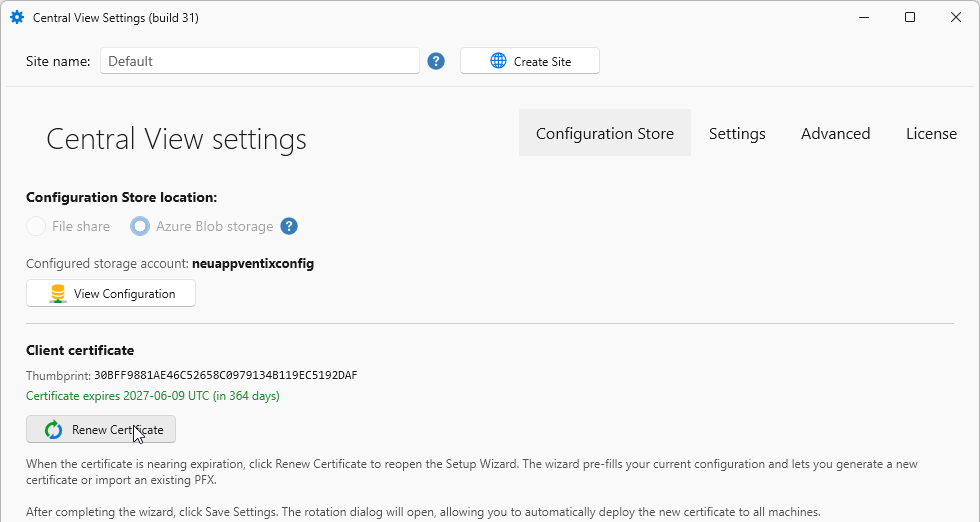
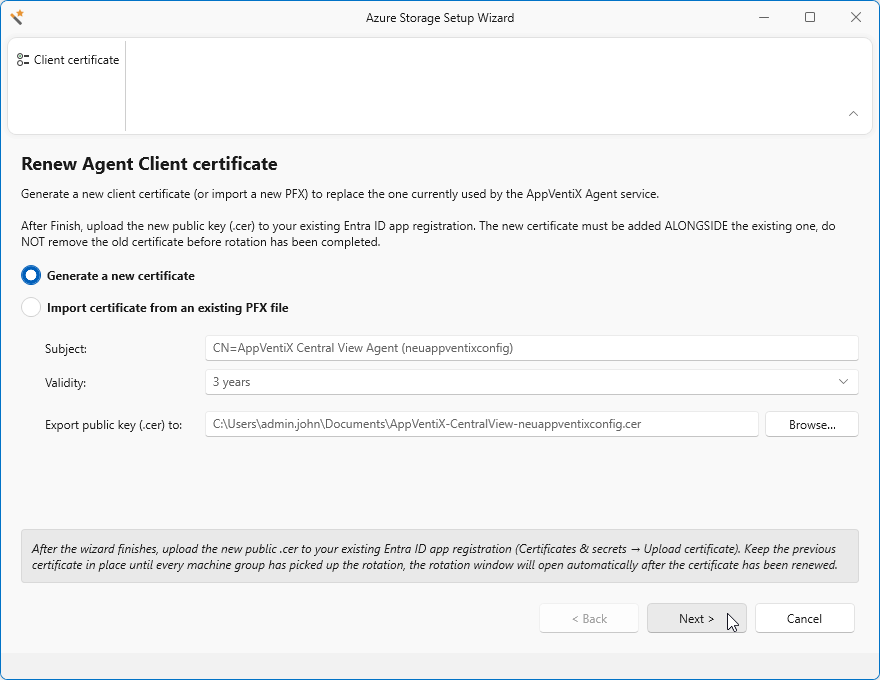
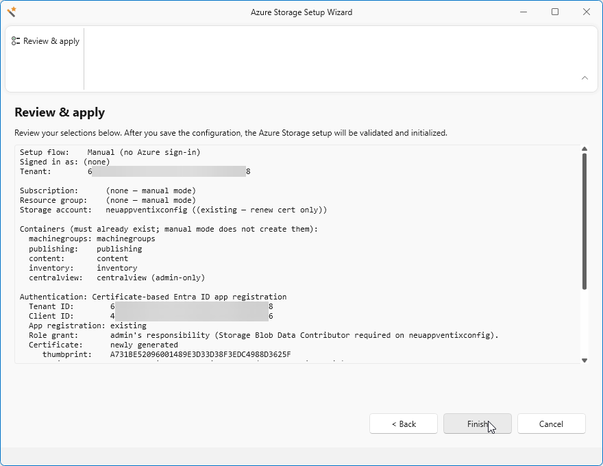
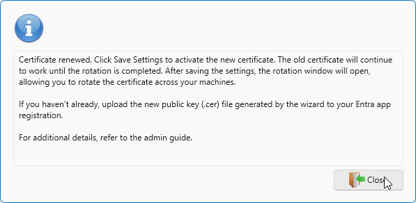
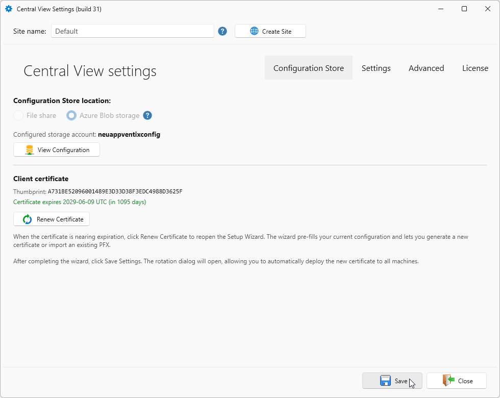
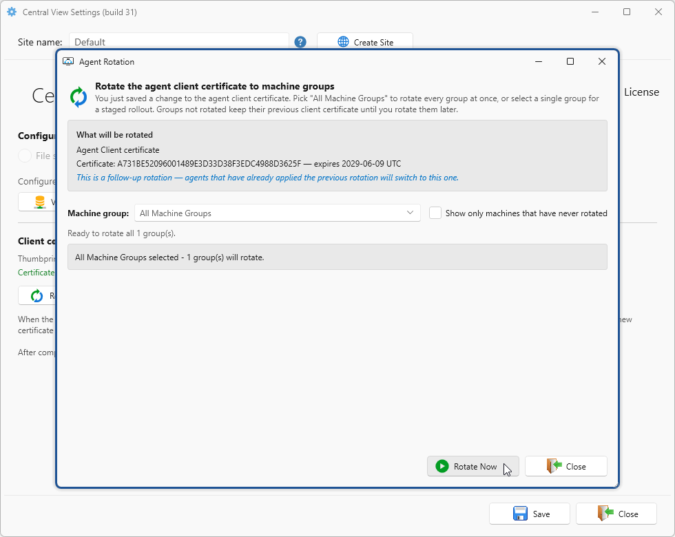
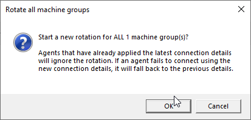
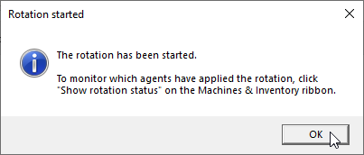
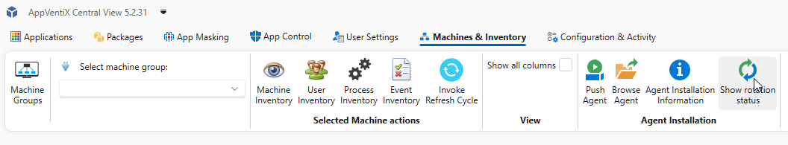

# Client certificate

## Rotate certificate

Before the certificate expires, you will receive a message that the certificate is expiring soon in x days.

To rotate the certificate, go to the Central View Settings under **Configuration & Activity**.
Click the **Rotate Certificate** button.

!!! Note
    You might want to create the certificate manually. Visit **[this page](../custom-app-registration/index.md#certificate-requirements)** for the manual steps and the certificate requirements.

By default the **Generate a new Certificate** is selected.
Change the validity period (default is 3 years).
Click **Next**

Review your new settings, click **Finish** to apply the new settings.

When the popup shows, you can click **Close**

Click **Save**.

A new window will appear to rotate the new certificate on one or more machines.
Select a specific Machine Group or **All Machine Groups**

Click **OK** to start the certificate rotation.

Click **OK** to close

To view the status, click **Show rotation status** on the **Machines & Inventory** tab.

... More info will follow soon ...