# Custom App Registration

When Entra ID is used, an App Registration is needed for the agents to be able to communicate with the storage account.
This can already be configured when the **[(automatic) wizard](../azure-blob-storage/index.md#automatic-setup)** was followed.
You can also configure this via **[Terraform](../azure-blob-storage-terraform/index.md)** or create it manually.

This guide will describe the manual steps. The steps can also be found as part in **[this guide](../azure-blob-storage/index.md#manual-setup)**.

## Create the client certificate

The agent authenticates to the storage account with a certificate. The Central View wizard and the Terraform deployment generate this certificate for you. When you create the App Registration manually, or when you want to use a certificate from your own PKI, you create it yourself.

You always end up with two files, both based on the same key pair.

| File | Contains | Used for |
|---|---|---|
| `.cer` (or `.pem` / `.crt`) | The public certificate only, without private key | Uploaded to the App Registration under **Certificates & secrets** |
| `.pfx` (PKCS#12) | The private key plus the certificate, password protected | Imported in AppVentiX Central View |

!!! warning
    Never upload the `.pfx` to Entra ID and never share the private key outside the machines that need it. Store the PFX password in a safe location such as a password manager. Anyone holding the PFX file and its password can authenticate as the agent.

### Certificate requirements

Any tool can be used, as long as the resulting certificate meets the following requirements.

- **Format:** X.509 v3. Self-signed is fine, a certificate from an internal CA works as well. A public CA works too, but the short certificate lifetimes make that impractical.
- **Key type:** RSA. Entra ID does not accept ECDSA keys as a certificate credential on an App Registration.
- **Key size:** 2048 bits minimum. 4096 bits works as well, at the cost of slower handshakes.
- **Signature algorithm:** SHA-256 or stronger. Certificates signed with SHA-1 are rejected.
- **Subject:** a Common Name (CN) is required. The value itself is free text, so use something recognizable such as `AppVentiX Central View Agent (appventix)`.
- **Validity:** the certificate must be valid at the moment of upload, so `notBefore` in the past and `notAfter` in the future. The wizard and the Terraform deployment use 3 years by default. Your tenant can have an application management policy that limits the credential lifetime, in which case a longer certificate is refused during the upload.
- **Key usage:** `digitalSignature` and `keyEncipherment`.
- **Extended key usage:** Client Authentication (`1.3.6.1.5.5.7.3.2`). Entra ID does not enforce this, but set it anyway so the certificate is scoped to what it is used for.
- **Private key:** must be exportable at the moment of creation, otherwise the `.pfx` file cannot be created afterwards.
- **PFX password:** required. AppVentiX Central View asks for it when the certificate is imported.
- **Chain:** when the certificate is issued by a CA, upload only the leaf public certificate. Entra ID matches on the thumbprint, not on the chain.

!!! Note
    The chain must be added in the pfx!
    `Export-PfxCertificate` does this by default. With OpenSSL, add `-certfile chain.pem` to the `pkcs12 -export` command.

### Create the certificate with PowerShell

The following steps create the certificate in the personal store of the user and export both files.

Set the variables. Adjust the storage account name, the validity period and the export path to your environment.

```powershell
$storageAccountName = 'appventix'
$certSubject        = "AppVentiX Central View Agent ($storageAccountName)"
$validityYears      = 3
$path               = "C:\Temp\$storageAccountName-agent.pfx"
$cerPath            = [System.IO.Path]::ChangeExtension($path, '.cer')
```

Create the self-signed certificate in the personal store of the user.

```powershell
$cert = New-SelfSignedCertificate `
    -Subject "CN=$certSubject" `
    -CertStoreLocation 'Cert:\CurrentUser\My' `
    -KeyAlgorithm RSA `
    -KeyLength 2048 `
    -KeyExportPolicy Exportable `
    -KeyUsage DigitalSignature, KeyEncipherment `
    -TextExtension @('2.5.29.37={text}1.3.6.1.5.5.7.3.2') `
    -NotAfter (Get-Date).AddYears($validityYears)
```

Note the thumbprint. You can use it later to confirm the correct certificate was uploaded.

```powershell
$cert.Thumbprint
```

Enter a password for the PFX file.

```powershell
$pfxPassword = Read-Host -Prompt 'Enter a password for the PFX file' -AsSecureString
```

Export the certificate including the private key to the PFX file.

```powershell
Export-PfxCertificate -Cert $cert -FilePath $path -Password $pfxPassword
```

Export the public key to the CER file. This is the file that is uploaded to the App Registration.

```powershell
Export-Certificate -Cert $cert -FilePath $cerPath
```

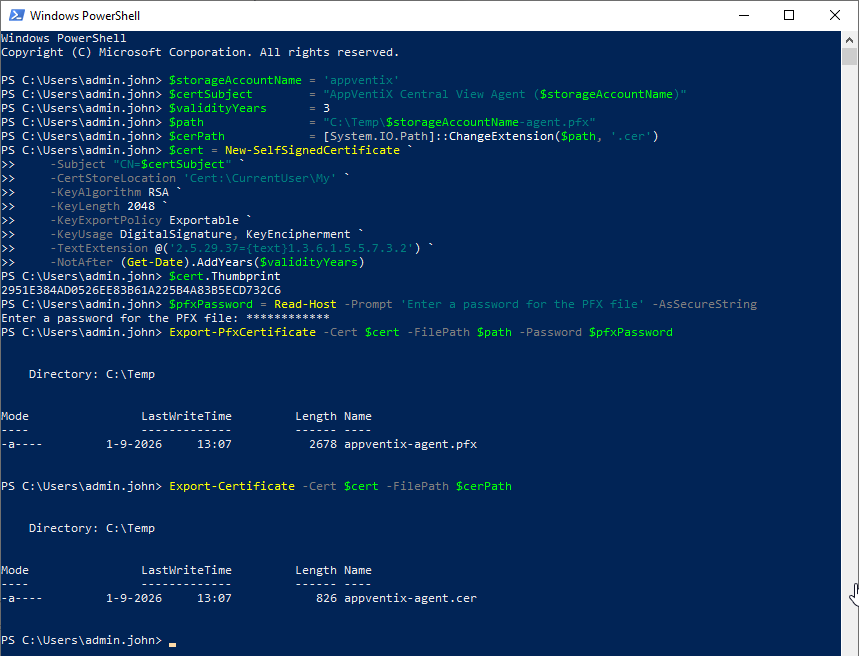

The certificate remains in `Cert:\CurrentUser\My` after the export. Remove it from the store when you only need the exported files.

### Create the certificate with OpenSSL

Create the private key and the self-signed public certificate in one step.

```bash
openssl req -x509 -newkey rsa:2048 -sha256 -days 1095 -noenc \
  -keyout agent.key -out agent.cer \
  -subj "/CN=AppVentiX Central View Agent (appventix)" \
  -addext "keyUsage=critical,digitalSignature,keyEncipherment" \
  -addext "extendedKeyUsage=clientAuth"
```

!!! note
    On OpenSSL 1.1.1 use `-nodes` instead of `-noenc`. Both write the private key unencrypted, which is needed for the next step.

Bundle the private key and the certificate into a password protected PFX file.

```bash
openssl pkcs12 -export -inkey agent.key -in agent.cer -out agent.pfx \
  -name "AppVentiX Central View Agent"
```

Delete `agent.key` afterwards. The private key is stored in the PFX file from now on.

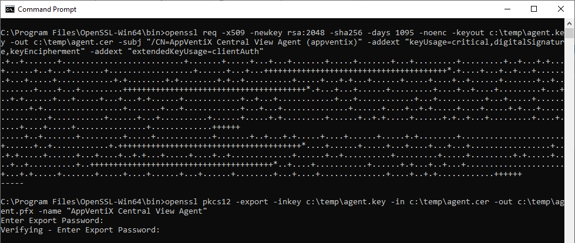

### Verify the certificate

Check the content of the certificate and the PFX file before you upload anything.

```bash
openssl x509 -in agent.cer -noout -text
openssl x509 -in agent.cer -noout -fingerprint -sha1
openssl pkcs12 -info -in agent.pfx -noout
```

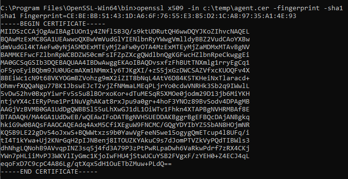

The SHA-1 fingerprint is the same value the Azure portal shows as **Thumbprint** after the upload.

### Common issues

- **The PFX file cannot be imported on Windows.** OpenSSL 3.x protects PKCS#12 files with AES-256 and PBKDF2 by default. Older Windows builds and some .NET versions cannot read that. Export the file again with `-legacy`, or with `-certpbe PBE-SHA1-3DES -keypbe PBE-SHA1-3DES -macalg sha1`.
- **The wrong file was uploaded.** Entra ID rejects a `.cer` file that contains a private key, and rejects a `.pfx` file completely.
- **DER or PEM.** The `.cer` extension is used for both encodings. The Azure portal accepts either one, other tooling might not. Check the file with `openssl x509 -in agent.cer -noout -text` before you assume.
- **The private key is not exportable.** Some tools use a non-exportable key by default. The PFX file can then no longer be created and the certificate has to be generated again.

### Other tools

Any tool producing a certificate that meets the requirements above can be used.

- **Azure Key Vault:** create a self-signed certificate through a certificate policy and export it as PFX. Useful when you want central storage and renewal.
- **XCA:** a graphical certificate manager, useful when you prefer not to work on the command line.
- **Your own PKI:** request a client authentication certificate through the normal enrollment process and export it including the private key.

## Create the App Registration - Website

First login to the [Azure portal](https://portal.azure.com)

Go to App Registrations to create a new App Registration. The App registration is used for the agent to access the configuration store (read only) using certificate based authentication. Access to configuration and content is read-only, access to the inventory location (optional) is read and write.

Click **New registration**


Give the App Registration a meaningful name (e.g. "AppVentiX").
**Single tenant only - xxx** is good for most configurations.
No **Redirect URI** is necessary.
When finished click **Register**.

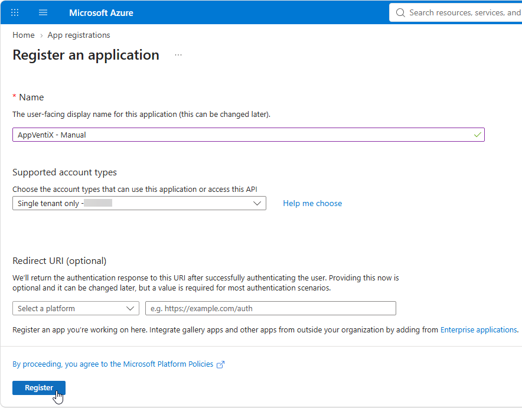

Copy the **Application (client) ID** and the **Directory (tenant) ID** values, we need these for the next steps.

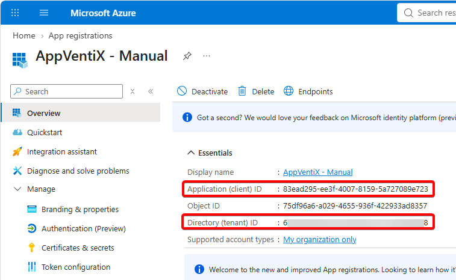

Open the **Manage** menu and select **Certificates & secrets**.
Select **Certificates** and click the **Upload certificate** button.

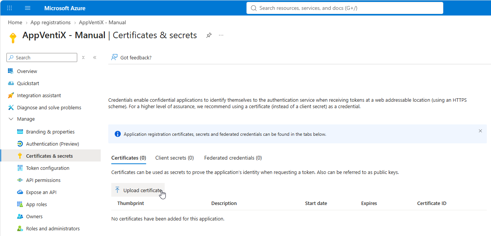

Select the `.cer` file created earlier, provide a description and click **Add**.

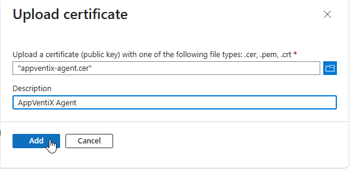

Compare the **Thumbprint** shown in the portal with the thumbprint noted during the creation of the certificate. Both values have to match.

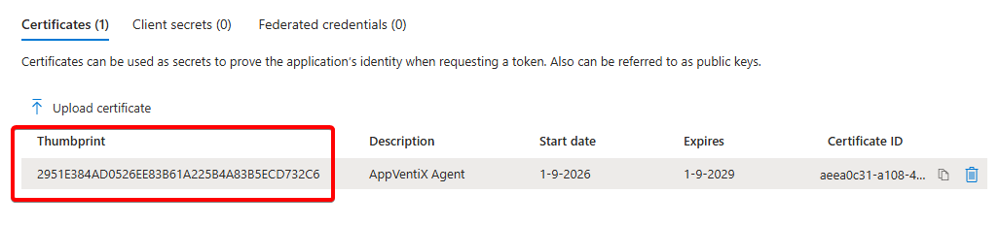

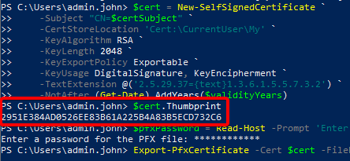

Select **Authentication** in the **Manage** section.
Select **Redirect URI Configuration** and select **+ Add Redirect URI**

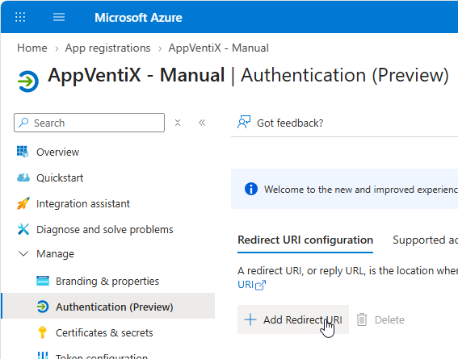

Next click the **Mobile and desktop applications** option.

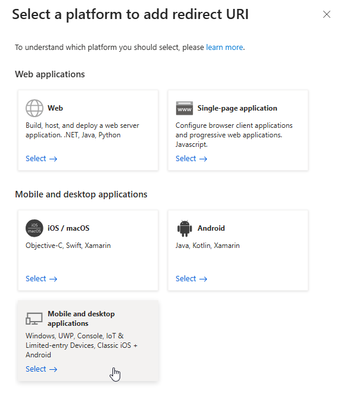

Enter the following value and click **Configure** when ready.

`ms-appx-web://microsoft.aad.brokerplugin/e05585a2-c70c-46fc-bcf9-74ad966e2837`

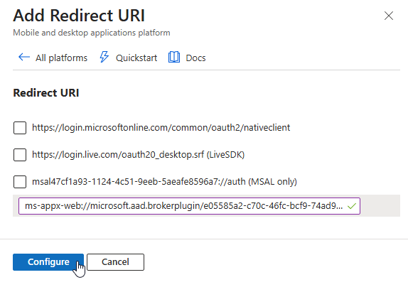

Navigate to **API permissions**.

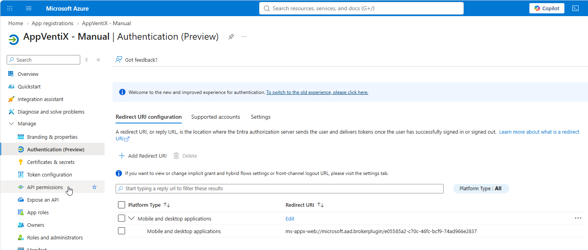

Click the **Grant admin consent for AppVentiX Corp** button

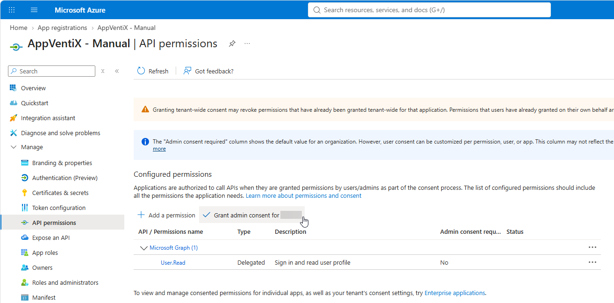

Click **Yes**.


You are ready for the next steps in AppVentiX.

To continue you need the following details:

* Application (client) ID
* Directory (tenant) ID
* Certificate pfx
* Certificate pfx password

## Create the App Registration - PowerShell

The App Registration can also be created with the Microsoft Graph PowerShell SDK. The result is the same as the portal steps above: an App Registration with the certificate, the redirect URI and admin consent for the Microsoft Graph `User.Read` permission.

!!! note
    You need an account with at least the **Cloud Application Administrator** role to create the App Registration and to grant admin consent.

Install the required modules. This is a one time action per machine.

```powershell
Install-Module Microsoft.Graph.Applications -Scope CurrentUser
Install-Module Microsoft.Graph.Identity.SignIns -Scope CurrentUser

Import-Module Microsoft.Graph.Applications
Import-Module Microsoft.Graph.Identity.SignIns
```

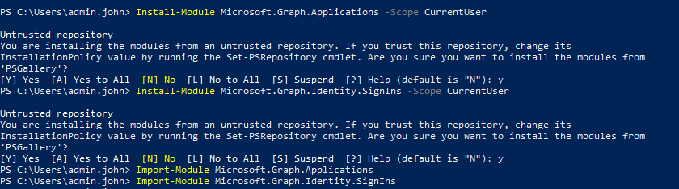

Set the variables. Adjust the display name, the tenant ID and the path to the `.cer` file to your environment. The redirect URI is a fixed value used by AppVentiX and has to be entered exactly as shown.

```powershell
$appDisplayName  = 'AppVentiX'
$tenantId        = '01234567-890a-bcde-1234-56abcdef1235'
$redirectUri     = 'ms-appx-web://microsoft.aad.brokerplugin/e05585a2-c70c-46fc-bcf9-74ad966e2837'
$graphAppId      = '00000003-0000-0000-c000-000000000000'
$userReadScopeId = 'e1fe6dd8-ba31-4d61-89e7-88639da4683d'
$cerPath         = 'C:\Temp\appventix-agent.cer'
```

Connect to Microsoft Graph. Leave the `-TenantId` parameter out to use the default tenant of the account.

```powershell
Connect-MgGraph -TenantId $tenantId -Scopes 'Application.ReadWrite.All', 'DelegatedPermissionGrant.ReadWrite.All'
```

A popup appears where you sign in with an account that has the required privileges. You might have to approve extra permissions.

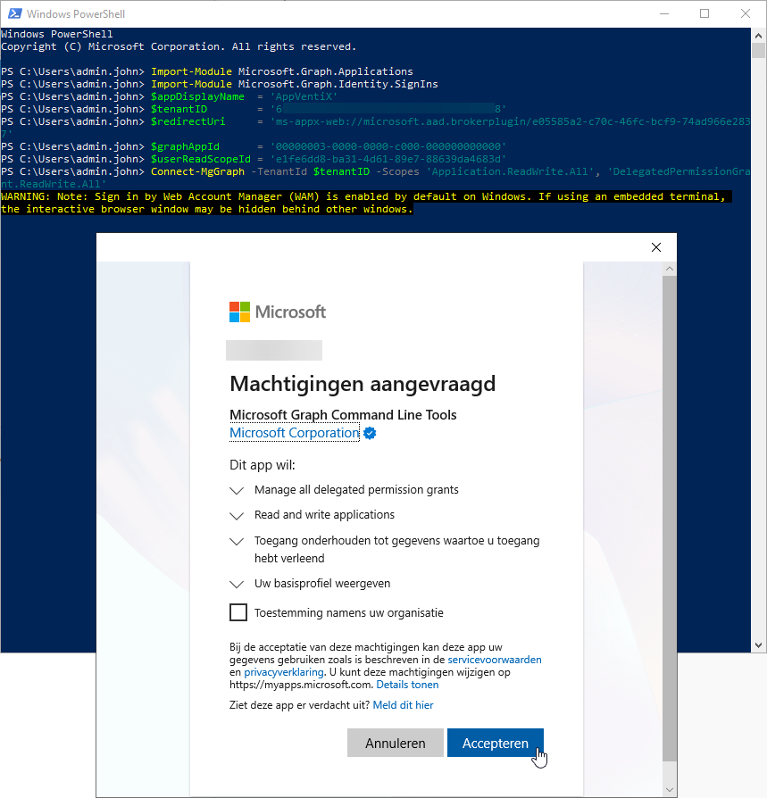

If the following popup is shown, you can select **No**

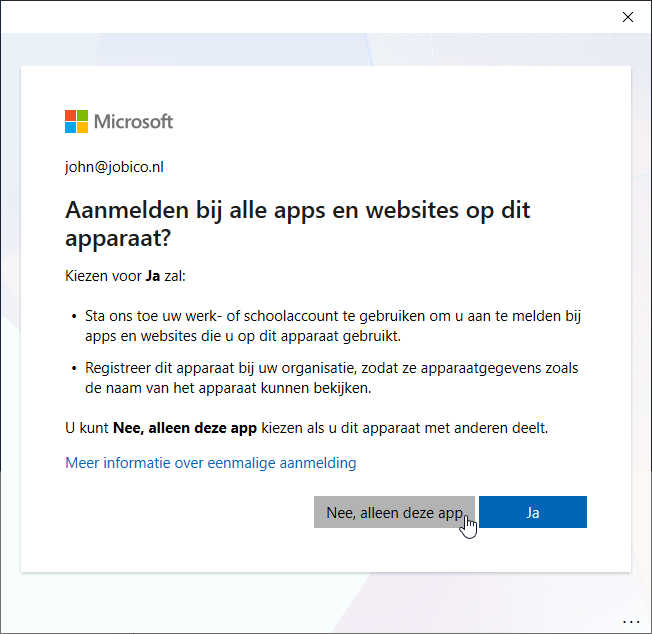

If the authentication succeeds you will be presented with a welcome message

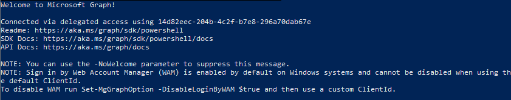

Load the public certificate created earlier.

```powershell
$cert = New-Object System.Security.Cryptography.X509Certificates.X509Certificate2($cerPath)
```

Create the App Registration, including the certificate, the redirect URI and the Microsoft Graph `User.Read` permission.

```powershell
$requiredResourceAccess = @(
    @{
        ResourceAppId  = $graphAppId
        ResourceAccess = @(
            @{
                Id   = $userReadScopeId
                Type = 'Scope'
            }
        )
    }
)

$app = New-MgApplication `
    -DisplayName $appDisplayName `
    -SignInAudience 'AzureADMyOrg' `
    -PublicClient @{ RedirectUris = @($redirectUri) } `
    -RequiredResourceAccess $requiredResourceAccess `
    -KeyCredentials @(
        @{
            Type        = 'AsymmetricX509Cert'
            Usage       = 'Verify'
            Key         = $cert.RawData
            DisplayName = $cert.Subject
        }
    )
```

Create the service principal (the enterprise application) belonging to the App Registration.

```powershell
$sp = New-MgServicePrincipal -AppId $app.AppId
```

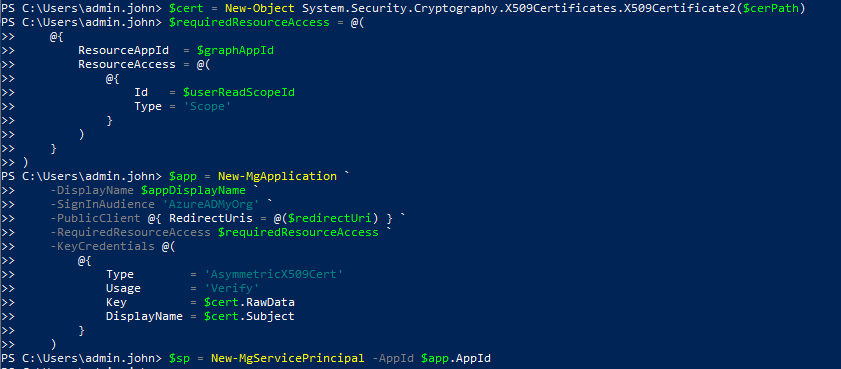

Grant admin consent for the `User.Read` permission. This replaces the **Grant admin consent** button in the portal.

```powershell
$graphSp = Get-MgServicePrincipal -Filter "appId eq '$graphAppId'"

New-MgOauth2PermissionGrant `
    -ClientId $sp.Id `
    -ConsentType 'AllPrincipals' `
    -ResourceId $graphSp.Id `
    -Scope 'User.Read'
```

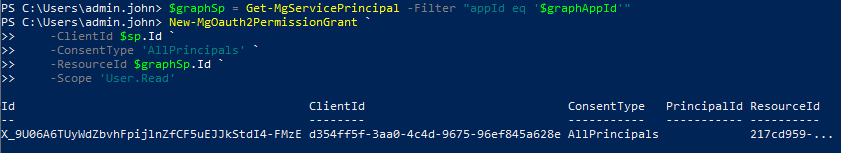

Show the values needed in AppVentiX Central View.

```powershell
[PSCustomObject]@{
    'Application (client) ID' = $app.AppId
    'Directory (tenant) ID'   = (Get-MgContext).TenantId
    'Certificate thumbprint'  = $cert.Thumbprint
}
```

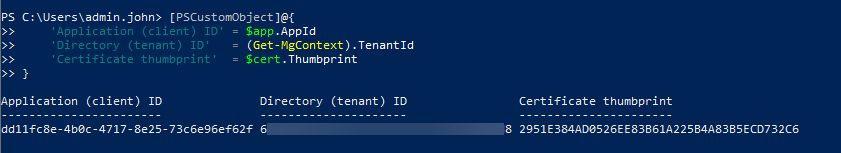

Disconnect when you are done.

```powershell
Disconnect-MgGraph
```

You are ready for the next steps in AppVentiX.

To continue you need the following details:

* Application (client) ID
* Directory (tenant) ID
* Certificate pfx
* Certificate pfx password
