# Azure AD (Entra ID) Integration

After you have enabled the Entra ID integration in the Central View settings, you have the option to use the AppVentiX Azure application registration or provide your own application registration. This is only used by the agent, not the Central View console. The Central View console uses the account you select to authenticate to Entra ID.

It is not needed to configure and provide secrets for AppVentiX. A basic application registration is enough for AppVentiX because AppVentiX will not connect to Entra ID by itself but instead uses the access token from the user using MSAL. This makes the solution secure because the secrets do not have to be stored by AppVentiX.

Navigate to **Configuration & Activity** and click on the **Settings** menu button.

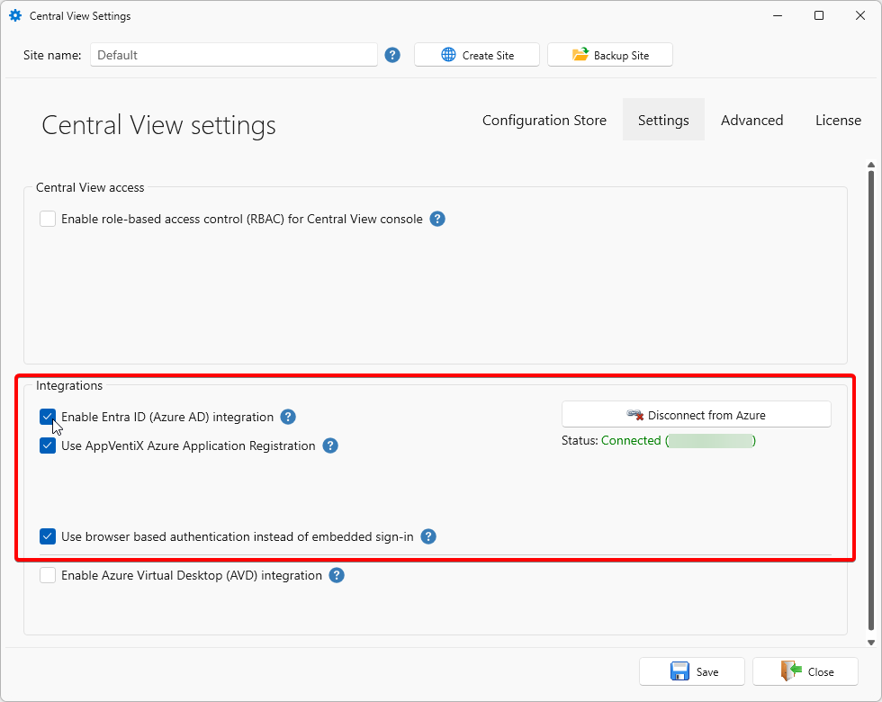

For Central View to be able to retrieve user groups and devices from Entra ID, the following Graph permissions need to be assigned to the account you use to log in to Entra ID:

- `Device.Read.All`
- `Group.Read.All`
- `GroupMember.Read.All`

---

## Using the AppVentiX Azure Application Registration

The user will see a consent window after login. The only permissions requested are `user.read` to retrieve the group membership of the user. It is recommended to let an admin perform a consent one time (with the checkbox checked) so users will not see the consent window at all.

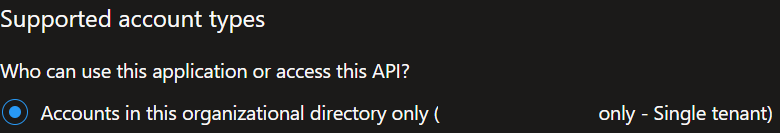

---

## Using Your Own Azure Application Registration

Create a new application registration in the Azure portal and give it a name like "AppVentiX".

Choose **This organization only**. You can enter the redirect URLs later; click **Save**.

Go to the **Authentication** menu in the application registration you just created. Click on **Add Platform** and choose **Mobile and Desktop Applications**.

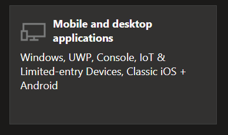

Enable the checkboxes and add one more redirect URI:

```
ms-appx-web://microsoft.aad.brokerplugin/aca5eaeb-ae60-4f0f-af22-32592d20910a
```

Replace the application ID with your application ID (found in the overview menu).

The end result looks like this:

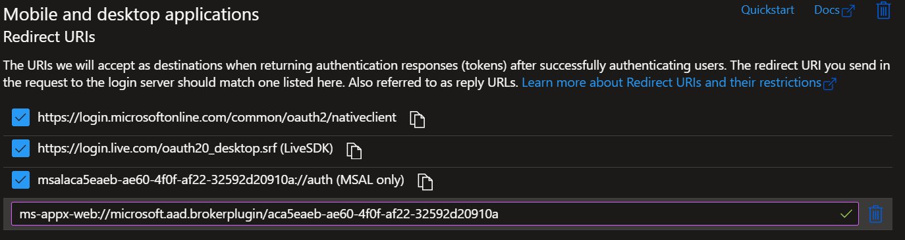

Now go to the **API Permissions** tab. The `user.read` permission should already be configured by default. If not, add the `user.read` permission (no more permissions are needed).

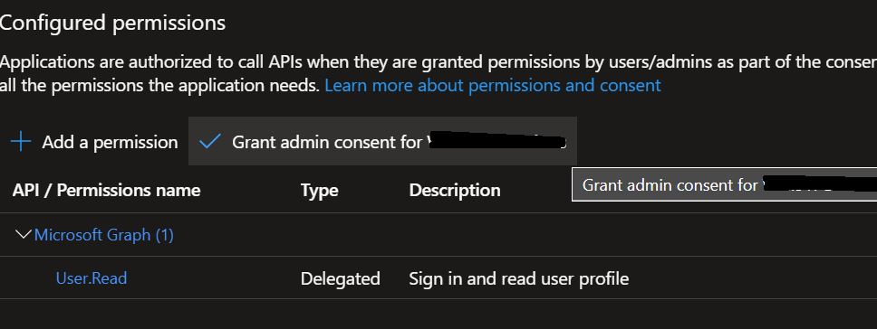

Click on **Grant admin consent**, so users are not prompted with the consent window.

Now go to the **Overview** menu for the application registration and copy the application and tenant ID:

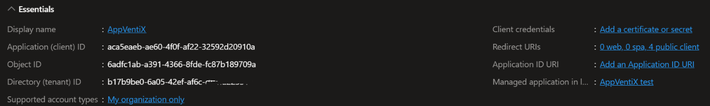

In the Central View settings window under **Integrations**, uncheck **Use AppVentiX Azure Application Registration**.
Paste the **Tenant ID** value and the **Application ID** values in the following fields:

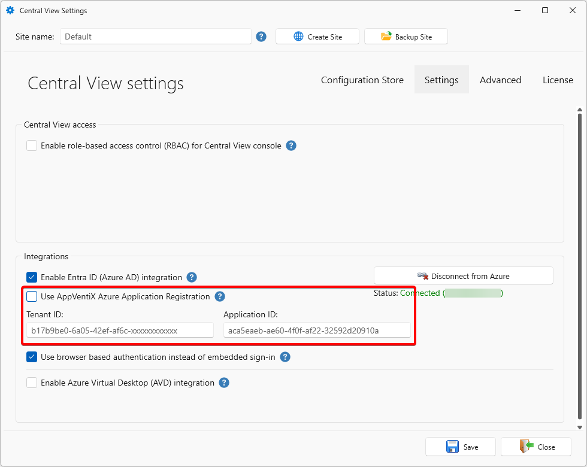

You are now finished. Click **Save**.

---

## Advanced Azure AD Settings

There are some advanced Azure AD settings that can be configured. You only need to configure them when needed:

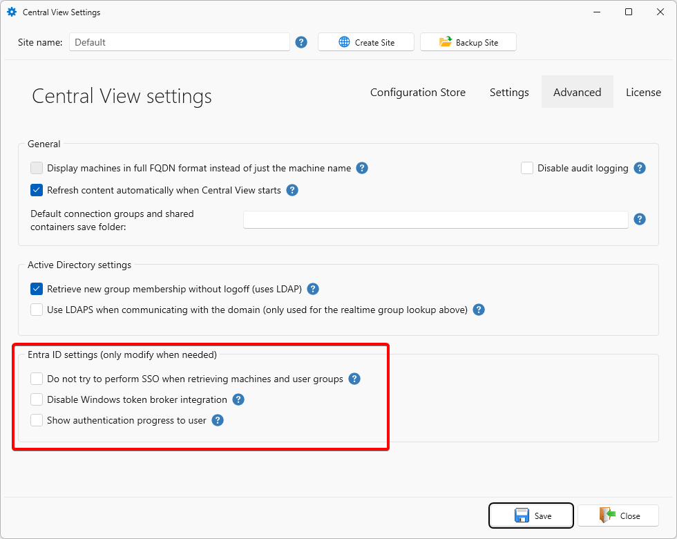

- **Disable SSO:** By default, SSO will be used in the Central View console to retrieve machines and user groups. If you do not want to use SSO, you can enable this setting.
- **Disable Windows Token Broker integration (WAM):** In newer operating systems (Win10/11) the integrated authentication broker will be used by default. For Azure AD-joined VMs this will work out of the box and normally you do not want to disable this.
- **Show authentication progress to user:** Normally the authentication and Azure AD group retrieval happens silently in the background. With this option the progress will always be shown to the user. This can be used for testing but is normally not needed.
- **Enable fall-back method for Azure AD authentication:** Uses older Azure AD integration. Only enable this option when MSAL cannot be used.

**Logging:** When a user sees a popup to consent or authenticate, the silent authentication did not work. You can find more information in the log file stored in the user's profile:

```
C:\Users\username\AppData\Roaming\AppVentiX\AppVentiXLogonHandlerLog.txt
```

---

## Hybrid Azure AD Joined Machines

For machines that are both Active Directory integrated and Azure AD integrated (hybrid joined), use the machine groups based on AD group or OU.

Only use the Azure AD machine group for Azure AD-only joined machines. Azure AD-only joined machines are not members of an Active Directory domain.

### Azure AD Joined (Only) Machines

Machines that are only joined to Azure AD can be configured with an Azure file share which is stand-alone (not AD integrated). For this you can provide the storage account name and access key. Please find more information in the [Azure File Share](../azure-file-share/index.md) section.

## Logging & Caching

AppVentiX Central View and the AppVentiX Agent store Entra ID logs and cache details in your user profile at `%APPDATA%\AppVentiX`.

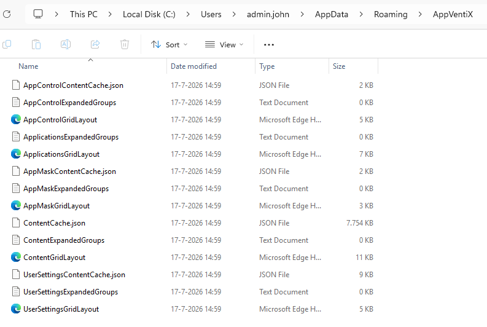

The AppVentiX Agent also writes to its own Windows Event Log channel, "AppVentiX".

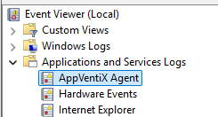

You can also retrieve this information via the Central View console. Select the machine where you want the eventlog from and click on the Eventlog Inventory button.

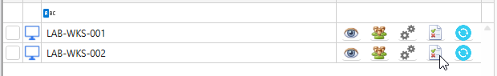

Next, select a timeframe for the event log items.

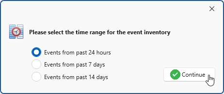