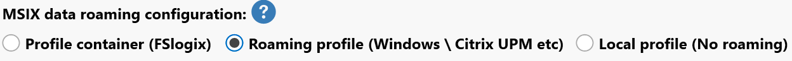
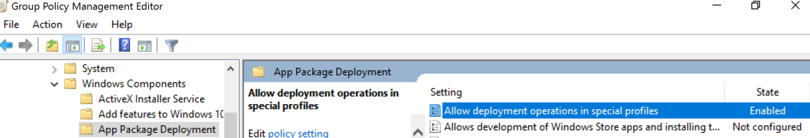
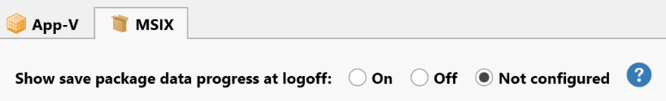

# FSLogix and Roaming Profile Settings

AppVentiX has been verified to work very well with FSLogix and other profile management solutions like Citrix UPM and Windows roaming profiles. Contact [support@appventix.com](mailto:support@appventix.com) if you have any questions.

---

## FSLogix in Combination with App-V

When using FSLogix in combination with App-V you might encounter some packages that do not work anymore after the second logon. To fix this, enable the **Always publish this package** option in the publishing task. This will make sure the package integrations for the affected package are configured correctly after each login.

Another workaround is to add the following path to the FSLogix exclusions XML file:

```
AppData\Local\Microsoft\AppV\Client
```

Also make sure to use the latest FSLogix build.

---

## FSLogix in Combination with MSIX

MSIX data roaming is enabled by default for FSLogix. No additional configuration is needed. MSIX data is roamed for normal deployed MSIX packages and MSIX packages delivered by App Attach.



The log file for the roamed MSIX app data can be found in: `%appdata%\AppVentiX`

The log file will be cleared every 7 days.

There is only one exclusion needed when you encounter stale Windows Start menu shortcuts. Create or modify your existing FSLogix exclusions XML file with the following:

```xml
<?xml version="1.0" encoding="UTF-8"?>
<FrxProfileFolderRedirection ExcludeCommonFolders="0">
<Excludes>
<Exclude Copy="0">AppData\Local\Packages\Microsoft.Windows.StartMenuExperienceHost_cw5n1h2txyewy\TempState</Exclude>
</Excludes>
</FrxProfileFolderRedirection>
```

> **Note:** The above exclusion is now the default in FSLogix since the 2501 release.

---

## Windows Roaming Profiles with MSIX

For Windows roaming profiles, the following setting needs to be enabled:



When you have configured the roaming profile settings to delete cached copies of the profile, you also need to enable the following GPO setting:

**Allow deployment operations in special profiles**

---

## Other Profile Solutions (Citrix UPM, etc.) with MSIX

For other profile solutions that capture the roaming data of the user (like Citrix UPM), enable the following agent setting:



Make sure the `%appdata%\AppVentiX` folder is captured/roamed in the roaming profile solution.

Optionally, the **Show save package data progress at logoff** setting can be enabled. This will show a brief notification of the MSIX data being saved at logoff.
