# Manage Content and Publishing Tasks

The Manage Content page allows you to inventory the content store(s) and manage the central configuration. Click on the eye icon next to the content store to inventory the share, or click the **Refresh Content** button in the top ribbon. Here you will find a lot of information about the packages. Do not forget to select the **Show All/Hidden Columns** checkbox to see even more information, like package size.

Double-click on a package (or select the package and click on the **Configure Package** button in the selected item actions ribbon menu) to open the package options.

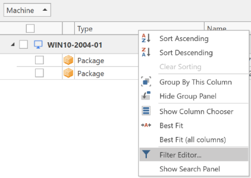

Here you can find details about the App-V or MSIX package and also create a publishing task or configure package options for the selected package. You can also click on the publish and options button next to the package; it will take you directly to the new publishing task or package options window.

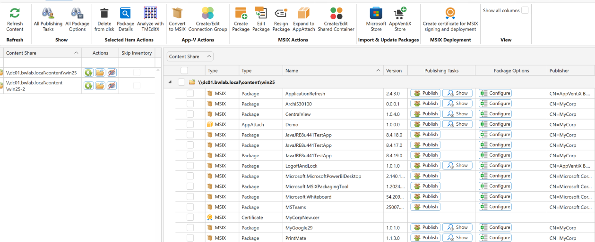

---

## Creating a Publishing Task

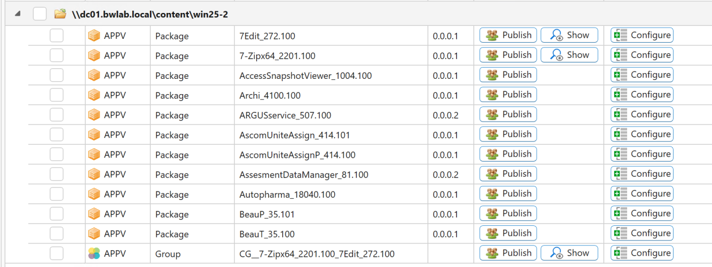

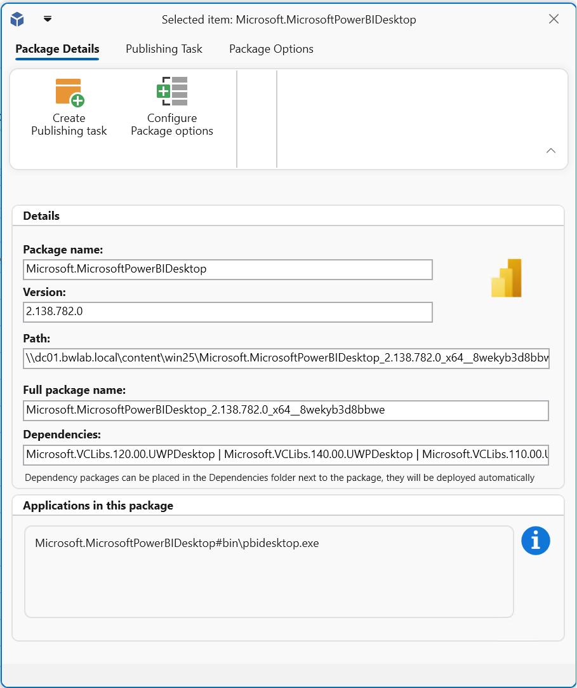

When creating a publishing task, you can configure various options to suit your needs. Most options are straightforward:

- **Global vs. user group publishing:** Set the package to be published globally (making it available to everyone on the machine, applicable to App-V only) or restrict it to specific user groups (supported by both App-V and MSIX). There is also a **Publish to Everyone** option for MSIX.
- **Unpublish tasks are unnecessary:** Deployment is fully automated. Removing a publishing task will automatically unpublish the package for the user or machine.
- **Missing package actions:** Define actions for cases where the package is missing during task execution. Options include dynamically adding the package or skipping the task altogether.
- **Machine group filter:** Restrict task execution to specific machine groups. By default, tasks apply to all machine groups.
- **Execution priority:** Control the order in which tasks are executed. Lower values indicate higher priority, useful if certain packages need to be published before others.
- **Always publish:** The agent checks for already-published packages and skips redundant tasks. The "Always publish this package even when already published" option overrides this behavior. Use this setting only if necessary, such as when dealing with profile solution issues.
- **Global publishing for specific user groups:** Some App-V packages (like Adobe Acrobat DC) must be published globally and do not support per-user publishing. The "Publish this package globally for this user group" setting allows the agent to globally publish packages based on user groups when required.

---

## Desktop and Seamless Application Scenario

AppVentiX supports full desktop and seamless application publishing scenarios. Full desktop does not need any additional configuration; just create and save the publishing task.

For seamless application publishing, check the **Publish as RemoteApp** checkbox. The window will be extended:

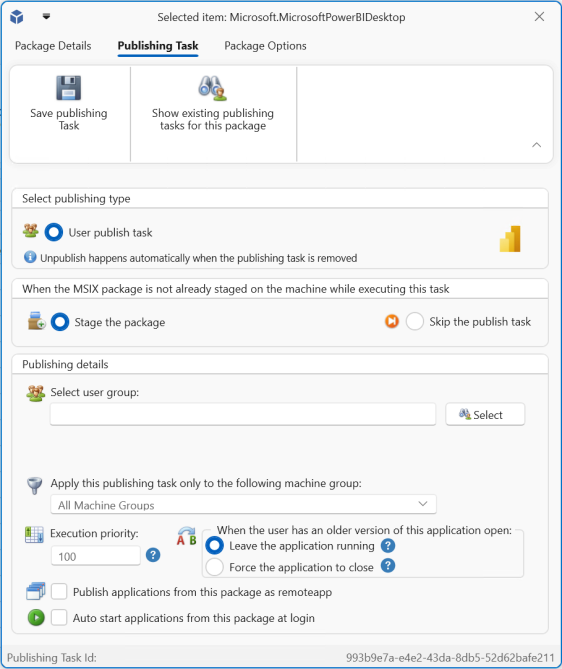

Now you can select the application you want to publish, or configure a PowerShell or cmd script to run. Scripts can run inside or outside the virtual environment.

When you click on the copy button next to the selected application, the command to publish the application is copied to your clipboard. Paste this command in your seamless application delivery solution (RDS, Citrix, VMware, etc.).

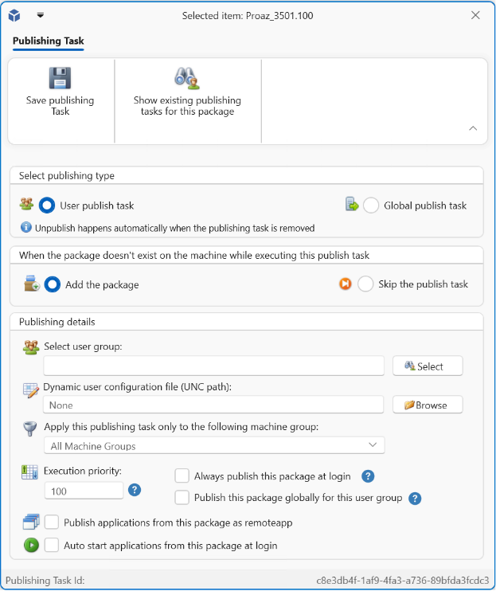

There is also a direct integration with [Azure Virtual Desktop (AVD)](../azure-virtual-desktop/index.md), which will publish the application directly in AVD and also remove the application when the publishing task is removed.

> **Note:** In full desktop scenarios the "Publish as RemoteApp" checkbox is not needed.

---

## Auto Start Applications

With auto start applications you can select applications from the package that should be auto-started for the user. The selected application(s) will be started automatically when the user logs in.

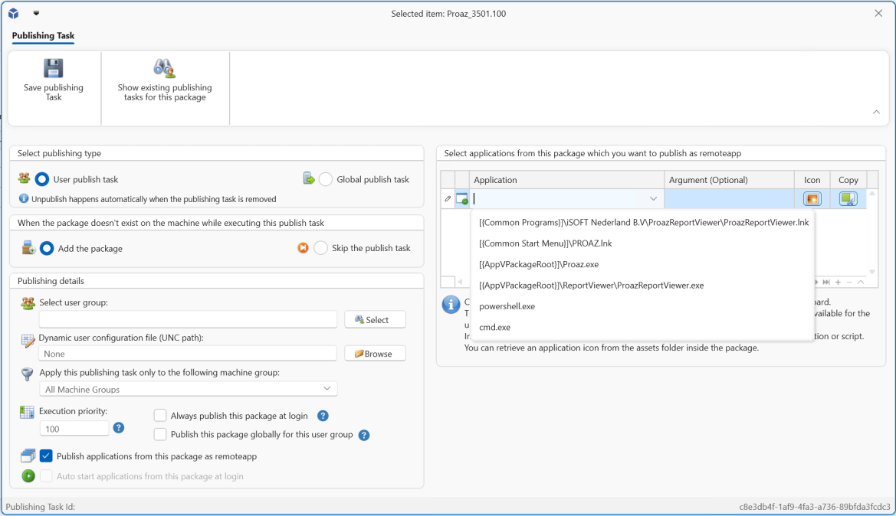

---

## Configure Package Options

When you click on **Configure Package Options**, you will see the following window:

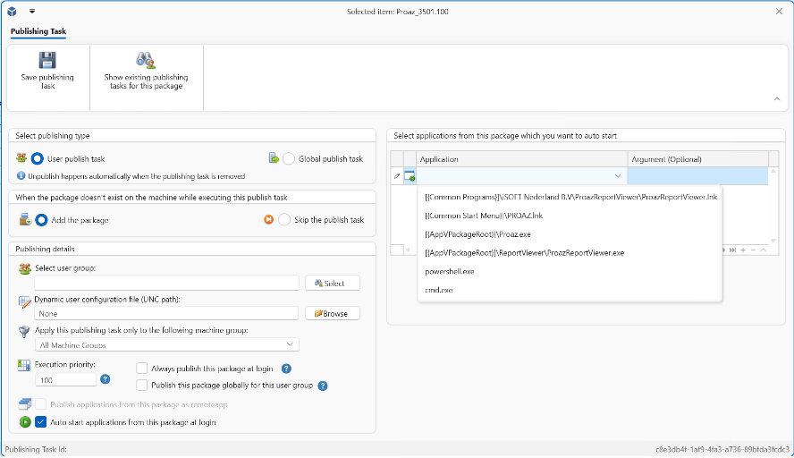

- **Drain:** When you enable drain for a package, the agent will remove the package and prevent it from deploying again. Make sure that the enable drain feature is enabled in the agent settings (default). When there are publishing tasks configured for the package, they will be removed automatically.
- **Pre-stage registry (App-V only):** Use this option for very large packages. When enabled, the agent will start the virtual environment of the package one time after it is deployed. This will increase the initial launch time of the application.
- **Machine group filter:** Filter on which machine group the configured package options should apply.

---

## After Stage Actions

With after stage actions you can provide commands which are executed after the package has been staged on the machine.

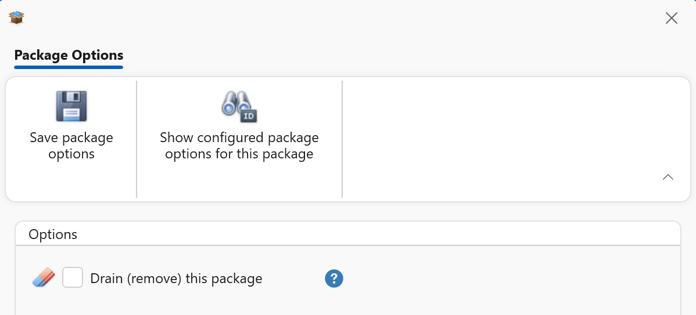

For example, when importing Microsoft Teams from the Import from Microsoft Store window, the following after stage action is configured automatically to install the Teams Office Add-in:

```
msiexec.exe /i "C:\Program Files\WindowsApps\MSTeams_24004.1309.2689.2246_x64__8wekyb3d8bbwe\MicrosoftTeamsMeetingAddinInstaller.msi" ALLUSERS=1 /qn /norestart TARGETDIR="C:\Program Files (x86)\Microsoft\TeamsMeetingAddin";REG Add HKLM\SOFTWARE\Microsoft\Teams /v disableAutoUpdate /t REG_DWORD /d 1 /f
```

You can separate multiple commands with the `;` character. Make sure to include quotes where necessary.

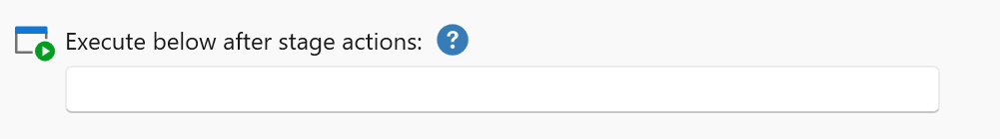

---

## Show Publishing Tasks and Package Options

On the inventory content window, you will find two buttons:

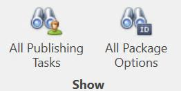

- **Show Publishing Tasks:** See an overview of all publishing tasks. You can filter and sort the tasks, edit the tasks, or delete the tasks.
- **Show Package Options:** See all configured package options.

In the selected items ribbon menu you will find different actions for selected items (depending on what package types are found in the inventory).

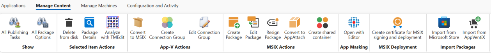

For example, you can create App-V connection groups by selecting specific packages or editing existing groups. You can also create MSIX shared containers directly from this page.

From the content page, you also have the option to convert App-V packages to MSIX, enabling a smooth migration at your own pace. Managing App-V and MSIX side by side is straightforward and efficient.

> **Note:** You need a code signing certificate to sign MSIX packages. This certificate can be obtained from an internal or external Certificate Authority like Sectigo, or you can create one using the Central View console. When you create a certificate in Central View it will automatically be deployed to the machines so packages signed with this certificate are automatically trusted. More information about certificates can be found in the [MSIX Certificate Management](../msix-certificates/index.md) section.
