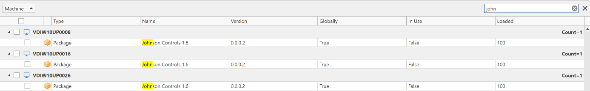

# Manage Machines

The Manage Machines page in Central View allows you to inventory machines and easily check which packages are deployed on a machine. You can compare machines with each other (check if they have similar packages deployed) and search packages by name.

You can right-click on a column header and set a filter to easily find the packages you are looking for.

You can select multiple packages and then click **Remove Package** to remove a package from the machine(s) in real-time (in the selected items ribbon menu). You can also filter machines to only see machines that are online. You will find this filter underneath the select machine group dropdown box.

Actions can be performed per machine (for example inventory or refresh) or per machine group (using the machine group actions ribbon menu).

If you have enabled both App-V and MSIX for a specific machine group, you will be asked which feature (App-V or MSIX) you want to manage. You can switch the active feature with the dropdown box in the ribbon menu. You can manage App-V and MSIX side by side.

With the **Show Virtual Process** button, you can inventory the virtual processes on machines and close them if needed (for example if you want to remove a package that is in use).

With the **User Inventory** button you can see in real-time which users are logged in and which packages they have published. You can also invoke a repair from there.

The **Event Inventory** will allow you to see all the latest events from the agent.
