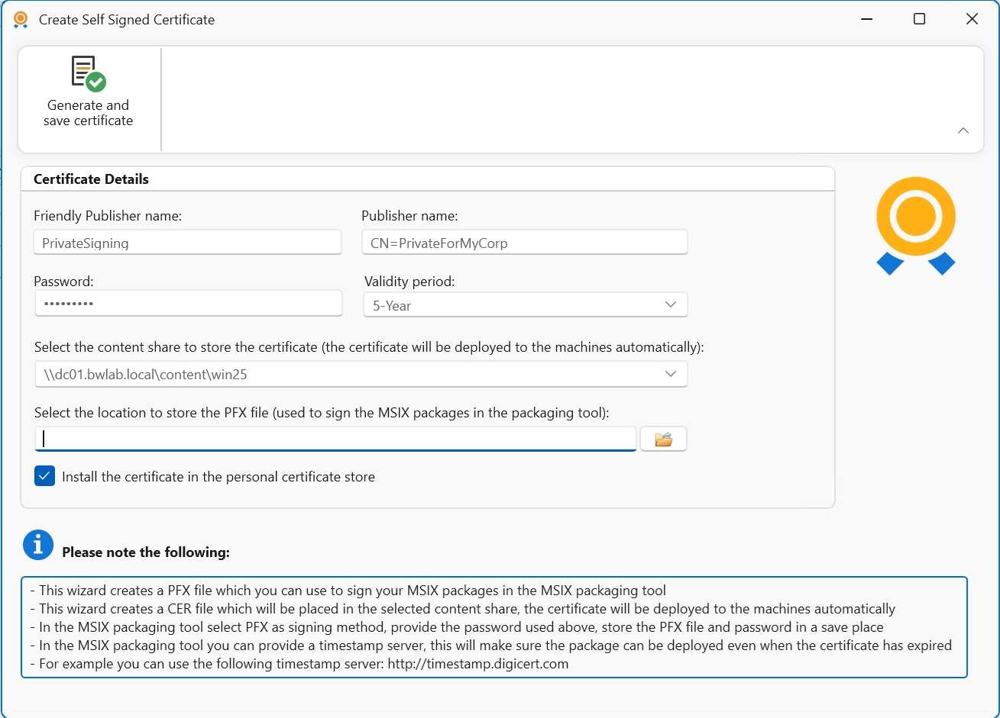

# MSIX Certificate Management and Deployment

Requesting third-party certificates for signing MSIX packages is time-consuming and costly. With AppVentiX it is now very easy to create your own certificate directly from the console. The certificate will be deployed to the machines automatically, making it a very easy and quick method to sign and deploy MSIX packages.

When creating a certificate you can provide the following information:

The certificate is stored as PFX and imported in the personal certificate store so it can be easily selected when converting packages from App-V to MSIX, for example.

The .CER file will be stored on the content store you select and will be deployed to the machines automatically. The certificate is also visible in the content overview:

