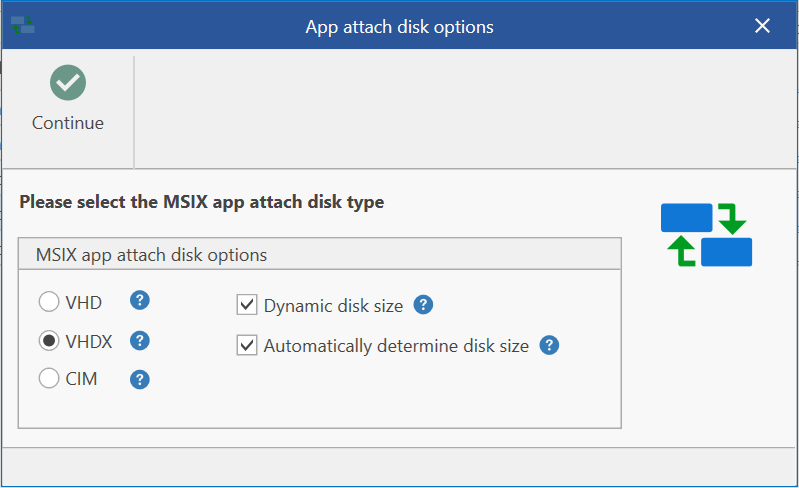
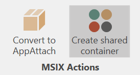
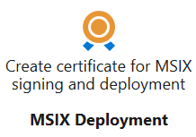

# MSIX and MSIX App Attach

With AppVentiX you can deploy normal MSIX packages and MSIX packages in a virtual disk format (called the App Attach mechanism). When you want to save disk space you can convert an MSIX package to App Attach. This process will create an image file (VHD/VHDX or CIM) containing the extracted MSIX package.

This image will be attached by the AppVentiX agent so the application can be published to users. This delivery mechanism has the advantage that no disk space is used on the agent. Please note you can also just deploy MSIX packages without App Attach; they will be cached on the hard disk of the machine instead of being remotely attached. You can also combine the two delivery methods.

After the package is converted to App Attach it will be visible in the content inventory where you can publish it to a user group. The original MSIX package is stored in the backup folder and can be found there in case you need it, for example to update the application. Because the original MSIX package is placed in a folder named "backup", the agent will not process/pre-cache the original package.

Converting to App Attach does not need any prerequisites. The convert process can run on:

- Server OS (2022 or higher)
- Client OS (Win 10 20H2 or higher, or Win 11)

When you want to convert to CIM format, please note you need Win10 20H2 or higher. Also, run the Central View console as Administrator to make sure the convert process runs smoothly.

The convert to App Attach feature supports different options when creating the App Attach disk:

- All disk options are supported (VHD, VHDX, and CIM)
- You can choose dynamic disk size or a fixed disk size
- The disk size is by default automatically determined according to the size of the MSIX package, but you can also configure the disk size manually

After converting an MSIX package to App Attach it will be visible in the content inventory and you can publish it for users just like a normal MSIX package.

The AppVentiX agent takes care of all the actions needed for MSIX App Attach (staging, de-staging, attaching/detaching). It contains intelligent decisions and keeps track of the disks attached to the agent.

MSIX and App Attach packages can be deployed and published to users even when they are not deployed/attached yet on the machine (on-the-fly delivery), making it a real dynamic delivery mechanism.

By default, the registration for MSIX packages will be removed when the user logs off. This is done by the AppVentiX LogOff Handler (when the "persist MSIX app data" agent setting is enabled). This process is needed when used in combination with FSLogix profile management and you want to roam the application data of the package between sessions. When you roam the profile of the user, the "persist MSIX app data" setting is needed (enabled by default). When you have persistent machines per user (laptops, etc.) you can disable this setting. AppVentiX will take care of the whole process and supports both situations where the profile is roaming and non-roaming.

Old versions of packages that you remove from the content store(s) will be removed from the agents automatically, making it a fully managed deployment solution.

---

## MSIX Shared Containers

MSIX Shared Containers are similar to App-V Connection Groups. Packages in a shared container will form one container so they can access each other's files and registry settings.

When you select multiple MSIX packages you can click on **Create Shared Container**. After you save the shared container it will be visible in the content inventory. You can then assign it to a user group and it will be enabled for the user automatically at the next refresh cycle or login.

> **Note:** MSIX Shared Containers are only supported on Windows 10 Build 22x and higher. The current implementation of shared containers requires (local) admin permissions to apply the container.
