# How to Set Up a QUIC Share to Allow Share Access over Port 443

Default SMB uses port 445, which can be blocked by internet ISPs. There is a Microsoft solution for this called QUIC: SMB over HTTPS, using the highest TLS encryption available today. The server hosting the QUIC share can be placed in the DMZ. No Active Directory communication is needed.

QUIC can be enabled on an Azure VM using the Admin Center in the Azure portal, or manually using PowerShell. Below are the steps to set up the QUIC share with PowerShell.

**Recommended OS:** Windows Server 2025

**Server requirements:**

- Installed with default roles, Workgroup in DMZ
- IIS Role is not required
- Inbound Firewall NAT: UDP, Port 443

**Disk layout:** A dedicated data disk for the QUIC repository is recommended, but the C: drive can be used as well.

---

## Firewall Rules

```powershell
# Allow SMB port 443 UDP in Windows Firewall
New-NetFirewallRule -DisplayName "Allow QUIC SMB 443" -Direction Inbound -Protocol UDP -LocalPort 443 -Action Allow -Profile Any

# Verify the rule
Get-NetFirewallRule -DisplayName "Allow QUIC SMB 443" | Get-NetFirewallPortFilter
```

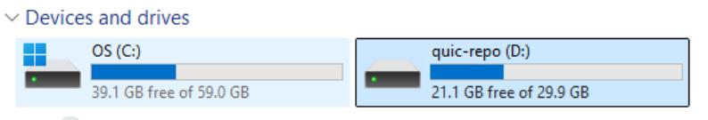

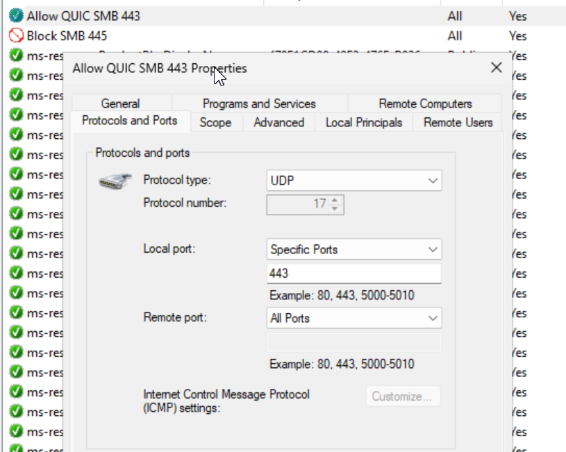

Optional: If the QUIC server is also accessible from the internal network, block port 445 or SMB clients may try to connect over this port instead of using the QUIC protocol.

```powershell
# Block SMB port 445 in Windows Firewall
New-NetFirewallRule -DisplayName "Block SMB 445" -Direction Inbound -Protocol TCP -LocalPort 445 -Action Block -Profile Any

# Verify the rule
Get-NetFirewallRule -DisplayName "Block SMB 445" | Get-NetFirewallPortFilter
```

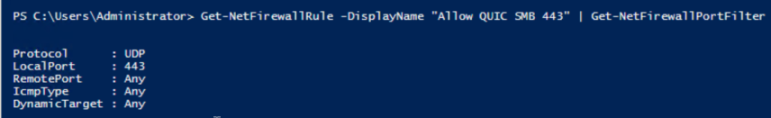

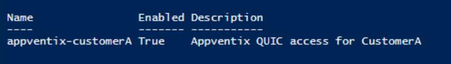

---

## User Accounts

```powershell
# Create local user
# Security Note: This local user is for AppVentiX Agent -> share authentication only.
$Password = ConvertTo-SecureString "ComplexP@ssw0rd!" -AsPlainText -Force

New-LocalUser -Name "appventix-customerA" -Password $Password `
    -Description "AppVentiX QUIC access for CustomerA" `
    -PasswordNeverExpires -AccountNeverExpires
```

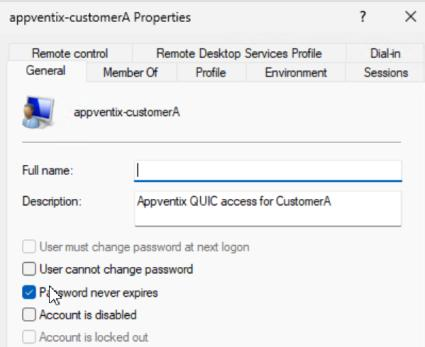

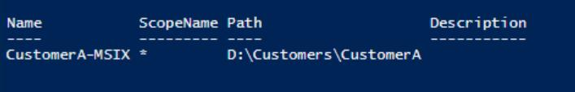

---

## Create File Structure

```powershell
# Create MSIX storage location
New-Item -Path "D:\Customers\CustomerA" -ItemType Directory

New-SmbShare -Name "CustomerA-MSIX" -Path "D:\Customers\CustomerA" `
    -FullAccess "Administrators" -ChangeAccess "appventix-customerA"
```

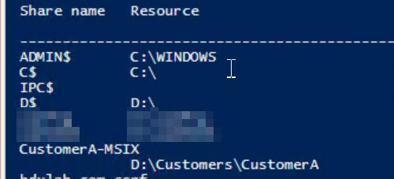

---

## NTFS Permissions

```powershell
# Set NTFS permissions
$Path = "D:\Customers\CustomerA"

$Acl = Get-Acl $Path

$AccessRule = New-Object System.Security.AccessControl.FileSystemAccessRule(
    "appventix-customerA",
    "ReadAndExecute",
    "ContainerInherit,ObjectInherit",
    "None",
    "Allow"
)

$Acl.SetAccessRule($AccessRule)

Set-Acl $Path $Acl

# Validate the Share and Permissions
Net share

# Validate permissions
(Get-Acl $Path).Access | Where-Object IdentityReference -like "*customerA*"
```

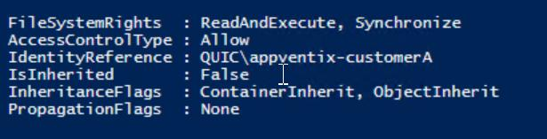

---

## SSL Certificate

For QUIC, a normal server SSL certificate is enough, just like one used on a webserver. This can be a certificate from a third-party SSL vendor like Sectigo, or a certificate created by your internal PKI environment.

```powershell
# Import SSL Certificate for QUIC Listener
$cert = Get-ChildItem -Path "Cert:\LocalMachine\My" | Where-Object Thumbprint -eq 0880DFBC3FB138CB9E598C87CCC3B53772021694

# Map cert to namespace
New-SmbServerCertificateMapping -Name quic.mycorp.com `
    -Thumbprint $cert.Thumbprint -StoreName My

# Configure SMB Server Certificate mapping
Set-SmbServerCertificateMapping -Name quic.mycorp.com `
    -RequireClientAuthentication $false

Set-SmbServerCertificateMapping -Name quic.mycorp.com `
    -SkipClientCertificateAccessCheck $false

# Note: If the certificate contains multiple SANs this command might show the default
# Name here. This can be ignored.
Get-SmbServerCertificateMapping
```

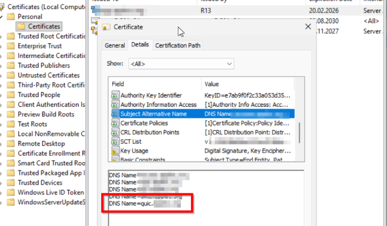

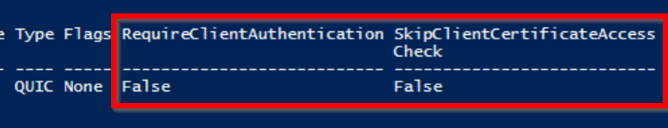

---

## Verification

```powershell
Get-SmbClientAccessToServer -Name quic.mycorp.com
```

| Check | Command |
|-------|---------|
| Check Listener on UDP Port | `netstat -na \| Select-String "UDP" \| Select-String ":443"` |
| Listener processes | `netstat -nao \| Select-String "^ *UDP.*:443"` (returns PID 4 for example), then `tasklist /FI "PID eq 4"` |
| Check SSL Cert mapping (thumbprint must match the SAN cert in machine store) | `Get-SmbServerCertificateMapping` |
| Check config | `Get-SmbServerConfiguration` |

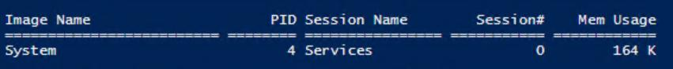

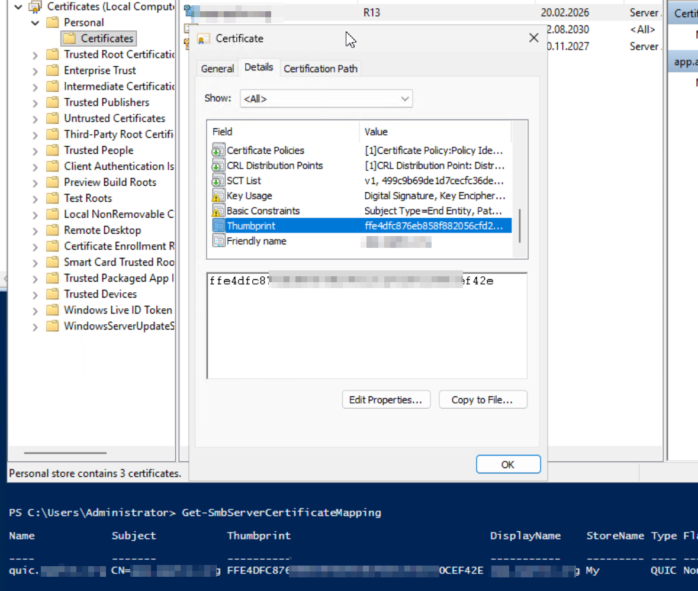

---

## Configure in Central View

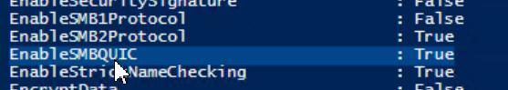

Configure the QUIC share in the Central View console:

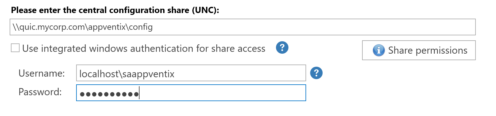

> For questions regarding the QUIC share implementation, please contact [support@appventix.com](mailto:support@appventix.com).
