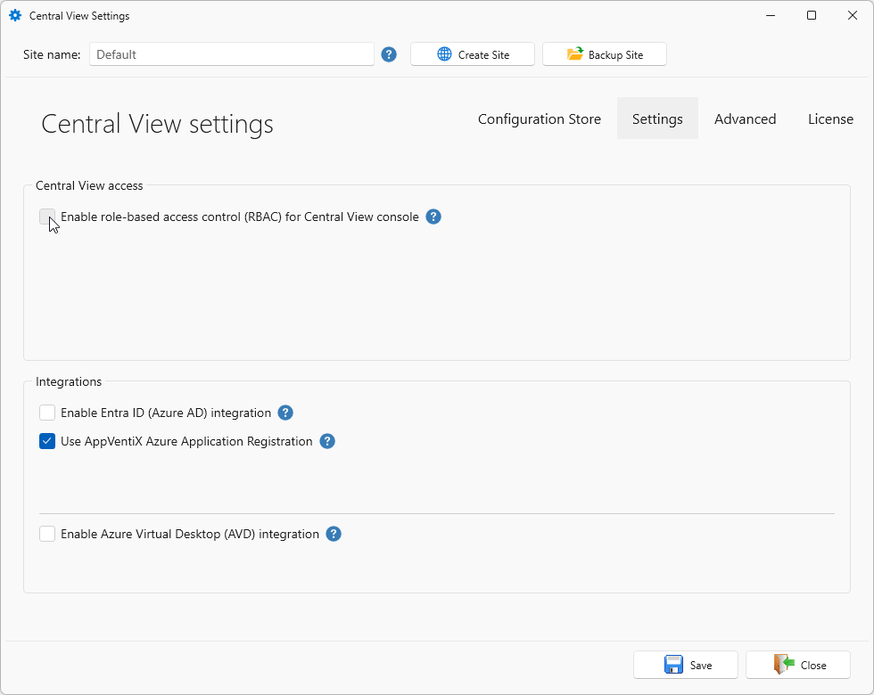
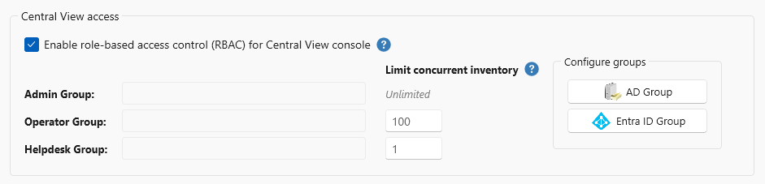
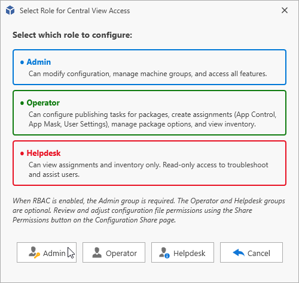
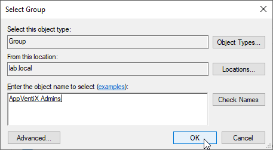
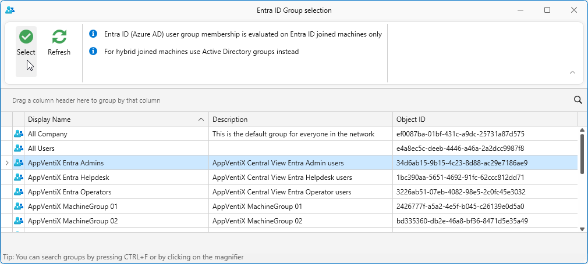
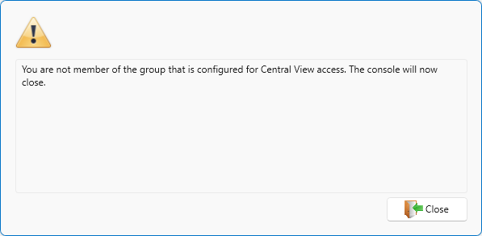
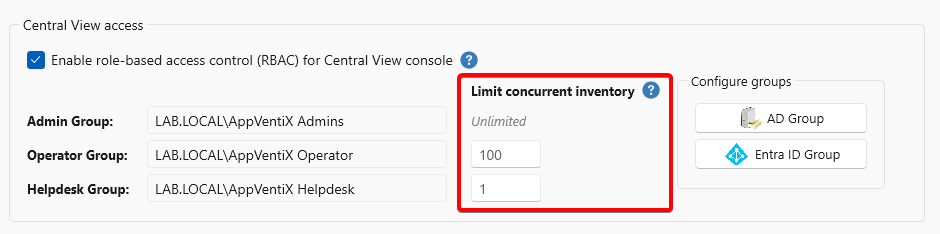

# Role Based Access Control (RBAC)

Role Based Access Control (RBAC) lets you delegate access to the AppVentiX Central View console without handing out full administrative control. Each role is linked to an Active Directory or Entra ID group. When a user starts the console, their group membership determines which role applies.

A role controls which actions the user can perform. This allows helpdesk and operations teams to do their daily work while reducing the risk of accidental configuration changes.

Within AppVentiX there are three roles you can configure:

- **Admin**: Can modify configuration, manage machine groups, and access all features. Full access.
- **Operator**: Can configure publishing tasks for packages, create assignments (App Control, App Mask and User Settings), manage package options and view inventory. Limited access.
- **Helpdesk**: Can view assignments and inventory only. Read-only access to troubleshoot and assist users.

!!! note
    With these roles you configure only the AppVentiX Central View console. File-level RBAC needs to be configured separately, see [Permissions when RBAC is enabled](#permissions-when-rbac-is-enabled).

## Enable role-based access control for the Central View console

To enable RBAC support, navigate to the **Configuration & Activity** tab and click the **Settings** button.
In the **Central View Settings** window, open the **Settings** tab.
Under **Central View access**, check **Enable role-based access control (RBAC) for Central View console**.

Depending on your enabled integrations, you might only see the AD Group or Entra ID Group button. If you have an Active Directory environment configured and have Entra ID integration enabled, you see both.
Click the **AD Group** or **Entra ID Group** button to configure the RBAC groups.

When RBAC is enabled, the **Admin** group is _required_. The **Operator** and **Helpdesk** groups are _optional_. Only **one** group per role is configurable.
Select the **Admin** button to select the group.

For Active Directory, the default group selection dialog will be presented where you can find and select an AD group.

For Entra ID a dialog will be presented, where you can find and select an Entra ID group.

When you have enabled RBAC and configured the groups, make sure your admins are added to the configured Admin group.
When access is denied you are presented with the following warning message.

## Limit concurrent inventory

With **Limit concurrent inventory** you determine the maximum number of machines a user in a role may run a Selected Machine inventory or refresh action against at the same time. Admins are **always** unlimited.
You can configure values for Operator (default 100) and Helpdesk (default 1). Set **0** for unlimited.

## Permissions when RBAC is enabled

The roles described above apply to the Central View console only. They do not change permissions on the configuration store. Without matching permissions there, an Operator or Helpdesk user can still open the configuration files outside the console and edit them.

Where you set those permissions depends on the layout of the configuration store. Sites created before AppVentiX Central View version 5.2 use the v1 layout, where all configuration files sit in the root of the store. Sites created with version 5.2 or later use the v2 layout, where those files moved into a `Configuration/` folder precisely so they can be secured per role. Existing sites keep their layout after an upgrade. See [Folder Structure](../folder-structure/index.md) to determine which one you have.

In the tables below, each role is the AD or Entra ID group you selected for that role in the steps above. For the permissions the console and the agent need on the store in general, see [Share Permissions and Share Configuration](../share-permissions/index.md).

### v1 layout (configuration stores created before version 5.2)

All configuration files sit in the root of the store, so the split has to be made per file:

| File or folder | Admin | Operator | Helpdesk |
|----------------|-------|----------|----------|
| `AppVentiX-AppControlPolicyAssignments.xml` | Modify | Modify | Read |
| `AppVentiX-PackageOptions.xml` | Modify | Modify | Read |
| `AppVentiX-PublishingTasks.xml` | Modify | Modify | Read |
| `AppVentiX-UserSettingFolders.xml` | Modify | Modify | Read |
| `AppVentiX-UserSettingsAssignments.xml` | Modify | Modify | Read |
| `AppVentiX-MachineGroups.xml` | Modify | Read | Read |
| `AppVentiX.lic` | Modify | Read | Read |
| `AppControl/`, `UserSettings/`, `Audit/` | Modify | Modify | Read |
| `Inventory/` | Modify | Modify | Modify |
| `Agent/` | Modify | Read | Read |

### v2 layout, SMB file share (configuration stores created on version 5.2 or later)

Set the permissions per role on the folders of the configuration store:

| Folder | Admin | Operator | Helpdesk |
|--------|-------|----------|----------|
| `Configuration/CentralView/` | Modify | Read | Read |
| `Configuration/Publishing/` | Modify | Modify | Read |
| `Configuration/Machinegroups/` | Modify | Read | Read |
| `AppControl/`, `AppMask/`, `UserSettings/`, `Audit/` | Modify | Modify | Read |
| `Inventory/` | Modify | Modify | Modify |
| `Agent` | Modify | Read | Read |

All three roles need Modify permissions on `Inventory/`, because running an inventory or a refresh action writes `Action.xml` for the selected machines.

### Azure Blob Storage

An Azure Blob Storage store keeps the same items in containers instead of folders, and `AppControl`, `AppMask`, `UserSettings` and `Audit` sit inside the `publishing` container rather than next to it. There are no NTFS permissions here, so Modify becomes the built-in **Storage Blob Data Contributor** role and Read becomes **Storage Blob Data Reader**. Assign those roles per container to the same groups:

| Container | Admin | Operator | Helpdesk |
|-----------|-------|----------|----------|
| `centralview` | SB Data Contributor | SB Data Reader | SB Data Reader |
| `publishing` | SB Data Contributor | SB Data Contributor | SB Data Reader |
| `machinegroups` | SB Data Contributor | SB Data Reader | SB Data Reader |
| `inventory` | SB Data Contributor | SB Data Contributor | SB Data Contributor |
| `content` | SB Data Contributor | SB Data Contributor | SB Data Reader |

!!! note
    SB Data Contributor and SB Data Reader in the table are the built-in **Storage Blob Data Contributor** and **Storage Blob Data Reader** roles. Do not use the subscription level Contributor and Reader roles, which grant management access to the storage account rather than access to the data in it.
