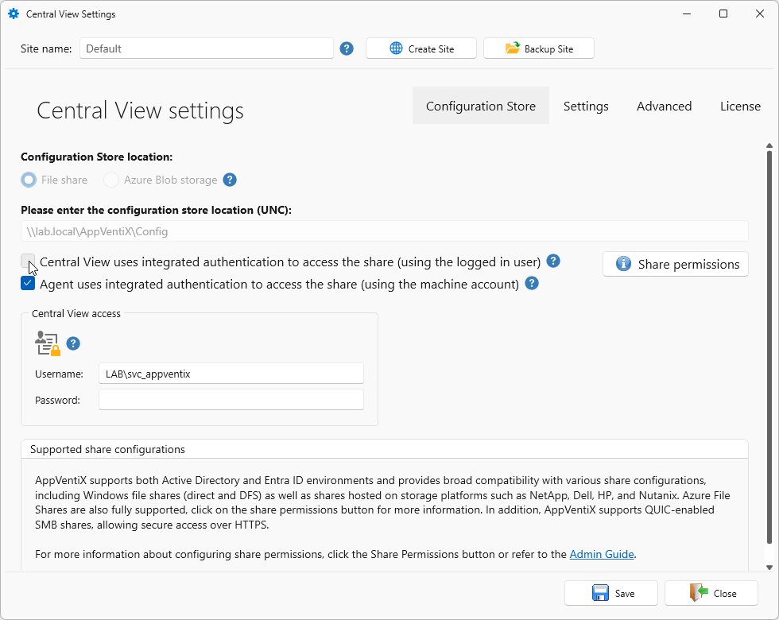
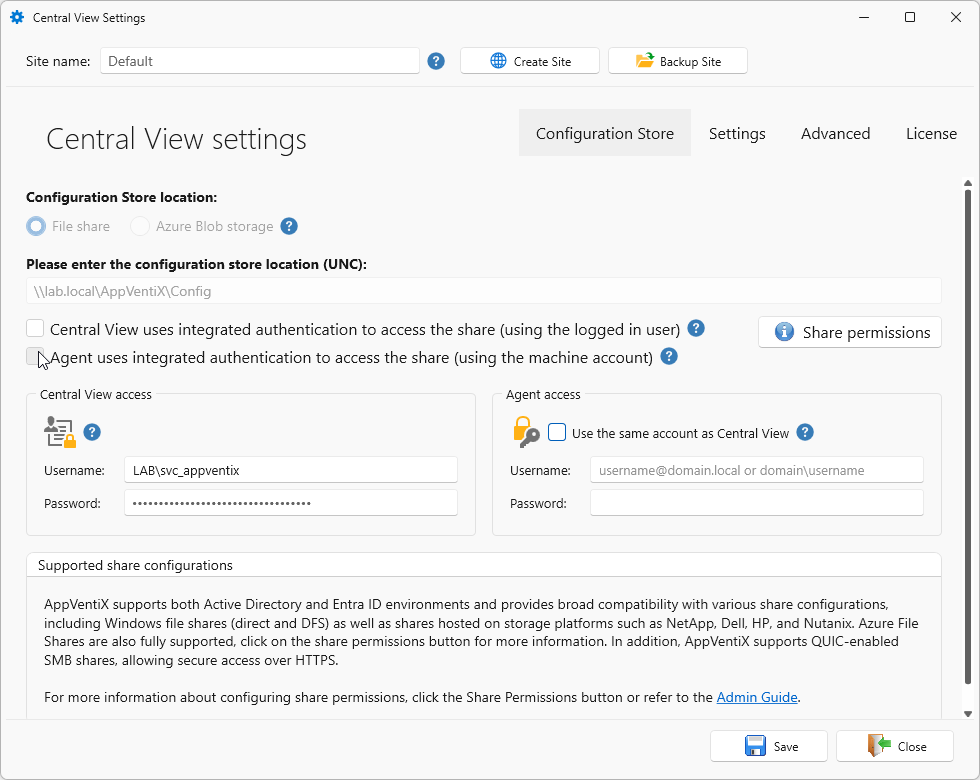
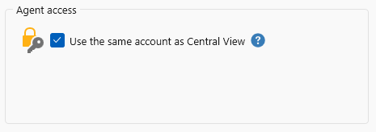
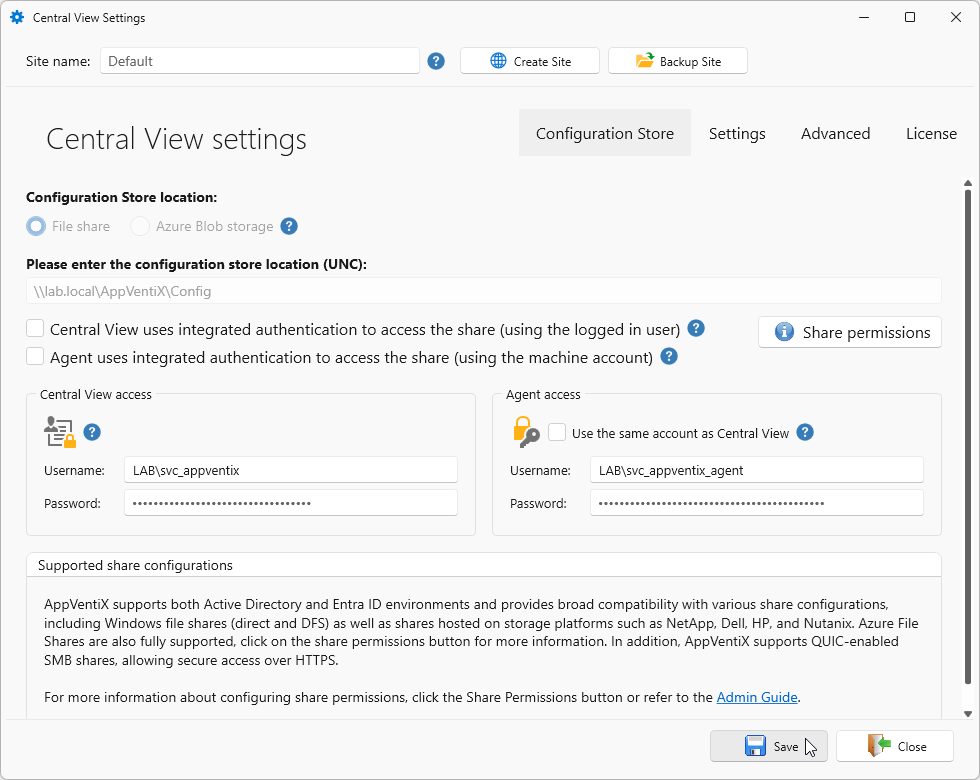
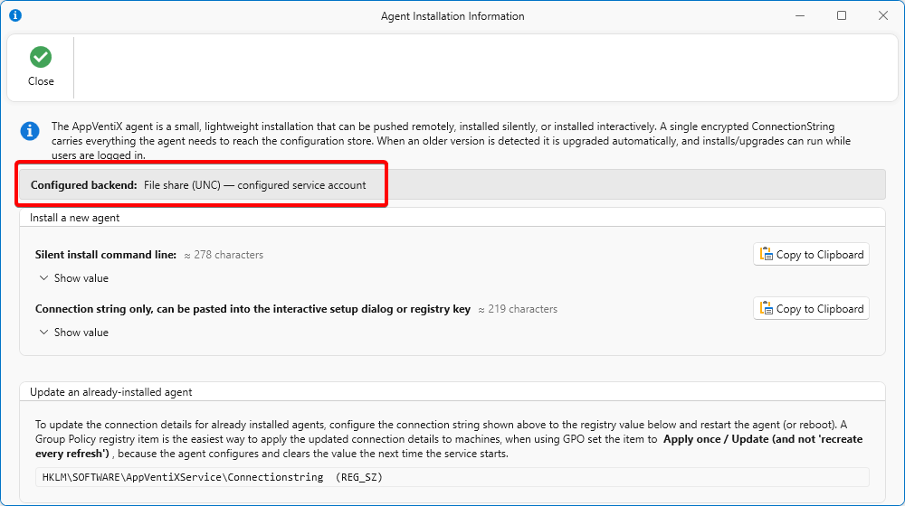

# Service Accounts

By default Central View accesses the configuration and content shares as the logged in user, and the agent accesses them with the computer account. Where that is not possible or not wanted, you can configure a service account for either of them. See [Share Permissions and Share Configuration](../share-permissions/index.md) for the permissions each identity needs on the store.

!!! warning
    A service account changes which identity reaches the share, so file permissions can no longer tell AppVentiX Central View console users apart. Every user of the AppVentiX Central View console reaches the store as the same account. The roles from [Role Based Access Control (RBAC)](../rbac/index.md) still apply inside the console.

## Service account for Central View

When AppVentiX uses the default enabled Active Directory integrated option, AppVentiX Central View uses the identity of the logged in user to access and modify the resources.
You can change this behavior to configure a _service account_. All actions in Central View will at that point be executed under the context of the configured _service account_.

Open **Settings** on the **Configuration & Activity** tab. In the **Central View Settings** uncheck the **Central View uses integrated authentication to access the share (using the logged in user)** option.
Next enter a user account, either `DOMAIN\Serviceaccount` or `serviceaccount@domain.local`, and the password.

## Service account for the agent

By default the agent reads the shares with the computer account. It might be preferred or necessary to configure a _service account_ instead, for example when the machines are not domain joined or when the computer accounts cannot be granted access to the share.

Open **Settings** on the **Configuration & Activity** tab. In the **Central View Settings** uncheck the **Agent uses integrated authentication to access the share (using the machine account)** option. The **Agent access** box becomes available.

When the option **Use the same account as Central View** is checked, the Agent connects to the share with the same account configured for Central View. Uncheck to assign the Agent a separate service account that you can rotate by editing the credentials and clicking Save Settings.

Specify the credentials you want the agent to use to connect to the share.

!!! note
    The account configured here is used to reach the configuration and content shares. When the machines are Active Directory integrated, the agent keeps using the computer account to query AD for user groups. The options that affect that behavior, such as multiple domain support, optimized group retrieval and LDAPS, are described under [Central View Advanced Settings](../central-view-advanced/index.md).

### Update an already-installed agent

Changing the way the agent connects does not require a reinstall. Only the connection string has to be updated on the machines that already run the agent.

Open the **Agent Installation Information** dialog on the **Machines & Inventory** tab. The **Configured backend** line reflects the new configuration, in the example below a file share reached with a configured service account.

Click **Copy to Clipboard** next to **Connection string only** to copy the connection string without the rest of the install command line. The other button on that dialog is for installing a new agent, see [Install AppVentiX Agent](../../quickstart/agent-installation.md). Then write it to the following registry value on each machine where the agent is installed, manually, through Group Policy, or with any other tool you use to configure registry values:

| Setting | Value |
|---------|-------|
| Key | `HKLM\SOFTWARE\AppVentiXService` |
| Name | `Connectionstring` |
| Type | `REG_SZ` (String) |
| Data | The copied connection string, which starts with `v2:` |

Restart the agent service, or reboot the machine, to apply the new connection string.

!!! warning
    The agent applies the value and clears it again the next time the service starts. When you deploy it with a Group Policy registry item, set the item to **Apply once / Update** and not to recreate it on every refresh.

