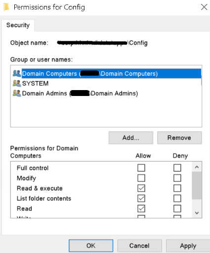
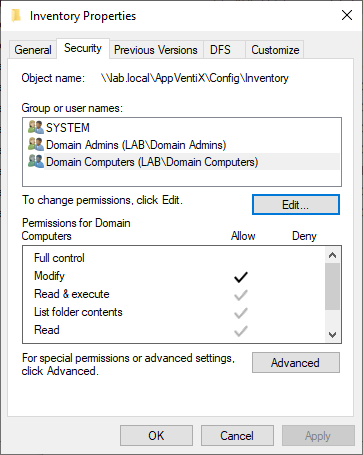
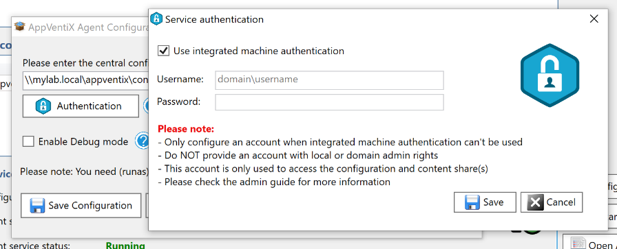
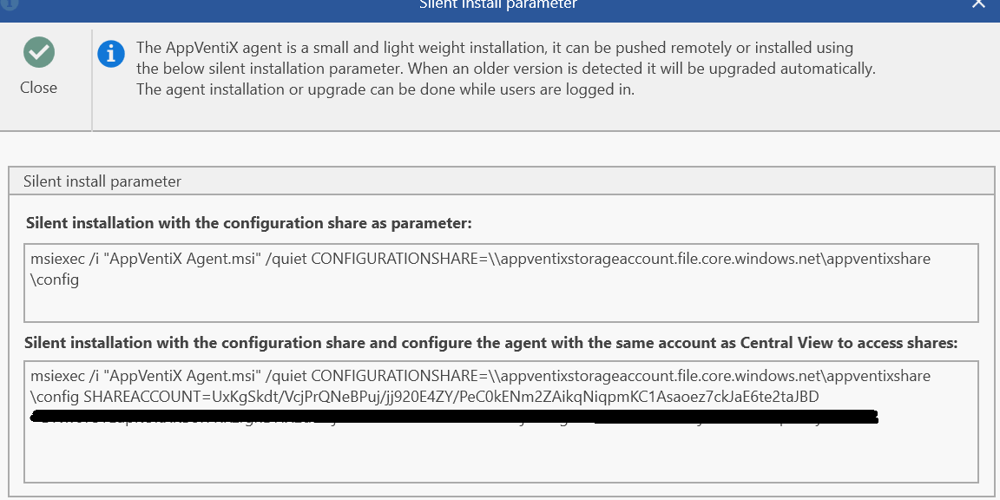
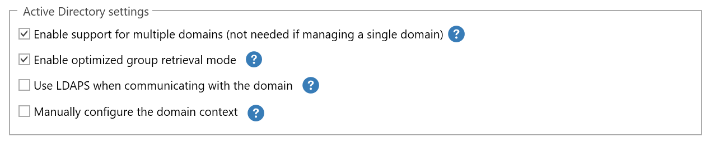

# Share Permissions and Share Configuration

AppVentiX supports Windows file shares (both direct and DFS), Azure file shares (domain integrated or stand-alone), and shares created on storage vendors like Nutanix and NetApp. AppVentiX can be configured to use integrated authentication or a (service) account to access the shares. The permission table is visible in the Central View console (share permission button).

## Required Share Permissions

| Share | AppVentiX Agent | AppVentiX Central View |
|-------|----------------|------------------------|
| Configuration store | Read | Read/Write* |
| Configuration store (inventory folder) | Read/Write | Read/Write |
| content store(s) | Read | Read* |

!!! note
    Central View needs also Write permissions if you want to convert MSIX packages to App Attach or App-V packages to MSIX, or if you want to delete content from the content store directly from the console. For other management activities, only Read permissions are needed. This means you can provide the console to helpdesk/admins to operate the deployment but not change any configurations.

When creating a share in an Active Directory environment, you can use integrated authentication or provide a (service) account. When using integrated authentication, provide the domain computers group Read permissions on the configuration store and Read/Write permissions on the inventory folder inside the configuration store.

**For the configuration store (integrated authentication):**

- Domain computers: Read permissions on configuration store
- Domain computers: Read/Write permissions on inventory folder
- Domain Admins (or group that performs management): Read/Write permissions

Share permissions can be set to Everybody Full Control, so NTFS permissions are used for effective permissions to the files.

When the machines are Active Directory integrated, the AppVentiX agent uses the computer account to query AD to retrieve user groups. By default this works out of the box, but sometimes Active Directory is configured with security-related settings that may interfere. In this case, contact [support@appventix.com](mailto:support@appventix.com) for help with the configuration.

The agent also uses integrated authentication by default, using the machine account to read the shares. You can configure the agent with a user account:

You can also install/update the agent silently to use the same account as configured in the Central View console (click on the **Silent Install** button in the Central View console):

This makes it easy to deploy the solution with minimal effort and get up and running quickly.

