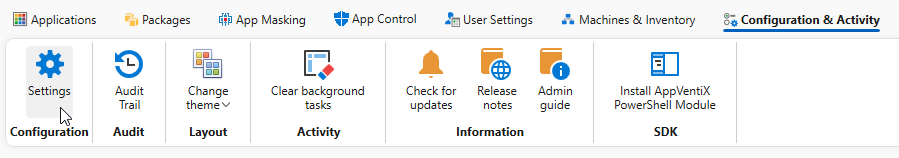
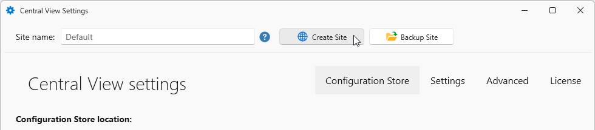
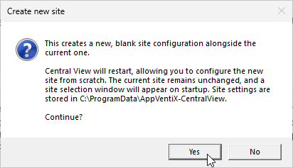
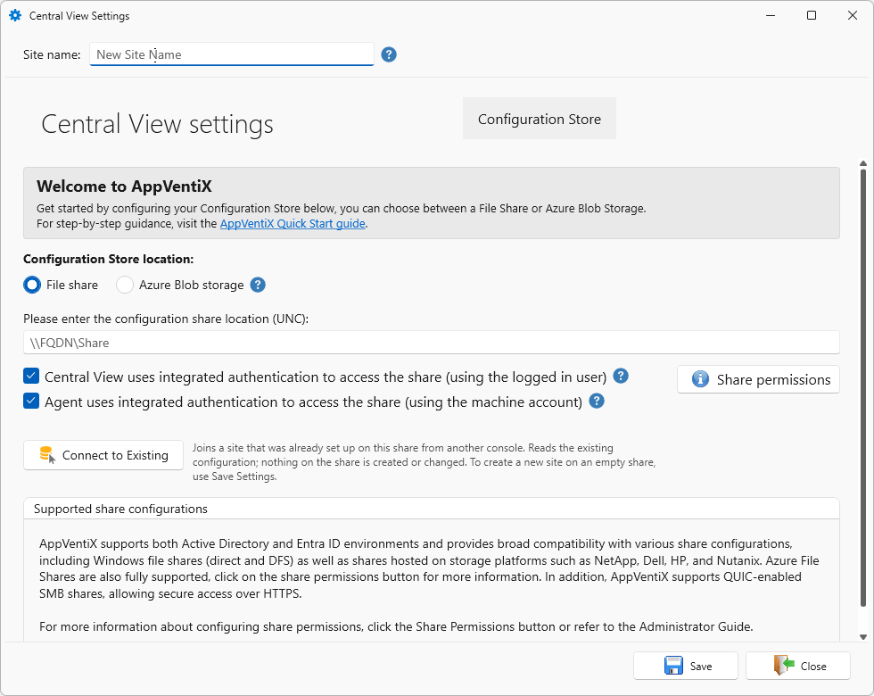
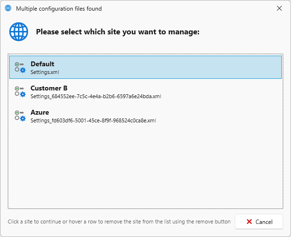

# Sites

A Site is the configuration boundary for AppVentiX Central View: everything Central View manages, such as machine groups, packages, and user settings, is scoped to a single active site. Use multiple sites to keep separate tenants, customers, or environments (for example production versus test) from sharing configuration.

## Site contents

A Site always contains exactly one configuration store and one or more content stores.

-   🏢 **Site A** (SMB)

    ---

    📁 **Configuration store**
    `\\fileserver.domain.local\AppVentiX\Config`

    📁 **Content store**
    `\\fileserver.domain.local\AppVentiX\Content`

-   🏢 **Site B** (SMB)

    ---

    📁 **Configuration store**
    `\\fileserver.domain.local\CustomerX\Config`

    📁 **Content store 1**
    `\\fileserver.domain.local\CustomerX\Content1`

    📁 **Content store 2**
    `\\fileserver.domain.local\CustomerX\Content2`

-   🏢 **Site C** (Azure Blob)

    ---

    📁 **Central View folder**
    Azure Blob container &rarr; `centralview/`

    📁 **Content folder**
    Azure Blob container &rarr; `content/`

    📁 **Inventory folder**
    Azure Blob container &rarr; `inventory/`

    📁 **Machine Groups folder**
    Azure Blob container &rarr; `machinegroups/`

    📁 **Publishing folder**
    Azure Blob container &rarr; `publishing/`

!!! Note
    For more information about the actual layout of the configuration store, [visit the following page](../folder-structure/index.md).

## Create a new Site

To create a new site, open **Settings** on the **Configuration & Activity** toolbar.

In the **Central View Settings** window, click **Create Site**.

Confirm the creation. This adds a new, blank site configuration alongside the current one and leaves the current site unchanged. Central View then restarts, and a site selection window appears on startup since site settings are stored locally at `C:\ProgramData\AppVentiX-CentralView`.

When Central View restarts, the new site loads with no configuration store set yet. Give it a name in the **Site name** field, then choose and configure a configuration store.

Choose the configuration store type that matches your setup:

* [Azure Blob Storage](../azure-blob-storage/index.md) - no Active Directory dependency, accessible outside your network
* [SMB Share](../smb-share/index.md) - standard Windows file share, DFS, or storage vendor share

!!! note
    Configure one of the above configuration stores before continuing.

Once the configuration store is set, click **Save**.

## Central View with multiple sites

When multiple sites are configured, Central View shows a site selection dialog every time it starts, listing all configured sites so you can pick which one to manage. Hovering a row also reveals a remove button to drop a site from the list.

!!! Tip
    Launch multiple instances of Central View to work with more than one site at the same time.