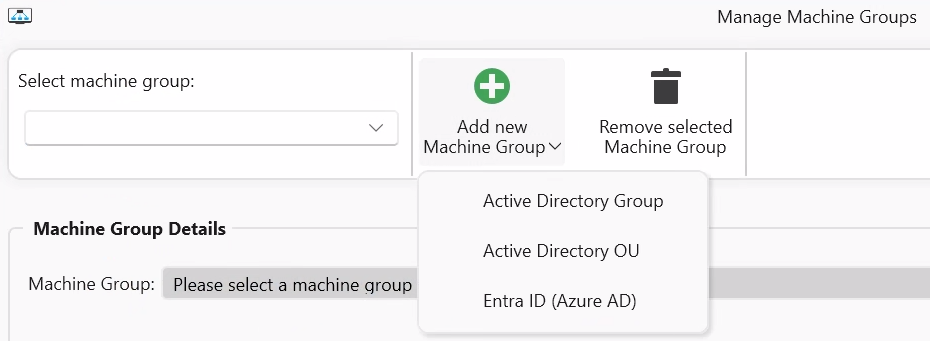
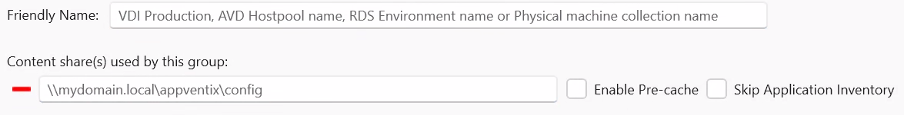
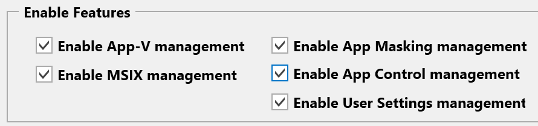

# SMB Share Configuration

The following steps will help you configure an SMB share as the AppVentiX configuration store.

## 1. Create a Configuration Store

Create a new file share or use an existing one. This share will be used to store the central configuration. You can use a normal Windows file share or a DFS share to make the share highly available (for example `\\yourdomain.local\appventix\config`). Also Azure file shares (domain integrated or stand-alone) and shares on storage vendors like Nutanix/NetApp/Dell/HP file shares are supported. AppVentiX also supports QUIC shares, which are shares that can be accessed over port 443 using highly encrypted TLS. You can read more about setting up a [QUIC share](../admin-guide/quic-share.md) or [Azure file share](../admin-guide/azure-file-share.md) in this admin guide.


### Windows file share, Storage vendor file share or Azure file share that is Active Directory integrated

#### Integrated (default) Authentication

With integrated authentication the Central View console will access the share(s) with the currently logged in user.
With integrated authentication the Agent will access the share(s) with the computer account.
File permissions needed for this option (make sure to verify both share and file permissions):

- **User group** performing management in Central View: **Read\Write** permissions on configurations share and content share(s)
- **Domain Computers group** (or group containing the machine accounts): **Read** permissions on configuration store and content share(s)
- **Domain Computers group** (or group containing the machine accounts): **Read\Write** permissions in inventory folder on configuration store

> **Tip**: You can configure another inventory share in the agent settings for the machine group

#### Configured account (service account)

When an account is configured in the Central View console, the account will be used to access the share(s).
When an account is configured in the Agent the account will be used to access the share(s).
Share permissions needed for this option:

- **Configured account** in Central View: **Read\write** permissions on configuration store and content share(s)
- **Configured account** in the Agent: **Read** permissions on configuration store and content share(s)
- **Configured account** in the Agent: **Read\Write** permissions in inventory folder on configuration store

> **Tip**: You can silently install the agent to use the same account.

The silent install parameter can be found in the Central View console (agent ribbon).

#### Use PowerShell to configure permissions

You can use PowerShell to configure the above described permissions. Either specify the necessary Group or (Service)User account.

```PowerShell
$ConfigShareRoot = "\\fileserver.domain.local\config$"

# User group performing management in Central View
$ConfigShareRootRW = "DOMAIN\ManagementGroup" # Or "DOMAIN\SvcAppVentiX"

# Domain Computers group (or group containing the machine accounts)
$ConfigShareRootR = "DOMAIN\Domain Computers" # Or "DOMAIN\SvcAppVentiX"

#Domain Computers group (or group containing the machine accounts)
$ConfigShareInventoryRW = "DOMAIN\Domain Computers" # Or "DOMAIN\SvcAppVentiX"

# Create the Inventory folder if it does not exist
$InventoryPath = "$($ConfigShareRoot)\Inventory"
New-Item -Path $InventoryPath -ItemType Directory -Force

# Get existing ACL from the root
$Acl = Get-Acl -Path $ConfigShareRoot

# Define Access Rules
# Syntax: Identity, Rights, Inheritance, Propagation, Type
$ArManagement = New-Object System.Security.AccessControl.FileSystemAccessRule($ConfigShareRootRW, "Modify", "ContainerInherit, ObjectInherit", "None", "Allow")
$ArComputersRead = New-Object System.Security.AccessControl.FileSystemAccessRule($ConfigShareRootR, "ReadAndExecute", "ContainerInherit, ObjectInherit", "None", "Allow")

# Apply rules to the Root ACL object
$Acl.AddAccessRule($ArManagement)
$Acl.AddAccessRule($ArComputersRead)

# Commit Root Permissions
Set-Acl -Path $ConfigShareRoot -AclObject $Acl

# --- Inventory Specific Permissions ---
$InvAcl = Get-Acl -Path $InventoryPath

# Define Write Access for Domain Computers on Inventory folder
$ArComputersWrite = New-Object System.Security.AccessControl.FileSystemAccessRule($ConfigShareInventoryRW, "Modify", "ContainerInherit, ObjectInherit", "None", "Allow")

$InvAcl.AddAccessRule($ArComputersWrite)

# Commit Inventory Permissions
Set-Acl -Path $InventoryPath -AclObject $InvAcl
```

### Azure file share which is Kerberos integrated, AD integrated or Stand-alone

#### Configured account (service account)

Configure the account as follows:

- From the Azure portal copy the Storage Account name and the access key
- In Central View uncheck the integrated authentication checkbox and provide the following details:
  - **Username**: localhost\<storageaccountname>
  - **Password**: <TheAccessKey>

---

## 2. Create a Content Share

Create a content share (for example `\\yourdomain.local\appventix\content`). This share will be used to store the packages. You can also create a folder on the same share as the configuration store created in Step 1. The share permissions are the same as in Step 1.

For integrated authentication (default), configure the following permissions for the content share:

- **Domain computers group**: Read permissions on the share
- **Central View Admins** (a group with users that performs the management): Read/Write permissions

When using a (service) account, you can use the permissions from the description in Step 1.


---

## 3. Configure the Central View Console

If you have configured the share permission add the path to the Central View settings window and click **Save**.

---

## 4. Create a Machine Group

Now create a Machine Group. You can use machine groups to implement DTAP (test, acceptance, production environment) or separate your deployment for hybrid use cases (laptops/virtual desktops, etc.). A machine group is just a reference to an AD OU, AD Group, or Azure AD tenant. There is no need to update these groups manually.

Select the option where the machines you want to manage are located.



In this example we will create a machine group based on OU. Select an OU and click **Ok**.


Provide an easy-to-remember friendly name like "RDS Production" or name it the same as the Citrix Delivery group, AVD Session Host pool, or group of physical machines. The content share is automatically pre-populated with the same share as the configuration store. The content share is where the packages/containers are stored. Check if the content share is accessible and configure multiple content shares if you wish.



When the **pre-cache** checkbox is enabled, the agent will preload (App-V) / pre-stage (MSIX) packages in the cache when the machine boots or when the refresh cycle is triggered. If you disable pre-cache, packages will be added on the fly whenever a user needs the package, making it a real dynamic delivery mechanism. You can use a combination of both approaches: pre-cache certain packages and dynamically deliver others by creating two content shares, one with pre-cache enabled and another with pre-cache disabled. The **Skip application inventory** checkbox will hide applications from this content share in the Central View applications overview window.



After configuring the content share(s), click **Configure Agent Settings**. Enable the feature(s) you want to use and click **Done**. In this quick start guide we will use the default settings for each feature. Please check the [Agent Settings](../admin-guide/agent-settings.md) chapter for an explanation of all agent settings.

Most of the time the default agent settings are a good starting point. For MSIX it is only important to choose the correct profile setting: for profile containers like FSLogix keep the default setting; if your machine group is for a fat client/laptop environment, select **local profile**.

Click **Save Machine Group** and close the Manage Machine Groups window.

The first-time inventory of the content share is now executed. If no content is found, you are asked if you want to import some packages to get started.

You can now click through the console and check if you can see the content and if the machines are visible when you select the machine group in the Manage Machines window.

---

