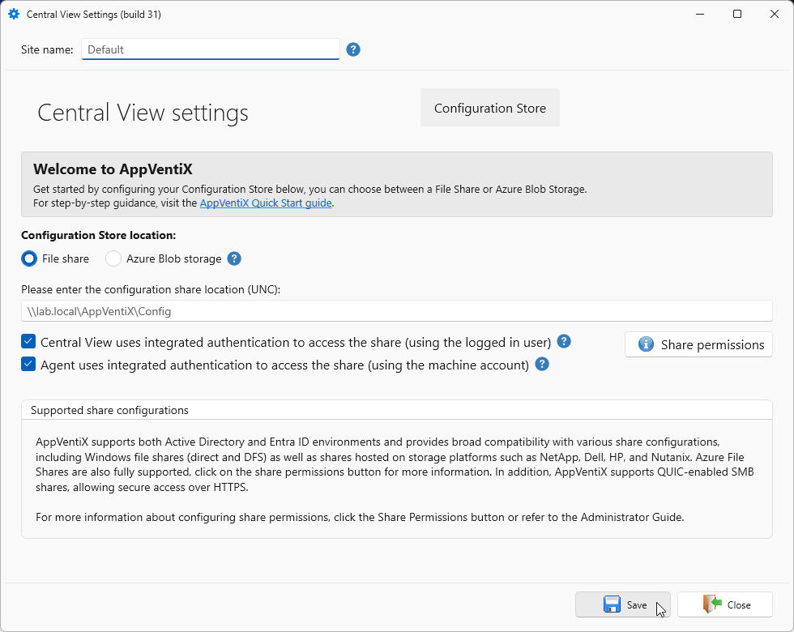

# SMB Share Configuration

The following steps will help you configure an SMB share as the AppVentiX configuration store.

## Create a Configuration Store

Create a new file share or use an existing one. This share will be used to store the central configuration. You can use a normal Windows file share or a DFS share to make the share highly available (for example `\\yourdomain.local\appventix\config`). Also Azure file shares (domain integrated or stand-alone) and shares on storage vendors like Nutanix/NetApp/Dell/HP file shares are supported. AppVentiX also supports QUIC shares, which are shares that can be accessed over port 443 using highly encrypted TLS. You can read more about setting up a [QUIC share](../quic-share/index.md) or [Azure file share](../azure-file-share/index.md) in this admin guide.

!!! note
    If you configure a (new) site with AppVentiX version 5.2.x or newer, you will get a different layout. More information can be found [here](./../folder-structure/index.md).

### Windows file share, Storage vendor file share or Azure file share that is Active Directory integrated

#### Integrated (default) Authentication

With integrated authentication the Central View console will access the share(s) with the currently logged in user.
With integrated authentication the Agent will access the share(s) with the computer account.
File permissions needed for this option (make sure to verify both share and file permissions):

- **User group** performing management in Central View: **Read\Write** permissions on configurations share and content store(s)
- **Domain Computers group** (or group containing the machine accounts): **Read** permissions on configuration store and content store(s)
- **Domain Computers group** (or group containing the machine accounts): **Read\Write** permissions in inventory folder on configuration store

!!! tip
    You can configure another inventory share in the agent settings for the machine group

#### Configured account (service account)

When an account is configured in the Central View console, the account will be used to access the share(s).
When an account is configured in the Agent the account will be used to access the share(s).
Share permissions needed for this option:

- **Configured account** in Central View: **Read\write** permissions on configuration store and content store(s)
- **Configured account** in the Agent: **Read** permissions on configuration store and content store(s)
- **Configured account** in the Agent: **Read\Write** permissions in inventory folder on configuration store

!!! tip
    You can silently install the agent to use the same account.

The silent install parameter can be found in the Central View console (agent ribbon).

#### Use PowerShell to configure permissions

You can use PowerShell to configure the above described permissions. Either specify the necessary Group or (Service)User account.

```PowerShell
$ConfigShareRoot = "\\fileserver.domain.local\config$"

# User group performing management in Central View
$ConfigShareRootRW = "DOMAIN\ManagementGroup" # Or "DOMAIN\SvcAppVentiX"

# Domain Computers group (or group containing the machine accounts)
$ConfigShareRootR = "DOMAIN\Domain Computers" # Or "DOMAIN\SvcAppVentiX"

#Domain Computers group (or group containing the machine accounts)
$ConfigShareInventoryRW = "DOMAIN\Domain Computers" # Or "DOMAIN\SvcAppVentiX"

# Create the Inventory folder if it does not exist
$InventoryPath = "$($ConfigShareRoot)\Inventory"
New-Item -Path $InventoryPath -ItemType Directory -Force

# Get existing ACL from the root
$Acl = Get-Acl -Path $ConfigShareRoot

# Define Access Rules
# Syntax: Identity, Rights, Inheritance, Propagation, Type
$ArManagement = New-Object System.Security.AccessControl.FileSystemAccessRule($ConfigShareRootRW, "Modify", "ContainerInherit, ObjectInherit", "None", "Allow")
$ArComputersRead = New-Object System.Security.AccessControl.FileSystemAccessRule($ConfigShareRootR, "ReadAndExecute", "ContainerInherit, ObjectInherit", "None", "Allow")

# Apply rules to the Root ACL object
$Acl.AddAccessRule($ArManagement)
$Acl.AddAccessRule($ArComputersRead)

# Commit Root Permissions
Set-Acl -Path $ConfigShareRoot -AclObject $Acl

# --- Inventory Specific Permissions ---
$InvAcl = Get-Acl -Path $InventoryPath

# Define Write Access for Domain Computers on Inventory folder
$ArComputersWrite = New-Object System.Security.AccessControl.FileSystemAccessRule($ConfigShareInventoryRW, "Modify", "ContainerInherit, ObjectInherit", "None", "Allow")

$InvAcl.AddAccessRule($ArComputersWrite)

# Commit Inventory Permissions
Set-Acl -Path $InventoryPath -AclObject $InvAcl
```

### Azure file share which is Kerberos integrated, AD integrated or Stand-alone

#### Configured account (service account)

Configure the account as follows:

- From the Azure portal copy the Storage Account name and the access key
- In Central View uncheck the integrated authentication checkbox and provide the following details:
  - **Username**: localhost\<storageaccountname>
  - **Password**: <TheAccessKey>

---

## Create a content store

Create a content store (for example `\\yourdomain.local\appventix\content`). This share will be used to store the packages. You can also create a folder on the same share as the configuration store created in Step 1. The share permissions are the same as in Step 1.

For integrated authentication (default), configure the following permissions for the content store:

- **Domain computers group**: Read permissions on the share
- **Central View Admins** (a group with users that performs the management): Read/Write permissions

When using a (service) account, you can use the permissions from the description in Step 1.




