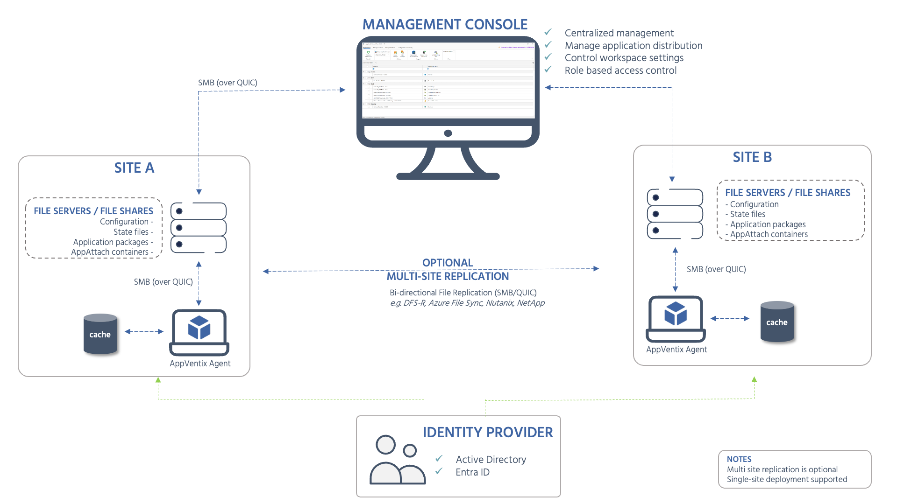
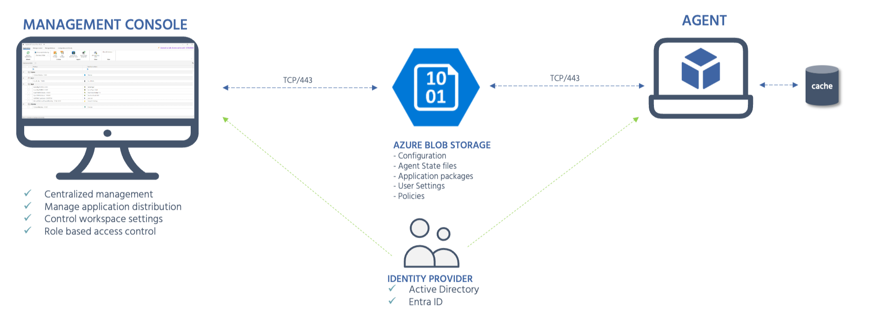

# Technical Architecture

AppVentiX follows a store-based architecture with no SQL back-end. A central Management Console (Central View) connects to a configuration store and one or more content stores that hold the configuration and application packages (App-V, MSIX and App Attach). A configuration store is backed by either an SMB file share or Azure Blob storage, and hybrid environments are supported through mixed configuration store combinations. Agents running on endpoint machines read from those stores over SMB (or QUIC on port 443) and apply the configuration locally. Authentication and targeting rely on Active Directory, Entra ID or hybrid.

The diagrams below show typical multi-site deployments. A single-site deployment is equally supported - the multi-site replication component is optional.

SMB file share deployment:

{target="_blank"}

Azure Blob storage deployment:

{target="_blank"}

---

## Key components

| Component                             | Role                                                                                                 |
| ------------------------------------- | ---------------------------------------------------------------------------------------------------- |
| **Management Console (Central View)** | Centralized management UI for application distribution, workspace settings, and role-based access control. Connects directly to the store - no database required. |
| **Configuration and content stores**  | Hold the configuration and application packages (App-V, MSIX and App Attach). A configuration store is backed by either an SMB file share (direct or DFS, Azure File Shares, Nutanix, NetApp, or QUIC shares) or Azure Blob storage. |
| **AppVentiX Agent**                   | Lightweight service running on endpoint machines (physical or virtual). Reads configuration from the store and applies packages and settings locally. |
| **Identity Provider**                 | Active Directory or Entra ID is used for machine group targeting and access control.                 |
| **Multi-site replication (optional)** | Store content can be replicated across sites using DFS-R, Azure File Sync, or third-party solutions. |