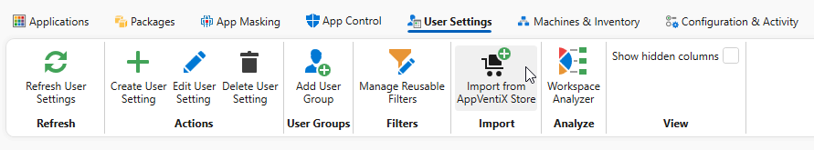
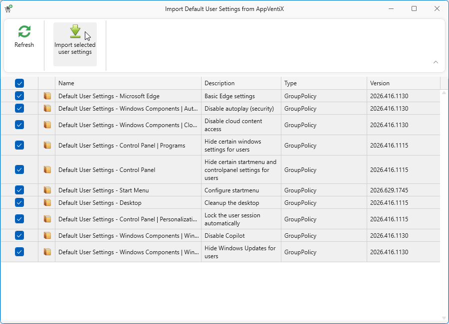

# Default User settings

AppVentiX offers a set of ready-made User Settings, built and maintained by the AppVentiX team, that you can import straight into your environment. They cover the workspace fine-tuning most deployments apply anyway: hiding Start menu and Control Panel items, cleaning up the desktop, disabling Copilot and cloud content, and locking the session automatically. Importing them saves building each policy by hand and gives you a working baseline for a single session or multi-session environment.

Every template is a User Setting of the Group Policy type. Once imported it becomes a normal item in your **Available User Settings** list, so you can inspect it, adjust it, scope it with [filters](../user-settings-filters/index.md) and assign it to user groups exactly like a setting you created yourself. Nothing reaches a user until you assign it.

## Importing the default settings

Open the **User Settings** tab and click **Import from AppVentiX Store** in the **Import** group.

The **Import Default User Settings from AppVentiX** window lists what is available, with a description, the type and a version per template. Select the templates you want and click **Import selected user settings**.

## What is available

| Template | What it does |
|----------|--------------|
| Microsoft Edge | Basic Edge settings |
| Windows Components, Autoplay | Disables autoplay |
| Windows Components, Cloud Content | Disables cloud content access |
| Windows Components, Windows Copilot | Disables Copilot |
| Windows Components, Windows Update | Hides Windows Update from users |
| Control Panel | Hides certain Start menu and Control Panel settings |
| Control Panel, Programs | Hides certain Windows settings |
| Control Panel, Personalization | Locks the user session automatically |
| Start Menu | Configures the Start menu |
| Desktop | Cleans up the desktop |

The templates are updated regularly and new ones are added over time. Click **Refresh** in the import window to pick up the current set. The **Version** column shows which revision a template is at, so you can tell it apart from one you imported earlier.

## Before you assign them

- Most templates are lockdowns. Check what a template changes before assigning it, in particular the Control Panel and Start Menu ones, which remove entry points users may expect to find.
- Treat them as a starting point rather than a finished policy. After importing you own the copy, so adjust it to your own requirements.
- Assign to a test user group first and check the result with the [Workspace Analyzer](../workspace-analyzer/index.md).
