# User Settings Reference

The User Settings module supports the following setting types:

* [Drive Mapping](#drive-mapping)
* [Environment Variables](#environment-variables)
* [External Tasks](#external-tasks)
* [File Type Association](#file-type-association)
* [Files and Folders](#files-and-folders)
* [Group Policy](#group-policy)
* [Printer Mapping](#printer-mapping)
* [Registry Settings](#registry-settings)
* [Shortcuts](#shortcuts)

See also [Assignment](#assignment) and [Folders](#folders).

Navigate to the **User Settings** tab and click **Create User Setting**.

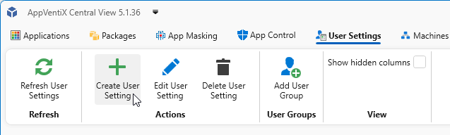

The **Create New User Setting** window will open. Select the setting type you want to configure.

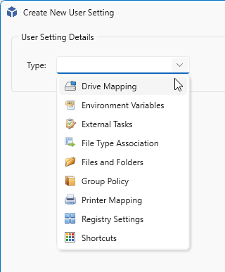

All setting types share the following common fields:

* **Name** - The name of the User Setting. This is a mandatory field.
* **Description** - An optional description for additional context.
* **Execution Order** - Controls the order in which settings are applied.

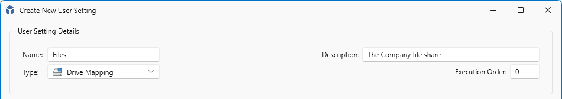

All setting types (except **File Type Association**) include a **Filters** tab. Here you can configure which Machine Groups a setting applies to. By default **All Machine Groups** is selected, which you can change as needed.

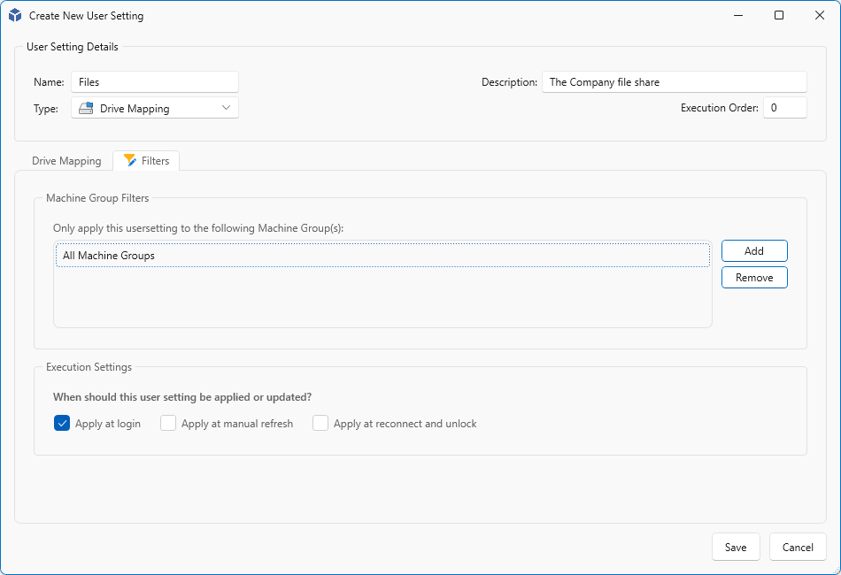

## Drive Mapping

Drive Mapping lets you map network shares to a drive letter, or control what happens with a specific drive letter.

Drive Mapping specific settings:

* **Drive Letter** - The drive letter you want to configure.
* **Network Path** - Path to the network share to bind to the drive letter.
* **Label** - An optional label to assign to the drive.
* Options:
    - **Do not execute drive mapping** - Use this if you only want to set a label for a drive letter without mapping a share. Select the drive letter, fill in the label, and save.
    - **Hide drive** - Hides the specified drive letter. For example, to hide the D: drive, select "D:", check this option, and save.

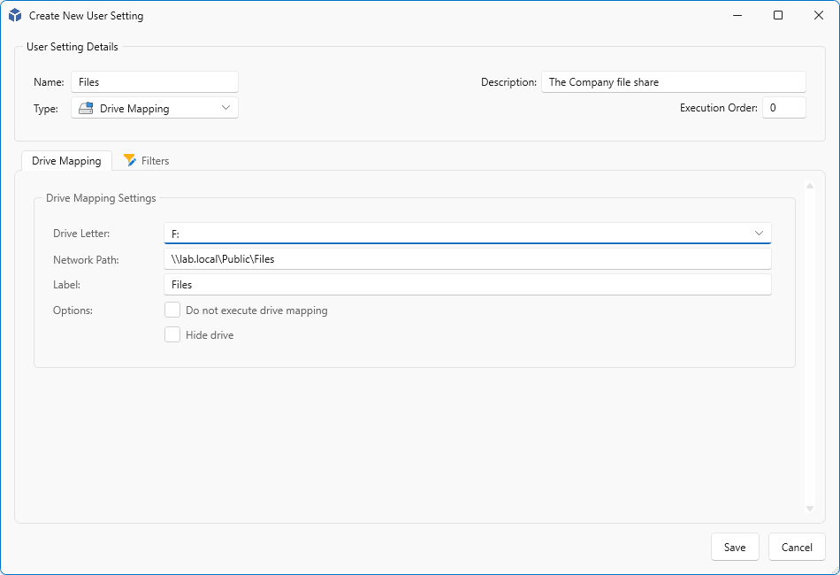

When done, click **Save**.

If not all Machine Groups have User Settings enabled yet, you may see a warning. Click **Yes** to continue. You can enable User Settings on other Machine Groups later when you are ready to promote settings to your production environment.

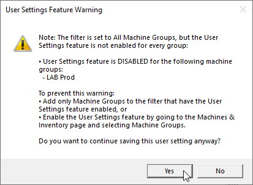

Click **Ok** on the Success popup message to continue.

## Environment Variables

Environment Variables lets you create new user environment variables, replace existing ones, or append data to existing variables.

Environment Variables specific settings:

* **Variable Name** - The name of the environment variable.
* **Value** - The value to assign to the variable.
* **Append to existing** - When enabled, the value is appended to an existing variable rather than replacing it. Useful for adding entries to `%PATH%`, for example.

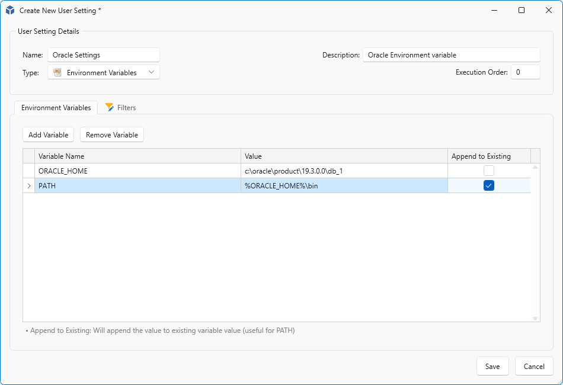

## External Tasks

External Tasks lets you execute applications and scripts, for example to launch an intranet site or run a hidden script at the user's logon.

Four task types are available:

* **Execute process** - Launch an executable. By default pre-filled with the Microsoft Edge path, which you can change as needed.
* **Execute PowerShell Script File** - Pre-filled to run a PowerShell script file.
* **Execute CMD Script File** - Pre-filled to run a `.cmd` or `.bat` file.
* **Execute Inline Script** - Add scripts directly in AppVentiX, no file share required.

Use **Remove Task** to remove a selected task from the list. Check **Run Once** to execute the setting only once per user.

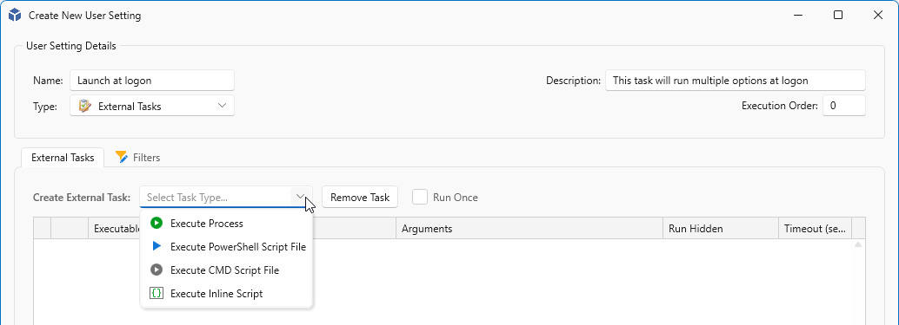

> **NOTE:** You do not have to wrap the path in double quotes, just enter the path and executable as is.

> **NOTE:** To reset **Run Once** and allow the task to run again, duplicate the User Setting and delete the original.

Each entry can be edited after it is added. For example, to use **pwsh.exe** instead of **powershell.exe**, set the executable to:

```
C:\Program Files\PowerShell\7\pwsh.exe
```

If the `-File` parameter does not work, for example when AppLocker is in use or you need to pass parameters, use `-Command` instead:

```
-NonInteractive -Command "& '\\fileserver.domain.local\share$\Scripts\Start-ThisScript.ps1' -Param1 Value1 -Param2 Value2 -EnableLogging"
```

To run the script or executable hidden, check the **Run Hidden** column. Use the **Timeout** field to set the maximum allowed run time in seconds. If the process is still running when the timeout expires, it will be terminated. Make sure the timeout is set to at least the expected run time of your script.

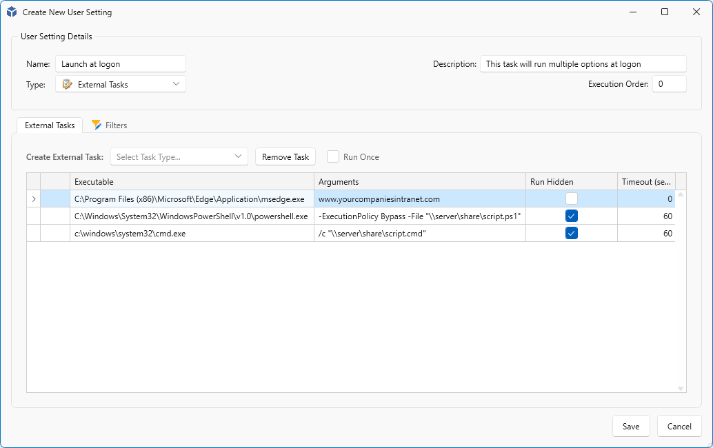

> **NOTE:** Scripts within the same User Setting are executed sequentially, from top to bottom. User Settings with the same Execution Order number are executed simultaneously.

With the fourth type **Execute Inline Script**, you can add scripts directly in AppVentiX without needing a file share.

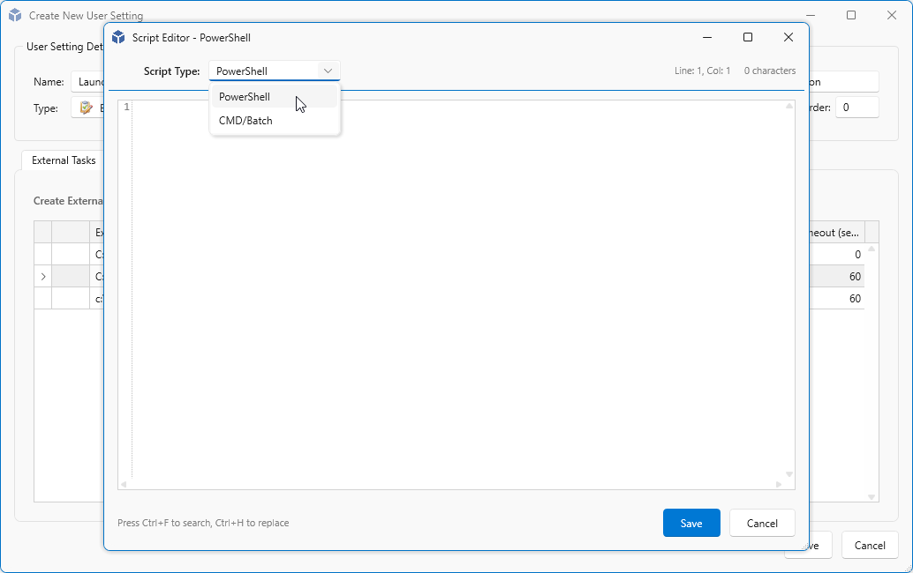

## File Type Association

File Type Association lets you configure which application opens a specific file extension.

This setting type works differently from the others. File Type Associations are packaged as an MSIX package. Click **Create Package** to start.

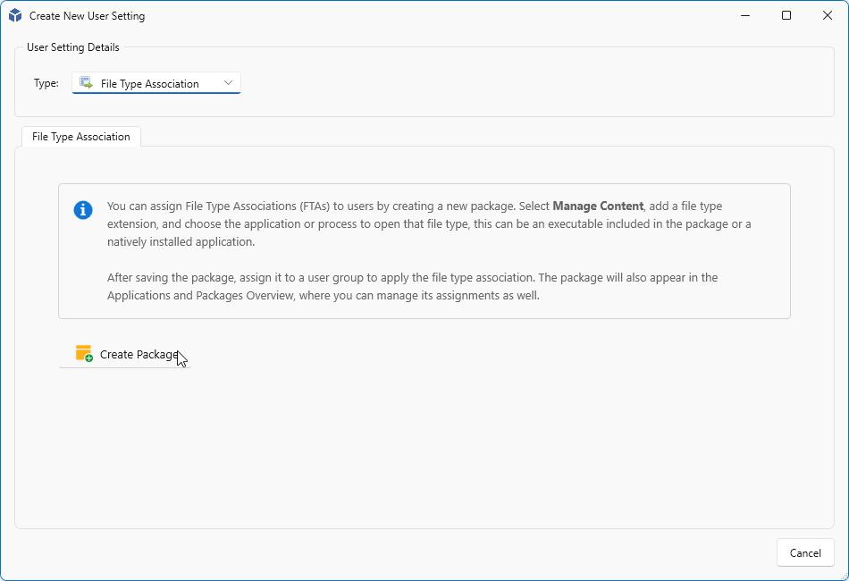

If you have multiple content stores configured, select the location where the package should be created and click **Continue**.


Enter a name for the package in the **Package name** field. Make sure the name does not contain spaces. Optionally change the version at **Package version**. Click on the **Create new shortcut** menu item and choose **Executable**.

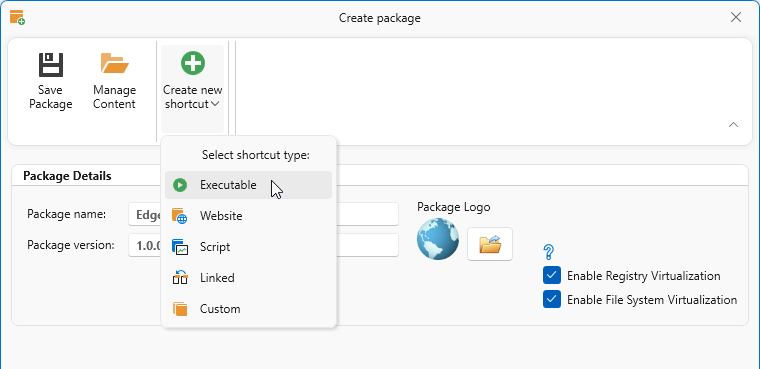

Give the application (shortcut) a name at **Shortcut Name** and select **Hide from startmenu** if you don't want to show this shortcut in the Startmenu.
Select the **Executable Location**, provide a **Working Directory** if you need to change the default. And optionally add **Arguments**.
Click **Save Shortcut** to save the shortcut.

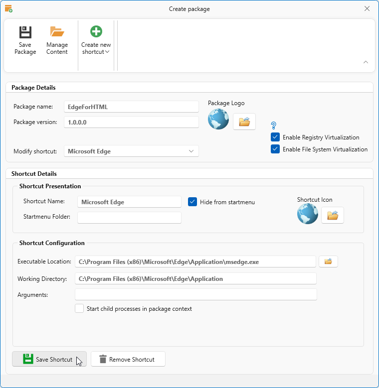

Click the **Manage Content** button. A new column will appear where you can click the **File Associations** button.

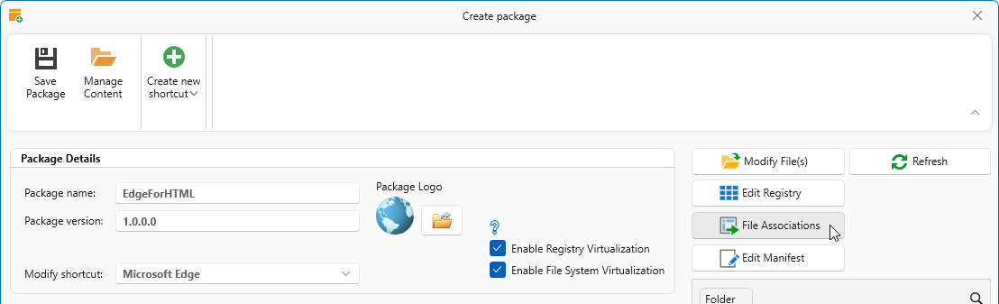

Select the application in the left column and click **Add FTA** under **File Type Associations**.

Provide an **Association Name** (No spaces allowed only the following characters _, -,  a-z,  A-Z or 0-9) and leave the **Executable** on the default value of **"PsfLauncher64.exe"**. Add the file type associations you need and finally click **Save FTA**. When finished, click **Close**.

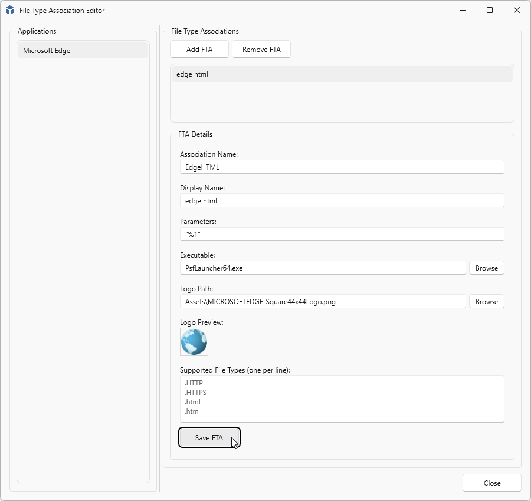

When you have added your FTA details, click the **Save Package** button in the toolbar.

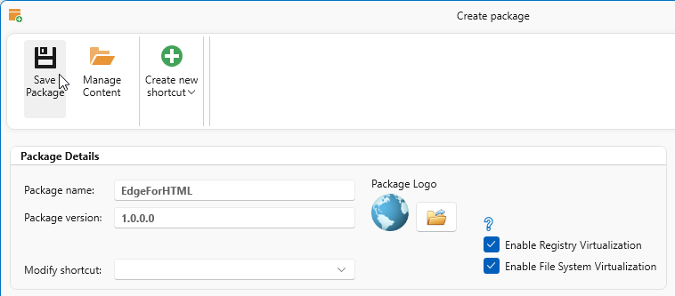

All MSIX packages must be signed. Select the code signing certificate to use. If you only have one, it will already be selected. When finished, click **Continue**.


Finally, choose one of two options:

* **Publish Now** - Create a publishing rule to publish the package directly to your users.
* **Close** - Save the package without publishing, to publish it later.

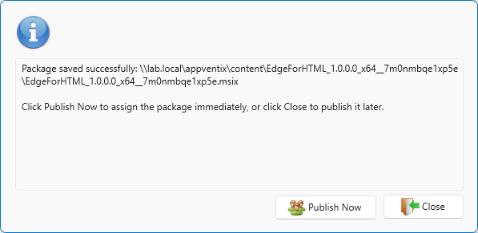

## Files and Folders

Files and Folders lets you copy or delete one or more files and folders.

You can add one or more actions, and for each action choose either **Copy** or **Delete**. As a best practice, keep Copy and Delete actions in separate User Settings. The **Run Once** option is also available here.

For Copy actions, specify a **Source Path or File** and a **Destination Path or File**. You can choose to always overwrite the destination, or only when the source file is newer.

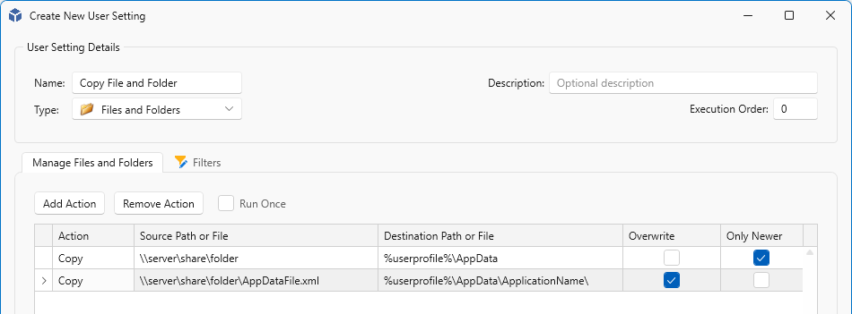

When **Delete** is selected, only a single field is shown to enter the path or file to delete.

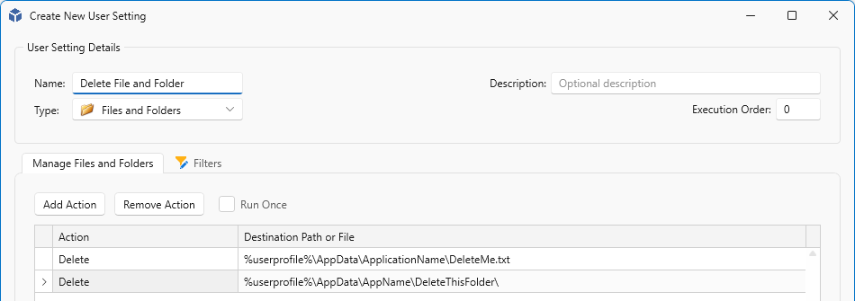

## Group Policy

Group Policy lets you apply Group Policy settings to your users and assign policy sets to all users or to specific groups.

To get started, click **Browse** and select an ADMX file. Make sure the corresponding ADML file is in the same folder or in a language subfolder. The selected ADMX file will be uploaded to the content store. For subsequent policies from the same ADMX file, you can select it from the existing ADMX list.

> **TIP:** You can find the Windows ADMX/ADML files in the following locations:
>
> * `C:\Windows\PolicyDefinitions`
> * `\\<domain.local>\SYSVOL\<domain.local>\Policies\PolicyDefinitions`

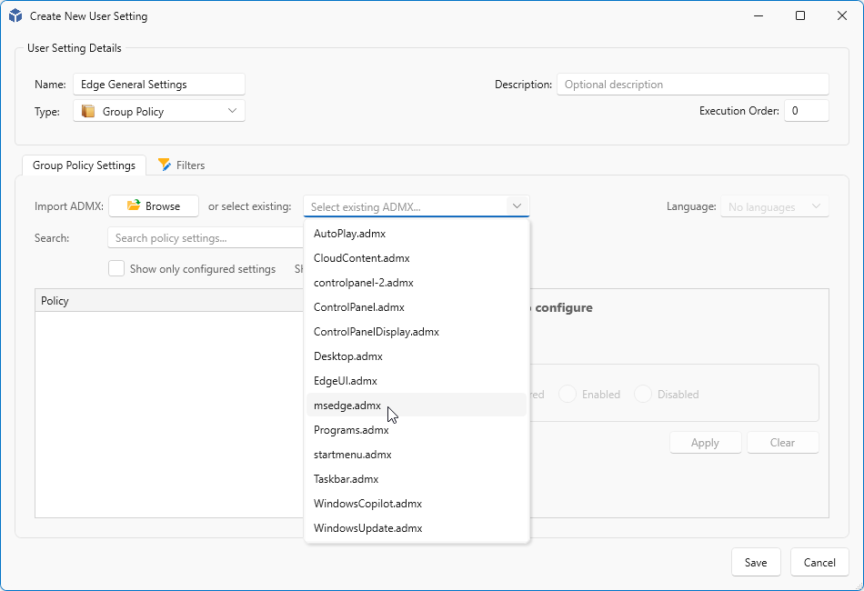

> **NOTE:** Only settings from one ADMX file can be configured per Group Policy User Setting.

Once an ADMX file is selected, use the search bar to filter settings by keyword. Check **Show only configured settings** to display only settings that have been enabled or disabled. Use the **Show** dropdown to switch between User, Machine, or Both policy scopes.

When changing a policy setting, click **Apply** to apply the change, then click **Save** when you are done.

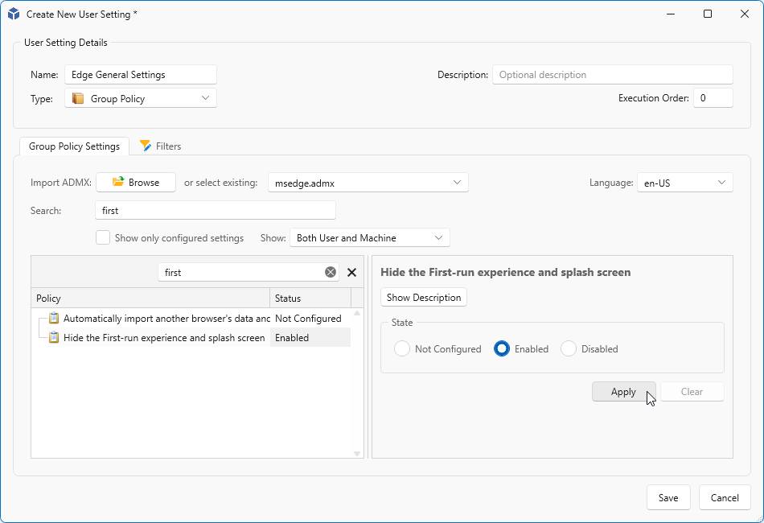

> **NOTE:** Machine level policies are not applied before the user logs in. They are applied during login, in the user's context.

## Printer Mapping

Printer Mapping lets you assign printers to your users.

Enter the print server FQDN and printer share in the **Printer Path** field. If your account has access to the printer share, the printer details will be automatically fetched and filled in the **Printer Details** field.

To set the printer as the default for your users, check the **Set as default** checkbox.

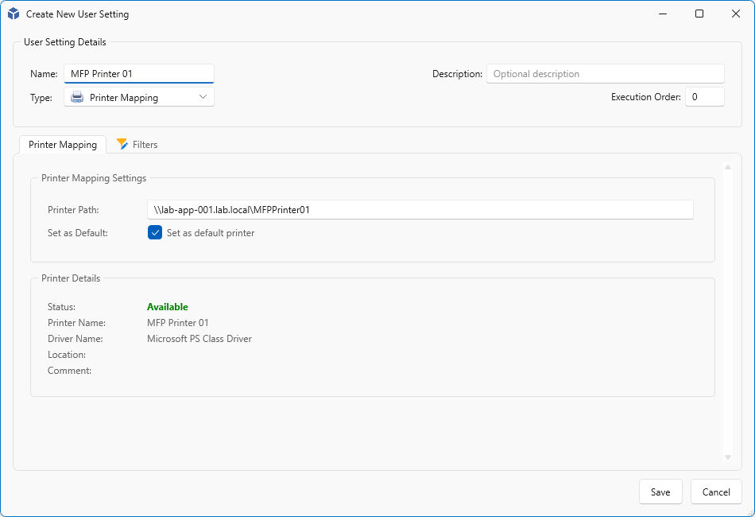

## Registry Settings

Registry Settings lets you create, edit, or delete registry keys and values. You can add entries manually, import a `.reg` file, or start from a set of default values.

* Click **Add Entry** to add a new entry.
* Click **Remove Entry** to remove a selected entry.
* Click **Import .reg File** to import from a `.reg` file.

For each entry you have the following options:

* **Root Key** - _HKEY_CURRENT_USER_ or _HKEY_LOCAL_MACHINE_
* **Registry Key** - The path of the registry location.
* **Value Name** - The name of the registry value.
* **Value Data** - The data to store in the registry value.
* **Type** - _REG_SZ_, _REG_EXPAND_SZ_, _REG_DWORD_, _REG_QWORD_, _REG_BINARY_, or _REG_MULTI_SZ_
* **Action** - _Set_ to create or replace a value, _Remove_ to delete it.

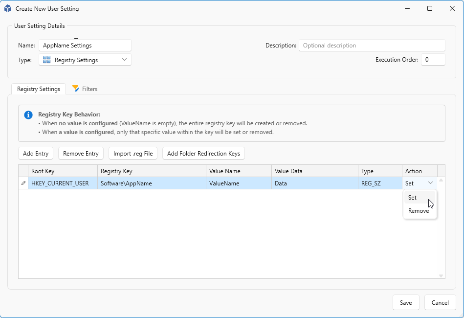

> **NOTE:** If **Value Name** is left empty, the entire registry key will be created or removed.

## Shortcuts

Shortcuts supports two options for creating shortcuts for your users:

* **Native** - Standard shortcuts added to the Start menu or desktop.
* **MSIX** - Shortcuts packaged as an MSIX package, which can then be published to your users.

### Native Shortcuts

Native Shortcuts lets you add or remove shortcuts in the Start menu or on the desktop. Click **Add Shortcut** to add a new entry. Select an entry and click **Remove Shortcut** to remove it.

For each entry you have the following options:

* **Click to change** - Change the icon for the selected entry.
* **Start menu shortcut name** - The name of your shortcut. Prefix with a folder name to place the shortcut in a subfolder.
* **Executable or File** - The target of your shortcut.
* **Argument(s)** - Optional arguments for the executable.
* **Desktop** - Check this to also add the shortcut to the desktop.
* **Working Dir** - Optional working directory for the shortcut.

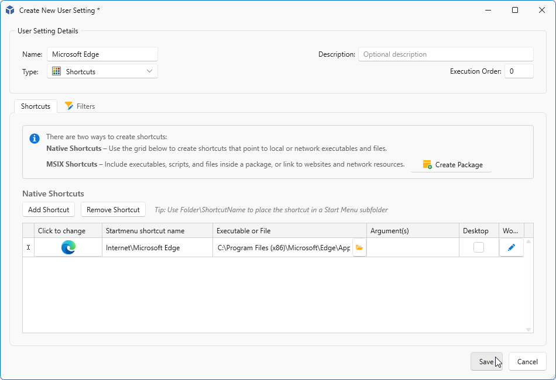

### MSIX Shortcuts

To create an MSIX shortcut, click **Create Package**. The current window will close and a new window will open where you can select the content store where the package will be created.

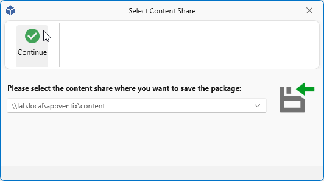

In the next screen, provide a name for the package. Optionally uncheck **Enable Registry Virtualization** and **Enable File System Virtualization**. Click **Create new Shortcut** and select your shortcut target. In this example we are using an **Executable**.

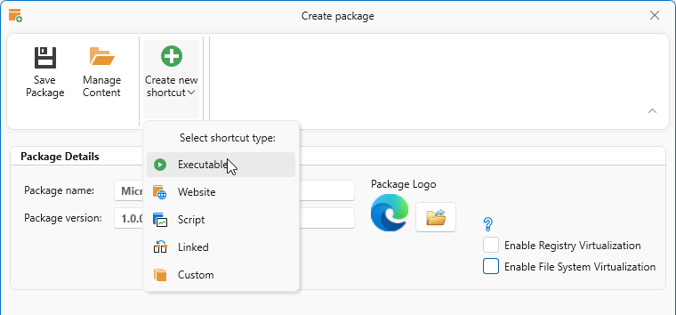

Fill in the shortcut details. Enter a **Shortcut Name** and optionally a Start menu folder name. Select the executable by browsing or entering the path in the **Executable Location** field. Optionally add arguments. When finished, click **Save Shortcut**.

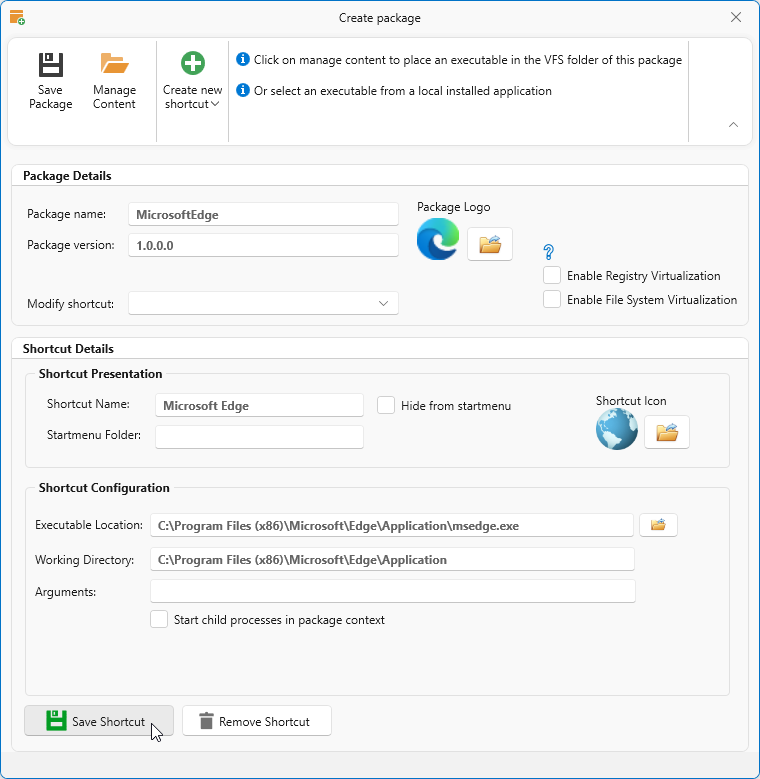

> **NOTE:** The package name cannot contain spaces.

You can add more shortcuts or other shortcut types as needed. When finished, click **Save Package**.

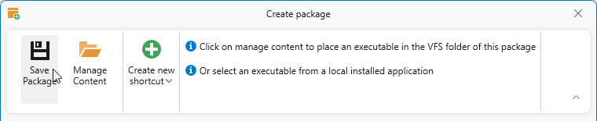

All MSIX packages must be signed. Select the code signing certificate to use. If you only have one, it will already be selected. When finished, click **Continue**.

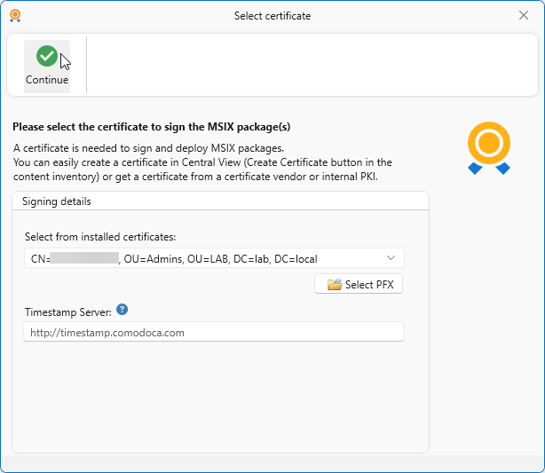

Finally, choose one of two options:

* **Publish Now** - Create a publishing rule to publish the package directly to your users.
* **Close** - Save the package without publishing, to publish it later.

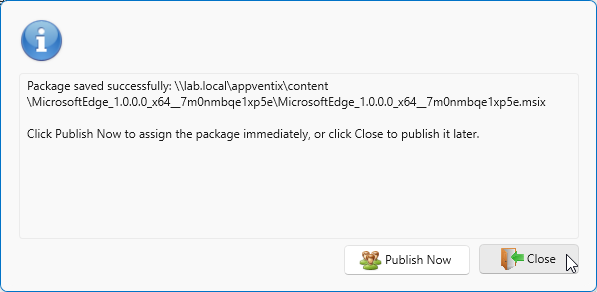

## Assignment

Once your User Settings are created, you can assign them to your users. Settings can be assigned to _Everyone_, a _group_, or an individual _user_. **Everyone** is added by default and cannot be removed. To add a group or user, click **Add User or Group** in the toolbar. The selected object will appear in the **User Group Assignments** pane.

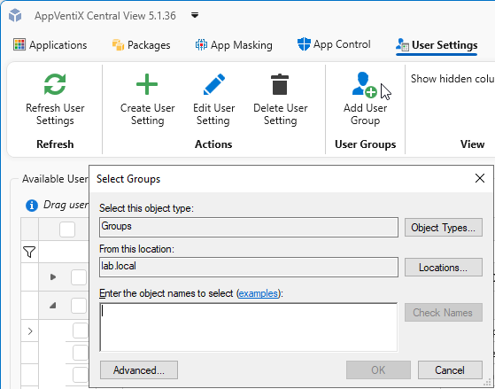

Select one or more items and drag them to the group you want to assign them to.

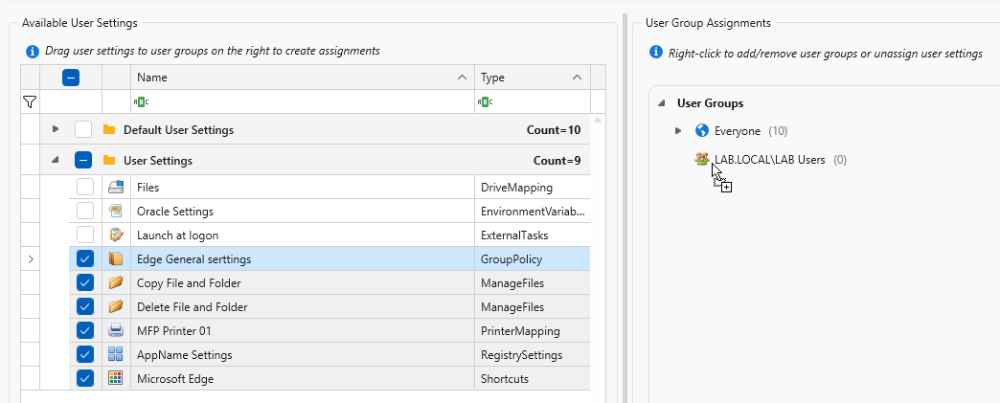

Confirm the changes by clicking **Yes**, or click **No** to cancel.

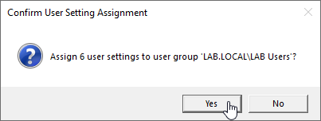

All your assignments are visible in the **User Group Assignments** pane.

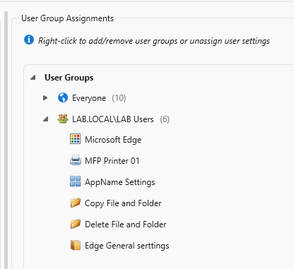

## Folders

Over time your list of User Settings can grow. To keep things organized, you can group settings into folders. Select one or more items, right-click, and choose **Create Folder & Move Selected** from the context menu.

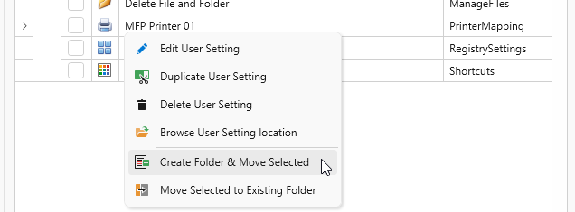

Enter a name for the folder and click **OK**.

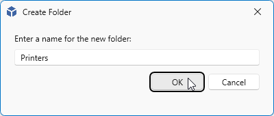

The selected items are moved to the newly created folder.

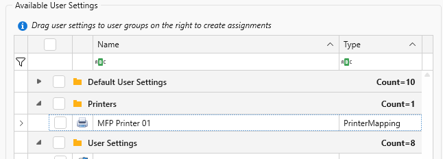
