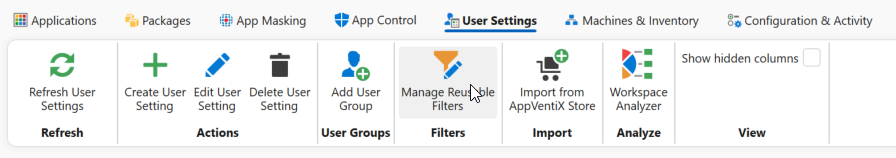
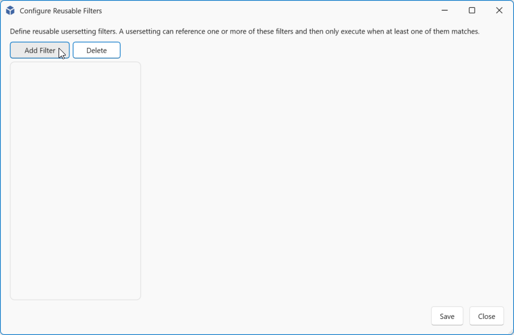
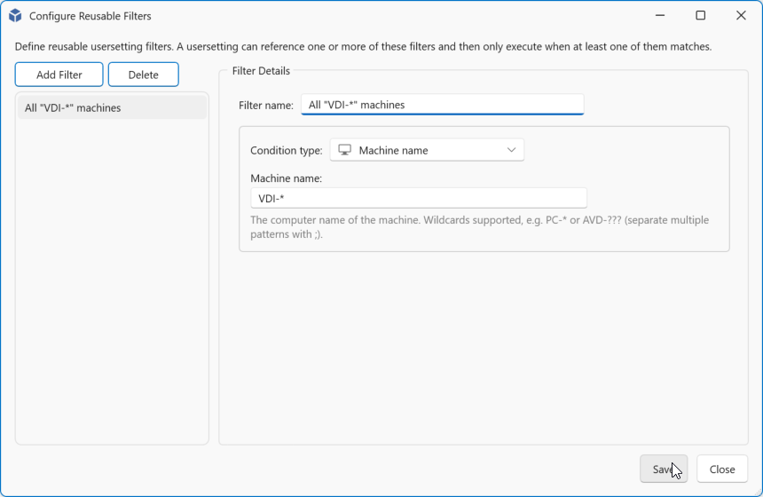
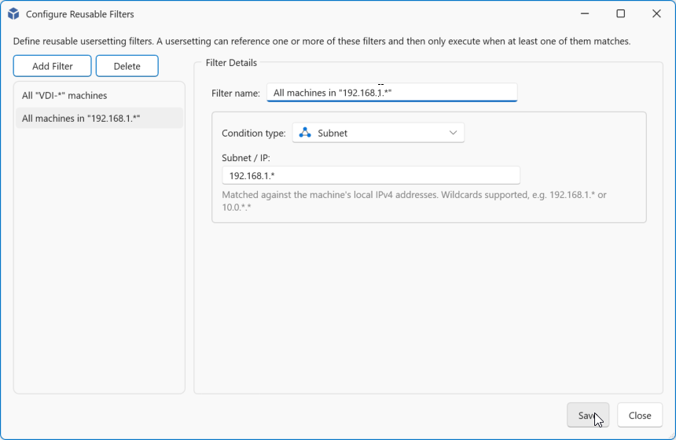
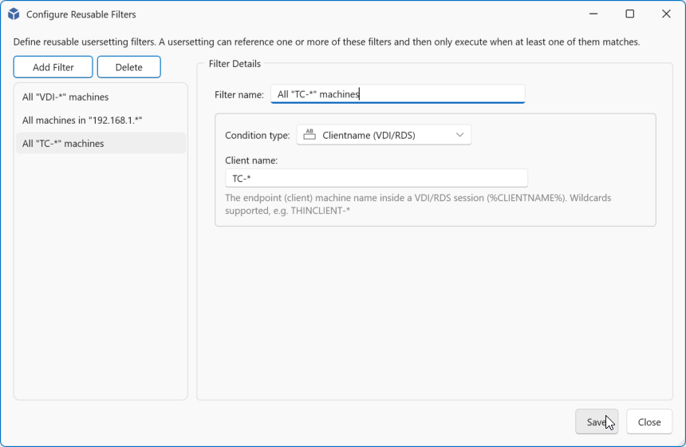
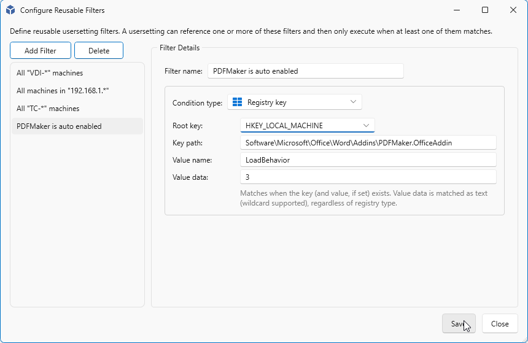

# User Settings - Reusable Filters

With Reusable Filters you have the option to scope any user setting. A Filter can be created once and be applied to one or mre USer Settings.

You will have the following Filter options available.

* [Machine Name](#machine)
* [Subnet](#subnet)
* [Clientname](#clientname)
* [Registry key](#registry-key)

Navigate to User Settings and click **Manage Reusable Filters**.

Click **Add Filter**.

## Machine

Enter a machine name filter. You may can make use of wildcards like ***** for one or more or **?** for a single character.
The match is case insensitive.
You can include multiple matches, separate them with **;**

| Filter | Matches |
|---|---|
| VDI-* | VDI-0001, VDI-Test-001, vdi-09 |
| AVD-?-* | AVD-T-001, avd-p-pool-001 |
| PC-??? | pc-123, PC-A12 |
| vdi-t-\*;vdi-p-\* | VDI-P-001, vdi-t-002 |

Click **Save** to save and close or **Add Filter** to add a new filter.

## Subnet

Enter a part of a ip-address that wil be used for the matching. You may can make use of wildcards like ***** for one or more characters.

| Filter | Matches |
|---|---|
| 192.168.1.* | 192.168.1.0 to 192.168.1.255 |
| 192.168.*.* | 192.168.0.0 to 192.168.255.255 |
| 192.\*.10.\* | 192.1.10.5, 192.254.10.26, 192.168.10.137 |

Click **Save** to save and close or **Add Filter** to add a new filter.

## Clientname

Enter a endpoint (client) machine name filter from within your single or multi session environment.
You may can make use of wildcards like ***** for one or more or **?** for a single character.
The match is case insensitive.
You can include multiple matches, separate them with **;**

| Filter | Matches |
|---|---|
| TC-* | TC-0001, TC-Test-001, tc-09 |
| WKS-?-* | WKS-T-001, wks-p-pool-001 |
| PC-??? | pc-123, PC-A12 |
| DSKT-t-\*;dskt-p-\* | DSKT-P-001, dskt-t-002 |

!!! note
    This is only an option in Single and Multi session environments.

Click **Save** to save and close or **Add Filter** to add a new filter.

## Registry key

With the Registry key option you can match for the existance for a key, value name or the value data content.
The Value data is matched as a string value regardless of the registry type.

| Filter | Matches |
|---|---|
| Root key: HKEY_LOCAL_MACHINE Key path: Software\Microsoft\Office\Word\Addins\PDFMaker.OfficeAddin Value name: `empty`  Value data: `empty` | Is `true` if this path exists else `false` |
| Root key: HKEY_LOCAL_MACHINE Key path: Software\Microsoft\Office\Word\Addins\PDFMaker.OfficeAddin Value name: LoadBehavior  Value data: `empty` | Is `true` if the path with value exists else `false` |
| Root key: HKEY_LOCAL_MACHINE Key path: Software\Microsoft\Office\Word\Addins\PDFMaker.OfficeAddin Value name: LoadBehavior  Value data: 3 | Is only `true` if the path with value and the value is equal to `3` else `false` |

