# Configuring User Settings

User Settings allow you to manage the user workspace, including applying registry keys, drive mappings, printers, external tasks (with an embedded script editor), and group policies.

User Settings can be enabled in the [Agent Settings](agent-settings.md) for the machine group:

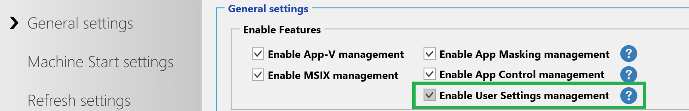

User Settings can be created and assigned to user groups:

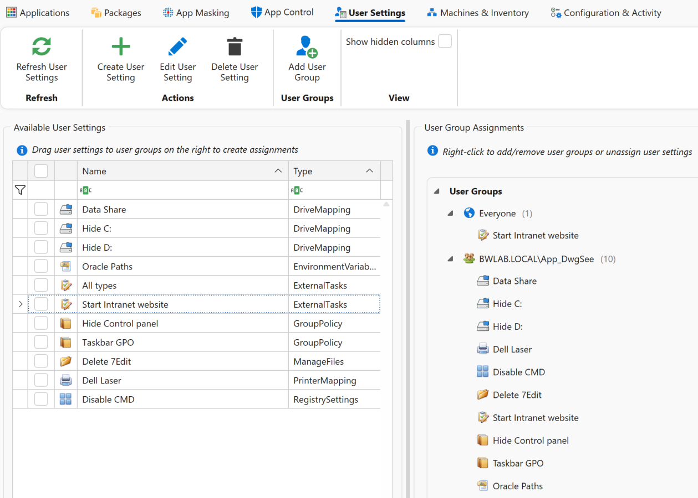

The **Everyone** group is a built-in AppVentiX group which means the setting is applied to everyone. Just create your user setting and drag it to the treeview to create assignments based on user groups. New user groups can be added with **Add User Group**. Both Active Directory and Entra ID groups are supported.

In each user setting there is a **Filters** tab. In this tab you can narrow the user setting down to a specific machine group, and configure whether the user setting should be executed only at login (default) or also when the Workspace of the user is refreshed.

---

## Tracked User Settings

The following user setting types are tracked:

- Group policies
- Drive mappings
- Printer mappings

**Tracked** means that when an assignment no longer applies, the setting is automatically reverted. For example, if you remove or unassign a drive mapping from a user group, the drive mapping is automatically removed from the user. This ensures that no manual cleanup is required when changing drive mappings, printer mappings, or policies.

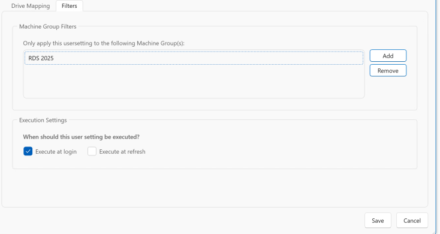

---

## RunOnce Setting

Some user settings have a **RunOnce** setting:

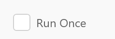

When enabled, the user setting is applied/executed for the user one time, like copying a file or importing a registry key. When the user setting is applied, a registry key is created in the AppVentiX registry key:

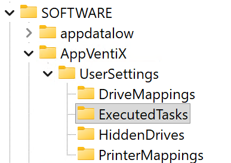

All user setting activities are also logged in the AppVentiX agent event log:

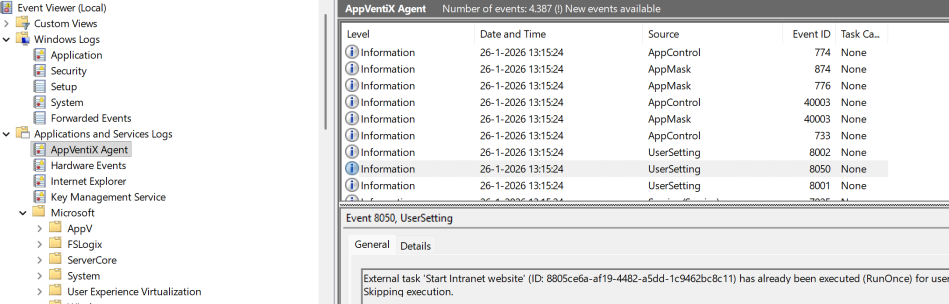

---

## Creating Shortcuts with MSIX

Leveraging MSIX it is very easy to manage shortcuts. You can even add (script) files to the shortcut package. Just create a new package and select the **Create new shortcut** button. You can start any executable (with or without arguments). These can be executables you add to the package but they can also reside outside the package. For example, you can configure Edge to start a specific website.

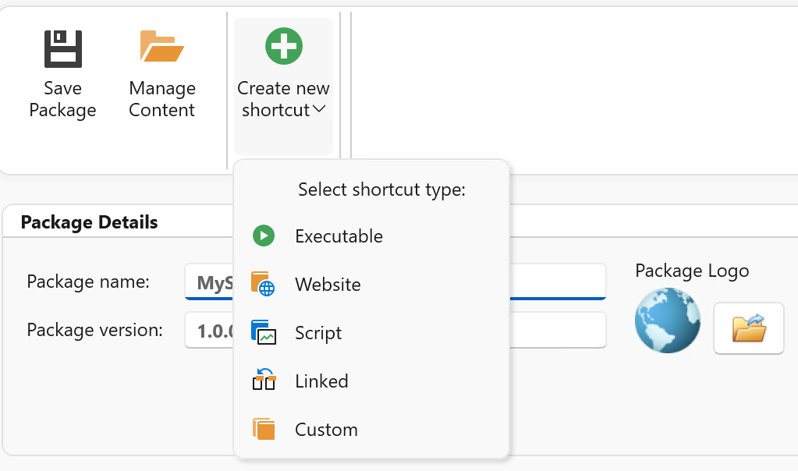

Example of a package containing shortcuts:

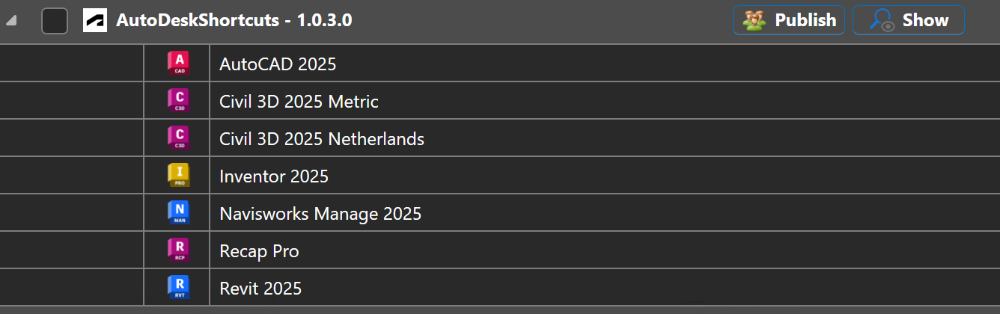

Using the **Manage Content** button you can optionally add files to the package.

It is also possible to configure File Type Associations (FTAs) which point to files inside or outside the package.

Shortcut packages are assigned to user groups in the same way as other applications.

---

## Refresh and Execution Order

The Workspace Refresh shortcut in the Start menu allows users to refresh their workspace:

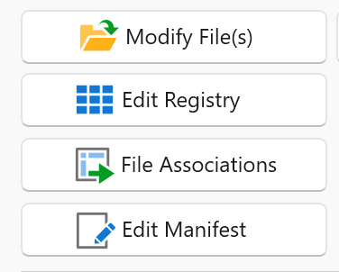

A progress will be displayed during refresh:

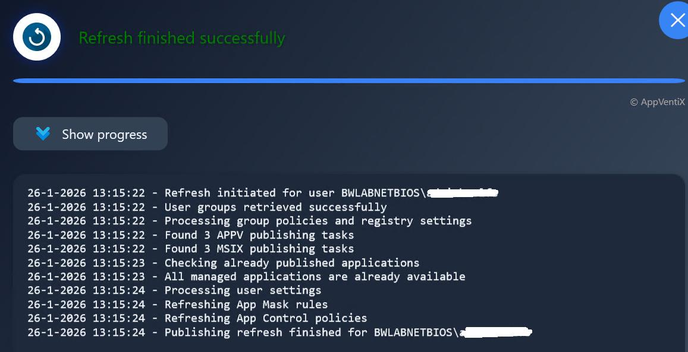

By default, User Settings are applied only at login. If you want them to also apply when a user clicks **Refresh**, enable this option in the Filters tab for the User Setting:

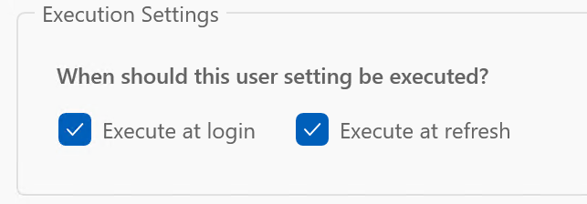

**Execution Order** lets you control the sequence in which User Settings are applied. Settings with a lower value have a higher priority and are applied earlier.

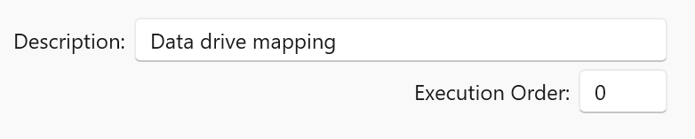

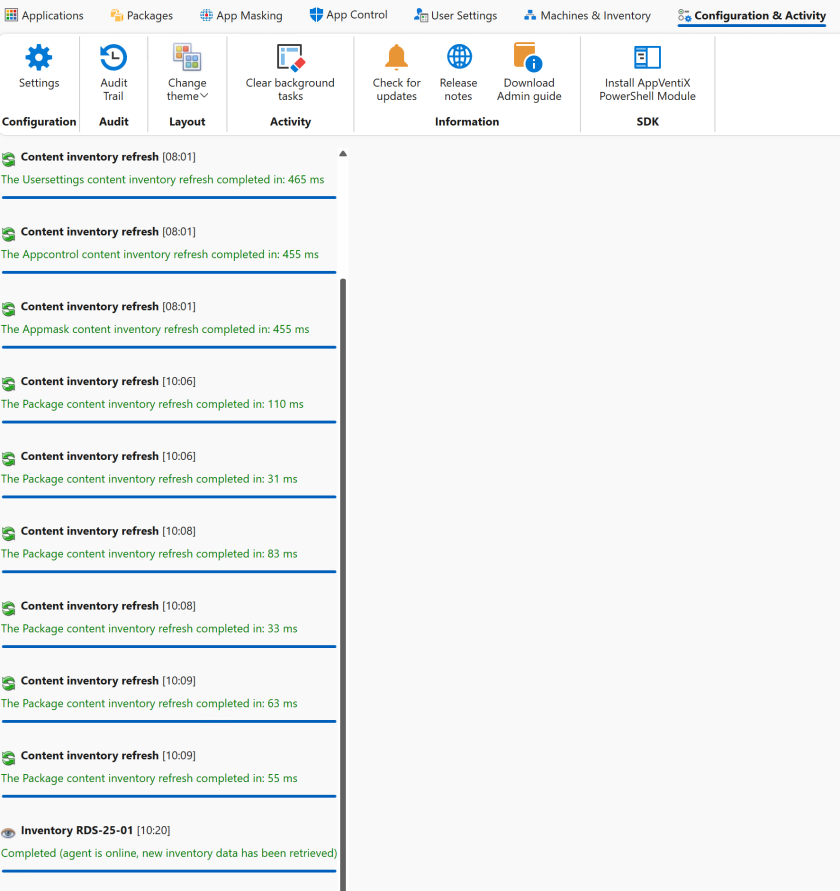
