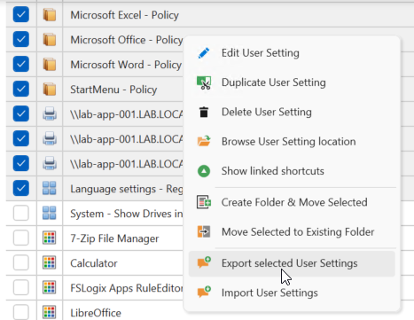
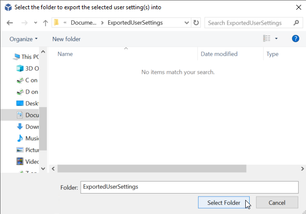
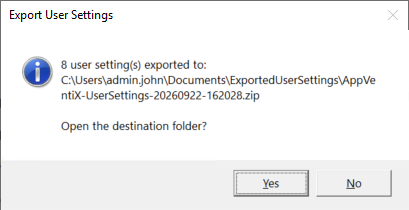
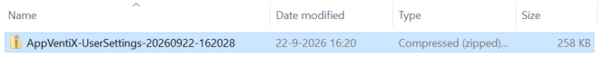
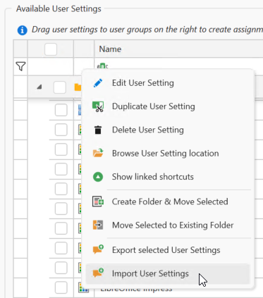
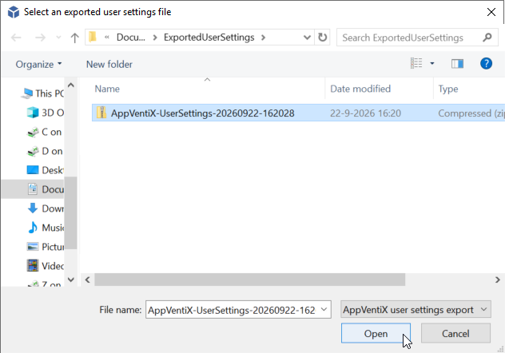
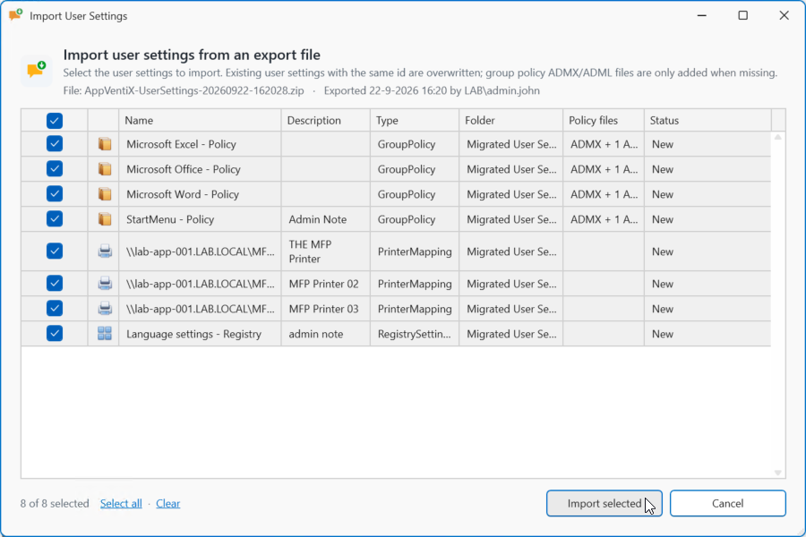
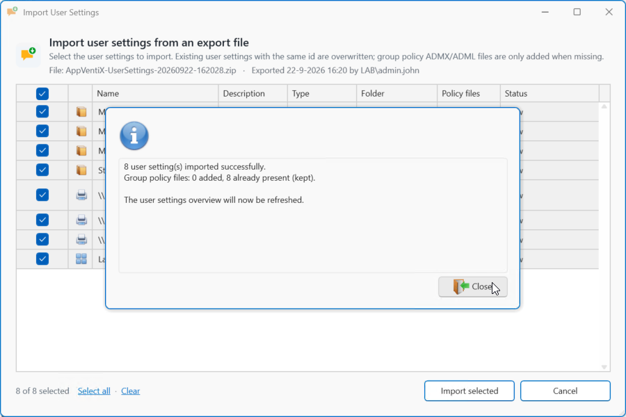

# Export and Import User Settings

Starting with version 5.3.x, AppVentiX supports exporting and importing user settings, making it easier to migrate configurations between different AppVentiX sites.

## Export User Settings

To export one or more User Settings, select the items you want to export. Right-click and select **Export selected User Settings**.

Select a folder for the export files and click **Select Folder**.

You can click **Yes** to open the folder location or **No** to close the confirmation popup.

The selected items will be stored in a ZIP-file.

## Import User Settings

To import one or more User Settings from a previous export, right-click and select **Import User Settings**.

Select the ZIP-file from a previous export and click **Open**.

Next, select the items you want to import into the current configuration and click **Import selected**.

When the import succeeds, click **Close**.

## Import from AppVentiX Store

AppVentiX offers a set of basic settings getting you started with a minimal Windows baseline as well as some helpful configuration options.

Visit [Default User Settings](../user-settings-default/index.md)