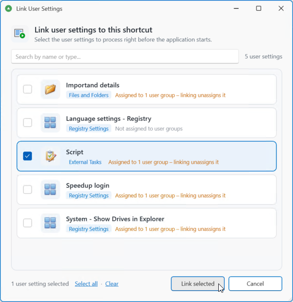
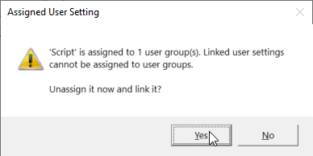
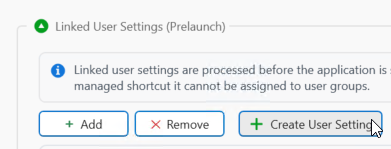
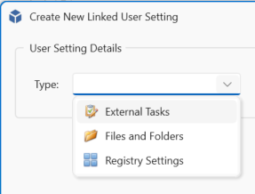
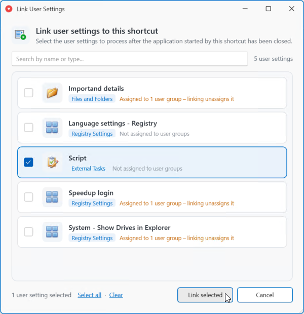
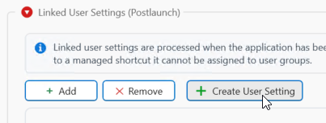

# Prelaunch and Postlaunch Settings

Managed Shortcuts can execute configurable actions before and after an application is started. These actions can, for example, be used to set registry values or copy files.

## Prelaunch

Linked user settings are processed before the application is started. Their Filters and Run Once settings are honored. When a user setting is linked to a managed shortcut, it cannot be assigned to user groups.

Click **+ Add** to assign an item to the shortcut. A popup will be displayed with the items eligible to be assigned.

Select the item(s) you want to assign and click **Link selected**.

!!! Important
    If an item was previously assigned to, for example, an AD Group, it will be unassigned before linking it to the managed shortcut.

    A warning popup will be shown if this is applicable. Click **Yes** or **No** to continue.

    

You can also create a new task from this window. Click **+ Create User Setting** to create a new External Tasks, Files and Folders, or Registry Settings user setting, place it in the Linked folder, and link it to this shortcut.

Create one of the three types, enter the details and create when finished.

## Postlaunch

Linked user settings are processed when the application has been closed. Their Filters and Run Once settings are honored. When a user setting is linked to a managed shortcut, it cannot be assigned to user groups.

Click **+ Add** to assign an item to the shortcut. A popup will be displayed with the items eligible to be assigned.

Select the item(s) you want to assign and click **Link selected**.

!!! Important
    If an item was previously assigned to, for example, an AD Group, it will be unassigned before linking it to the managed shortcut.

    A warning popup will be shown if this is applicable. Click **Yes** or **No** to continue.

    

You can also create a new task from this window. Click **+ Create User Setting** to create a new External Tasks, Files and Folders, or Registry Settings user setting, place it in the Linked folder, and link it to this shortcut.

Create one of the three types, enter the details and create when finished.

