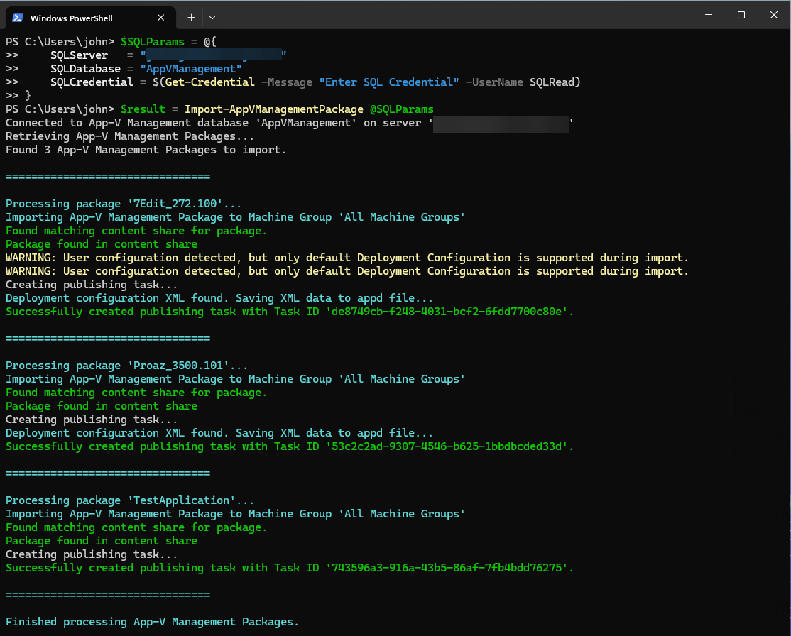
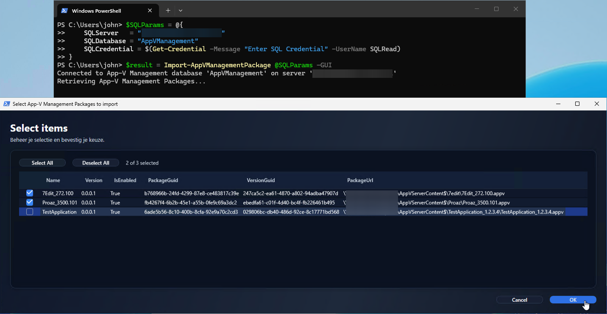
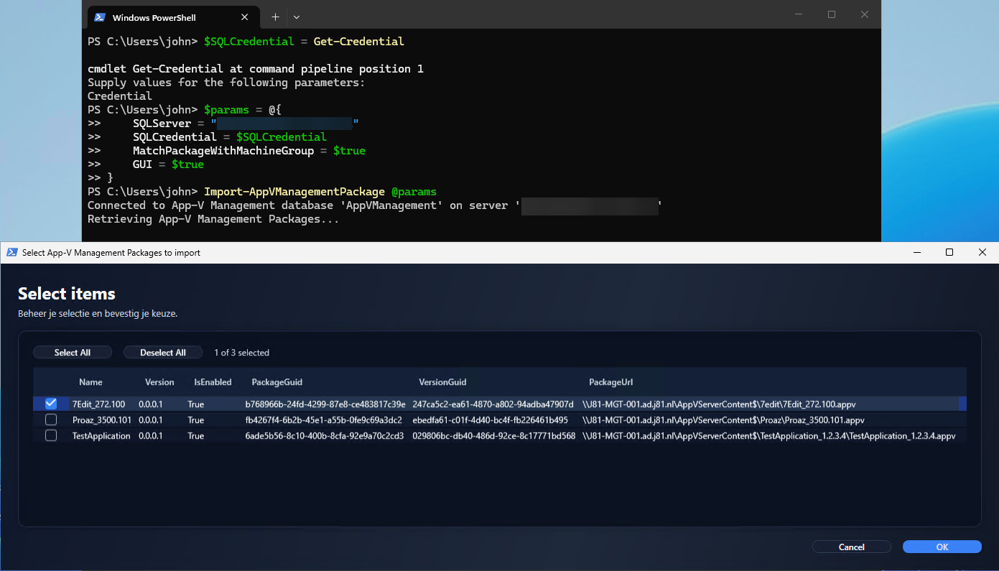
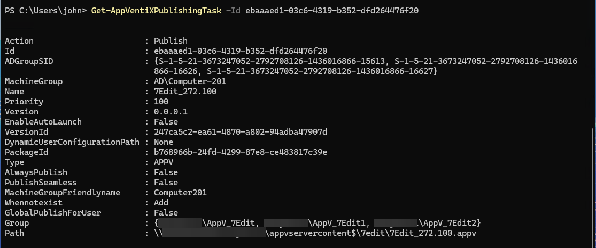
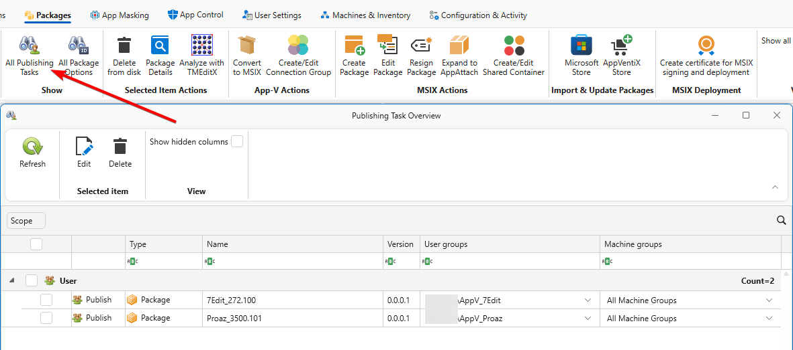

# HowTo: Import packages from App-V Management Database

This guide walks you through the process of importing your existing App-V packages from the Microsoft App-V Management Server database into AppVentiX.

## Prerequisites

Before you begin, ensure you have:

- AppVentiX PowerShell module installed and configured
- SqlServer PowerShell module installed
- Network access to the SQL Server hosting the App-V Management database
- Appropriate permissions to read from the App-V Management database
- content stores already configured in AppVentiX (Machine Groups) that match your App-V package locations

## Step 1: Verify AppVentiX Configuration

First, ensure your AppVentiX environment is properly configured:

```powershell


# Install the (latest) AppVentiX module
Install-Module AppVentiX -Force [-Scope CurrentUser] [-AllowClobber]

# Install the (latest) SqlServer module
Install-Module SqlServer -Force [-Scope CurrentUser] [-AllowClobber]

# Import the module
Import-Module AppVentiX [-Scope CurrentUser] [-Force] [-AllowClobber]
Import-Module SqlServer [-Scope CurrentUser] [-Force] [-AllowClobber]

# If custom credentials are required, you can run the following command to connect
# E.g. if the current user does not have permissions to access the configuration store

$Credential = Get-Credential -Message "Enter AppVentiX Configuration Store credentials"
$ConfigShare = "\\fileserver.domain.local\config$"
Set-AppVentiXConfigShare -ConfigShare $ConfigShare -Credential $Credential

# (Optional) Verify your license is valid
Test-AppVentiXIsLicensed

# (Optional) Test connectivity with SQL

# Enter variables for SQL connection
$SQLCredential = Get-Credential -Message "Enter SQL Credential"
$Params = @{
    SQLServer = 'sql01.domain.local'
    SQLCredential = $SQLCredential
    SQLDatabase = 'AppVManagement'
}

# NOTE: If you have the database in a separate instance, configure "SQLInstance" also as an additional parameter, else leave out.

# Test the SQL connection for the AppV Management database
Test-AppVManagementSQLConnection @Params -Verbose

# Result (if successful)
VERBOSE: Checking for SqlServer module availability
VERBOSE: SQL Management connection already established in this session.
True
```

!!! Important
    Make sure the SQL port is reachable from the location you run the PowerShell actions from.

## Step 2: Identify Your SQL Server Details

Gather the following information about your App-V Management Server:

| Information | Example | Description |
|-------------|---------|-------------|
| SQL Server | `sql01.domain.local` | Hostname or IP of the SQL Server. Optionally add port `sql01.domain.local,1433`|
| Database Name | `AppVManagement` | Name of the App-V database (default: AppVManagement) |
| SQL Instance | `MSSQLSERVER` | Optional SQL Instance name (leave empty for default instance) |
| SQL Credentials | `SQLRead` | Optional if you current user does not have permissions, Read Only is enough |

## Step 3: Test Database Connectivity

Before importing, verify you can connect to the database:

```powershell
# Test connection using Windows Authentication
$connectionParams = @{
    SQLServer = "sql01.domain.local"
}

# Or with a named instance
$connectionParams = @{
    SQLServer = "sql01.domain.local"
    SQLInstance = "APPV"
    SQLDatabase = "AppVManagement"
}
```

## Step 4: Import Packages

### Option A: Import All Packages (Automated)

To import all enabled packages automatically and publishing to 'All Machine Groups':

```powershell
Import-AppVManagementPackage -SQLServer "sql01.domain.local"
```




### Option B: Import Selected Packages (GUI)

For more control over which packages to import, use the GUI mode. The published task IDs will be returned in the output:

```powershell
$result = Import-AppVManagementPackage -SQLServer "sql01.domain.local" -GUI

$result | Out-String

Name           Id
----           --
7Edit_272.100  ebaaaed1-03c6-4319-b352-dfd264476f20
Proaz_3500.101 b963da39-a7bc-4406-a7c4-e1e4a876b4e8
```

This opens a dialog where you can select specific packages to import:



### Option C: Import with Machine Group Matching

To automatically assign packages to the correct machine groups based on their content store location and with explicit SQL credentials:

```powershell
$SQLCredential = Get-Credential -Message "Enter SQL Server credentials"
$result = Import-AppVManagementPackage -SQLServer "sql01.domain.local" -SQLCredential $SQLCredential -MatchPackageWithMachineGroup  -GUI

```

Or the same command while using splatting:

```powershell
$SQLCredential = Get-Credential -Message "Enter SQL Server credentials"
$params = @{
    SQLServer = "sql01.domain.local"
    SQLCredential = $SQLCredential
    MatchPackageWithMachineGroup = $true
    GUI = $true
}
Import-AppVManagementPackage @params
```



### Option D: Copy Packages to the content store of a Machine Group

Use this option when you want to move your packages to a new location while importing, for example to a new file server or share that is the content store of an AppVentiX Machine Group. You select the target Machine Group with `-MachineGroupFriendlyName`, and `-CopyPackages` copies each package to the content store of that Machine Group before the publishing task is created. The publishing task then points to the copied package.

!!! important
    The package will be copied to the first content store you have added to the Machine Group in AppVentiX.

```powershell
$params = @{
    SQLServer                = "sql01.domain.local"
    MachineGroupFriendlyName = "VDI"
    CopyPackages             = $true
    GUI                      = $true
}
$result = Import-AppVManagementPackage @params
```

For each package, the import:

1. Looks up the package in the content store of the Machine Group.
2. Copies the `.appv` file from its App-V Management location to the content store if it is not there yet. The folder structure below the source share is kept.
3. Saves the deployment and user configuration from the App-V Management database as `.appd` and `.xml` files next to the copied package.
4. Creates the publishing task for the copied package.

| Source | Target |
|--------|--------|
| `\\fileserver.domain.local\SourceShare\WS12345\MSOffice365.appv` | `\\fileserver.domain.local\TargetShare\WS12345\MSOffice365.appv` |

#### Rename the package folder

App-V Management package folders often have names that say little about their content, such as a ticket or workstation number. Add `-RenamePackageFolder` to copy each package to a folder in the root of the content store named after the `.appv` file:

```powershell
$params = @{
    SQLServer                = "sql01.domain.local"
    MachineGroupFriendlyName = "VDI"
    CopyPackages             = $true
    RenamePackageFolder      = $true
}
$result = Import-AppVManagementPackage @params
```

| Source | Target |
|--------|--------|
| `\\fileserver.domain.local\SourceShare\WS12345\MSOffice365.appv` | `\\fileserver.domain.local\TargetShare\MSOffice365\MSOffice365.appv` |
| `\\fileserver.domain.local\SourceShare\Apps\WS67890\7Edit.appv` | `\\fileserver.domain.local\TargetShare\7Edit\7Edit.appv` |

#### Packages that already exist

If a package already exists in the content store, it is not copied. A warning is shown and the publishing task points to the existing file. Add `-Force` to overwrite existing packages:

```powershell
Import-AppVManagementPackage -SQLServer "sql01.domain.local" -MachineGroupFriendlyName "VDI" -CopyPackages -RenamePackageFolder -Force
```

!!! Note
    - Packages are copied with robocopy, using the permissions of the user running the command. This user needs read access to the source share and write access to the content store.
    - Only the `.appv` file is copied. Other files in the source folder are not copied.
    - `-RenamePackageFolder` and `-Force` only work together with `-CopyPackages`. Without it, a warning is shown and they are ignored.

!!! Warning
    With `-RenamePackageFolder`, packages with the same file name in different source folders get the same target folder. The first package is copied. The next ones get an "already exists" warning and their publishing task points to the first package. With `-Force`, each next package overwrites the previous one. Check your packages for duplicate file names before you use this option.

!!! Important
    You may have publishing rules without a group assignment, these will be skipped by default. If you sill like to import these you can specify a parameter to assign a certain group while importing these in AppVentiX. To use this feature specify the following parameter `-UnassignedADGroup "domain.local\AppVentiX Unassigned Group"`

## Step 5: Verify the Import

After importing, verify your packages are correctly configured:

```powershell
# List all publishing tasks
Get-AppVentiXPublishingTask

# To get all publishing tasks from the previous step, saved in the `$result` variable
$result | ForEach-Object {$_ | Get-AppVentiXPublishingTask}

# List a publisning task by id
Get-AppVentiXPublishingTask -Id ebaaaed1-03c6-4319-b352-dfd264476f20

```


You can also verify the imported packages (publishing tasks) in the AppVentiX Console.
On the tab "Packages" click "All Publishing Tasks" to see all, including the newly added publishing tasks.



## Common Issues and Solutions

### Issue: Package not found in content store

**Symptom:** Import reports that a package cannot be found.

**Solution:** Ensure the content store path is accessible and the package files exist at the expected location. Verify the content store is configured in AppVentiX.

### Issue: Authentication failed

**Symptom:** Cannot connect to the SQL Server.

**Solution:**
1. Verify network connectivity to the SQL Server
2. Check firewall rules allow SQL connections (port 1433)
3. Confirm your account has read permissions on the database
4. Try using SQL Server Authentication with explicit credentials

### Issue: No packages imported

**Symptom:** Import completes but no packages appear.

**Solution:** Only enabled packages with valid UNC paths are imported. Check the App-V Management Console to verify packages are enabled and have valid content paths.

### Issue: Package already exists in content store

**Symptom:** With `-CopyPackages`, the import shows the warning `Package already exists in Content Store: '<path>'. Use -Force to overwrite.`

**Solution:** The package was copied before, or another package with the same file name was copied to the same folder (with `-RenamePackageFolder`). The publishing task uses the existing file. Run the import again with `-Force` if the existing file must be replaced.

### Issue: Package copy failed

**Symptom:** With `-CopyPackages`, the import shows the error `Failed to copy package '<name>' to '<path>', robocopy exit code <code>.` and no publishing task is created for that package.

**Solution:**
1. Confirm the user running the command has read access to the source share and write access to the content store
2. Check there is enough free disk space on the content store
3. Run the import with `-Verbose` to see the robocopy output

## Best Practices

1. **Test First:** Always use the `-GUI` parameter initially to review which packages will be imported
2. **Verify content stores:** Ensure all content stores are configured in AppVentiX before importing
3. **Import in Batches:** For large environments, consider importing packages in smaller batches
4. **Copy a few packages first:** When you use `-CopyPackages`, start with a few packages selected with `-GUI` and check the result in the content store before you copy everything

## Next Steps

After importing packages, you may want to:

- [Import Connection Groups](../powershell-module/commands/Import-AppVManagementConnectionGroup.md) to maintain application dependencies
- Review and adjust publishing task settings in the AppVentiX Console
- Test package delivery on a pilot group of machines

## Related Commands

- [Import-AppVManagementPackage](../powershell-module/commands/Import-AppVManagementPackage.md) - Command reference
- [Import-AppVManagementConnectionGroup](../powershell-module/commands/Import-AppVManagementConnectionGroup.md) - Import connection groups
