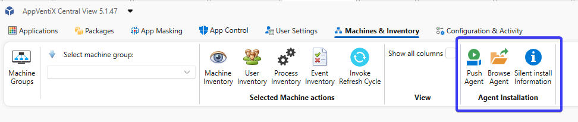
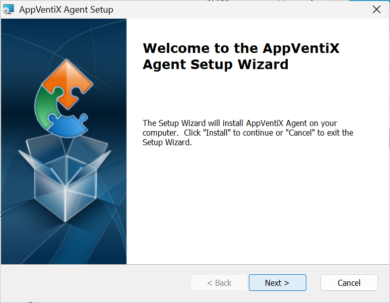
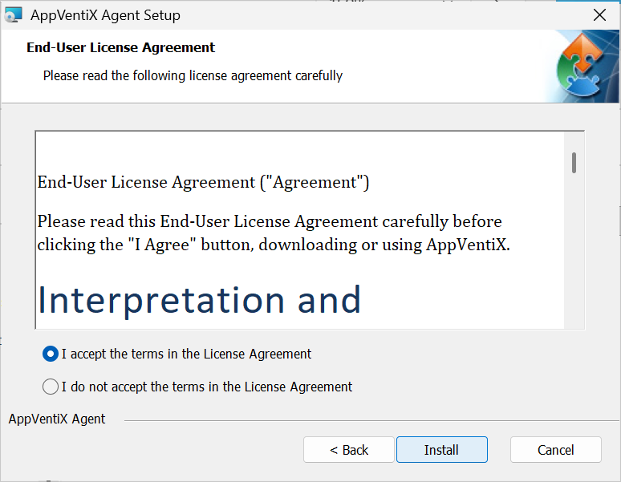
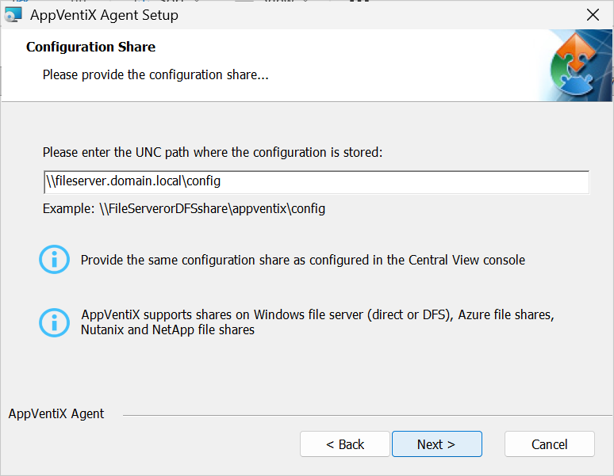
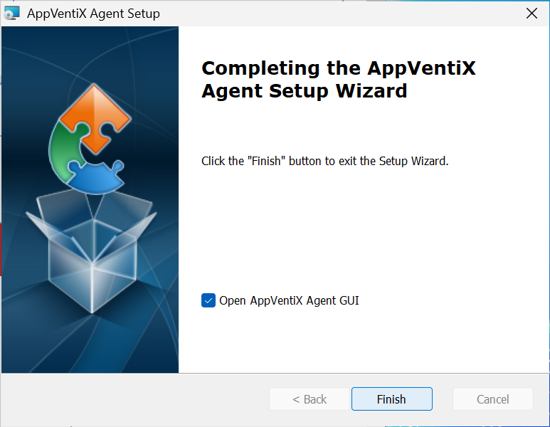

# Install the AppVentiX Agent

The AppVentiX Agent handles application delivery on the client machine. It connects to the config share to retrieve its configuration and publishing tasks.

## Prerequisites

Before installing the agent, ensure the following:

- A supported version of Windows is installed on the machine or master image
- The AppVentiX config share is accessible from the machine
- You have sufficient permissions to install software (local administrator)

## Locating the Installer

The agent installer is located on the AppVentiX config share:

```
\\fileserver.domain.local\config\Agent\AppVentiX Agent.msi
```

Replace `\\fileserver.domain.local\config` with the actual path to your config share.

## Installation


Now that the Central View console is up and running, install the agent. The agent can be pushed remotely to machines (even when users are logged in, no reboot is needed) or installed silently using an automated procedure, like an image build procedure or pipeline. When an older version of the agent is detected, it will be upgraded automatically.

### Option A: Push Agent

In the Central View Console:

- select **Manage Machines**.
- Select one or multiple machines and click on the **Push Agent** button.

The agent will now be installed or upgraded automatically.



### Option B: GUI Installation

Run `AppVentiX Agent.msi` by double-clicking it.



Click **"I accept the Terms..."** to agree and click **Install** to continue to the next step.



Enter the full path to your config share and click **Next** to start the installation.

> **Note:** Replace `\\fileserver.domain.local\config` with the actual path to your config share.



Uncheck the **"Open AppVentiX Agent GUI"** to close or leave checked to open the Agent GUI after the installation.
Click **Finish** to complete the installation.



### Option C: Silent Installation

For scripted or image-based deployments, use the following command:

```cmd
msiexec /i "AppVentiX Agent.msi" /quiet CONFIGURATIONSHARE="\\fileserver.domain.local\config"
```

Replace `\\fileserver.domain.local\config` with the actual path to your config share.

The `/quiet` switch suppresses all UI. The `CONFIGURATIONSHARE` parameter tells the agent where to find its configuration. This is the only required parameter beyond the standard MSI switches.

> **Note:** For non-persistent VDI and SBC environments, run the silent installation on the master image before sealing it. Depending on the configuration certain tasks can run before the image is sealed.

## After Installation

Once installed, the agent connects to the config share and retrieves its configuration automatically. No further manual configuration is required on the client.

Proceed to [Step 4: Verify the Agent](../quickstart/verify-agent.md) or optionally [Optimize the Workspace](../quickstart/optimization-script.md) before verifying.