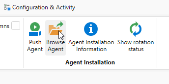
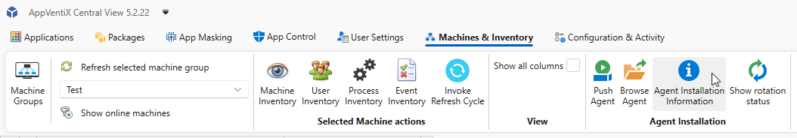
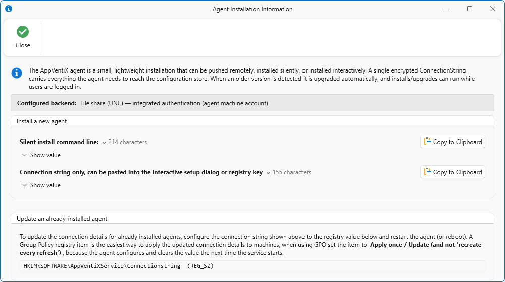

# Install the AppVentiX Agent

The AppVentiX Agent handles application delivery on the client machine. It connects to the configuration store to retrieve its configuration and publishing tasks.

## Prerequisites

Before installing the agent, ensure the following:

- A supported version of Windows is installed on the machine or master image
- The AppVentiX configuration store is accessible from the machine
- You have sufficient permissions to install software (local administrator)

## Locating the Installer

You can find the Agent easily from Central View by clicking the **Browse Agent** button on the **Machines & Activity** tab.



The agent installer is available from two locations depending on your configuration store type:

* [Central View machine](#1-appventix-central-machine)
* [SMB file share](#2-smb-file-share)

### 1. AppVentiX Central machine

If you have configured an Azure Blob Storage account, the agent is located on the machine where Central View is installed:

`C:\Program Files\AppVentiX\AppVentiX Central View\Agent\AppVentiX Agent.msi`

### 2. SMB file share

If you have an SMB share configured, the agent is located in the configuration store:

`\\fileserver.domain.local\config\Agent\AppVentiX Agent.msi`

Replace `\\fileserver.domain.local\config` with the actual path to your configuration store.

## Installation

The agent can be pushed remotely to machines (even when users are logged in, no reboot is needed) or installed silently using an automated procedure, like an image build procedure or pipeline. When an older version of the agent is detected, it will be upgraded automatically.

!!! note
    If you are pushing the agent remotely, skip to [Option A: Push Agent](#option-a-push-agent).

For manual or silent installation, first open Central View, go to the **Machines & Inventory** tab, and click **Agent Installation Information**.



Two values are shown:

1. **Silent installation with connection string** - needed for [Option C: Silent Installation](#option-c-silent-installation)
2. **Connection string only** - needed for [Option B: GUI Installation](#option-b-gui-installation)



### Option A: Push Agent

In the Central View console:

1. Go to **Machines & Inventory**.
2. Select the machine group containing the machines you want to target.
3. Select one or more machines.
4. Click **Push Agent**.

The agent will now be installed or upgraded automatically.


### Option B: GUI Installation

Run `AppVentiX Agent.msi` by double-clicking it.
Click **Next** to start the installation.


Read the End-User License and click **Next** to continue to the next step.


Paste the connection string copied from Central View (value 2) and click **Next**.


Optionally uncheck **Open AppVentiX Agent GUI** if you do not want the Agent GUI to open after installation.
Click **Finish** to complete the installation.


### Option C: Silent Installation

For scripted or image-based deployments, use the following command:

```cmd
msiexec /i "AppVentiX Agent.msi" /quiet CONNECTIONSTRING="<Connection string value>"
```

The `/quiet` switch suppresses all UI. The `CONNECTIONSTRING` parameter tells the agent where to find its configuration and how to authenticate if this is required. This is the only required parameter beyond the standard MSI switches.

!!! note
    For non-persistent single or multi session environments, run the silent installation on the master image before sealing it. Depending on the configuration certain tasks can run before the image is sealed.

## After Installation

Once installed, the agent connects to the configuration store and retrieves its configuration automatically. No further manual configuration is required on the client.

Proceed to [Step 4: Verify the Agent](../quickstart/verify-agent.md) or optionally [Optimize the Workspace](../quickstart/optimization-script.md) before verifying.