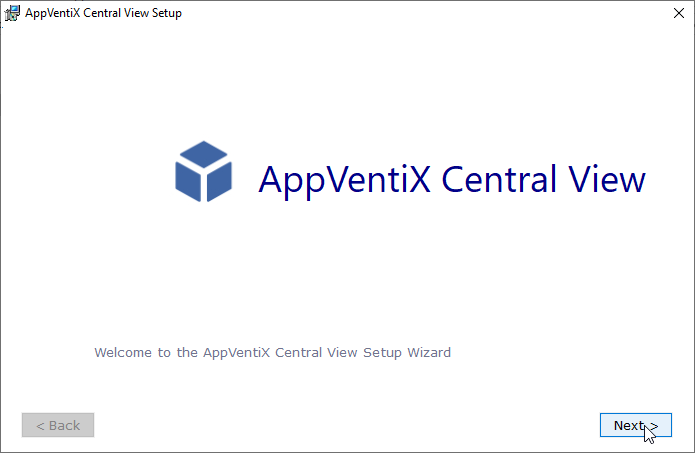
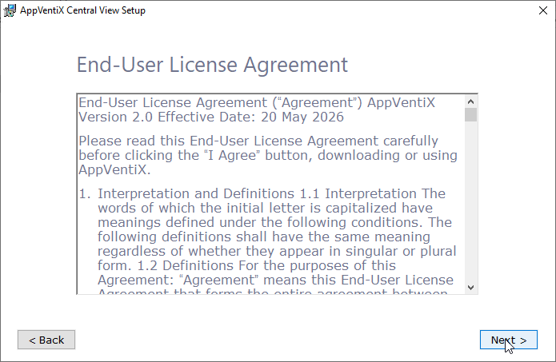
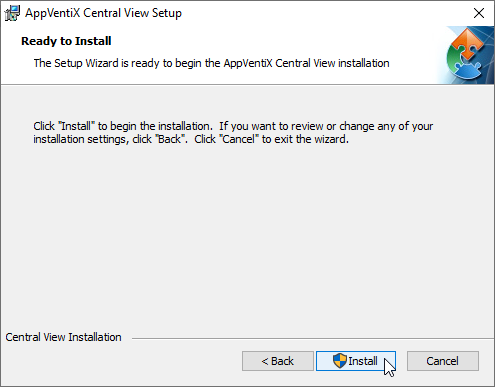
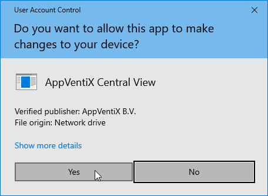
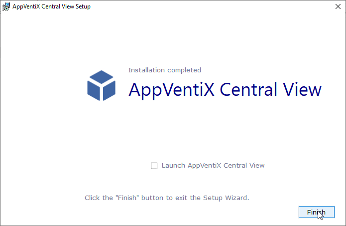
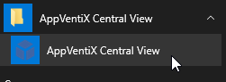
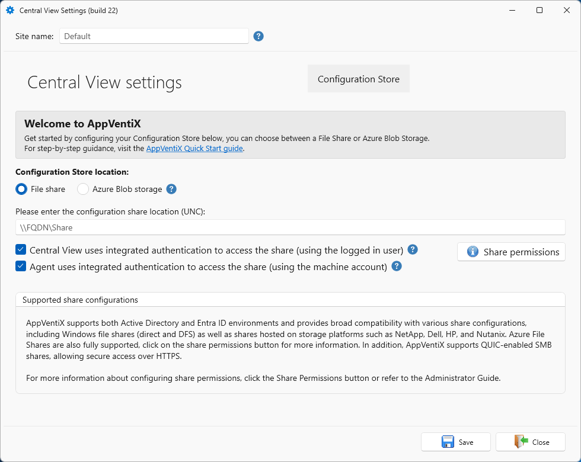
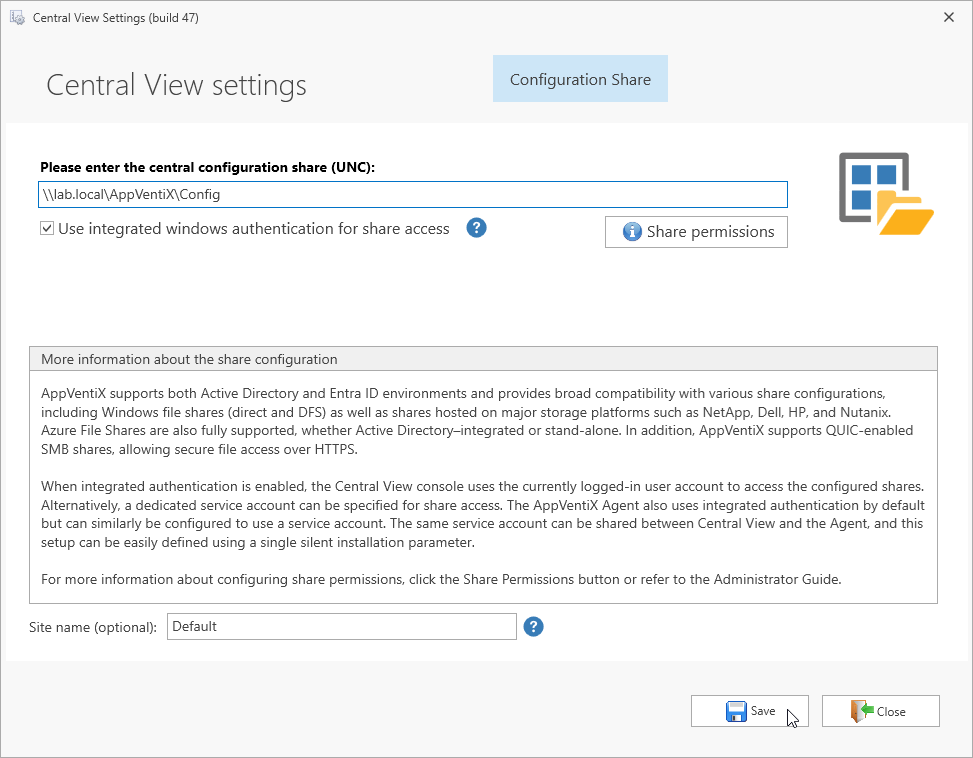
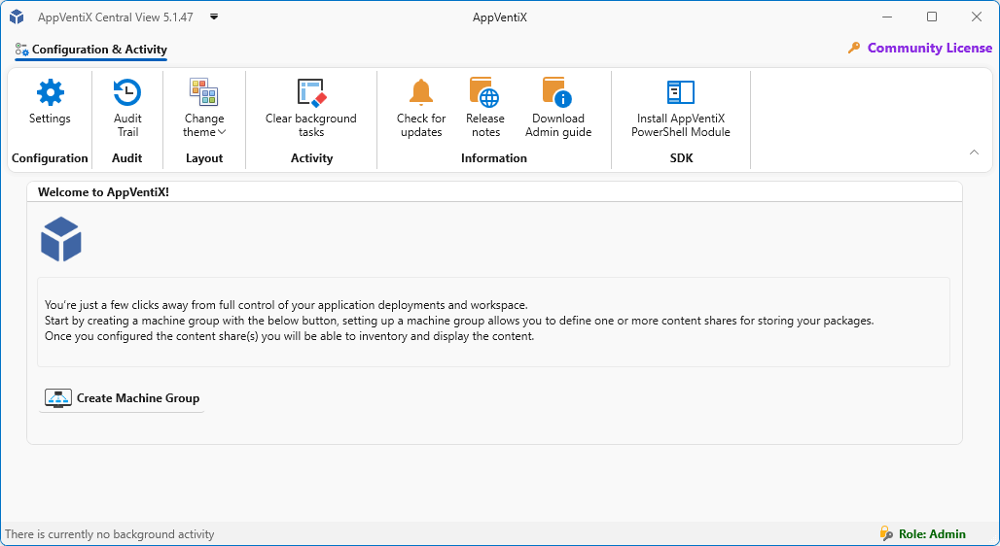

# AppVentiX Central View Installation

## Requirements

Before installing, ensure the following requirements are met:

- The machine must have a 64-bit OS (Server OS or Client OS)
- The configuration and content store must be accessible and configured correctly
- The machine may not be a Domain Controller

## Download

Download the latest version directly from [https://download.appventix.com/latest](http://download.appventix.com/latest),
or click the **Download** button in the top-right corner of the [AppVentiX website](https://appventix.com).

## Install AppVentiX Central View

Extract `AppVentiX Central View.msi` from the downloaded zip file, then open it to start the installer.

Click **Next** to begin.

Read the End-User License and click **Next** to continue.

Click **Install** to start the installation.

Approve the UAC prompt if it appears.

Click **Finish** to complete the installation.

## Start the Central View Console

Launch AppVentiX Central View from the shortcut added to your Start Menu.

On first launch (no existing configuration), the Central View settings window will open.

Choose the configuration store type that matches your setup:

* [Azure Blob Storage](../admin-guide/azure-blob-storage/index.md) - no Active Directory dependency, accessible outside your network
* [SMB Share](../admin-guide/smb-share/index.md) - standard Windows file share, DFS, or storage vendor share

> **NOTE**: Make sure you have configured either one of the above configuration stores before continuing with the next steps.

You can optionally enter a site name. When all details are complete, click **Save**.

AppVentiX Central View is now ready to use.

> [QuickStart: Continue with the Machine Group](create-machine-groups.md)