# Create (your first) Machine Group(s)

Machine Groups are an important part of the AppVentiX environment. They scope your deployment: each group maps to an AD OU, AD Group, or Azure AD tenant and controls which packages are delivered, which content stores are used, and which agent settings apply.

Create your first Machine Group by clicking the **Create Machine Group** button.

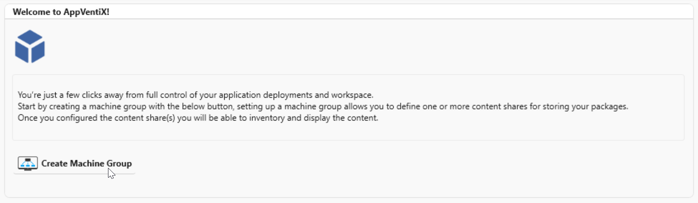

---

## Configure Agent Settings

First you need to configure the Agent settings. These settings tell the agent which AppVentiX features to enable on the target machines. You have two options:

| Option | Description |
|---|---|
| [Configure Agent for selected Machine Group](#configure-agent-for-selected-machine-group) | Start a fresh agent configuration and choose the features you need for this group. |
| [Copy settings from existing Machine Group](#copy-settings-from-existing-machine-group) | Reuse the agent settings and/or content stores from a Machine Group you have already configured. |

### Configure Agent for selected Machine Group

Select this option to start a new configuration. Choose the features you want to enable for the machines in this group. In most cases the default settings are a good starting point - you can always adjust them later.

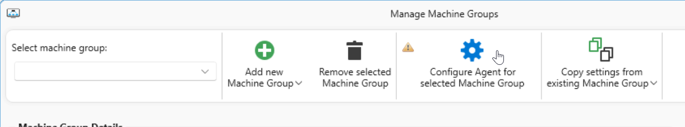

> **Tip:** For a detailed explanation of all agent settings, see the [Agent Settings](../admin-guide/agent-settings.md) page in the admin guide.

[Continue to Machine Group details](#machine-group-details)

### Copy settings from existing Machine Group

If you already have a Machine Group configured with the right agent settings, you can copy those settings instead of starting from scratch. This is a quick way to set up additional groups that should behave the same way.

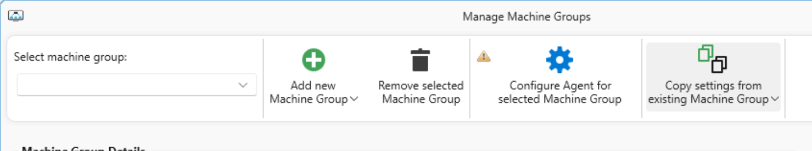

Select the Machine Group you want to copy from and choose what to include:

| Option | Description |
|---|---|
| Copy agent settings | Copies the agent feature configuration (which AppVentiX features are enabled) from the selected Machine Group. |
| Copy content store(s) | Copies the content store locations from the selected Machine Group, so the new group uses the same package sources. |

Click **Click here to copy** to apply the selected settings.

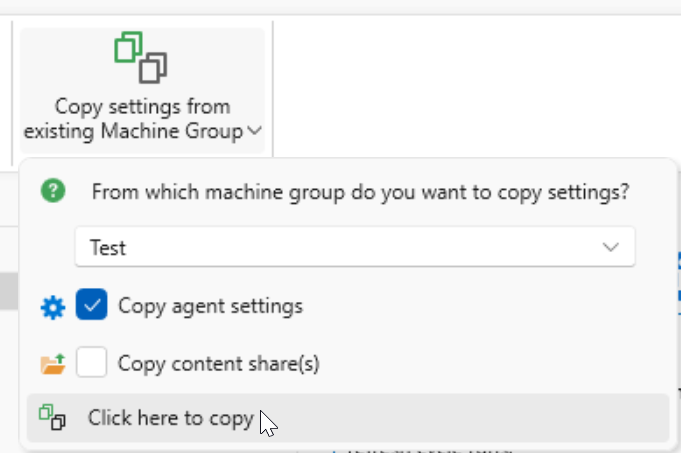

[Continue to saving the Machine Group](#save-machine-group)

---

## Machine Group Details

Select what the Machine Group is based on. AppVentiX supports three types:

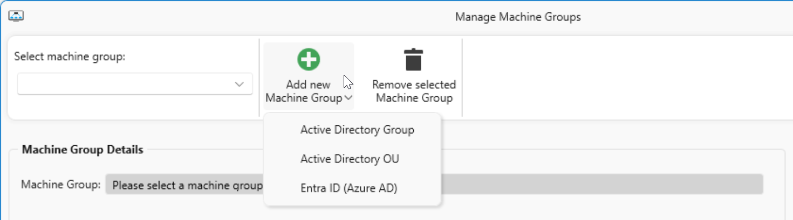

| Option | Description |
|---|---|
| [Active Directory Group](#active-directory-group) | Target machines based on membership of an AD computer group. Useful when you manage machine membership through Active Directory groups. |
| [Active Directory OU](#active-directory-ou) | Target all machines whose computer accounts are in a specific AD Organizational Unit. A common and easy choice in most environments. |
| [Entra ID (Azure AD)](#entra-id-azure-ad) | Target machines registered in Entra ID (formerly Azure AD). Suitable for cloud-only or hybrid environments without on-premises AD dependency. |

### Active Directory Group

With the **Active Directory Group** option you create a Machine Group based on computer account group membership. Select the AD group that contains the computer accounts of the machines you want to manage.

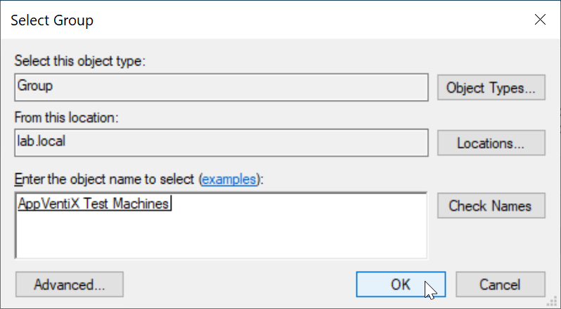

The AD group must contain the computer accounts of the machines you want to assign to this Machine Group - not user accounts.

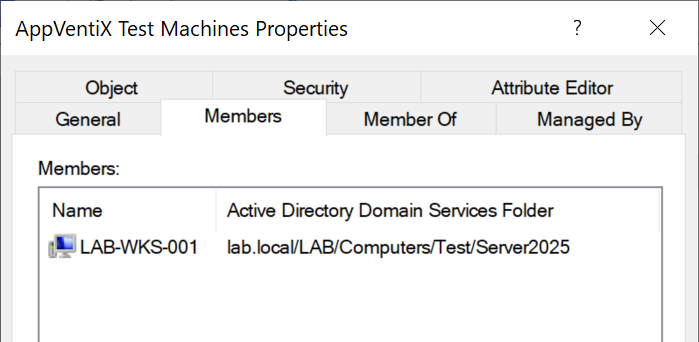

Enter a **Friendly Name** to identify this Machine Group in Central View. Choose something descriptive, like "RDS Production" or "VDI Test".

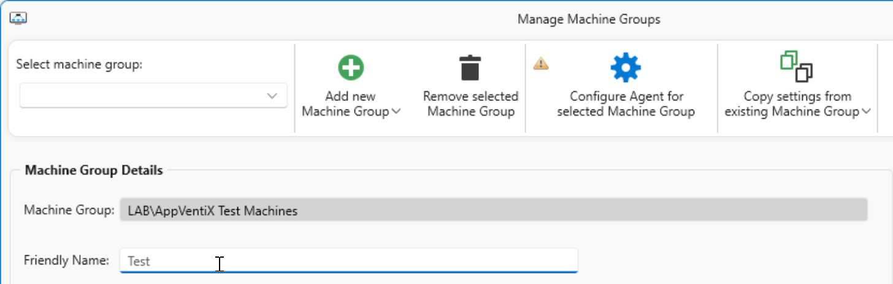

[Continue to Content Store(s) configuration](#content-stores)

### Active Directory OU

With the **Active Directory OU** option you target all machines whose computer accounts are in a specific OU. This is a convenient choice when your machines are already organized in OUs.

In a multi-domain environment, select the correct domain first. In a single-domain environment the domain is already pre-selected.

Select the OU where the machine accounts are located and click **Done** when finished.

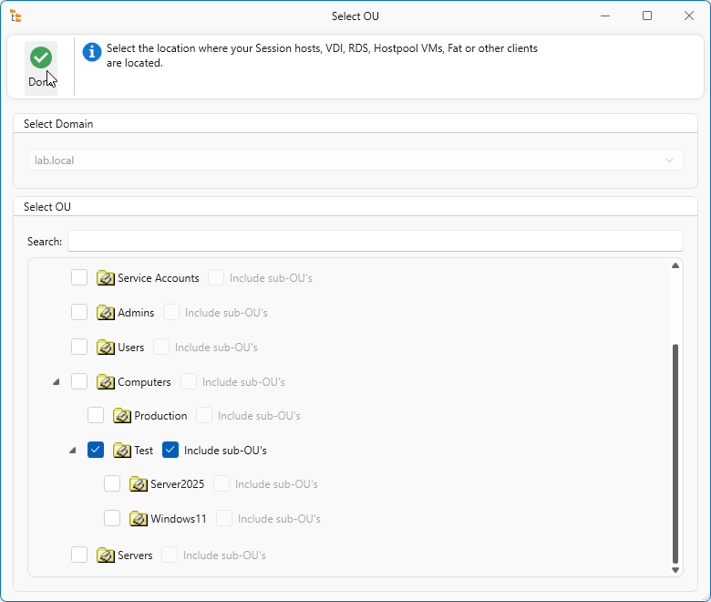

> **NOTE**: If you have nested OUs under the selected OU and want to include machines from those as well, make sure to check the **Include machines in sub OU's** option.

Enter a **Friendly Name** to identify this Machine Group in Central View.

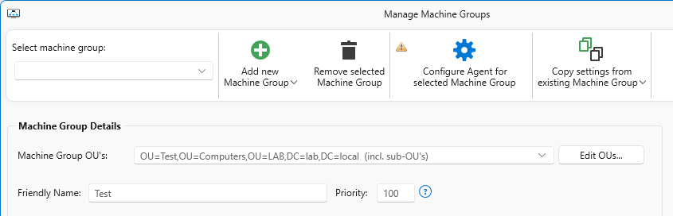

[Continue to Content Store(s) configuration](#content-stores)

### Entra ID (Azure AD)

With the **Entra ID** option you target machines registered in your Entra ID tenant. You have two sub-options for defining which machines to include:

| Option | Description |
|---|---|
| **Include all machines** | Targets every machine registered in the Entra ID tenant. Use this when you want to manage all cloud-joined machines. |
| **Dynamic name filter** | Targets machines whose name matches a pattern. For example, machines named `LAB-T-001`, `LAB-T-002`, etc. can be targeted with the filter `LAB-T*`. This is useful when you use naming conventions to distinguish machine types. |

Enter a **Friendly Name** to identify this Machine Group in Central View.

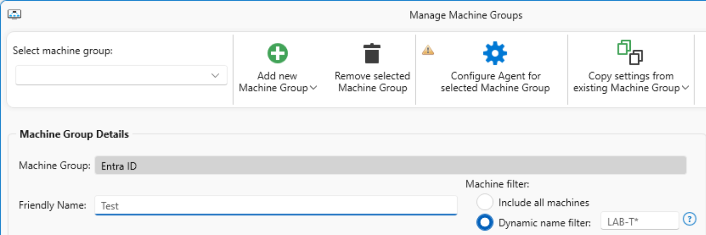

[Continue to Content Store(s) configuration](#content-stores)

---

## Content Store(s)

The content store is the location where the agent retrieves packages (MSIX, App-V, etc.) for this Machine Group. You can add multiple content stores if needed.

You have two options:

| Option | Description |
|---|---|
| **[UNC](#unc)** | A standard SMB file share, for example `\\fileserver01.domain.local\content`. Any SMB share with the correct permissions will work. |
| **[Azure](#azure)** | An Azure Blob Storage container linked to your configured storage account. You can select an existing container or create a new one. |

### UNC

Enter the UNC path to the file share that contains your packages.

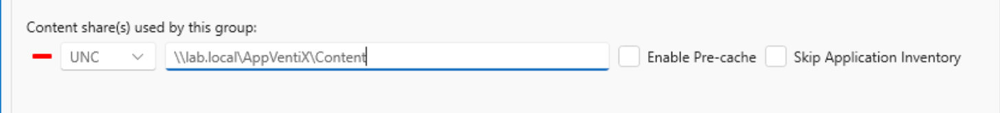

[Continue to Content Store options](#content-store-options)

### Azure

When using Azure Blob Storage, you can either select an existing container or create a new one directly from this window.

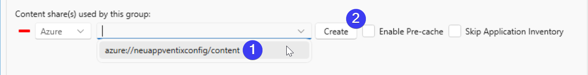

#### Select an existing location

Choose a pre-existing container from the dropdown list.

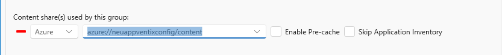

[Continue to Content Store options](#content-store-options)

#### Create a new location

Enter a name for the new container and click **Create**.

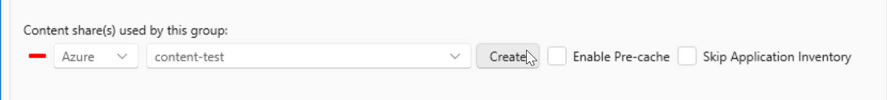

A confirmation dialog will appear once the container has been created. Click **OK** to continue.

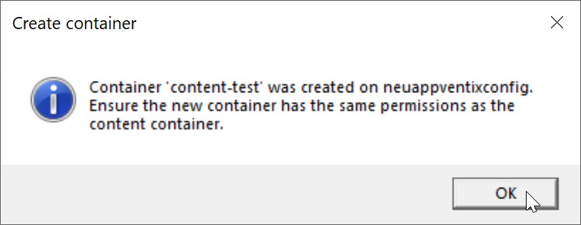

[Continue to Content Store options](#content-store-options)

---

## Content Store Options

After selecting a content store location, you can configure two additional options:

| Option | Description |
|---|---|
| **Enable Pre-cache** | When enabled, the agent will automatically pre-load packages from this store when the machine starts or when the refresh cycle runs. This is particularly useful for large packages or packages that are used frequently, as it ensures they are ready before the user needs them. When pre-cache is disabled, packages are delivered on the fly the moment a user needs them - a fully dynamic delivery model. |
| **Skip Application Inventory** | When enabled, packages from this content store will not appear in the Central View application overview. This can be useful when you have multiple content stores and want to keep the overview focused on a specific set of packages. |

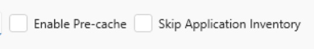

---

## Save Machine Group

Once you have configured all the settings, click **Save Machine Group** to save your configuration.

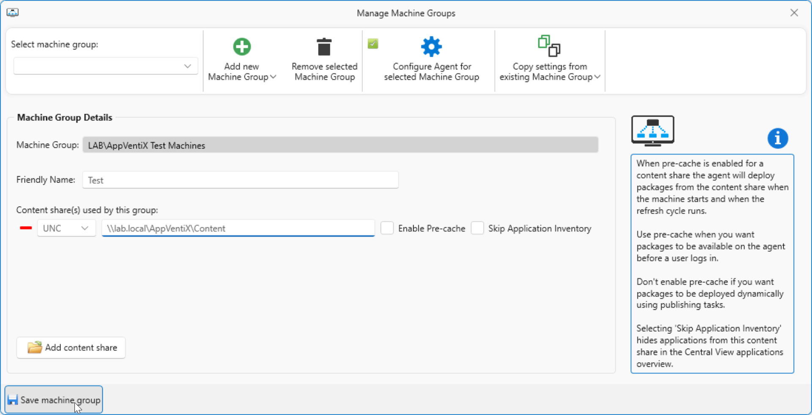

A confirmation message will appear to let you know the Machine Group was saved successfully. Click **Close** to return to the Machine Group overview.

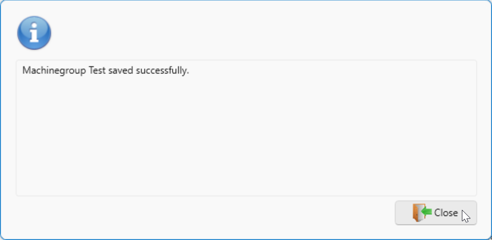

[Continue with the agent installation](agent-installation.md)
