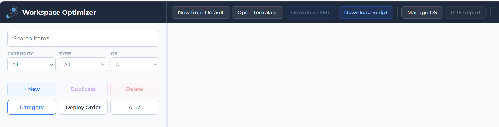
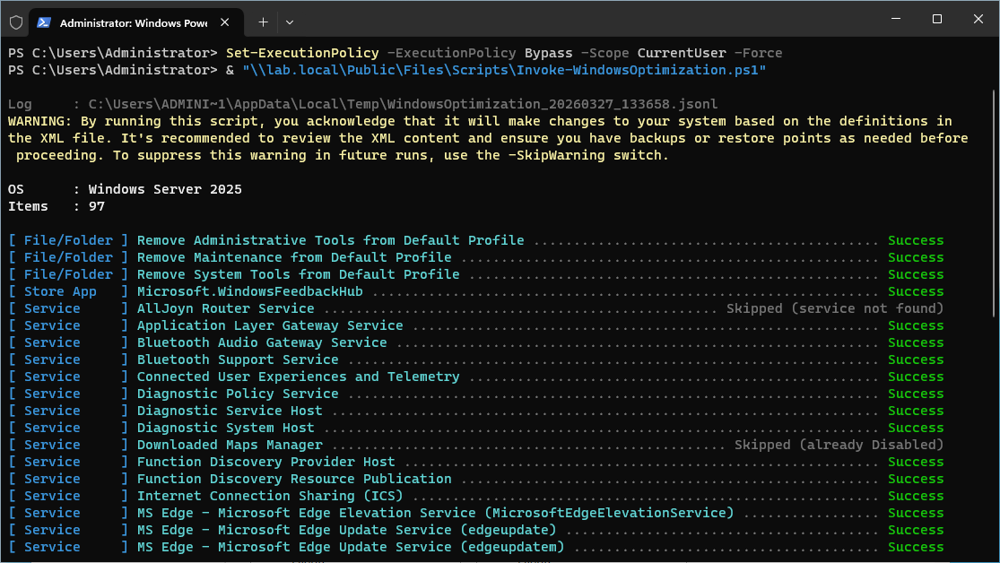
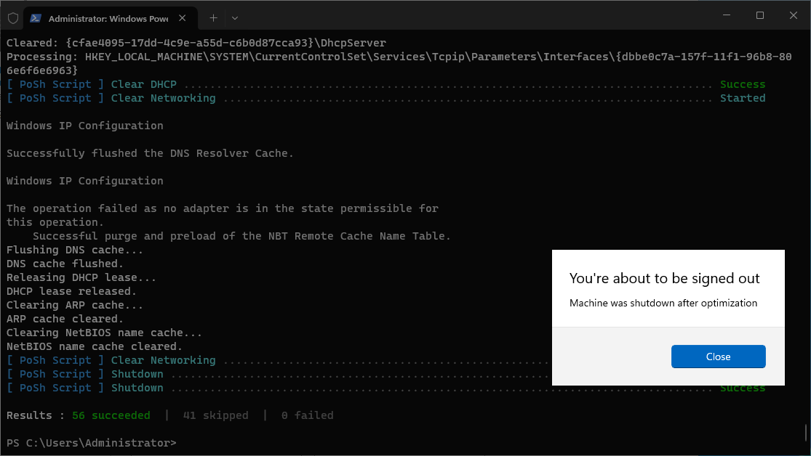

# Optimize the Workspace

The workspace optimization removes unnecessary built-in apps, disables unused services and scheduled tasks, and applies performance and reliability settings suited to managed environments. It is driven by a PowerShell script and an XML configuration template.

> **Note:** For physical desktops and laptops, run this optimization once during initial setup and again after significant application changes. For non-persistent VDI and SBC environments, run it on the master image before sealing.

## Prerequisites

- Elevated PowerShell session (Run as Administrator)
- `Invoke-WindowsOptimization.ps1` and `Windows.xml` in the same directory

## Getting the Script and Template

Configure and download the template and script from the [Workspace Optimizer](https://workspaceoptimizer.appventix.com) web tool.

### Using the Default Template

Click **New from Default** to start from the built-in default template, then click **Download Script** and **Download XML** to download both files.

### Customizing the Template

The web tool lets you review and modify every optimization item before downloading. Open an existing template with **Open Template** or start from the default, adjust the items to match your environment, then download the updated XML with **Download XML**.



The toolbar provides the following actions:

| Button | Description |
|--------|-------------|
| **New from Default** | Load the built-in default template as a starting point |
| **Open Template** | Open a previously saved `Windows.xml` file |
| **Download XML** | Download the current template as `Windows.xml` |
| **Download Script** | Download the `Invoke-WindowsOptimization.ps1` script |
| **Manage OS** | Manage which operating systems are available in the template |
| **PDF Report** | Generate a PDF overview of the current template configuration |

Place both downloaded files in the same directory before running the script. By default the script searches for a file called `Windows.xml`.
You can rename the file to something different, in this case you need to specify the template name separately when executing.

---

## What the Script Does

The optimization is driven by a PowerShell script (`Invoke-WindowsOptimization.ps1`) combined with an XML configuration file (`Windows.xml`). The XML defines every optimization item: what it is, what type of change it makes, which operating systems it applies to, and whether it applies to virtual machines, physical machines, or both. The script reads the XML, auto-detects the OS and machine type, and applies only the items that match.

This means you can use the same script and configuration file across all your machines: Windows 10, Windows 11, Windows Server 2019, 2022, and 2025, virtual or physical, without any manual adjustments. Items that are not applicable to the current machine type are automatically skipped and reported as such in the output.

The default template is primarily configured for virtual machines. Most finalization items, such as releasing the network configuration and shutting down, are marked as virtual-only and will not run on physical hardware. For items where the optimization makes sense on both, you can simply enable it for both in the template.

The script processes items in the following order:

1. **Clean up the Default Profile** - removes shortcuts like Administrative Tools, Maintenance, and System Tools from the default user profile, so they don't appear in every new user's Start menu.
2. **Remove built-in Store apps** - strips out consumer apps that have no place in a managed environment: Cortana, Xbox apps, Clipchamp, Microsoft News, Weather, Solitaire, Maps, Feedback Hub, and more.
3. **Disable unnecessary services** - stops and disables services that serve no purpose on a managed image, including telemetry and diagnostics services (DiagTrack, DiagSvc, DPS), Bluetooth services, Fax, Geolocation, Windows Search, SSDP Discovery, Superfetch, Update Orchestrator, and others. On Server OS images, services relevant only to client machines are automatically skipped.
4. **Disable Windows traces** - turns off background trace logging for components like Cellcore, Cloud Experience Host, Cortana, ReadyBoot, and others that generate unnecessary disk writes.
5. **Apply miscellaneous optimizations** - a collection of targeted registry changes and system settings:

   - Turns off Cortana and the Windows Customer Experience Improvement Program
   - Disables hibernate, the default screensaver, the first logon animation, and Storage Sense
   - Disables automatic background disk defragmentation and auto-layout
   - Disables NTFS last-access timestamp updates (reduces disk I/O on busy systems)
   - Increases the disk I/O timeout to 200 seconds (important in virtualized storage environments)
   - Disables automatic memory dump creation
   - Suppresses hard error popups
   - Disables the Windows Update auto-update mechanism
   - Removes Microsoft Edge auto-update tasks and active setup entries
   - Sets the new disk policy to **OnlineAll**, so new disks come online automatically, which is essential for virtual machines with additional data disks
   - Sets the power plan to **High Performance**
6. **Disable scheduled tasks** - disables a large set of scheduled tasks that would otherwise wake the system, consume CPU, or generate unnecessary activity: Windows Defender maintenance tasks, disk defrag, WinSAT benchmarking, telemetry reporting, compatibility appraiser, disk diagnostics, SpeechModel downloads, and many others. On Server OS, Server Manager at logon is also disabled.
7. **Remove optional features** - removes features not needed in a managed environment, such as Windows Media Player and Azure Arc components on Server OS.

> **Note:** You are responsible for the items you enable in the template. Review them before running the script. In most cases the defaults are a good starting point, but your environment may require adjustments. We cannot take responsibility if applications or certain Windows components do not work as expected. Review the template carefully.

## Running the Optimization

Open an elevated PowerShell session on the image and run the script. If you place `Windows.xml` is in the same directory as `Invoke-WindowsOptimization.ps1` you can run it without options.

```powershell
.\Invoke-WindowsOptimization.ps1
```

You can optionally specify an alternative template name if it differs from the default `Windows.xml`.

```powershell
.\Invoke-WindowsOptimization.ps1 [-FilePath "C:\Path\To\TemplateName.xml"]
```

The script will auto-detect the OS and apply the correct set of optimizations. Every item is shown on screen with its result, Success, Skipped, or Failed, so you can see exactly what happened.



To skip specific items, use the `-ExcludeOrder 10,20,30` parameter with the order number of one or more items you want to exclude. For example, order `99999` is the Shutdown step. Excluding it lets the script complete without shutting down the image:

```powershell
.\Invoke-WindowsOptimization.ps1 -ExcludeOrder 99999
```

To only run specific order numbers, use the `-IncludeOrder 10,20,30` parameter.

```powershell
.\Invoke-WindowsOptimization.ps1 -IncludeOrder 10,20,30
```

A log file is written to `%TEMP%` by default. You can redirect it to a different location with the `-LogPath` parameter, and control the verbosity with `-LogLevel` (`Info`, `Verbose`, or `Debug`):

```powershell
.\Invoke-WindowsOptimization.ps1 -LogPath 'C:\Logs' -LogLevel Verbose
```

> **Note:** The script requires elevation (Run as Administrator).

## Finish

When the script is finished it will shutdown the machine or it will just finish the script and close depending your last action.

