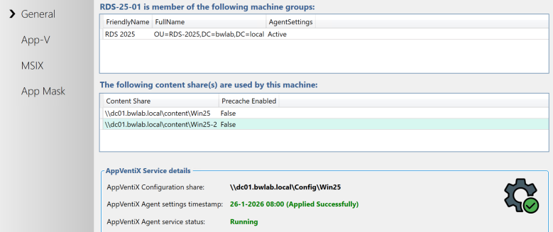
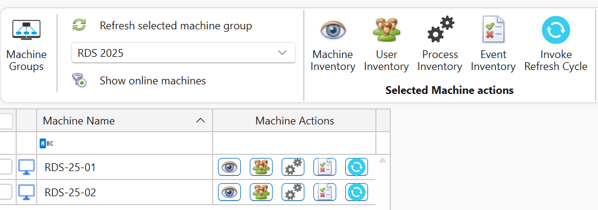
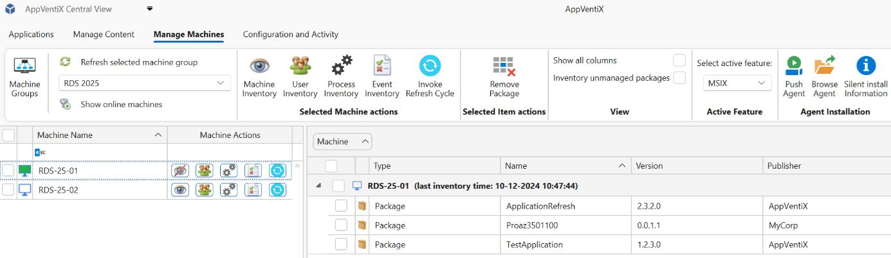

# Verify the Agent

The agent contains a small GUI (the AppVentiX Agent GUI) `AppVentiXAgentGUI.exe`. A shortcut to this GUI is not placed in the Start menu; you can find it in: `C:\Program Files\AppVentiX\AppVentiX Agent`. The GUI will show you the service state and detected machine group. If the machine group is not detected or another error is displayed, open the agent log (button at the right) for useful troubleshooting information.

The AppVentiX Agent GUI is great for checking the service state, seeing which packages are deployed, viewing package details, and troubleshooting. You can also invoke a refresh from the Agent GUI. A refresh can also be invoked in the Central View console (per machine or machine group). The refresh cycle runs automatically when the machine starts; optionally it can also be configured with a timer in the agent settings.

By default, user publishing is refreshed when the user logs in, and user publishing will also be refreshed when the refresh cycle is invoked. This setting can be adjusted in the agent settings for the machine group.

You are now ready to deploy packages, shortcuts, user settings, App Masking rules, and/or App Control policies, and manage your deployment.

Return to the Central View console to see how easy it is to inventory and manage machines by clicking the eye icon. During these quick steps, you configured a content share for the machine group. If the Pre-cache checkbox is enabled, packages from the content share will be preloaded onto the machine(s) when you click the **Refresh Cycle** button. If it is disabled (default), packages will be delivered based on the publishing tasks you configure. The Refresh Cycle (blue circle) updates publishing for currently logged-in users, pre-caches new packages, and automatically removes packages that are no longer in the content share. No manual cleanup is required.

In the machine inventory view you can right-click on the column header and select filtering options to easily find a package. With the **User Inventory** feature (user group icon) you can see in real-time which users are logged in and which packages they have published. With the **Show online machines** button you can filter the machines that are online and see the agent version.
