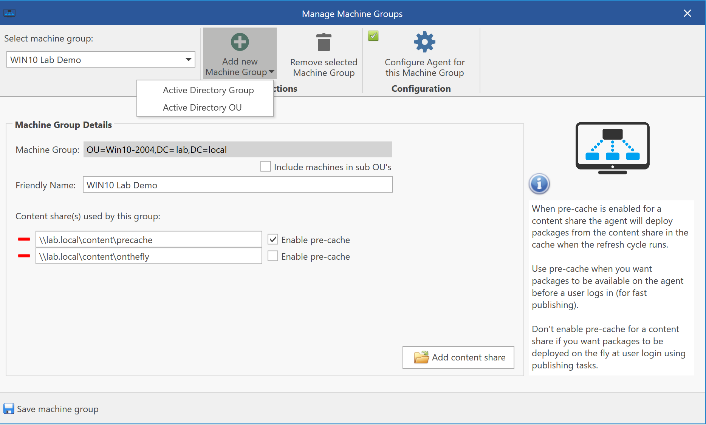
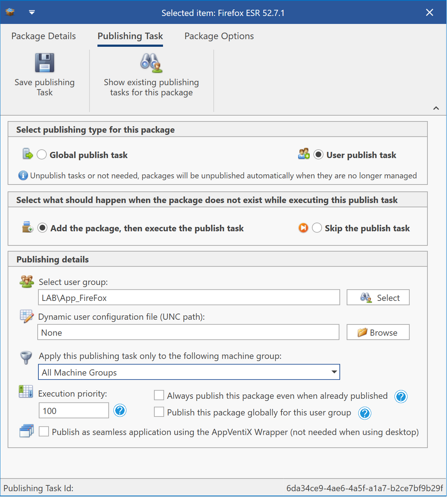
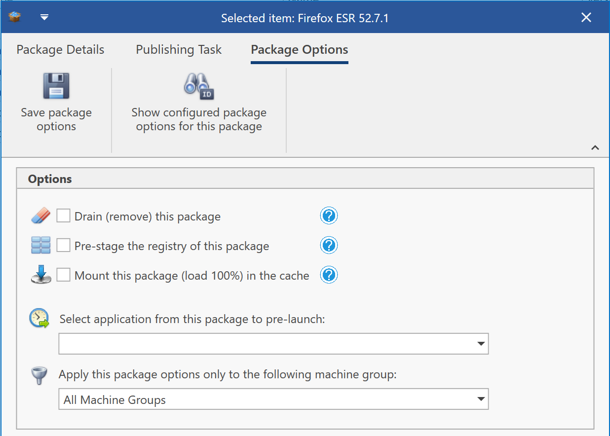
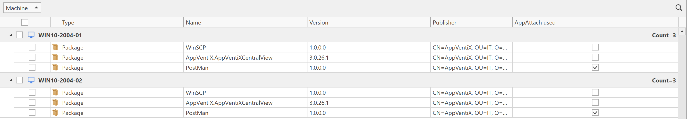
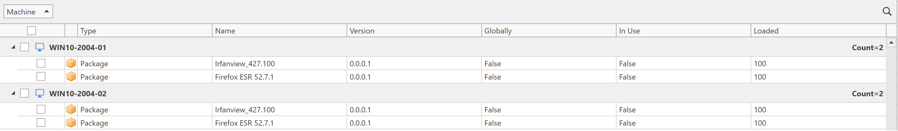
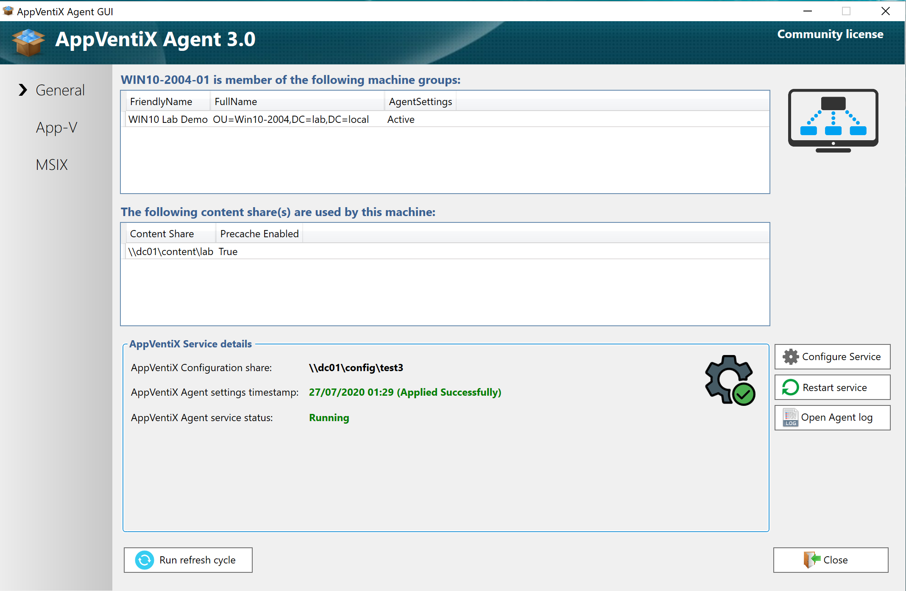
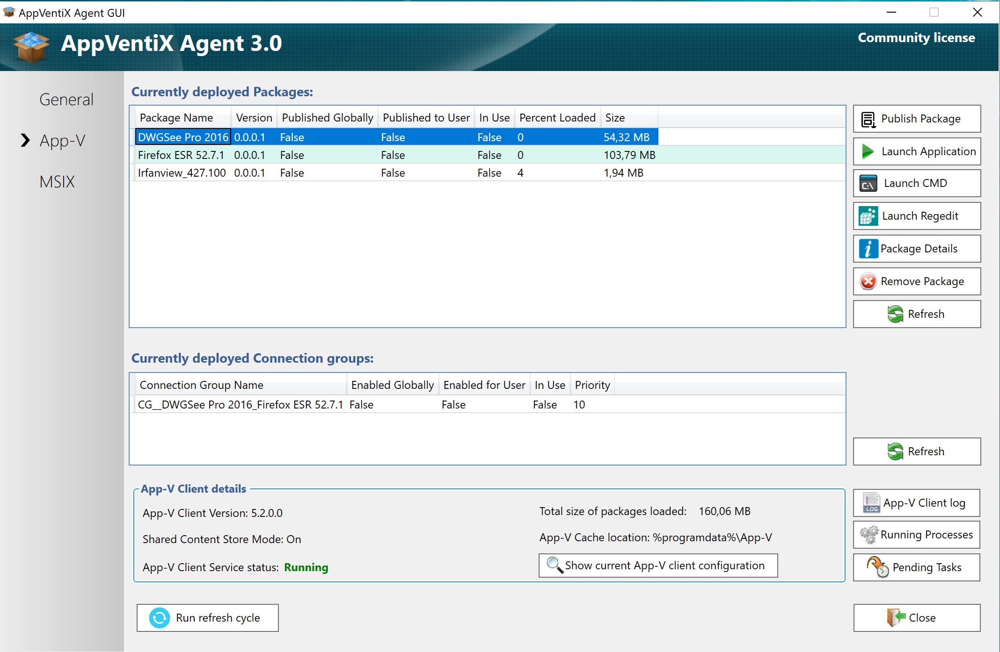
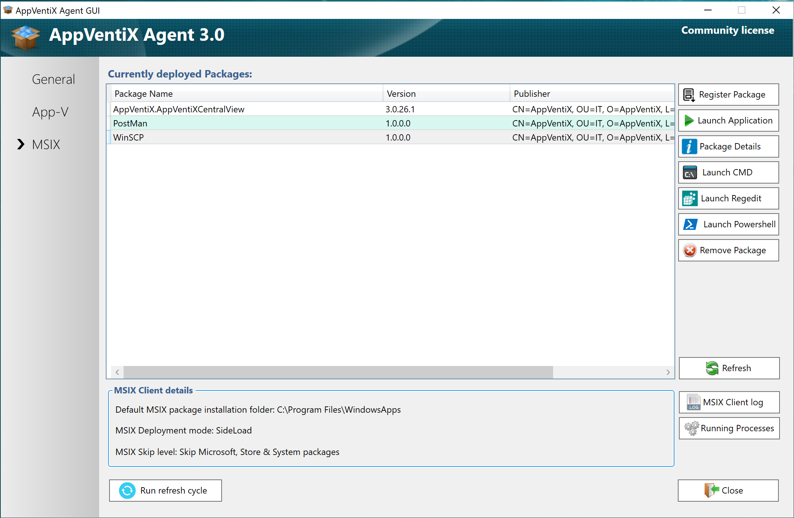

# AppVentiX 3.0.27 release notes

AppVentix (previously App-V Scheduler) has arrived!

App-V is well known for its application compatibility and high success rate in deploying a diversity of Windows applications. We are committed to App-V and will continue to support and add new features to it. And now we also expanded our solution to support the new Microsoft MSIX packaging format! With AppVentiX you can manage App-V and MSIX side by side in the same convenient way.

Besides support for MSIX we have implemented a lot of new features and improvements in the product:

- The Central View console has been re-designed and is now even easier to use
- The agent configuration is now configured centrally in the Central View console, this dramatically simplifies the deployment
- The agent has been rebuilt from the ground up, it's now even faster and lighter
- Advanced cache management features for both non-persistent and persistent environments have been improved
- Pre-caching can now be configure per content share

- Fully managed deployment: No more orphaned shortcuts & left overs in user profiles. AppVentiX will only publish new or updated packages for users and machines. The unpublishing is done automatically when a package is no longer managed. Watch this short video where we will show you how easy the publishing and auto unpublishing feature works:
- Publishing and package options have been extended to support every deployment scenario:

- It's now possible to edit and modify publishing tasks
- You can now filter publishing tasks and package options based on machine groups
- With priority you can configure which packages should be published first
- It's now possible to publish packages globally based on user group membership
- You can convert MSIX packages to AppAttach with just one click and deploy them in seconds. Check the below video for a short demo:
- Inventory and manage App-V, MSIX and MSIX AppAttach side by side in real-time in the same convenient way

- A new filter to only show online machines in the inventory has been added

- This release contains a new wrapper for seamless application publishing. The wrapper will make sure the package is published for the user and will then start the application
- Advanced features have been extended: support for multi domain environments, support for LDAPS
- The agent GUI has been re-designed and can be used to manage App-V and MSIX packages

- This release contains a lot of improvements and fixes, it also includes all fixes and improvements from previous service releases

---

*Source: [AppVentiX release history](https://appventix.com/appventix-release-history/).*
