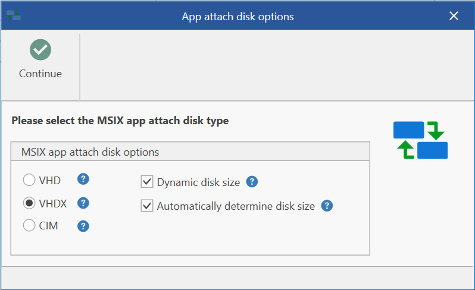
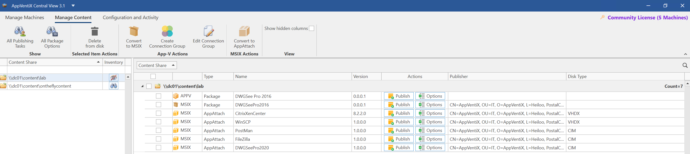
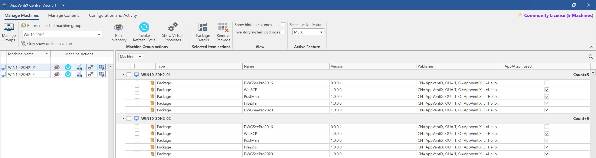
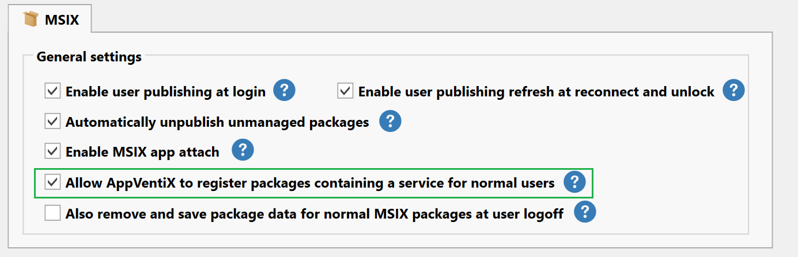
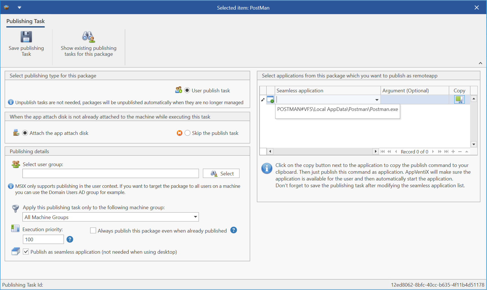
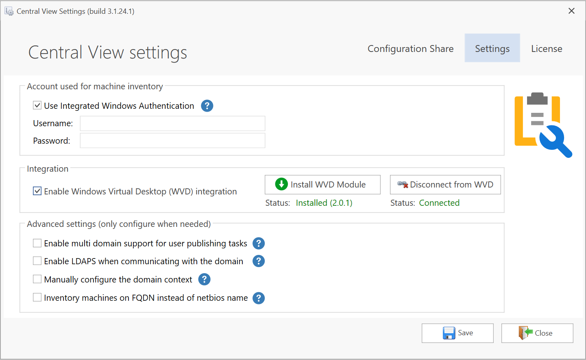
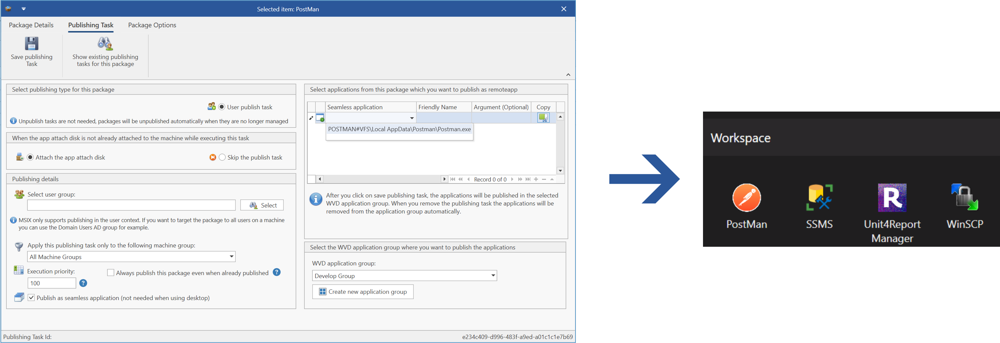
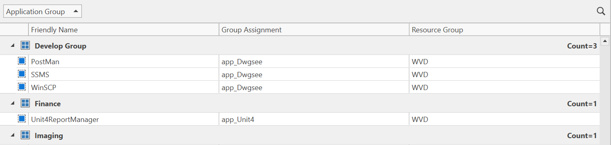
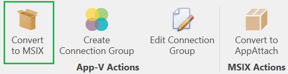

# AppVentiX 3.1.24 release notes

Since 2014 we are helping customers to deliver new and updated applications faster with more control and confident. The AppVentiX solution is easy to implement and provides complete control and insight in the App-V and MSIX (+ app attach) deployment, no matter if it is on-premises, in the cloud or hybrid. AppVentiX supports Microsoft (WVD), Citrix (CVAD) and VMware (Horizon) environments and integrates very well with FSlogix and profile solutions from Citrix, VMware and Ivanti.

We are excited to announce the availability of AppVentiX 3.1, in this version we support even more use cases for App-V and MSIX.

## What's new in AppVentiX 3.1

The MSIX and app attach integration has been extended and a lot of new capabilities have been added, all app attach disk formats (VHD,VHDX & CIM) are now supported and new convert to app attach options have been added. AppVentiX brings support for app attach to on-premises and cloud deployments.

The content inventory has been redesigned and will show you a complete overview including the app attach disk type:

## Extended use cases for MSIX and MSIX app attach

AppVentiX supports direct MSIX and MSIX delivered with app attach deployments. With direct MSIX deployment the application is cached on the machine itself, making it less dependent on the network, the application is started directly from the cache. With app attach the MSIX application(s) are stored inside a virtual disk and attached to the machine (either attached before user login or dynamically at login), this allows faster delivery and consumes less disk space on the machine. With AppVentiX you can mix and match this MSIX deployment type per package and manage them in the exact same way. Convert MSIX to app attach with one click, the original package is saved in case you want to update the application later.

AppVentiX now supports on the fly delivery of MSIX and MSIX app attach packages, exactly in the same way as we support this for App-V. When a user logs in the package is added (or attached in case of app attach) and the application is available immediately for the user making it a real dynamic delivery experience. Of course, it is also possible to pre-attach\pre-cache the package on the machine before the user logs in, with AppVentiX you can easily combine this delivery approaches, for example you can pre-attach\pre-cache the applications everybody needs in the organization and deliver applications dynamically for certain group of users just when they need it. This means that applications that are only used by a specific group doesn't have to exist or attached on all machines beforehand. With AppVentiX you have complete control over this deployment types, in the machine inventory you can easily see which packages are attached to which machines and which deployment type they use:

New MSIX agent options have been added, for example it's now possible to publish MSIX packages which contains a service for normal users, making it easier to deploy applications to users without admin intervention.

With AppVentiX the deployment is fully managed, this means when a user leaves an AD group or the publishing task for a given package is removed the application will be automatically removed for the user. This makes application updates very easy; you don't have to worry about removing the old application\version, just remove the old publishing task and create a new one, users don't even have to logoff and back on again to receive the new or updated application.

## Extended support for seamless application publishing scenarios

AppVentiX works out of the box for full desktop scenarios and we now also extended the use case for seamless application (remote app) publishing scenarios. Just click on "publish as seamless application" in the publishing task and you can select applications from the package which you want to publish as seamless application, easily add this to your remoting solution (we support all remoting solutions like Citrix, VMware, Parallels, etc) and AppVentiX will make sure the application is available for the user when they start the published application.

## Direct Windows Virtual Desktop (WVD) integration

For WVD we add value by bringing real-time control and single point of management for both published desktop and remote app scenarios. With the direct WVD integration feature in AppVentiX you can publish applications directly in WVD either to an existing application group or to a new application group created directly from AppVentiX.

The WVD integration can be enabled with just one checkbox in the settings:

The WVD integration supports App-V, MSIX and MSIX packages delivered by app attach, after this feature has been enabled you can publish applications directly to an existing application group or a new one.

The application is immediately visible in the Remote Desktop client feed:

But that's not it, we know how important it is for proper application management to easily perform application updates and to clean-up old versions, so when you remove a publishing task which contains published remote apps, they will be automatically removed from WVD as well, no manual steps required. So when you want to update an application all you have to do is remove the old publishing task and create a new one, the applications are automatically updated in WVD. This makes application updates super easy, controllable and provides a single point of management.

The WVD integration also contains a complete overview of all Remote Apps:

You can filter on application group, group assignment and also more columns can be selected. This will give you a complete overview of your WVD environment. Of course the WVD integration can be combined with a full published desktop scenario.

## Convert App-V to MSIX with just one click

App-V is well known and used by a lot of companies worldwide, Microsoft has taken the best things out of App-V and used it as the basis for MSIX. Their formats are very similar. While App-V stays supported for a long time, MSIX will eventually replace all application installation formats (including MSI, App-V, etc). With AppVentiX you can manage App-V and MSIX side by side in the same convenient way, convert App-V to MSIX with just one click, migrate when you want at your own pace. App-V packages can be converted to MSIX with just one click in the console:

## AppVentiX doesn't need any back-end infrastructure

As you might know AppVentiX only needs a file share, no back-end components are needed. AppVentiX has been validated to work and supports the following file shares: Windows file shares (direct or DFS), Azure file shares, Nutanix and NetApp file shares.

## Other improvements and fixes

Below is a list of improvements and fixes we also implemented in version 3.1:

- A new option has been added to refresh user publishing tasks on session reconnect and machine unlock
- The Citrix image mode detection has been enhanced
- The App-V client settings have been extended and the agent can now also configure 8.3 name creation which is needed for the App-V client
- The App-V client service is now restarted automatically when the configuration has been updated
- App-V connection groups could not be drained, this has been fixed
- MSIX (+ app attach) now also supports package options like draining, on the fly delivery and filter per machine group
- The execution order of publishing tasks can be controlled with a priority, this priority was not maintained correctly in 3.0, this has been fixed
- Machines can now be inventoried by using their FQDN name
- The agent has been modified to better support offline use cases where the share isn't always accessible
- It's now possible to manually configure the Active Directory context, this adds support for more complex Active Directory environments and Active Directory environments configured with delegation of control. AppVentiX also support multi domain environments.
- The AppVentiX agent GUI has been improved and now also contains a package filter to easily find a package
- Numerous improvements in the Central View console, like direct publishing from the content inventory page, improved package management and inventory
- The admin guide now contains different approaches which you can follow to deploy, update and remove applications with AppVentiX
- The admin guide now contains more information about possible share configurations
- The installation expiration has been enhanced, the solution can be installed and configured in under 10 minutes

---

*Source: [AppVentiX release history](https://appventix.com/appventix-release-history/).*
