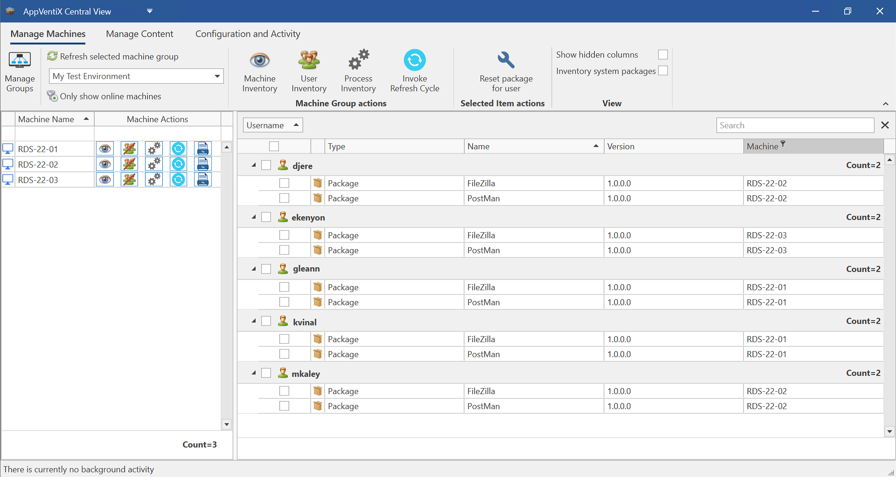
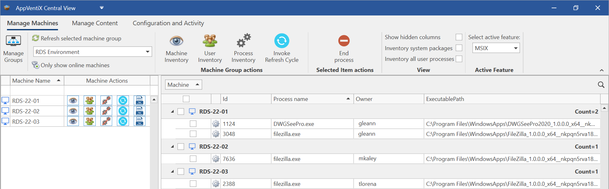
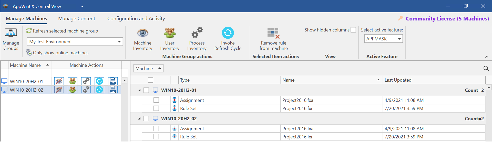
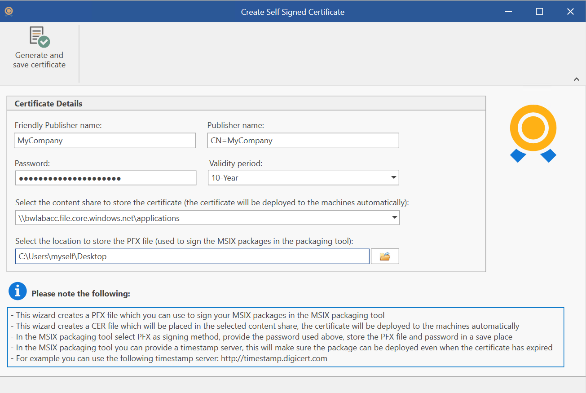
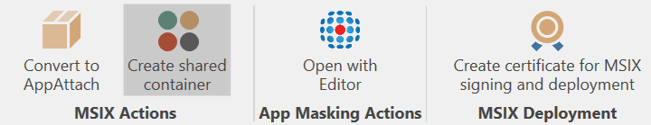
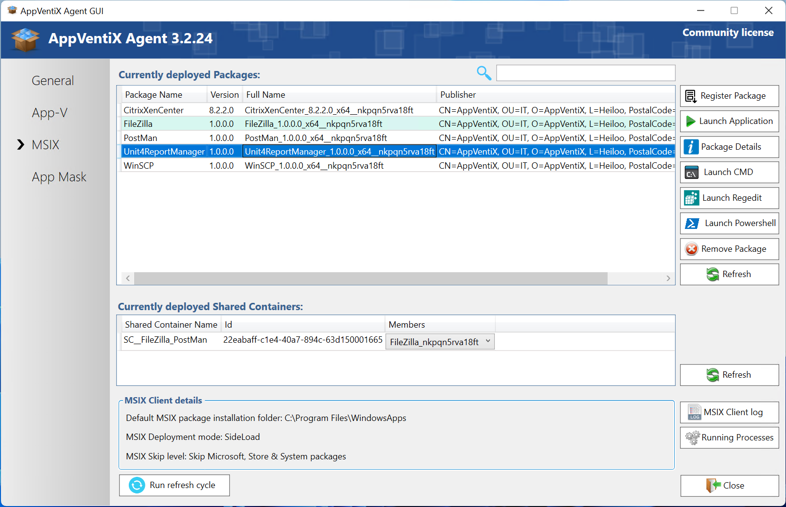
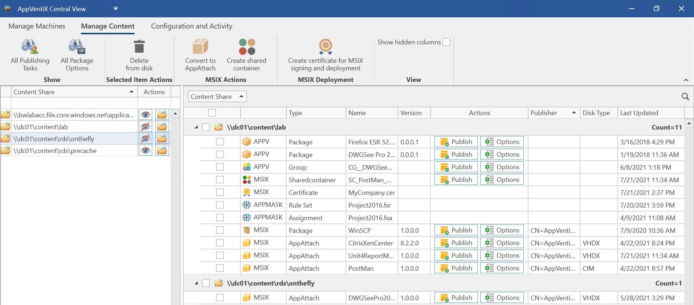

# AppVentiX 3.2.24 release notes

We are excited to announce the latest AppVentiX 3.2 release.

## About AppVentiX

AppVentiX is an affordable addon management solution that integrates very well with Azure Virtual Desktop, Citrix Virtual Apps and Desktops and VMware Horizon. AppVentiX supports Cloud, On-premises, and Hybrid deployments both Virtual (VDI\RDS) and Physical (laptops\pc's).

With AppVentiX you gain real-time control and visibility over your App-V and MSIX (app attach) deployment. The solution is powerful, yet light weight and easy-to-use.

AppVentiX installs under 10 minutes and doesn't need any back-end infrastructure. You will get immediate results which will make you confident about releasing new applications and updates.

## What's new in AppVentiX 3.2

## Real-time user inventory

One of the exciting new features is the real-time user inventory feature, with AppVentiX it was already possible to inventory machines and see which packages they have deployed and manage them centrally, but now it is also possible to see which users are logged on and which packages they have published. From there you can offer a package reset for a user to bring the application back in its original state and verify if a user has the right applications (and versions) published. Below you can see a screenshot of the user inventory feature in a lab environment, this feature works for both App-V and MSIX.

## Improved process inventory

The process inventory and management feature has been enhanced, with this feature you can easily see if an application is in use. It's possible to inventory only processes from App-V and MSIX applications or all processes.

## FSlogix App Masking integration

Another new feature in AppVentiX 3.2 is the integration with FSlogix App Masking. Software compatibility with App-V and MSIX is very high, it allows dynamic deployment, updating and publishing to specific user groups. But there are situations where you need to install software onto your machines without using App-V or MSIX. With App Masking you can control which users can see and access the installed application (by hiding files and registry items).

With AppVentiX you can now centrally manage FSlogix App Masking rules and assignments. Just place them on the content share and they will be deployed and updated automatically. Rules and assignments you remove from the content share will be automatically removed from the machines as well. You can modify the App Masking rules and assignments directly from the Central View console and you can inventory machines to see which rules and assignments they have applied (see screenshot below). Note the "Last Updated" time value in the inventory where you can see if your modified rules are updated and applied correctly.

## MSIX simplified certificate management

Requesting 3th party certificates for signing MSIX packages is time consuming and costly. With AppVentiX it is now very easy to create your own certificate. The certificate will be deployed to the machines automatically making it a very easy and quick method to sign and deploy your MSIX packages. The whole process takes less than 1 minute, below you can see a screenshot of the certificate creation window.

## Support for MSIX Shared Containers

AppVentiX now supports MSIX Shared Containers, Shared Containers are similar to App-V Connection Groups where multiple packages\containers share the same environment. In this way they can access each other's files and registry items, this can be used for plugins or other situations when applications need to integrate with each other on a high level. In AppVentiX just click the MSIX packages you want to add to the shared container and click save.

After saving the shared container it will be visible in the content inventory overview where you can assign it to a user group just like a MSIX package.

You can see the deployed shared container deployed and verify its members:

Please note that MSIX Shared Containers are only supported on the latest Windows builds.

## Renewed content inventory

The content inventory has been renewed and it is easier to navigate and find content. Also the last updated value provides information when a package has been updated the last time. Below you can find a screenshot showing multiple content types:

## Other improvements and fixes

The following list of improvements and fixes are also implemented in version 3.2:

- Improved Azure Virtual Desktop (AVD) integration and it's now possible to switch the active subscription. All Windows Virtual Desktop (WVD) text have been updated to reflect the new AVD name.
- First day support for Windows 365 (cloud PC)
- Support for Windows 11 and Windows Server 2022, AppVentiX has been verified to work great on the latest Windows releases, both App-V and MSIX (app attach)
- Improved MSIX and app attach app data persistency in combination with FSlogix profiles, also contains a very handy logging feature (see admin guide for more details)
- A lot of validation has been done around MSIX and app attach in different deployment scenarios and different customer cases
- Enhanced logging information has been added
- The Agent GUI has been improved
- Multiple other fixes and improvements

---

*Source: [AppVentiX release history](https://appventix.com/appventix-release-history/).*
